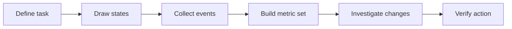
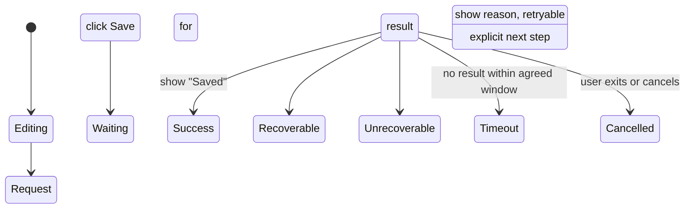
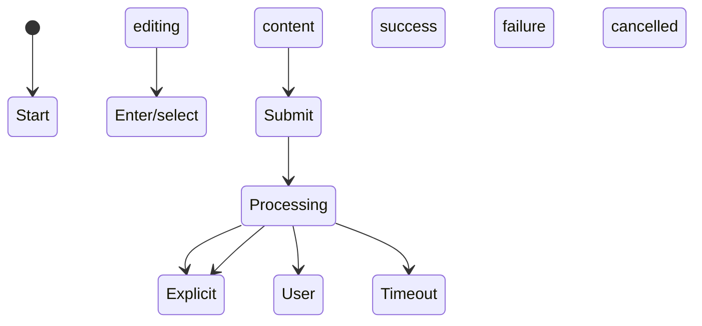

"Improving the metric" is not a clear requirement. First ask: what exactly are we measuring?

Whether a request succeeds describes a single response from the system; whether a user is affected describes a person's experience; whether a task is completed describes an outcome. Mixing them together often yields a number that looks precise but cannot actually be explained. The dictionary below collects common ways of defining metrics without presupposing any specific threshold; its focus is to help people clarify the object and its boundaries before using the numbers.

This is not a "what should go on the dashboard" checklist, but an executable workflow. It fits four common scenarios: preparing a new feature, noticing production fluctuations, advancing experience optimization, and reviewing an incident. Readers don't need to build every metric at once; starting from one key user task and closing a small loop through the six steps below is usually more valuable than spreading out dozens of charts.

The "save draft" example in this article is only an example; you can replace it with login, search, payment, upload, appointment, or any other key task. Numbers, thresholds, and conclusions should all be re-established for your own context rather than applied directly.

## A complete example first: from "saving is slow" to an actionable problem

Someone reports: "Saving a draft is slow, and sometimes I don't even know whether it succeeded." This is not a directly actionable problem. After breaking it down with this guide, you get the following working object:

| Step | Product | Example |
| --- | --- | --- |
| Define the task | Start point, end point, user value | The user initiates a save from the editing state and clearly sees a success or failure result. |
| Draw the states | An observable state sequence | Start editing → click Save → submitting → success / failure / timeout / cancelled. |
| Define the metric set | Outcome, experience, cause, data quality | Completion rate, P95 wait, timeout rate, retry rate, status-reporting completeness. |
| Establish a baseline | Normal range and comparable conditions | Under the same version and entry point, continuously observe trends split by platform and network. |
| Investigate changes | An evidence chain | Whether the completion-rate drop is concentrated on a certain network; whether waiting increases after submission rather than during editing. |
| Verify the action | Return to the original task | After the fix, actually save under the original network conditions and confirm the status is clear, retries are safe, and content is recoverable. |

The following sections expand on these six steps one by one. If a team can only adopt one practice first, it's recommended to start with "every core task has a state sequence and a metric definition card."

## Working step one: translate a vague goal into a user task

Don't start with "I want to monitor a page" or "I want to improve performance." First write an observable task description: **who, under what conditions, to obtain what result, completed which key actions.**

| Vague statement | Workable task definition |
| --- | --- |
| Search doesn't work well | After entering a query, the user can find and open content relevant to their goal on the results page. |
| Login is unstable | A registered user with valid credentials and a normal network can complete authentication and enter the target page. |
| The page is too slow | Whether the wait the user experiences from opening the page to seeing the main content and performing the first key action is acceptable. |
| Publishing often fails | Whether the user can complete the task within a reasonable time, from starting to edit to seeing a clear publishing result. |

### Method: the task definition card

For each core task, first write a card no longer than one page. It doesn't need an approval process, but it should be reviewed by relevant collaborators before instrumentation or analysis begins.

| Field | Value |
| --- | --- |
| Task name | Save draft |
| Target user | Someone who is editing content and wants to continue later |
| Start point | The editing page has completed the necessary input, and the user clicks "Save" |
| End point | The user gets a clear success or failure result |
| Success | The draft can be opened later, and its content matches what the user submitted |
| Failure | An explicit failure, a timeout, or the user leaves before confirming the result |
| Excluded | Test traffic, auto-save (counted separately from manual save) |
| Key risks | Repeated clicks on a weak network, leaving the page, inconsistency between client and server state |

**Why do this:** it distinguishes "the save API returns 200" from "the user actually has a recoverable draft." The API is an implementation detail; the task result is the object to protect.

## Working step two: draw the states first, then decide what to instrument

Metrics can only be computed from events. Before instrumenting, first draw the states the task is allowed to pass through and the states that must not happen. The states don't need to be complex, but they should cover success, failure, cancellation, and timeout.

### Method: the state–event table

Map each state transition to an event. This way you can both compute the task completion rate and see at which step users leave.

| State transition | Minimal event | Required fields | What it computes |
| --- | --- | --- | --- |
| Click Save | `draft_save_started` | Task ID, session ID, time, entry point | Number of tasks started. |
| Send the request | `draft_save_submitted` | Task ID, attempt count, network type | Retry rate, submit-to-result latency. |
| Show success | `draft_save_succeeded` | Task ID, end-to-end latency, whether it succeeded on first try | Completion rate, first-try success rate. |
| Show failure | `draft_save_failed` | Task ID, standard error category, whether it is retryable | Error rate, error distribution. |
| Show timeout | `draft_save_timed_out` | Task ID, wait duration, whether it is still processing in the background | Timeout rate, visible waiting. |
| User cancels | `draft_save_cancelled` | Task ID, cancellation stage | Abandonment rate, possible interaction friction. |

The task ID here should span all events of a single task; without it, it's hard to distinguish "ten users each trying once" from "one user trying ten times in a row." Error categories should use a controlled enum — for example network unavailable, authentication failed, invalid input, service rejected, or unknown error — rather than reporting raw error text directly.

### Handling the exception: what if the final result arrives late?

Real systems often have the case where "the user first hits a timeout, but the background later succeeds." This is not an excuse; failing to record it actually distorts the completion rate. You can keep two metrics at the same time:

- **User-visible completion rate**: the share of tasks in which the user clearly gets a success result within the agreed window;
- **Final processing success rate**: the share of tasks that the system ultimately processes successfully.

A gap between the two precisely indicates a break between system results and user experience: you may need to shorten the wait, improve status reporting back to the client, or let the user safely resume the task later.

## Working step three: build a set of metrics for the same task

A task should not be tied to just one metric. A minimal usable metric set usually consists of four kinds of questions: whether the outcome happened, what the experience costs, where the process might go wrong, and whether the data itself is trustworthy.

| Category | Question for the save-draft task | Examples |
| --- | --- | --- |
| Outcome | Did the user end up with a recoverable draft? | User-visible completion rate, final processing success rate. |
| Experience | Does the process require guessing, waiting, or repeated actions? | P95 visible wait, retry rate, timeout rate. |
| Diagnosis | In which link is failure more likely to occur? | Network error rate, non-network error rate, error distribution by version. |
| Data quality | Did we record the complete state? | Task ID coverage, start/end event match rate, reporting latency. |

### Method: the metric definition card

Keep a definition card for each core metric. It should be short enough to read through in a review, and complete enough for another colleague to recompute.

| Field | Value |
| --- | --- |
| Name | User-visible completion rate of saving a draft |
| Purpose | Judge whether the user gets a clear save-success result within a reasonable time |
| Object | One manual save task (linked by task ID) |
| Numerator | The number of tasks that produced draft_save_succeeded within the agreed window |
| Denominator | The number of tasks that produced draft_save_started and meet the statistical conditions |
| Excluded | Test traffic, duplicate events, events that cannot be linked to a task ID (reported separately as coverage) |
| Breakdown | Platform, app version, network type, entry point |
| Companion metrics | P95 visible wait, timeout rate, final processing success rate, retry rate |
| Known boundary | This metric alone cannot judge whether the saved content fully matches the user's expectation |

### Metric set example: don't let a single number carry the conclusion alone

| Phenomenon | Don't look only at | Look at together with | Possible judgment |
| --- | --- | --- | --- |
| Completion rate drops | Final processing success rate | User-visible completion rate, timeout rate, reporting completeness | The system may ultimately succeed, but the user is first interrupted by a timeout message. |
| Errors increase | Error event count | Error rate, share of affected users, problem frequency per user | It may just be more traffic, or a few users failing repeatedly. |
| The page gets faster | Average load latency | P95, LCP/INP, task completion rate, layout shift | The typical sample gets faster, but the long tail or interaction may not improve. |
| Feedback increases | Total feedback count | Feedback per million active users, confirmation rate, share of the same issue | You need to distinguish entry-point changes or user growth from quality problems. |

## Choose the right unit of measurement first

| Unit of measurement | Question it suits | Common misuse |
| --- | --- | --- |
| Request | Does a certain API or resource respond promptly and correctly? | Using request volume as a proxy for user impact. |
| Session | Is a continuous period of use smooth? | Confusing background activity with real usage. |
| User | How many people have encountered a problem? | Ignoring the degree to which the same user is repeatedly affected. |
| Task | Did the user achieve the goal? | Looking only at page or API success without checking whether the result was achieved. |
| Device / version | Is the problem concentrated in a specific runtime environment? | Treating correlation directly as root cause. |

The same thing can have multiple legitimate units of measurement. Take file upload: the request success rate reflects the service's response, the share of affected users reflects coverage, the upload completion rate reflects the task result, and the high quantiles of upload latency reflect the experience of the longest-waiting segment. Don't force one metric to answer every question.

## Common metrics and their definitions

### Availability and completion

| Metric | General formula | Notes |
| --- | --- | --- |
| Success rate | Successful events / all valid events | Define "success" and "valid" first; cancellations, duplicate submissions, and invalid requests should usually be listed separately. |
| Error rate | Failed events / all valid events | It complements the success rate, but the two event sets must be consistent. |
| Availability | The proportion of time or requests in which the expected capability can be provided normally | State whether it is computed by time, by request, or by task. |
| Task completion rate | Tasks that completed the goal / tasks started | You need to clarify the task start point, end point, and a reasonable timeout window. |
| Abandonment rate | Tasks started but not completed / tasks started | Not the same as the failure rate; a user actively changing their mind can also cause abandonment. |

A high success rate doesn't necessarily mean the task is smooth. If a user must retry many times to succeed, the final success rate may hide the real friction. For critical paths, it's best to watch the first-try success rate, the final completion rate, and the number of attempts per task together.

### Errors and impact

| Metric | General formula | Notes |
| --- | --- | --- |
| Error event count | The total of failure events within the statistics window | Used to assess processing volume and sudden spikes; heavily influenced by traffic changes. |
| Error rate | Error events / valid events | Good for comparing changes across different traffic scales. |
| Share of affected users | Deduplicated users with at least one problem / active users | Describes the scope of impact, not how often problems recur. |
| Problem frequency per user | Problem events / affected users, or / active users | The two denominators mean different things and must be stated clearly in the name. |
| Crash rate | Sessions or users that crashed / total sessions or users | Clarify whether to deduplicate by session or by user, and distinguish foreground from background. |

"Perceptible errors per user per minute" is a valuable experience metric: it takes both repeated failures and usage duration into account. But "perceptible" should have an auditable definition — for example, whether an error message is shown, whether it blocks the task, and whether it happens in the foreground; you cannot treat every log anomaly directly as a user problem.

### Latency and waiting

| Metric | General formula or value | Notes |
| --- | --- | --- |
| Average latency | Arithmetic mean of all sample latencies | Easily affected by extreme values; better as a supplement than the sole judgment. |
| Median (P50) | Half the samples are faster than this value, half are slower | Describes the typical experience, but you can't see the long tail. |
| High-quantile latency (e.g. P90 / P95 / P99) | The latency most samples do not exceed | Reflects the waiting of slower users; the quantile point used must be labeled. |
| Timeout rate | Events exceeding the agreed waiting threshold / valid events | The threshold should come from task needs or interaction expectations, not from making the chart look good. |
| Foreground waiting duration | The duration of a user-visible waiting state | Closer to the experience than pure network or service latency, but you must define the start and end points. |

Quantiles should not be mystified. They simply take a position in the sorted samples: P95 means 95% of samples do not exceed this value. To use them you need enough samples, and you should avoid mixing different types of tasks in one distribution.

### Frontend and interaction performance

Public web performance metrics can describe loading and interaction experience. They should be interpreted together with dimensions such as browser version, network conditions, and page type. The definitions of Web Vitals evolve with standards and browser implementations, so when using them you should follow [web.dev's metric documentation](https://web.dev/articles/vitals).

| Metric | Question it focuses on | Interpretation boundary |
| --- | --- | --- |
| LCP (Largest Contentful Paint) | When the user sees the main content | Suits loading experience, but does not mean the page is fully interactive. |
| INP (Interaction to Next Paint) | Whether user action to visual feedback is timely | Requires observing real interaction samples; does not mean all business tasks are complete. |
| CLS (Cumulative Layout Shift) | Whether page elements jump unexpectedly | Reflects visual stability, not loading speed. |
| FCP (First Contentful Paint) | When the user first sees content | The content may not yet be enough to complete the task. |
| Long task / jank share | Whether a persistently busy main thread affects interaction | Requires defining the jank threshold, foreground scope, and sampling method. |

These metrics are good for spotting experience risk, but not for proving on their own that a change brought a business result. To judge a change's effect, you should still return to the corresponding user task, coverage, and experimental design.

### User feedback and quality signals

| Metric | General formula | Notes |
| --- | --- | --- |
| Feedback rate | Valid feedback / active users or tasks | Clarify the denominator to avoid misreading traffic growth as worsening quality. |
| Issue confirmation rate | Verified issues / valid feedback | Reflects feedback classification and handling quality, not all real problems. |
| Share of duplicate issues | Feedback of a certain issue type / all issue feedback | Helps find concentrated pain points, but is influenced by classification rules. |
| Post-fix recurrence rate | The proportion of the same issue reappearing after a fix | Requires clarifying how "same" is judged and the observation window. |
| Problem feedback per million active users | $\text{Valid Problem Reports} / \text{Active Users} \times 1{,}000{,}000$ | Good for comparing across products or periods of different scales, provided the feedback entry point and classification rules are consistent. |

User feedback is an entry point for discovering problems, not an unbiased sample of the true distribution. Who is willing to give feedback, where the feedback entry point sits, and how it is classified all change the data; so it should be cross-validated with behavioral data, logs, and interviews.

### Perceived quality and competitor comparison

Some metrics' unit is not "whether the service returned", but what the user actually experienced while using it. They can form a separate set of experience-quality signals:

| Metric | Suggested definition | What it helps discover |
| --- | --- | --- |
| Perceptible network errors per user per minute | Events shown to the user and classifiable as network failures during foreground use / deduplicated user usage minutes | Whether weak networks, disconnections, or resource-load failures actually interrupt usage. |
| Perceptible non-network errors per user per minute | Failure events shown to the user with a non-network cause during foreground use / deduplicated user usage minutes | The experience impact of client, service-logic, or state-consistency problems. |
| Perceptible wait time per user per minute | Total duration of user-visible loading, submitting, or waiting states / deduplicated user usage minutes | The total burden of forced waiting in a session. |
| Jank duration or count per user per minute | Duration or count satisfying the defined jank conditions during foreground interaction / deduplicated user usage minutes | Whether scrolling, input, animation, or page transitions are choppy. |
| Key physical performance comparison | Under reproducible device, version, network, and task, compare publicly measurable items such as loading, memory, power drain, data usage, or response | Discover relative differences in experience or resource efficiency; not a substitute for judging user value. |

The key to these "per user per minute" metrics is the denominator. It should not mix background residency, abnormally long sessions, or unverifiable durations into usage minutes; otherwise the denominator dilutes the problem. If you use it for external comparison, compare only results under publicly reproducible conditions, and write down the device model, system version, network, task script, and measurement tool. Different products have different tasks, content scales, and login states, so you cannot assert which is "better" from a single ranking alone.

## Working step four: confirm the change is real before explaining the cause

When a chart fluctuates, the most common mistake is to first find a plausible-looking cause. The correct order is to verify the data first, then judge the scope, and finally propose and verify hypotheses.

### Method: the five-question investigation

| Order | Question to ask | Save-draft example | Evidence and action |
| --- | --- | --- | --- |
| 1 | Is the data itself complete? | Are success events under-reported for a certain version? | Cross-check the coverage and reporting latency of start, success, and failure events; fix the data first if it's missing. |
| 2 | When did the change begin? | Does it start from the first complete statistics window after a release? | Mark version, entry-point, and collection changes on the trend chart; don't conflate two changes. |
| 3 | Where is the impact concentrated? | Does it only happen on a certain platform or network type? | Slice by the most plausibly relevant dimensions first, keeping the sample size of each group. |
| 4 | What is the cost to the user? | Is it just background success getting slower, or does the user see a timeout and leave? | Read visible completion rate, waiting, timeout, retry, and abandonment together. |
| 5 | Which hypothesis can be reproduced or falsified? | Does repeated clicking during a network switch create two drafts? | Confirm with a reproducible environment, logs, or small-scale verification; don't settle it by intuition. |

### Example: the same "completion rate drop" can lead to completely different actions

| Observed combination | More reasonable explanation | Next step |
| --- | --- | --- |
| Task starts are normal, success events suddenly near zero, but service logs are normal | Success event collection or reporting may have failed | Fix the data pipeline first, and mark that window as not comparable. |
| Final processing success rate stable, user-visible completion rate drops, timeout rate rises | The background is still processing, but feedback reporting or the waiting experience has worsened | Check client timeouts, polling, status refresh, and messaging strategy. |
| A certain version's network error rate, retry rate, and abandonment rate rise together | The new version may have introduced a regression under weak networks | Roll back, fix in a canary, or degrade that version; retest under weak-network conditions. |
| Total error events rise, but error rate and feedback per million active users stay stable | Growth in usage scale or task volume | Don't treat it as a "quality incident"; keep observing capacity and absolute processing cost. |

The output of this step should not be "the root cause is confirmed", but a falsifiable statement, for example: "Starting from version X, the user-visible timeout rate rose for a certain platform under weak-network conditions; the final processing success rate did not change. We suspect the client's waiting state is not refreshed correctly, pending verification with captured logs and reproduction."

## Working step five: turn the analysis conclusion into an action with verification conditions

The end of data analysis is not "finding the problem", but clarifying the next action, expected impact, and verification method. Otherwise a team easily writes the "observation" into the conclusion without turning it into a trackable change.

### Method: the action-hypothesis card

| Field | Value |
| --- | --- |
| Observation | Under weak networks, the user-visible completion rate dropped, while P95 wait time and repeated-click rate rose. |
| Hypothesis | The submission result has returned, but the client does not refresh the success state promptly after the network recovers. |
| Action | Fix the state refresh; provide a clear status while waiting; make repeated clicks idempotent. |
| Expected | The user-visible completion rate rises, while the timeout rate and retry rate drop; the final processing success rate should not get worse. |
| Verification | Under the same version range and the same network slice, compare complete statistics windows before and after the change; return to the original task and verify manually. |
| Risk guardrails | The error rate, content-consistency problems, and crash rate must not worsen. |

The key here is to write the "expectation" as a set of metrics, rather than just "the experience is better". If a change raises the completion rate but increases errors or duplicate content, the guardrails will expose that cost in time.

### When there's no way to run a rigorous experiment

Not every change can be A/B tested. You can still use a more cautious verification approach: keep the statistical definition unchanged; choose complete, comparable windows before and after the change; mark releases or traffic changes happening at the same time; group by affected scope; and explicitly state "observed correlated changes" in the conclusion rather than claiming causality. For higher-risk changes, prefer small-scale releases and reversible plans.

## Working step six: turn one analysis into a reusable working rhythm

A metric system is not a one-off project. A lightweight, sustainable rhythm usually includes these four things:

| Timing | What to do | Minimal output |
| --- | --- | --- |
| Before a new task or change | Write the task definition card, state diagram, and metric definition card | A list of key tasks and events. |
| Before release | Walk through the states with real or simulated scenarios, and check that success, failure, timeout, and cancellation are all recorded | An acceptance record and known blind spots. |
| Daily observation | Watch the trends of outcomes and guardrails, and run the five-question investigation on anomalies | A one-page anomaly record, not just a screenshot. |
| After a fix or iteration | Return to the original task to verify, and watch for recurrence and side effects | The action-hypothesis card's conclusion and a follow-up observation period. |

### One-page anomaly record template

| Field | Value |
| --- | --- |
| Discovery time and metric | When, which metric, and against which baseline did the change appear? |
| Scope | Which platforms, versions, networks, or tasks are affected? What are the numerator, denominator, and sample size? |
| User impact | What will the user see, and can they still complete the task? |
| Data credibility | Are coverage, latency, definitions, and the collection pipeline normal? |
| Current evidence | Which metrics or logs support it, and which facts are not yet confirmed? |
| Action | Mitigate first, keep investigating, fix, or observe? Who is responsible and when will it be verified? |
| Verification result | How does the same-caliber data change after the action, are the guardrails stable, and does tracking need to continue? |

Its value is that the next participant doesn't have to start over from an isolated screenshot, and that retrospectives can distinguish "facts known at the time" from "explanations confirmed later".

## Every metric must spell out its numerator, denominator, and exclusions

What's easiest to omit in metric arguments is not the formula, but the exclusions. It's recommended to keep a short definition for each core metric:

| Field | Value |
| --- | --- |
| Name | Draft-save task completion rate |
| Object | One user task from the start of editing to a clear save result |
| Numerator | The number of tasks that got a "save succeeded" result within the agreed window |
| Denominator | The number of save tasks started and meeting the statistical conditions |
| Excluded | Test traffic, duplicate reports, tasks the user actively cancelled (counted separately) |
| Dimensions | Platform, version, network type, region, entry point |
| Latency | How long after the event the data becomes available for analysis |

This definition doesn't need to be long, but it should be enough for another reader to recompute independently and to know how it differs from similar metrics.

## Supplement: put metrics into a task, not into isolated charts

Take "publishing a piece of content" as an example; a single user task can be broken into a state sequence:

From this you can get a set of metrics that cross-check each other:

| Observation angle | Corresponding metric | What it answers |
| --- | --- | --- |
| Outcome | Task completion rate, first-submit success rate | Whether the user finally published successfully, and whether a retry was needed. |
| Coverage | Share of affected users, share of affected tasks | How wide the problem is. |
| Experience | P50/P95 wait time, total visible wait duration | How long to wait before completion, and whether the slowness is concentrated in the long tail. |
| Stability | Network error rate, non-network error rate, timeout rate | Which link the failure is more likely to occur in. |
| Behavior | Retry rate, abandonment rate, failure-to-exit ratio | Whether the user was forced to take a detour or give up. |
| Quality | Event reporting coverage, state-sequence completeness | Whether the above conclusions rest on complete data. |

This is closer to the real experience than staring only at the "API success rate". If the API returns success but the client doesn't show the result, the task may still fail; if a request fails but an automatic retry succeeds, the user may not be affected at all. Only by recording task state and perceptible state separately can you distinguish the two cases.

## Supplement: segmentation is not about finding the prettiest slice

Overall metrics are the entry point; segmentation is for finding where the differences come from. Common dimensions include platform, app version, network type, region, device capability, entry point, and new-versus-returning user status. One analysis should not unfold every dimension at once, or it's easy to pick out accidental fluctuations from a large number of slices.

A more reliable order is: first confirm the overall change really exists, then slice by the dimension with the most causal plausibility, and finally verify that slice with sample size, time trends, and reproduction. Any segmentation conclusion should also state the numerator, denominator, and sample size; "a small group's error rate is very high" with very few samples usually only means you need to keep observing.

Dimensions also have privacy boundaries. For questions that can be answered with coarse-grained version, network type, or device capability, you should not introduce precise location, personal content, or identifiable identity. Finer data is not necessarily more useful, and it brings higher misuse and protection costs.

## Supplement: avoid six common misreadings

1. **Treating volume as quality.** When traffic increases, total errors may rise while the error rate falls. The two facts do not conflict.
2. **Treating the average as everyone.** When the average latency gets faster, some users may still wait longer; look at quantiles and the distribution too.
3. **Treating correlation as causation.** Two curves changing together only means it's worth investigating; you still need to check versions, traffic structure, experiments, or other evidence.
4. **Treating no data as no problem.** Missing collection, insufficient samples, and users routing around the path can all make a problem disappear from the chart.
5. **Treating final success as no friction.** Automatic retries, repeated clicks, and long waits may make the final result succeed while already exhausting the user's patience.
6. **Treating external comparison as an absolute ranking.** With different devices, networks, task scripts, content scales, and account states, performance comparison can only provide hypotheses, not directly replace independent verification.

## Appendix: a reusable metric review template

Each time you add or change a core metric, you can quickly go through these seven questions:

1. Which user task or decision does it serve?
2. What is the object being measured: a request, a session, a user, or a task?
3. What are the numerator, denominator, deduplication rules, and exclusions?
4. Where does the data come from, and what are the coverage, latency, and known gaps?
5. Which dimensions should it be sliced by, and which dimensions should not be collected?
6. What are its companion guardrail and diagnostic metrics?
7. After the value changes, which action will change accordingly?

If the last question has no answer, this metric may only be recording, without truly entering a decision.

## Conclusion: numbers are observation, not verdict

Good metrics make problems easier to see and make judgments reviewable; they do not replace understanding of users, systems, and contexts. Before each discussion begins, spend a minute confirming the measurement object, event definition, and denominator. Many metric arguments that seem intractable will, at this step, become a more concrete and more productive collaboration.
