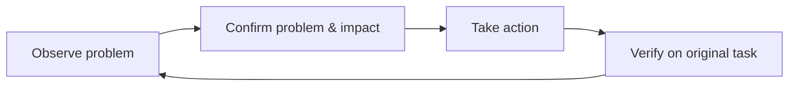

> This article expands on the "closed loop" thread in [Management Retrospective](/en/writing/2026/08/management-retrospective/).

"Developers should use their own product more" is something almost no one would object to. But it can easily devolve into a requirement with no outcome: everyone opens the product one evening, scrolls through content for ten minutes, raises a few scattered issues, and then starts from scratch again next time. The "experience nights" I organized myself went through exactly this kind of spinning in place—until I turned them into a full loop with an entry point and an exit, and only then did they begin to produce things that actually pushed the product forward.

The problem isn't that developers aren't serious enough, but that "using" the product doesn't automatically generate feedback. Only when use is placed inside a complete loop—with real tasks, assessable evidence, a clear handling path, and follow-up verification—does it become a source of product improvement.

This article offers a four-step method applicable to content, tool, and consumer products: **task-based experience, evidence-based recording, structured handling, and closed-loop verification**.

## 1. Task-Based Experience: Don't "Browse the Product," Complete a Task

Ordinary users don't open a product to inspect a feature; they come with a goal. So the smallest unit of experience should not be a page or a button, but a real task from start to result.

A good task has three characteristics:

- A clear goal, for example "find a restaurant for the weekend and send it to a friend";
- A complete path, for example search, filter, read, bookmark, and share;
- Realistic constraints, for example an unstable network, first-time use, unfamiliarity with the content language, or an older device.

For example, rather than asking everyone to "experience search," give them a task: **you plan to go to a neighborhood you've never visited with a friend, find a restaurant with trustworthy reviews, save the route, and send your reasons for choosing it to them.** This path naturally passes through query understanding, result ranking, content credibility, the bookmark entry, the share copy, and the landing page after the jump. Hesitation, waiting, or failure at any step is a more valuable observation than "the search page looks fine."

Tasks don't all have to be designed by the organizer. Developers can also borrow goals from their own lives: finding a travel guide, publishing a photo journal, managing to-dos, subscribing to a topic, recovering an unfinished draft. The key is: while completing the task, first set aside what you know about how the product is implemented.

## 2. Evidence-Based Recording: Turn "It Feels Bad" into an Actionable Problem

"The experience here isn't great" is usually not enough to drive change, because it doesn't say who ran into what difficulty under what circumstances. Feedback that can be acted on should include at least four parts:

| Element | Question to answer | Example |
| --- | --- | --- |
| Context | Who is using it, and under what conditions? | First-time use; the network switches from Wi-Fi to cellular. |
| Task | What are they trying to accomplish? | Edit a post with images and save it as a draft. |
| Observation | What actually happened? | No feedback after clicking save; clicking again produces two identical drafts. |
| Impact | What did it cost the user? | Unsure whether the content was saved; may repeat the action or just quit. |

This isn't asking for every piece of feedback to become a long report. Its purpose is to connect subjective feelings to reproducible facts.

For example, the two ways of writing below have very different value for handling:

> The draft-saving experience is bad.

> While editing a long piece of text on a weak network, I clicked "Save draft" and saw no status indicator for 8 seconds. I clicked again, and after the network recovered there were two drafts; the user has no way to tell whether the first action succeeded. I suggest at least providing "saving / saved / failed to save" states, and verifying whether repeated submissions are deduplicated.

The latter doesn't presume a solution, yet it already provides reproduction conditions, user impact, and a verifiable direction. Development, design, and testing can discuss around the same fact, instead of first arguing over "whether this even counts as a problem."

## 3. Structured Handling: Distinguish Defects, Friction, and Opportunities

When all observations go into the same "issue pool," the most common result is that no one knows what to do first. A more effective approach is to first divide feedback into three categories:

| Type | Meaning | Example | First action |
| --- | --- | --- | --- |
| Defect | The user can't get the expected result, or the result is clearly wrong. | The link doesn't open after clicking share. | Confirm the scope, reproduce, and fix as soon as possible. |
| Friction | The task can still be completed, but the user has to guess, wait, detour, or repeat actions. | Filter options are buried too deep, so the user keeps returning to the list to adjust. | Judge frequency and impact, then optimize the path or the feedback. |
| Opportunity | The current path doesn't fail, but it reveals an unmet goal. | After bookmarking several guides, the user still has to organize the itinerary manually. | Validate the need first, rather than starting a project immediately. |

Categorizing isn't about labeling issues, but about matching different ways of handling them. Defects should prioritize confirming the facts; friction should look at how often it happens and how important the task is; opportunities should avoid concluding "we should add a feature" from a single observation.

Add two simple questions, and you can complete a basic prioritization:

1. How many people does it block from completing how important a task?
2. How much does it cost to fix or validate it?

For example, both "an icon's spacing is a bit uncomfortable" and "content disappears after bookmarking" are worth recording, but the latter blocks the key task of returning to content, so it should be handled first. Conversely, "I wish the bookmark folder could auto-sort by travel days" might be a good idea, but it first needs to be validated through similar behavior from multiple users.

## 4. Closed-Loop Verification: A Fix Is Not the End of Feedback

Many feedback systems stop at "submitted." But for experience issues, submitting, fixing, and actually improving are not the same thing. A closed loop needs to go through at least four states:

The last step is especially important. Take draft saving again: after the fix, you shouldn't just confirm that "the interface returns success"; you should also return to the original weak-network scenario and check whether the user can understand the save status, whether repeated clicks are safe, and whether the content can really be recovered after quitting. Technical success doesn't necessarily mean the user's task has been completed smoothly.

This verification also corrects the initial judgment in return. Maybe the waiting indicator resolves the uncertainty, but you discover that what users are really confused about is "where the draft is saved"; maybe cross-platform checking reveals the problem only appears with a certain input method or OS version. The value of the feedback loop is precisely that it lets the team keep correcting old assumptions with new observations.

## Make the Mechanism Serve the Loop, Not the Check-In

Group experience sessions, cross-platform mutual testing, new-member experience notes, personal-account usage, and topic groups can all serve as carriers for this method; they are not the method itself.

A post-release group experience can be organized like this: first pick 3 real tasks, with each person responsible for one of them; during the experience, record by "context—task—observation—impact"; afterward, sort findings into defects, friction, and opportunities; assign a next step to each priority item; and revisit the same tasks in the next version. An hour like this is usually more effective than browsing aimlessly all evening.

It's also not advisable to make "everyone must report one issue per week" a hard metric. It nudges people to hunt for trivial problems, or to dress up guesses as conclusions. Four signals are more worth watching:

- Whether the experience tasks cover the key user paths;
- How much of the feedback contains reproducible evidence;
- How long high-priority issues take from discovery to handling;
- Whether the original task actually becomes smoother after the fix.

## Conclusion: A Developer's Most Valuable Advantage Is Returning to the User's Position

Developers know a system's internal logic well, which is an advantage for solving problems; but it also makes it easy to skip over the confusion users must go through. The meaning of genuinely using your own product is to temporarily set aside this "knowing" and re-experience how users find the entry point, interpret feedback, endure waiting, and face failure.

When "use the product more" is designed as a complete feedback loop, it stops being an extra burden and becomes part of development work: each real task may let us see, earlier, a problem we would otherwise only discover after a user complaint.
