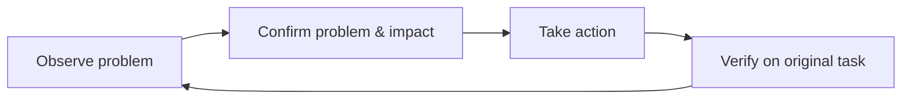

> 本文是[《管理复盘》](/writing/2026/08/management-retrospective/)中「闭环」这条线的展开。

"开发者应该多用自己的产品"听上去几乎没有人会反对。但它很容易落成一项没有结果的要求：大家在某个晚上打开产品、刷十分钟内容、提几个零散问题，然后下次继续从头开始。我自己组织的"体验之夜"就经历过这种空转——直到把它改成一整套有入口、有出口的回路，才真正开始产出能推动产品的东西。

问题不在于开发者不够认真，而在于"使用"本身不会自动产生反馈。只有当使用被放进一套完整的回路——有真实任务、有可判断的证据、有明确处理路径，也有回访验证——它才会成为产品改进的来源。

这篇文章给出一套适用于内容、工具和消费类产品的四步方法：**任务化体验、证据化记录、结构化处理、闭环式验证**。

## 一、任务化体验：不要"逛产品"，要完成一件事

普通用户不会为了检查一个功能而打开产品；他们带着目标而来。因此，体验的最小单位不应是某个页面或某个按钮，而应是一个从起点到结果的真实任务。

一个好任务有三个特征：

- 有明确目标，例如"找到适合周末去的餐厅并发给朋友"；
- 有完整路径，例如搜索、筛选、阅读、收藏和分享；
- 有现实约束，例如网络不稳定、首次使用、不熟悉内容语言，或使用较旧设备。

例如，与其让大家"体验搜索"，不如给出任务：**你计划和朋友去一个没去过的街区，找到一家评价可信的餐厅，保存路线，并把选择理由发给对方。** 这条路径会自然经过搜索词理解、结果排序、内容可信度、收藏入口、分享文案和跳转后的落地页。任何一步的犹豫、等待或失败，都是比"搜索页看起来不错"更有价值的观察。

任务不必都由组织者设计。开发者也可以从自己的生活里借用目标：寻找旅行攻略、发布一条照片记录、管理待办、订阅一个主题、恢复一份未完成的草稿。关键是：完成任务时，先暂时忘记自己知道产品怎么实现。

## 二、证据化记录：把"感觉不好"变成可处理的问题

"这里体验不太好"通常不足以推动改变，因为它没有说明谁在什么情况下遇到了什么困难。一个能被处理的反馈，至少应包含四个部分：

| 要素 | 要回答的问题 | 示例 |
| --- | --- | --- |
| 情境 | 谁在什么条件下使用？ | 第一次使用、网络从 Wi-Fi 切到蜂窝网络。 |
| 任务 | 想完成什么？ | 编辑一条图文并保存为草稿。 |
| 观察 | 实际发生了什么？ | 点击保存后页面没有反馈；再次点击后出现两条相同草稿。 |
| 影响 | 用户因此付出了什么代价？ | 不确定内容是否保存成功，可能重复操作或直接退出。 |

这不是要求每一条反馈都写成长报告。它的作用是把主观感受接到可复现的事实。

例如，下面两种写法的处理价值很不一样：

> 草稿保存体验不好。

> 在弱网下编辑一段较长文字，点击"保存草稿"后 8 秒没有状态提示。我再次点击，恢复网络后出现两份草稿；用户无法判断第一次操作是否成功。建议至少提供"正在保存／已保存／保存失败"的状态，并验证重复提交是否会去重。

后者不预设解决方案，却已经提供了复现条件、用户影响和可验证的方向。开发、设计和测试可以围绕同一个事实讨论，而不是先争论"这算不算问题"。

## 三、结构化处理：区分缺陷、摩擦与机会

所有观察都进入同一个"问题池"时，最常见的结果是没人知道该先做什么。更有效的做法，是先把反馈分成三类：

| 类型 | 含义 | 例子 | 首要动作 |
| --- | --- | --- | --- |
| 缺陷 | 用户无法得到预期结果，或结果明显错误。 | 点击分享后链接打不开。 | 尽快确认范围、复现与修复。 |
| 摩擦 | 任务仍可完成，但用户要猜、等、绕路或重复操作。 | 筛选条件藏得太深，用户反复返回列表调整。 | 判断频率和影响，优化路径或反馈。 |
| 机会 | 当前路径没有失败，但暴露出未被满足的目标。 | 用户收藏多篇攻略后，仍要手动整理行程。 | 先验证需求，而不是立刻立项。 |

分类不是为了给问题贴标签，而是为了匹配不同处理方式。缺陷要优先确认事实；摩擦要看发生频率和任务重要性；机会则要避免凭一次观察直接得出"应该新增功能"的结论。

再加上两个简单问题，就能完成基本排序：

1. 它阻断了多少人完成多重要的任务？
2. 修复或验证它，需要付出多大代价？

例如，同样是"收藏"，一个图标间距不够舒服，和"收藏后内容消失"都值得记录，但后者阻断了用户回访内容的关键任务，应当优先处理。反过来，"希望收藏夹能按旅行天数自动排序"可能是好想法，却需要先通过多位用户的相似行为来验证。

## 四、闭环式验证：修复不是反馈的终点

很多反馈系统停在"已提交"。但对体验问题而言，提交、修复和真正改善并不是同一件事。闭环至少需要经历四个状态：

最后一步尤其重要。仍以草稿保存为例：修复后，不应只确认"接口返回成功"，还应回到原来的弱网场景，检查用户能否明白保存状态、重复点击是否安全、退出后是否真的能恢复内容。技术上的成功不必然等于用户任务已经顺畅完成。

这种验证也会反过来校正最初的判断。也许等待提示解决了不确定性，却发现用户真正困惑的是"草稿保存在哪里"；也许跨平台检查发现问题只出现在某个输入法或系统版本。反馈回路的价值，正是让团队不断用新的观察修正旧的假设。

## 把机制服务于回路，而不是服务于打卡

共同体验、跨平台互测、新成员体验记录、个人账号使用和主题小组，都可以成为这套方法的载体；它们不是方法本身。

一次发布后共同体验可以这样组织：先选 3 个真实任务，每人负责其中一个；体验时按"情境—任务—观察—影响"记录；结束后将发现分为缺陷、摩擦和机会；为每条优先事项指定下一步；下一个版本再用同一任务回访。这样的一小时，通常比无目标地浏览一晚上更有效。

也不建议把"每人每周必须报一个问题"作为硬性指标。它会诱导人寻找琐碎问题，或者把猜测包装成结论。更值得关注的是四个信号：

- 体验任务是否覆盖了关键用户路径；
- 反馈中有多少包含可复现的证据；
- 高优先级问题从发现到处理需要多久；
- 修复后，原任务是否真的变得更顺畅。

这四个信号背后是同一件事：开发者熟悉系统的内部逻辑，这是解决问题的优势，但也容易让人跳过用户必须经历的那部分困惑。真实自用要做的，就是暂时放下这些"知道"，重新体验一次用户如何找到入口、理解反馈、承担等待和面对失败。

我自己组织的"体验之夜"从空转到能产出东西，靠的正是把"多用产品"重新设计成一条完整的反馈回路——不是额外负担，而是开发工作本身的一部分。每一次真实任务，都可能让我们比等到用户投诉时更早看见问题。
