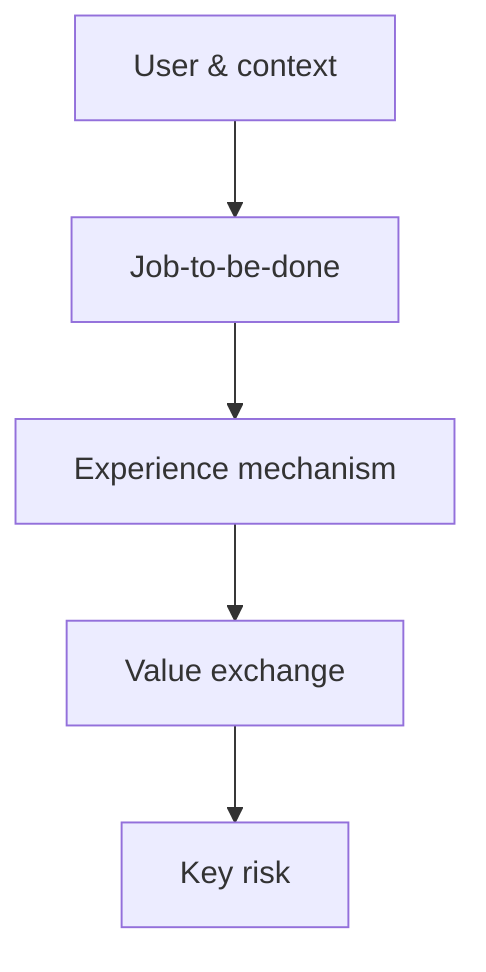

A product overview is most easily written as a kind of "material warehouse": founding dates, market lists, feature screenshots, competitor tables, news links, page after page. I started my own product research from this warehouse model — until I found that readers might know more after reading, yet still could not answer the most important question: **Whose problem does this product actually solve? What makes it work? What judgment should we act on right now?**

Later I rewrote it into something else: not an abridged encyclopedia, but a judgment model aimed at specific readers. It should let someone just joining the discussion build enough shared context to participate in decisions within a short time; it should also let people familiar with the product see their own assumptions, evidence, and unknowns.

The following is an approach that can be used for new-member onboarding, project kickoff, design review, or competitor research. Notion here serves only as a practice subject for studying public materials: it is not an explanation of the product's internal situation, nor does it treat descriptions on public pages as unverified business conclusions.

## First, be clear: whom this overview should help make what judgment

Before writing, first write down a one-line definition of done: what better judgment should the reader be able to make after reading?

The same product yields completely different overviews for different readers. A version for new colleagues might focus on users, core tasks, and a glossary; a version for a design review might focus on critical paths, existing constraints, and assumptions to be tested; a version for partners needs to clearly separate public facts, inferences, and unknowable information.

If the purpose is unclear, material will naturally pile up. Every item seems "potentially useful," yet there is no standard for deciding whether it belongs in the main text.

You can first constrain the scope with a single question:

> This document helps people encountering the product for the first time understand: what goals users arrive with, how the product organizes those goals through experience, and which key judgments still need evidence.

This sentence is not a formatting requirement but an editorial knife. Material that cannot help readers answer this question need not go into the main text; even if kept, it should go into an appendix or a source index.

## Use "user tasks" instead of a "feature list" as the skeleton

Features are capabilities the product provides; tasks are what users are trying to accomplish. If an overview starts from features, it often produces a list like "recommendations, search, publishing, favorites, comments" — every word is correct, but nothing explains why these capabilities belong together.

A more explanatory approach is to start from a user task, then follow it with questions:

1. In what situation does the user open the product?
2. What result does she want to achieve, rather than just which feature to click?
3. What key steps must she go through to reach the result?
4. Where does the product reduce uncertainty, create motivation, or introduce friction?

For example, the public [Notion website](https://www.notion.com) describes it as a workspace that combines documents, knowledge bases, tasks, and databases, and lists capabilities such as pages, databases, templates, multi-person collaboration, and integrations. Copying these materials directly into a "feature introduction" has limited value; organizing them into user tasks reveals the product logic: an individual may arrive with the goal of "turning scattered thoughts into reusable structure," creating pages, organizing hierarchies, and linking to related records; a team arrives with the goal of "making information jointly discoverable and updatable," establishing a shared workspace, agreeing on structure, and maintaining a single source of truth.

The point here is not to assert that these are all user motivations, but to propose a model that can continue to be validated. Public store copy describes the product's self-description and visible capabilities; user interviews, usability tests, and behavioral data can support stronger demand conclusions. An overview should keep the two separate.

## Use one page to make the product's causal chain clear

Before the material starts to multiply, first try writing a one-page "product causal chain." It does not need to be precise down to every module, but it should let readers see the connections from user to result.

| Layer | Question to answer | Practice with Notion's public material |
| --- | --- | --- |
| User & context | Who has this need, and when? | Individuals and teams who need to organize information, collaborate, or establish a working structure. |
| Job-to-be-done | What progress does the user want? | Turn scattered thoughts into searchable, reusable structure; let a team find and update together. |
| Experience mechanism | How does the product help accomplish the task? | Pages, databases, templates, and the block editor; shared workspaces and permissions; third-party integrations. |
| Value exchange | Why is the user willing to keep investing? | Individuals gain a reusable knowledge structure; teams gain a unified source of collaboration and information. |
| Key risk | Which link, if it fails, breaks the experience? | Observations based on public material and common products of the same kind: onboarding barrier and switching cost; the complexity of collaboration permissions. (Only a hypothesis to be verified, not a proven conclusion.) |

The first four rows of the table can form preliminary hypotheses from public pages and hands-on experience; the last row in particular should not be disguised as proven fact. Its purpose is to point out what to research next. For example, "content relevance" can be observed through task testing and search-result sampling; "credibility" requires studying how users judge authors, sources, and recommendations; "regional availability" must be checked by region, system, and version, rather than reusing an old market map.

The benefit of a one-page causal chain is that it prevents the overview from being dragged along by organizational structure, page structure, or a historical timeline. That information may matter, but only when it explains a user outcome or a decision constraint should it become part of the main thread.

## Don't just describe the current state; also explain change

A good overview doesn't only hold at a single point in time. It will be reread as the product evolves, so it's worth extending "a description of the current state" into a judgment structure that "also holds under change."

For products that depend on content, transactions, or network effects, you can at least look at three things at once:

1. Acquisition quality. Where do users come from? What is the channel promising users? Can that promise be fulfilled inside the product?
2. Value handoff. Do new users encounter content, services, or relationships relevant to their task quickly enough? Do users brought in by one-off tools, incentives, or trends have a path into long-term use?
3. Supply loop. Can consumer demand and feedback enable creators, merchants, or service providers to keep supplying better?

These three usually are not in a linear relationship: stronger acquisition can degrade the supply structure, and incentivizing supply can raise quantity while damaging trust. The overview's job is not to claim they can always be improved at once, but to point out the currently weakest link and the trade-offs.

A practical test question: **Why would a user open the product again without any external reminder?** If the only answers are "because of an event," "because of a push notification," "because of a subsidy," the product is still using external forces to sustain usage; a more solid answer should rest on the user's recurring task — the belief that here they can discover, solve, express, compare, or finish something faster.

For content products, supply volume is often the first variable observed, but users do not come for total content; they come looking for a suitable answer to a specific problem or interest. Content strategy therefore has at least three levels:

- Coverage: is there enough consumable supply for the target users' common tasks?
- Quality & trust: can users distinguish experience, advertising, reposted content, outdated information, and genuine feedback?
- Structure & matching: does the content carry enough signals to be understood, categorized, and retrieved, so users can find it while browsing, searching, or being recommended?

This reminds us that the growth section of an overview should not merely list "acquisition / activation / retention" metrics, but should explain which link is currently most constraining, why, and what will sustain repeated use in the next stage.

## Facts, inferences, and questions must be placed in separate columns

What most damages an overview's credibility is not the existence of unknowns, but writing unknowns as certainties. Especially when researching external products, public web pages, app-store copy, media reports, reviews, and personal experience do not all carry the same reliability.

A simple practice is to label the nature of each key statement:

| Label | Meaning | Example wording |
| --- | --- | --- |
| Fact | Can be directly verified against current, accessible sources. | "The app-store page lists the on-site editing tools." |
| Inference | An interpretation based on several facts; may be reasonable but still needs checking. | "These tools may be lowering the cost of switching between text and image creation." |
| Question | Not yet enough evidence to reach a conclusion. | "How does a new creator judge whether the feedback after publishing is worth continued investment?" |

This column system does not make the document seem less confident; on the contrary, it lets readers know which parts can be used directly and which parts only serve as a starting point for the next step of research. The goal of a product overview is not to create the feeling of "already understanding everything," but to give the team a shared understanding of what they know, what they believe, and what evidence is still missing.

Sources should also be placed as close to the conclusion as possible, rather than piled into a long list at the end. For a public case like Notion, the [official product page](https://www.notion.com/product) can support "how the developer currently describes the product and its features"; the [official help center and privacy documentation](https://www.notion.com/help) can support "what permissions and data-handling options the product provides." Neither can on its own prove user scale, retention, ecosystem quality, or actual usage motivations. The limits of what a source can support should be written out together with the conclusion.

## Competition is not a list, but the user's alternative paths

The "competitors" section often takes up a lot of space yet most easily devolves into a wall of logos. The reason is that it only answers "who else exists," not "why the user would choose another path at this moment."

A more practical unit of comparison is the alternatives to the same task. Taking "finding weekend travel inspiration" as an example, a user might search the web, ask friends, browse map reviews, watch video platforms, save image inspiration, or ask questions in a vertical community. These are not necessarily similar apps in the traditional sense, yet they jointly compete for the user's attention and trust.

When comparing, you can keep only the few dimensions relevant to the task:

| Dimension | Question to ask |
| --- | --- |
| Entry path | Does the user enter from search, follow relationships, a recommendation feed, or an external link? |
| Information form | Is the content suited to quick browsing, deep reference, saving for reuse, or immediate discussion? |
| Trust signals | What does the user rely on to judge whether content suits them? |
| Cost of action | How many jumps, filters, and reorganizations does it take to go from seeing information to completing the next step? |
| Applicability boundary | Under what task, region, language, or audience is this path actually better? |

This turns the superficial comparison of "does it resemble some platform" into an explanation of the user's choice. It also reminds writers: a competition conclusion must state the scenario, and must not inflate a single interface observation into a definite judgment about "product positioning."

## Keep the history, but don't let the timeline take over the narrative

History has value because it can explain today's constraints, user expectations, and technical debt; but a product overview is not a chronicle of events. Every piece of historical information should answer a present-tense question: whose behavior did it change? What capability or limitation did it leave behind? Why does today's reader need to adjust their judgment because of it?

For example, version updates, launch regions, or product feature changes should enter the main text only when they affect the current scope of research. Everything else can go into a short "known timeline" appendix with the retrieval date noted. This preserves traceability while avoiding mixing outdated information with the current state.

## Write the overview as a research entry point that can be maintained over time

An overview goes stale as soon as it is published. The best deliverable is therefore not a seemingly complete article that no one dares update, but an entry point that later contributors can supplement and correct.

At minimum, four things should be left behind:

- A scope statement: the research's readers, questions, and what is not covered;
- A source list: links, access dates, and what each source can support;
- A list of assumptions and unknowns: the judgments that need verifying, ordered by importance;
- Update triggers: for example, revisiting when the product's critical path changes, when entering a new research region, or when counter-evidence appears.

The author of an overview need not bear the responsibility of being permanently correct, but should make their reasoning checkable and correctable. Then newcomers won't collect material from scratch; disagreements won't have to turn into a clash of "I think" versus "you think," but can return to evidence, definitions, and unresolved questions.

## A pre-publish self-check

After finishing a first draft, you can review it with five questions:

1. Does the opening explain the judgment the reader needs to make, not just introduce the product?
2. Can you read all the way from user tasks to experience mechanism, value exchange, and risk?
3. Is it clear whether each key conclusion is a fact, an inference, or a question to be verified?
4. Do the comparisons revolve around the user's alternative paths, not just a list of similar products?
5. Can the reader use this to know what to look at next, whom to ask, and what to verify?

If most of the five questions cannot be answered, you usually don't need to add more material; you need to delete irrelevant information, tighten the question, and fill in the causal chain and the boundaries of evidence.

The real value of a product overview is not letting people quickly recite how many features the product has or which milestones occurred. It should organize scattered material into a jointly inspectable model: why users come, how the experience works, where value happens, where assumptions are fragile, and how the next step turns uncertainty into evidence. When it achieves this, it is no longer a static introduction but the most useful shared language when collaboration begins.
