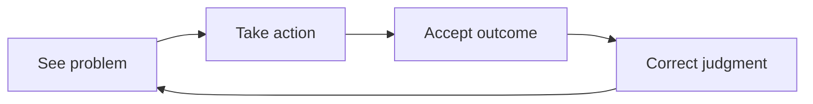

Whether a job really helps you grow cannot be judged only by whether it makes you busier, whether you are recognized, or whether you land a seemingly better position. The more worthwhile question is: has this experience changed the way I understand problems, invest my time, and take action? Can these changes be carried into the next context?

This piece is only about personal growth. It is not a set of "self-iteration" techniques, but an observational framework for judging whether a job is worth committing to over the long term: does it broaden your understanding, does it leave you with time you can control, and does it turn the experience gained through execution into an ability of your own.

## Personal Growth

Personal growth can begin with three words: **understanding, time, and execution**. They are not linear steps but a cycle: first see clearly the problem you face, then invest enough time to try, and finally correct your judgment through execution and reflection. When judging a job, you can also check these three things one by one to see whether they have happened.

### Understanding

#### A Change of Role

Most people are familiar with growth in school: moving from one grade to the next, with courses, exams, and goals that are relatively clear. You feel yourself moving forward, but a change of grade does not automatically mean your ability has grown.

After leaving school for work, the first thing to complete is a shift in understanding. The path common in student life is: someone designs the course, I learn it, and then an exam verifies the result. The path more common at work is: the problem appears first, and I have to find a way to solve it.

This means that many times you cannot wait until you have "learned everything" before starting. The first time you touch an unfamiliar technology, take charge of a cross-disciplinary collaboration, or face a failure you have never handled, you often can only fill in the most necessary knowledge first, run a small validation, and keep learning along the way. Learning while doing does not mean being careless; it requires you to judge more actively what must be understood first and what can be filled in gradually as you act.

After a few years of work, another question becomes more obvious: what exactly should I learn in the next stage? The answer is usually no longer written in the curriculum. Rather than clinging to some unified checklist of abilities, it is better to observe whether you can solve more complete problems: whether you can go from receiving a task to understanding the problem, whether you can identify constraints and trade-offs, and whether you can make one experience keep paying off the next time. The essence of a change of role is not obtaining a new title, but taking on more and clearer judgment about the problem.

#### Opening Your Horizons, Learning Continuously

After you start working, few people arrange your growth step by step. Self-drive is also not about pushing yourself harder, but about being willing to think and explore on your own initiative and to handle the work in front of you reliably.

A sense of direction comes from a wide enough field of view. If you compare only within the small area right in front of you, it is easy to mistake an accidental practice for the only answer. You can deliberately observe how neighboring fields solve similar problems: read public technical retrospectives and design documents, join discussions in professional communities, consult more experienced peers, or look carefully at the constraints faced by different organizations and different products.

The purpose of input is not to collect more material, but to renew your sense of what questions matter. For example, someone who originally only cared about "how to finish on time" may, after seeing more approaches, start to ask "how to reduce rework," "how to surface risks earlier," or "how to make things easier for the next person who takes over." Only after your horizons open up are you more likely to find a direction that suits you, rather than working in isolation with limited information.

#### Accepting What You Have

Growth is not always smooth. Trying hard and still not getting the result you wanted, encountering an unsuitable opportunity, or progressing very slowly at some stage are all common. Accepting reality is not giving up, but avoiding turning everything beyond your control into harsh blame of yourself.

This acceptance has two layers. The first is accepting the outcome: when something does not meet expectations, you can review it honestly, yet you need not turn a single result into a verdict on your entire worth. The second is accepting the process: growth has detours, and it also has fragmented, on-and-off accumulation. Not all learning can be arranged into a complete course; much judgment is slowly pieced together through repeated reading, discussion, trying, and failing.

Problems you can avoid, you should of course avoid; problems you must face should not be handled by evasion alone. The more stable attitude is to strive as hard as you can while leaving room for uncertainty: take concrete actions seriously, but do not magnify momentary gains and losses into your whole life.

### Time

Growth takes time. What is meant here is not just spending a few extra hours each week, but being willing to set aside stable space over a longer period for understanding, practice, and consolidation.

Under high-intensity work, time is especially scarce. One direction is to improve efficiency: cut trivial matters without priority, improve repetitive processes, and put attention on what truly matters. The other direction is to cherish the time you can control, but not treat rest and life as resources that must be requisitioned. Sleep, relationships, and recovery are not the opposite of growth; they often determine whether you can keep learning and keep your judgment.

The way you invest also differs by stage. Early in your career you may be willing to spend more blocks of whole time filling in fundamentals and doing exercises; later, with more family, health, or life responsibilities, study time shrinks and requires more trade-offs. This is not regression. The key is to know which stage you are in and to make choices at a realistic, sustainable pace.

Therefore, judging whether a job helps you grow also means looking at whether it allows you to form this kind of time structure: beyond continuous delivery, whether there is still room to understand the reasons, learn something new, consolidate experience, and recover energy when necessary. Busyness that leaves only fatigue with no accumulation over the long term hardly deserves to be called growth.

### Execution

#### Clarifying the Goal of Learning

Growth must land in action, practice, and results, not stop at "I want to become better." But the goal need not be grand from the start. Compared with vaguely saying "become an expert" or "improve my ability," it is more useful to state: what type of problem do I want to solve? What counts as doing better? What change can I observe next time?

Goals come from two sources. One is observing yourself: in which situations do I keep getting stuck, and which abilities are worth accumulating over the long term. The other is communicating proactively with others: bringing the thinking you have already done and asking peers, seniors, or collaborators how they understand the problem. Having many questions is not a burden; what tends to waste everyone's time is questions that are unprepared and fail to advance the discussion.

It is certainly nice when someone gives you the answer directly, but such opportunities are not reliable. The more dependable approach is to first build a sense of what "good" means, then hold it up against what you are doing: what is already working, what is still lacking, and how to change the next step. A learning goal should point at the problem to be solved, not forever wait for someone else to write your to-do list.

#### An Open Mind: Learn from Stronger People and Execute

When work becomes familiar and input becomes scarcer, people tire easily. At such times, it is worth bringing your own accumulation and approach to discuss with people who do it better. "Stronger" here need not mean someone with a higher title, but someone who happens to have deeper experience on a particular problem and can offer a different perspective.

Learning is also not limited to scheduling a formal conversation. Watching how others write proposals, break down problems, and handle disagreements, and joining public communities or professional groups, are all opportunities to observe real practice. What matters is that you also "make a move": first give a judgment, propose an approach, then polish it against feedback. If you only listen and never practice, experience rarely becomes your own.

Openness also means being able to handle criticism. Disagreement does not require an immediate rebuttal, nor does it require accepting everything. You can first distinguish whether the other person is pointing out a fact, a risk, a preference, or a problem of expression, and then decide how to adjust. People are not perfect; being able to keep absorbing outside information and correcting yourself often matters more than defending a single judgment.

#### An Execution Approach That Fits You Better

Learning methods need not be uniform. Some people are used to using scattered time to read, record, and sync information; others need a full block of time to write a long article, finish an exercise, or study a subject systematically. Both kinds of time deserve to be cherished, but they suit different kinds of work.

Fragmented time can be used to read an article, note down a question, or fill in a concept; the key is to later string the fragments together and turn them into your own understanding and action. Whole blocks of time suit work that requires sustained focus, such as finishing a small project, researching an unfamiliar topic, or going back to fill in a foundational subject. The measure of whether a method is good is not how self-disciplined it looks, but whether it can be sustained over the long term and genuinely improve the results of your work.

#### Summarizing Continuously

Problems inevitably appear in the course of execution, so you also need to review. Every so often, it is worth looking back: what have I done, what have I accumulated, where have I failed repeatedly, and which judgments were later overturned by the facts?

When summarizing, you can first write down your observations as fully as possible: your way of working, your collaboration with others, the objective conditions behind unmet expectations, and the signals you ignored at the time. Then break down the core problem, distinguishing what genuinely needs improvement from "false needs" that are merely surface symptoms. When it is time to actually change, clarify priorities and land the conclusion in a concrete action you can take next time.

Whether a job brings growth can be tested with these questions: can I define problems better than before? Have I received feedback that corrects my judgment? Have I kept methods that I could use in another context? If these answers gradually multiply, experience is turning from repetition into accumulation.

### A Casual Note from a Personal Angle

Everyone's path of growth is different. At certain stages, a senior who is willing to guide you concretely can matter a great deal: they may help you see your way of working clearly, point out a problem in an implementation, or demonstrate how to set more realistic goals. But anyone's energy and experience have limits, and you should not expect someone to plan everything for you completely over the long term.

More sustainable growth often comes from actively seeking out material, observing other people's approaches and judgments, producing your own output, and putting it back into real situations to verify. Sometimes you need to communicate more, sometimes you need to settle things alone; there is no cure-all, only continually adjusting your method to your circumstances.

## Conclusion

Growth is not a form filled in by someone else, nor is it an endless upward acceleration. It is a long-term cycle of understanding, time, and execution: see the problem, invest in action, accept the outcome, correct the judgment, and carry the experience into the next context.

To judge whether a job is really helping you grow, look less at whether it seems busy and more at whether it lets you understand problems better, do things more correctly, and be more capable of facing the next change.
