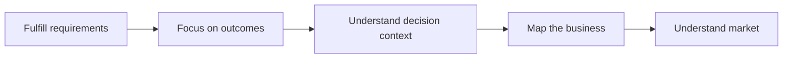
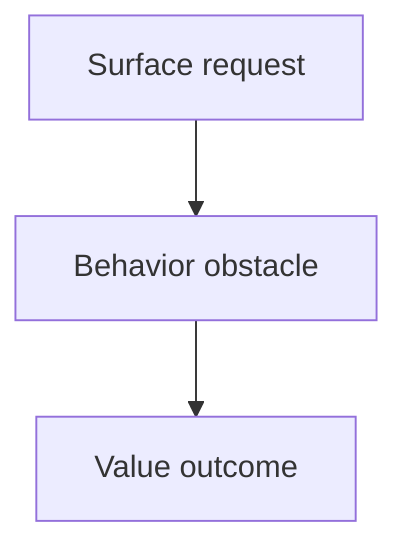
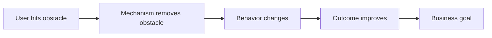

Product judgment for engineers is not a demand that everyone replace the product manager, nor is it an extra "soft skill" bolted onto technical work. Its purpose is to let engineers know: whose problem they are solving, why the approach holds, how the effort produces results, and where to go back and correct when results fall short of expectations.

Technical implementation is one part of the work; understanding the problem, weighing trade-offs, and validating outcomes determine whether that implementation is actually pointed in the right direction. This article keeps a practical growth framework: starting from completing requirements, gradually learning to understand outcomes, take part in discussions, map the business, and form judgment across a wider scope.

## 1. Five Stages of Product Understanding

These five stages are neither a rank ladder nor a linear promotion path. The same engineer may already be able to take part in planning in a familiar domain, yet still need to start from understanding requirements after entering a new one. What they describe is how one's perspective gradually widens.

### Stage 1: Complete Requirements — First, Get Things Right

At first, the focus is usually the implementation itself: what the requirement is, how the interface is defined, what the boundary conditions are, and how to deliver on time and reliably. This is the basic craft of engineering work and must not be dismissed.

The problem is that, over the long term, if you only care about "whether I finished the development," it is easy to treat requirements as external orders that need no understanding. An engineer can become very good at completing local tasks while struggling to explain why they are being done, how to judge whether they worked, and how to raise valuable questions when the plan is unclear.

You don't need to take on every product responsibility to move past this stage. It's enough to ask three more things at each requirement review: What problem does this work solve? What does success look like? How do you plan to confirm the results after release? Understanding the background before development, checking during development whether the approach is drifting from the goal, and looking back at the feedback once after release is enough to build a basic feedback loop.

#### Why Engineers Need to Understand Outcomes

First, outcomes are the common language for describing the value of work. Complex implementations, the time invested, and the amount of code only take on meaning when placed inside outcomes. Second, outcomes help engineers make better technical trade-offs: only by knowing what sits on the critical path can you judge how to rank performance, stability, experience, and maintenance cost. Third, understanding outcomes lets engineers spot problems earlier, instead of discovering that the requirement's boundaries were wrong only when rework is needed.

### Stage 2: Focus on Outcomes, but Not Merely "Listening and Watching"

After working for a while, most engineers start paying attention to goals, outcomes, and feedback. This is a necessary step from execution toward understanding, but it is easy to stay at passive input: you can follow the metrics and conclusions others explain and can restate a requirement's value, yet you cannot explain the relationships between them.

To understand more deeply, the key is not to memorize more terms but to distinguish three kinds of information: the outcome you ultimately want to change, the user's concrete behavior along the way, and the experience and costs that must be kept from deteriorating. The first gives direction, the middle behavior helps locate the problem, and the last prevents local optimization from harming the whole.

For example, a flow that is asked to "raise its completion rate" does not succeed merely because the completion rate went up. You should also ask: Did the user really understand the task? Did they encounter waiting, errors, or hesitation along the way? Did they get a valuable result after finishing? Was the short-term change bought with more interruptions, resource consumption, or lower quality? Only by putting the outcome back into the full chain can you avoid being led astray by a single signal.

### Stage 3: Understand the Decision Context and Take Part in Discussion

When engineers not only know what a requirement does but can also explain its background, goal, constraints, and likely impact, they can begin to take part in the discussion. Participating does not mean you must overturn the existing plan; more importantly, it means stating the problem clearly, exposing hidden assumptions, and turning technical risk into trade-offs that can be discussed.

A valuable question usually has four parts: what I understand the goal to be; through what mechanism the current plan reaches that goal; which constraint or side effect I am worried about; and whether we can add evidence, narrow the scope, or validate the key assumptions first. This kind of phrasing moves a decision forward far better than "I just don't think it's reasonable."

What this stage requires practice in is translating feature language into user tasks. Users don't inherently need a particular page, entry, or configuration item; they need to complete a task in a given scenario at lower cost. When an engineer can point out whether "the plan solves a feature description or the user's actual obstacle," they are already improving the quality of the plan.

### Stage 4: Map the Business and Understand Your Place in the Value Chain

A single requirement is only a local action. The next ability is being able to explain whom the module you own serves, what inputs it receives, what outputs it provides, which upstream and downstream systems it depends on, and how it affects the overall goal.

Mapping the business does not mean writing an exhaustive introduction. It is enough to answer five questions first: Who are the users or partners? What task do they need to accomplish? Where are the main obstacles in the current chain? Which link can this module influence? What constraints define the plan's boundaries? If you can answer these questions reliably, you can do project reviews, cross-team communication, and follow-up planning more effectively.

At this stage, you should expand from "looking at one requirement" to "looking at a set of consecutive requirements." Reviewing past iterations is for understanding how the problem evolved; knowing the work currently in progress is for spotting synergies and conflicts; watching the next direction is for preparing capabilities and dependencies ahead of time. History is not a reason to copy the past but material for judging cause and effect.

### Stage 5: Understand the Market, Competition, and Trends from a Wider Perspective

More mature judgment places the project in a larger environment: whether user needs are changing, how supply and cost are changing, what problems similar approaches have solved, and what new boundaries technology has brought. This is not asking engineers to produce strategy reports on demand, but to avoid discussing only local optima from an internal perspective.

This layer is hard, and you don't need to pretend to have certain answers. What matters is forming hypotheses, seeking outside evidence, admitting the information is incomplete, and revising your judgment as the facts change. Real planning is not about predicting with absolute accuracy but about keeping a sense of direction and the ability to adjust amid change.

## 2. From Requirements to User Problems: Three Layers of Questioning

A requirement document usually describes a solution to be implemented rather than the problem itself. After receiving a requirement, engineers can use three layers of questioning to avoid diving into implementation details too early.

### Layer 1: The Surface Request — What to Deliver

First, confirm the basic boundaries: who will use this capability, in what scenario it occurs, what behavior is to be added or changed, and which experience, compatibility, compliance, or timing conditions cannot be breached. This layer ensures the team shares a common understanding of scope.

### Layer 2: The Behavioral Obstacle — What the User Wanted to Accomplish and Where They Got Stuck

Then translate the feature into a task. The user's difficulty might be not finding the entry, not understanding the information, too many steps, untrustworthy results, waiting too long, or missing feedback at a key point. Different obstacles need different mechanisms; you cannot treat them all with one implementation.

### Layer 3: The Value Outcome — Why It Is Worth Solving First

Finally ask: if the obstacle is reduced, which user behavior will change? How does that change support the current goal? What experience, quality, or cost might have to be paid? What evidence would count as effective?

Take "adding a shortcut entry" as an example: the surface request is to add an entry, but the real obstacle might be that users don't know the capability exists, or that the existing flow is too long. The former calls for improving discovery and guidance, while the latter calls for examining the flow itself first. Without making this distinction, you could fully implement the entry and still not improve the user's task.

## 3. How to Place a Technical Solution in the Business Causal Chain

Any plan should be expressible as a chain that can be discussed: the user hits an obstacle in a scenario, the product mechanism reduces the obstacle, the user's behavior changes, the key outcome improves, and this in turn advances the business goal. The engineer's job is to make the mechanism in that chain reliable, controllable, and reasonably costly, and to verify that the chain actually holds.

### Work Backward from the Goal, Not from Technical Preference

State the outcome to be changed first, then discuss the implementation. A practical template is: in order to make it easier for a certain group of users to complete a certain task in a certain scenario, we reduce a specific obstacle through some mechanism; we expect to observe a behavior change first, which then brings an outcome change; and we also need to watch for certain risk signals.

This forces the team to answer several key questions: which link does the plan affect? Why does it affect it? If the outcome does not appear, where is the chain most likely to break? If you cannot explain these things, a complex implementation usually cannot make up for a missing problem definition.

### How Technical Metrics Connect to User Value

Technical metrics are not business value in themselves, but they often sit at important positions in the causal chain. When expressing this, avoid the leap from "better performance, therefore better experience"; instead, explain the concrete mechanism: waiting or failure on key steps decreases, users reach an actionable state faster, tasks are interrupted less, and only then do subsequent behaviors have a chance to happen.

The same optimization has different priority in different scenarios. If the problem sits before a critical task, has a wide impact, and is backed by evidence, it is worth prioritizing; if it sits on a low-frequency, non-critical path, you should compare its opportunity cost against other work. Foundational work that cannot directly form a business chain is still worth doing, but you should be clear that it solves reliability, efficiency, or long-term maintenance problems — and avoid packaging every technical investment as short-term growth.

### Write Out Both the Positive and Negative Chains

A mature plan states not only the benefits but also the costs. Whom does it make things easier for, and whom might it make things harder for? When it raises local efficiency, does it increase cognitive burden, system complexity, resource consumption, governance risk, or long-term maintenance cost?

Writing out both the positive and negative chains shifts the discussion from "should we support this plan" to "do the benefits outweigh the costs, and how do we reduce the costs." This is precisely the unique value engineers can bring to a review.

## 4. How to Map the Business and Make Plans

When you begin to own a direction that evolves continuously, you should switch from a requirement list to a business map. The point of the map is not to show coverage but to find the problems genuinely worth investing in.

### First, Locate Your Own Scope

Clarify the module you own, its capability boundary, and its upstream and downstream relationships: what inputs upstream provides, what problem you handle, who consumes your output, and which partners jointly determine the final result. When the scope is unclear, plans tend to overstep; when you stare only at local metrics, you tend to optimize the wrong place.

### Then, Find the Core Tension

The core problem is usually not a missing feature but the most prominent conflict among user tasks, supply capacity, experience cost, and system constraints. When judging, you can keep asking: What is the current phenomenon? Why does it happen? One level up, what condition keeps it persisting? Keep asking until you find the cause that is both actionable within your current scope and carries the greatest impact.

This is not about getting a globally optimal answer in one shot. Most real decisions can only be made as local optima under limited information: choose the direction that is more important, better supported by evidence, and verifiable, then keep correcting it through feedback.

### What a Plan Should Contain

A useful plan states at least: the background and current problem; the goals and their priorities; key constraints; short-term verifiable actions; long-term capability building; dependencies and risks; and how to judge progress. A plan is not a feature list, nor is it putting everything you want to do on a timeline. It must explain how each investment serves the problem and the goal, and how to adjust when conditions change.

A short-term plan may only relieve the surface, while a long-term plan deals with deeper structural problems. The two are not in conflict: solve the most urgent blockage now, while avoiding a short-term implementation that locks the future path completely. A plan has real value only when you can make this trade-off explicit.

## 5. How to Keep Judgment and Collaboration Amid Disagreement

Engineers don't need to fully agree with every decision. What matters is distinguishing personal preference, local cost, and the shared goal. When opposing a decision, first confirm whether you have the full background; then express your doubts as concrete goals, risks, and evidence; and finally propose a verifiable alternative or a protective measure.

If the team makes a trade-off with fuller information, engineers should still execute well and keep opportunities for observation and review. Sticking to principles does not mean refusing to collaborate; accepting a decision does not mean giving up on thinking. Part of judgment is knowing which issues need to be escalated for discussion and which should be corrected by later facts.

## 6. Learning Something New: Learn, Do, and Review at the Same Time

Product understanding is not knowledge you "finish learning" once. Waiting to learn everything thoroughly before acting often means missing the real scenario; only burying yourself in work without filling in background tends to fragment experience. A more effective way is to learn with concrete questions, test your understanding through action, and then distill the results into a framework you can reuse next time.

### Why Review Matters

A review is not for grading the past but for calibrating judgment. One review can check along the causal chain: Was the problem defined correctly? Were the target users actually reached? Was the mechanism understood and adopted? Was the implementation stable? Were the results influenced by other factors? What should be kept, stopped, or adjusted next time?

Falling short of expectations does not mean the work had no value. If you can locate where the chain broke, you gain knowledge more reusable than "success or failure." In the long run, judgment is formed precisely through this repeated calibration.

### Asking, Answering, and Explaining

A high-quality question is not the vague "how do we do it" but rather states the known facts, your own understanding, the reasoning step that is genuinely stuck, and what kind of help you hope to get. Answering a question is not throwing out a conclusion either, but explaining the premises, the path of reasoning, and the boundaries.

Explaining a problem to someone unfamiliar with the background is a good way to test your understanding. If you can only restate terms, you are still at the input stage; if you can explain the goal, the chain, the trade-offs, and the risks, you have formed your own judgment. Writing short reviews, organizing sharing sessions, and discussing with collaborators are all effective practice.

### Stay Open and Keep Producing Output

Experience brings efficiency but also inertia. When facing a new problem, respect your existing experience while also acknowledging that it may not apply to new users, constraints, and environments. Staying open is not changing your position lightly, but being willing to let evidence revise your conclusions.

Producing output makes thinking testable. You can start from the smallest form: record a requirement's user task, key assumptions, the plan's trade-offs, and the feedback after release. With continuous accumulation, these records become a shared judgment asset for both you and the team.

## 7. Common Questions: Putting Judgment Back into Real Work

The framework above may not look complicated; what is truly hard is applying it to the concrete, trivial work of each day. Below I answer a few common questions. These questions have no universal standard answer, but they can provide a more stable starting point for thinking.

### I'm Only Responsible for Implementation — Why Do I Need to Understand Business Outcomes?

Because engineering work doesn't end the moment code is committed. Understanding outcomes first helps you judge whether what you're doing is the critical problem: of two tasks that both require time, one blocks users from completing a core action while the other merely polishes an edge experience — their priorities are clearly different. Second, outcomes are the common language for explaining value, driving collaboration, and securing resources. Describing only "what was done" makes impact hard to compare; when you can explain "what problem was solved, what change resulted, and what it cost," the discussion becomes far more effective.

More importantly, understanding outcomes improves technical design in return. You will know which states must not fail, which paths are worth optimizing, which data or logs must be kept, and which abstractions should be built now versus later. Technical judgment does not become purer by leaving the business behind; rather, it is about knowing where it is worth investing rigorously.

### Should Engineers Handle Product Details, Analysis, or Collaboration Gaps Found in Requirements?

You don't need to take every omission onto yourself, but when you see an obvious problem, you should raise it. Raising a problem is not overstepping: you don't need to write a full plan in someone else's place, nor take on delivery for every role; what you need to do is explain, based on the facts you have touched, the impact the omission might cause, and help the team decide who should handle it.

A workable distinction is: does it affect the user's task, launch quality, a key constraint, or later judgment? If so, it is worth explaining in the right venue; if it is only personal preference, first judge whether it is worth the collaboration cost. Separating "finding a problem" from "owning a problem" is how you keep both a sense of responsibility and a sense of boundaries.

### I Understand the Metric Definition — Does That Count as Understanding the Business?

Not yet. Understanding the definition only shows you know how to measure a phenomenon; understanding the business also requires knowing why this phenomenon is measured, where it sits in the chain, what a change would mean, and which other outcomes it would sacrifice.

You can keep asking: what user behavior does this signal correspond to? After this behavior improves, what outcome do you ultimately hope to get? If it improves while the final outcome stays the same, which link might have broken? If it improves but brings side effects, who bears the cost? Only when you can answer these questions does a metric stop being just a name on a report.

### Can You Judge a Direction by Looking at a Single Core Outcome?

No. A core outcome provides direction, but looking at it alone hides stage differences, structural differences, and quality problems. When a direction is in the exploration, building, stable, or convergence stage, the reasonable focus of observation differs; the same change can also come from different types of users, different channels, or different task paths.

Therefore you need to look at outcomes, process, and guardrails at the same time. Outcomes tell you whether you are approaching the goal, process tells you why it is happening, and guardrails warn whether local change was bought with an unacceptable cost. Engineers especially need to watch the guardrails: failures, performance regressions, error rates, resource consumption, maintenance complexity, and user complaints often appear first on the engineering side.

### How Do You Tell Whether a Decision Solves the Core Problem?

Don't try to get an absolutely correct answer in one shot. A more reliable way is to keep tracing the problem upward: What is the immediate phenomenon? What direct cause produced it? Why does that cause persist? Keep asking until you find a link that is both closer to the root cause and actionable within your current scope.

What counts as "core" usually satisfies three points at once: it affects a significant user task or system result; solving it unblocks multiple downstream problems rather than merely covering the surface; and the team has the ability to change it through current investment. If it can only affect a very small part, or is entirely outside your control, you should not invest too many resources under the name of a "core problem."

### When Should You Start Caring About Upstream, Downstream, and the Whole?

You can start with your very first requirement; only the depth increases over time. The smallest action is to understand the current requirement's context and consequences: why it is raised now, what conditions it depends on, and what downstream behavior it will affect. Then look at what has been done before in the same direction, what is being done now, and what it aims to solve in the future. Only finally does it expand to partners, adjacent modules, and the external environment.

You don't need to collect all information in the name of a "global view." Good global understanding expands selectively around the current problem: when an outcome can't be explained, follow the causal chain to look at upstream inputs, downstream results, and collaboration boundaries. Having lots of information does not mean deep understanding; being able to locate the information relevant to the problem is the effective global view.

### How Do You Write a Truly Useful Business Map?

First, avoid piling up material starting from organizations, features, and terminology. A better order is: first write the task the user or partner needs to complete, then write the key chain for completing it; then mark each link's goal, obstacle, dependency, and current evidence; and finally explain where your own module can and cannot have influence, and what to verify next.

A map should let someone unfamiliar with the project answer four questions: Why does this direction exist? What is the most important problem right now? Why did the team choose to do it this way? What will be used to judge progress going forward? If, after reading it, you still only know which modules make up the system without knowing the problems and trade-offs, it is still just a collection of material.

### How Do You Judge Whether What You Do Has Value?

Value is not declared unilaterally by an individual. The most reliable judgment comes from putting the work back into the shared goal and the causal chain: whose cost did it reduce, which task did it improve, which constraint did it remove, or which downstream collaboration did it make more reliable? Is there evidence or a verifiable hypothesis? Is there a lower-cost alternative?

Some foundational work does not directly change external outcomes yet still has value — for example, reducing failures, shortening delivery, lowering the cost of understanding, and avoiding duplicate construction. The key is to describe the type of value and its scope of effect honestly, rather than forcing everything to be described as visible growth. Accurately expressing indirect value is often more credible than exaggerating direct value.

### How Do You Decide What Not to Do?

Stopping a piece of work does not mean rejecting the idea; it means admitting the current opportunity cost is higher. You can filter with four questions: Is the problem it addresses real and important? Is there a credible mechanism between the plan and the problem? Are the conditions sufficient now for a high-quality delivery? Compared with other options, how do its benefits, risks, and reversibility stack up?

If the problem is unclear, the conditions for validation are missing, the risk is unacceptable, or a simpler alternative exists, you should narrow the scope, postpone the investment, or explicitly decide not to do it. Be especially wary of the mindset that "since we've already invested some, we must continue"; sunk cost is not a reason to keep investing.

### How Do You Engage Deeply with the Business Without Sinking into Pointless Busyness?

Deep engagement does not mean attending more meetings or reading more material. It means that, within the scope you own, you can continuously form judgments about problems, goals, constraints, and feedback, and turn those judgments into better plans and collaboration.

You can choose a direction you own over the long term, keep maintaining a one-page business map and a problem list; complete your hypotheses before each requirement and update your understanding after release; and regularly align on changes with upstream and downstream. Compared with tracking large amounts of scattered information, this scoped, feedback-driven accumulation more easily builds real domain understanding.

## 8. Making Learning and Thinking a Sustainable Habit

### Learn Everything First, or Learn While Doing?

Both extremes are less than ideal. Starting only after learning everything tends to turn learning into a collection with no feedback; doing only the task in front of you means repeatedly hitting the same cognitive boundary. A better rhythm is: first build a basic map sufficient for action, invest in practice with concrete questions, fill targeted gaps after hitting blockages, and then abstract the experience through review.

In the early stage of a new domain, you can first learn the basic concepts, typical users, main tasks, and common constraints; once you enter the actual work, fill in finer knowledge problem by problem. This way you are neither blind from insufficient preparation nor losing the chance to act by waiting for "complete understanding."

### How Do You Train Critical Thinking?

Critical thinking is not about rebuttal, but about making conclusions withstand scrutiny. You can build a few fixed habits: distinguish facts, explanations, and suggestions; write out the premises for key conclusions; actively look for counterexamples and failure conditions; compare alternatives side by side; and check your earlier reasoning against the results afterward.

A good review, therefore, is not about finding fault but about helping the team complete the reasoning chain. What it asks is not "is this plan good or bad" but "is the goal clear, is the evidence sufficient, have constraints been missed, how do we roll back on failure, and how do we verify the result." Over the long term, giving and receiving such feedback makes your judgment increasingly stable.

### How Do You Explain a Problem Clearly?

Before asking, first explain what you already know, how far your own reasoning has reached, and what part you truly cannot derive. When answering, give the conclusion first, then explain the premises, the reasoning, and the boundaries. When explaining a complex problem, try to follow the order of "background — problem — goal — plan — trade-offs — verification."

If you cannot explain a decision in plain language to someone unfamiliar with the background, it is usually not a lack of presentation skill but that the problem itself has not been thought through. Writing, explaining, and discussing matter precisely because they force vague understanding to take shape.

### How Do You Keep Thinking Continuously?

You don't need to write long essays every day, nor form an opinion on everything. Just keep a short record for the work you own: What do I currently think the problem is? Which facts does this judgment depend on? How do I plan to verify it? Once the results come back, has my judgment been updated?

The hard part of sustained thinking is not method but the willingness to admit "I don't know" and "I was wrong before." Only by treating correction as a normal part of learning, rather than proof of incompetence, can feedback truly enter the next decision.

## Conclusion

In the end, an engineer's product judgment is not about making technical work look more "business-savvy," but about solving problems more accurately, making trade-offs, and taking responsibility for the results.

Starting with your next requirement, ask one less "how do we implement this feature" and one more "whose behavior is it meant to change, and why can this plan work." When an engineering plan can be clearly placed between the user's problem and the business outcome, technical ability finally gains a true sense of direction.
