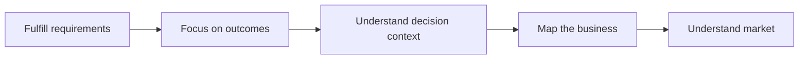
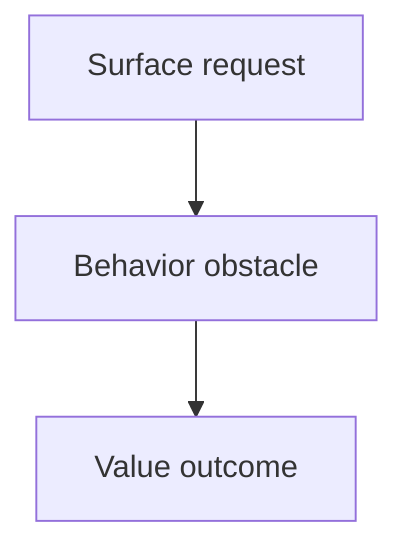
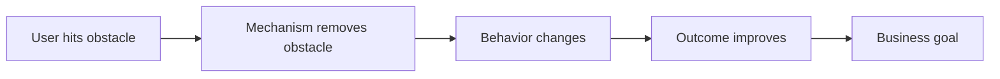

工程师的产品判断，不是要求每个人去替代产品经理，也不是在技术之外额外增加一门“软技能”。它的作用是让工程师知道：自己正在解决谁的问题，方案为什么成立，投入如何产生结果，以及结果不符合预期时该回到哪里修正。

技术实现是工作的一部分；理解问题、判断取舍、验证效果，则决定技术实现是否真正有方向。本文保留一个实用的成长框架：从完成需求开始，逐步学会理解结果、参与讨论、梳理业务，并在更大的范围内形成判断。

## 一、产品认知的五个阶段

这五个阶段不是职级划分，也不是线性晋级。同一位工程师在熟悉领域可能已经能够参与规划，进入新领域后仍需要从理解需求开始。它们描述的是视角如何从“完成一项开发”逐渐扩大到“理解一个市场”。

### 阶段一：完成需求，先把事情做对

最初的关注点通常是实现本身：需求是什么、接口如何定义、边界条件有哪些、怎样按时且稳定地交付。这是工程工作的基本功，不能被轻视。

问题在于，若长期只关心“我是否完成了开发”，就容易把需求当作无需理解的外部指令。工程师会很擅长完成局部任务，却难以解释为什么要做、如何判断是否有效，也难以在方案不清楚时提出有价值的问题。

举例来说，假设一次需求是“给订单列表页增加导出 Excel 的按钮”。只关心实现的做法是确认导出字段、处理大数据量分页、联调完成即可交付。但多问三句就会不一样：这项工作解决什么问题——是运营需要线下核对，还是客服需要留存证据？成功是什么样子——一天导出几次、导出后是否还要手工整理？发布后怎么确认结果——如果两周后导出量几乎为零，说明真正的诉求可能根本不是“导出”，而是列表页本身缺少某种筛选或核对功能。开发前弄清背景，开发中检查是否偏离目标，发布后回看一次真实使用情况，就能建立起基本闭环。

#### 为什么工程师需要理解结果

第一，结果是说明工作价值的共同语言。复杂的实现、投入的时间和代码量，只有放进结果中才有意义。第二，结果帮助工程师做更好的技术取舍：知道什么处于关键路径，才能判断性能、稳定性、体验和维护成本应如何排序。第三，理解结果会让工程师更早发现问题，而不是等到返工时才知道需求边界有误。

### 阶段二：关注效果，但不止于“听和看”

工作一段时间后，大多数工程师会开始关注目标、效果和反馈。这是从执行走向理解的必要一步，但很容易停留在被动输入：能听懂别人说明的指标和结论，也能复述需求的价值，却无法解释它们之间的关系。

要进一步理解，关键不是记住更多名词，而是分清三类信息：最终希望改变的结果、用户在过程中的具体行为，以及必须防止恶化的体验与成本。前者说明方向，中间行为帮助定位问题，后者防止局部优化损害整体。

例如，一个流程被要求“提高完成率”，并不意味着只要完成率上升就算成功。还应问：用户是否真的理解了任务？是否在中途遇到等待、错误或犹豫？完成之后是否获得了有价值的结果？是否以更多打扰、资源消耗或质量下降换来了短期变化？只有把结果放回完整链路，才不会被单个信号带偏。

### 阶段三：理解决策背景，能够参与讨论

当工程师不仅知道需求做什么，还能讲清它的背景、目标、约束与可能影响时，就可以开始参与讨论。参与并不意味着必须推翻既有方案；更重要的是把问题说清楚，把隐含假设暴露出来，把技术风险转化为可讨论的取舍。

一个有价值的提问通常包括四部分：我理解目标是什么；当前方案通过什么机制达成目标；我担心哪项约束或副作用；是否可以补充证据、缩小范围或先验证关键假设。这样的表达比“我觉得不合理”更能推动决策。

此阶段需要练习的，是把功能语言翻译为用户任务。用户并不天然需要某个页面、入口或配置项；他们需要在某个场景下以更低成本完成一件事。工程师能指出“方案解决的是功能描述，还是用户真正的障碍”，就已经在提升方案质量。

举例来说，假设产品同事提出“把注册流程从三步改成两步”，理由是“步骤越少转化越高”。功能层面这很容易实现：合并两个页面即可。但参与讨论意味着先问：现在流失最多的是哪一步、用户在那一步卡在什么地方？如果流失集中在“验证码收不到”，合并步骤并不会改变这个障碍，只是把同样的障碍挪到了另一个页面里；真正该做的可能是优化验证码到达率，而不是精简步骤数。这类提问不是否定产品同事的方案，而是把“步骤更少”这个功能目标，还原成“用户在哪里被卡住”这个真实问题。

### 阶段四：能够梳理业务，理解自己在价值链中的位置

单个需求只是局部动作。进一步的能力，是能够说明自己负责的模块服务谁、接收什么输入、提供什么输出、依赖哪些上下游，以及它如何影响整体目标。

梳理业务不等于写一份大而全的介绍。先回答五个问题即可：用户或合作方是谁；他们要完成什么任务；当前链路的主要障碍在哪里；本模块能影响哪一环；有哪些约束决定了方案边界。能够稳定回答这些问题，就能更有效地做项目复盘、跨团队沟通和后续规划。

在这一阶段，应从“看一个需求”扩展到“看一组连续的需求”。回顾过去的迭代是为了理解问题如何演变；了解正在推进的工作是为了识别协同和冲突；关注下一步方向是为了提前准备能力与依赖。历史不是照搬的理由，而是判断因果的材料。

### 阶段五：从更大视角理解市场、竞争和趋势

更成熟的判断会把项目放进更大的环境中：用户需求是否变化，供给和成本如何变化，同类方案解决了什么问题，技术发展带来了哪些新边界。这不是要求工程师随时做战略报告，而是避免只在内部视角下讨论局部最优。

这一层很难，也不需要假装拥有确定答案。重要的是建立假设、寻找外部证据、承认信息不完整，并随着事实变化修正判断。真正的规划不是预测得绝对准确，而是在变化中保持方向感和调整能力。

## 二、从需求到用户问题：三层追问

需求文档通常描述的是一种待实现的方案，而不是问题本身。拿到需求后，工程师可以用三层追问避免过早进入实现细节：先看表层请求要交付什么，再看用户原本卡在哪个行为障碍上，最后看这个障碍被解决之后会带来什么价值结果。

### 第一层：表层请求——要交付什么

先确认基本边界：谁会使用这项能力，在哪个场景发生，要新增或改变什么行为，哪些体验、兼容、合规或时效条件不能突破。这一层保证团队对范围有共同理解。

### 第二层：行为障碍——用户原本想完成什么，卡在哪里

再把功能翻译成任务。用户的困难可能是找不到入口、看不懂信息、步骤太多、结果不可信、等待太久，或在关键节点缺少反馈。不同障碍需要不同机制，不能用同一种实现一概而论。

### 第三层：价值结果——为什么值得优先解决

最后追问：若障碍被降低，哪种用户行为会发生变化？这种变化如何支持当前目标？可能付出哪些体验、质量或成本代价？需要什么证据才算有效？

以“增加快捷入口”为例，表层请求是新增入口；但真正的障碍可能是用户不知道能力存在，也可能是现有流程过长。前者适合改善发现与引导，后者则应优先审视流程本身。若不做这层区分，就可能完整实现了入口，却没有改善用户任务。

## 三、如何把技术方案放进业务因果链

任何方案都应能写成一条可讨论的链路：用户在某个场景遇到障碍，产品机制降低障碍，用户行为发生变化，关键结果得到改善，进而推动业务目标。工程师的职责，是使其中的机制可靠、可控、成本合理，并验证链条是否真的成立。

### 从目标倒推，而不是从技术偏好出发

先说明要改变的结果，再讨论实现。一个实用模板是：为了让某类用户在某场景更容易完成某项任务，我们通过某种机制降低具体障碍；预期先观察到某种行为变化，再带来结果变化；同时需要关注哪些风险信号。

这会迫使团队回答几个关键问题：方案影响的是哪一环？为什么它会影响？若结果不出现，哪里最可能断裂？如果无法说明这些问题，复杂实现往往不能弥补问题定义的缺失。

### 技术指标如何连接用户价值

技术指标本身不是业务价值，但经常处在因果链的重要位置。表达时应避免“性能更好，所以体验更好”的跳跃，而要说明具体机制：关键步骤的等待或失败减少，用户更快获得可操作状态，任务中断更少，后续行为才有机会发生。

同一个优化在不同场景的优先级也不同。若问题位于关键任务之前、影响范围广且有证据支撑，就值得优先投入；若位于低频、非关键路径，则应与其他工作比较机会成本。无法直接形成业务链路的基础建设仍然值得做，但要明确它解决的可靠性、效率或长期维护问题，避免把所有技术投入都包装成短期增长。

### 同时写出正面链路和反面链路

成熟的方案不只说明收益，也说明代价。它让谁更方便，又可能让谁更困难？它提高局部效率时，是否增加认知负担、系统复杂度、资源消耗、治理风险或长期维护成本？

把正反两条链路写出来，讨论会从“支不支持方案”转向“收益是否大于代价、如何降低代价”。这正是工程师在评审中能够提供的独特价值。

## 四、如何梳理业务与制定规划

当开始负责一个持续演进的方向，应该从需求清单切换到业务地图。地图的目的不是展示覆盖范围，而是找出真正应投入的问题。

### 先定位自己的范围

明确自己负责的模块、能力边界和上下游关系：上游提供什么输入，自己处理什么问题，输出被谁消费，哪些合作方共同决定最终结果。范围不清楚时，规划容易越界；只盯本地指标时，又容易优化错位置。

### 再寻找核心矛盾

核心问题通常不是某个功能缺失，而是用户任务、供给能力、体验成本和系统约束之间最突出的冲突。判断时可以连续追问：当前现象是什么？它为什么发生？再往上一层是什么条件导致它持续存在？继续追问，直到找到当前范围内可行动且影响最大的原因。

这不是追求一次得到全局最优解。现实决策大多只能在有限信息下做局部最优：选择更重要、证据更充分、可以验证的方向，并通过反馈不断校正。

### 规划应包含哪些内容

一份有用的规划至少写清：背景与当前问题；目标及优先级；关键约束；短期可验证动作；长期能力建设；依赖关系与风险；如何判断进展。规划不是功能列表，也不是把所有想做的事排上时间线。它必须说明每项投入如何服务问题与目标，以及在条件变化时如何调整。

短期方案可能只能缓解表象，长期方案则处理更深的结构性问题。两者并不冲突：先解决当前最急迫的阻塞，同时避免短期实现把未来路径彻底锁死。能明确这种取舍，规划才有实际价值。

## 五、面对不同意见，如何保持判断与协作

工程师不必对每项决定完全认同，重要的是区分个人偏好、局部成本与共同目标。当反对一个决定时，先确认自己是否拥有完整背景；再将疑虑表达为具体的目标、风险和证据；最后提出可验证的替代方案或保护措施。

如果团队在更完整信息下做出取舍，工程师仍应将执行做好，并保留观测和复盘机会。坚持原则不等于拒绝协作；接受决策也不等于放弃思考。判断力的一部分，就是知道哪些问题需要升级讨论，哪些问题应通过后续事实来校正。

## 六、学习一项新事物：边学、边做、边复盘

产品理解不是一次性“学完”的知识。完全学透再行动，往往会错过真实场景；只埋头做而不补背景，又容易把经验碎片化。更有效的方式是带着具体问题学习，在行动中检验理解，再将结果沉淀为下一次可复用的框架。

### Review 为什么重要

复盘不是为了给过去打分，而是校准判断。一次复盘可以沿因果链检查：问题定义是否正确？目标用户是否真正触达？机制是否被理解和采用？实现是否稳定？结果是否受其他因素影响？下一次要保留、停止或调整什么？

没有达到预期并不等于工作没有价值。若能定位链条断在何处，就获得了比“成功或失败”更可复用的认知。长期看，判断力正是在这种重复校准中形成的。

### 提问、回答与阐述

高质量提问不是泛泛地问“怎么做”，而是先说明已知事实、自己的理解、真正卡住的推理环节，以及希望获得哪种帮助。回答问题也不是抛出结论，而是说明前提、判断路径与边界。

把一个问题讲给不熟悉背景的人听，是检验理解的好方法。若只能复述术语，说明还停留在输入；若能说明目标、链路、取舍与风险，才算形成了自己的判断。写短复盘、组织分享、和协作者讨论，都是有效的练习。

### 保持开放与持续输出

经验会带来效率，也会带来惯性。面对新问题时，既要尊重已有经验，也要承认它可能不适用于新的用户、约束和环境。保持开放不是轻易改变立场，而是愿意让证据修正结论。

输出则让思考变得可检验。可以从最小形式开始：记录一个需求的用户任务、关键假设、方案取舍和发布后的反馈。持续积累后，这些记录会成为个人和团队共同的判断资产。

## 七、常见问题：把判断放回真实工作

前面的框架看起来并不复杂，真正困难的是把它用于每天具体而琐碎的工作。下面集中回答几个常见问题。这些问题没有放之四海皆准的标准答案，但可以提供更稳定的思考起点。

### 我只是负责实现，为什么还要理解业务结果？

因为工程工作并不只在提交代码时结束。理解结果，首先能帮助你判断自己做的是不是关键问题：同样需要投入时间的两个任务，一个阻塞用户完成核心动作，另一个只是改善边缘体验，它们的优先级显然不同。其次，结果是解释价值、推动协作和争取资源的共同语言——只描述“做了什么”很难比较影响，能说明“解决了什么问题、带来了什么变化、代价是什么”，讨论才会更有效。

这件事还会反过来改善技术设计本身。知道哪些状态不能出错、哪些路径值得优化、哪些数据或日志必须保留，才知道哪些抽象现在就该建、哪些可以先放一放。技术判断从来不是离业务越远越纯粹，而是要知道在哪些地方值得严谨地投入。

### 需求里的产品遗漏，该不该自己扛？

看到明显问题时应当提出，但不必把整个方案接过来做。提出问题不等于越权：既不需要代替对方写完整方案，也不需要替所有角色承担交付，只需要基于自己接触到的事实，说清遗漏可能造成的影响，再交给团队决定由谁处理。

一个可操作的判断标准，是它是否会影响用户任务、上线质量、关键约束或后续判断。会，就值得在合适场合讲清楚；只是个人偏好，就先掂量一下值不值得消耗协作成本。发现问题和占有问题，是两件事。

### 听懂指标定义，是不是就等于懂业务？

不等于。理解定义只说明知道如何测量一个现象；理解业务，还要知道为什么测这个现象、它在链路中处于什么位置、变化后意味着什么、又会牵动哪些其他结果。

可以连续追问：这个信号对应用户的什么行为？这个行为改善后，最终希望得到什么结果？如果它变好而最终结果不变，可能是哪一环断了？如果它变好却带来副作用，代价由谁承担？能回答这几层，指标才不再只是报表上的名称。

### 只看一个核心结果，能不能判断方向好坏？

单看一个数字容易被掩盖：一个方向处于探索、建设、稳定或收敛的不同阶段时，合理的观察重点本就不同；同样的变化，也可能来自不同类型用户、不同渠道或不同任务路径，未必是同一件事在起作用。

更稳妥的做法是同时看结果、过程与护栏——结果说明是否接近目标，过程说明为什么会发生，护栏提醒是否用不该接受的代价换来了局部变化。工程师尤其要盯紧护栏：失败率、性能退化、异常率、资源消耗、维护复杂度和用户抱怨，往往最早出现在工程侧，比业务数字更早报警。

### 怎么判断一个决策解决的是核心问题？

不必追求一次就找到绝对正确的答案，更可靠的方式是不断上溯：眼前现象是什么？它由什么直接原因造成？这个原因为什么会持续存在？一直追问，直到找到一个既更接近根因、又在当前范围内可行动的环节。

举例来说，假设某功能的“完成率”连续两周下滑，第一反应可能是“操作步骤太多，应该简化交互”。但继续上溯会发现，真正原因可能是上一次版本更新后某个接口偶发超时，用户在中途放弃——如果只按第一反应去精简交互，投入的工作量不小，完成率却几乎不会变化，因为真正的障碍从未被触碰。所谓“核心问题”，通常同时满足三点：它影响较大的用户任务或系统结果；解决后能带动多个下游问题一起改善，而不只是遮住表面；团队现在就有能力通过手上的投入让它发生变化。只能影响很小的局部，或根本不在可控范围内的原因，就不值得以“核心问题”的名义投入过多资源。

### 怎样写一份真正有用的业务梳理？

避免从组织架构、功能列表和名词堆材料开始。更好的顺序是：先写用户或合作方要完成的任务，再写完成任务的关键链路；标出每个环节的目标、障碍、依赖和当前证据；最后说明自己的模块能影响哪里、不能影响哪里，以及下一步该验证什么。

判断一份梳理是否有用，看它能不能让不熟悉项目的人回答四个问题：这个方向为什么存在？当前最重要的问题是什么？团队为什么选择这样做？后续用什么衡量进展？读完只知道系统由哪些模块组成、却说不出问题与取舍，那还只是材料汇总，不是梳理。

### 什么样的工作值得做、什么时候该收手？

价值不该由个人单方面宣布，而要放回共同目标和因果链里检验：它减少了谁的成本，改善了哪个任务，解除了哪个约束，让后续协作更可靠了吗？有没有证据或至少一个可验证的假设？是否存在更低成本的替代方法？有些基础建设不直接改变外部结果，例如减少故障、缩短交付、降低理解成本，依然有价值——关键是如实说明它的价值类型和作用范围，而不是把一切都包装成显性增长。

反过来判断该不该停手，也可以用几个问题筛一遍：它对应的问题是否真实且重要？方案与问题之间是否有可信的作用机制？现在是否具备做出高质量交付的条件？相比其他选择，收益、风险和可逆性如何？问题不清楚、验证条件缺失、风险不可接受，或者存在更简单的替代方案，就该缩小范围、延后投入，或者干脆明说不做。尤其要警惕“已经投入了一些，所以必须继续”这种心态——沉没成本从来不是继续投入的理由。

### 怎样深度参与业务而不陷入无效忙碌？

深度参与不等于参加更多会议、读更多材料，而是在自己负责的范围内，持续对问题、目标、限制和反馈形成判断，并把判断转化为更好的方案与协作。这个范围可以从第一个需求就开始扩展，只是深度逐步增加：先弄清当前需求的前因后果——为什么现在提出、依赖什么条件、会影响什么后续行为；再看同一方向过去做过什么、正在做什么、未来想解决什么；最后才扩展到合作方、相邻模块和外部环境。

不必为了“全局视角”囤积所有信息——好的全局理解是围绕当前问题有选择地扩展：一个结果解释不通时，再顺着因果链去看上游输入、下游结果和协作边界。信息很多不等于理解很深，能定位到与问题相关的那部分，才是真正有用的全局视角。做法上，可以选一个长期负责的方向，持续维护一页业务地图和问题清单，在每个需求前补全假设、发布后更新认识、定期与上下游对齐变化——比零散追踪大量信息更容易形成真正的领域理解。

## 八、让学习与思考成为可持续的习惯

### 怎样训练思辨能力？

思辨不是为了反驳，而是为了让结论经得起检验。可以养成几个固定动作：区分事实、解释和建议；为关键结论写出前提；主动寻找反例和失败条件；把替代方案放在一起比较；在事后对照结果检查当初的推理。

好的 Review 因此不是找错，而是帮助团队补全推理链。它要问的不是“这个方案好不好”，而是“目标是否清楚、证据是否足够、约束是否遗漏、失败时如何回退、结果如何验证”。长期接受和给出这样的反馈，判断会越来越稳定。

### 怎样把问题讲清楚？

提问前，先说清楚你已经掌握什么、自己的判断到哪一步、真正无法推导的部分是什么。回答时，先给结论，再说明前提、推理和边界。阐述一个复杂问题时，尽量遵循“背景—问题—目标—方案—取舍—验证”的顺序。

如果无法用简洁语言向不了解背景的人说明一个决定，往往不是表达技巧不足，而是问题本身还没有想清楚。写作、讲解和讨论之所以重要，是因为它们会迫使模糊理解显形。

### 怎样持续保持思考？

不需要每天写长文，也不需要对所有事情形成观点。只要为正在负责的工作保留一份简短记录：我现在认为问题是什么；这个判断依赖哪些事实；我准备怎样验证；结果回来后，我的判断更新了吗？

持续思考的难点不在方法，而在愿意承认“不知道”和“之前判断错了”。把改正看成学习的正常部分，而非能力不足的证明，才能让反馈真正进入下一次决策。

## 结语

工程师的产品判断，最终不是为了让技术工作显得更“懂业务”，而是为了更准确地解决问题、做出取舍，并对结果负责。

从下一项需求开始，少问一句“功能怎么实现”，多问一句“它要改变谁的什么行为，为什么这个方案能起作用”。当工程方案能够清楚地放进用户问题与业务结果之间，技术能力才真正拥有了方向感。
