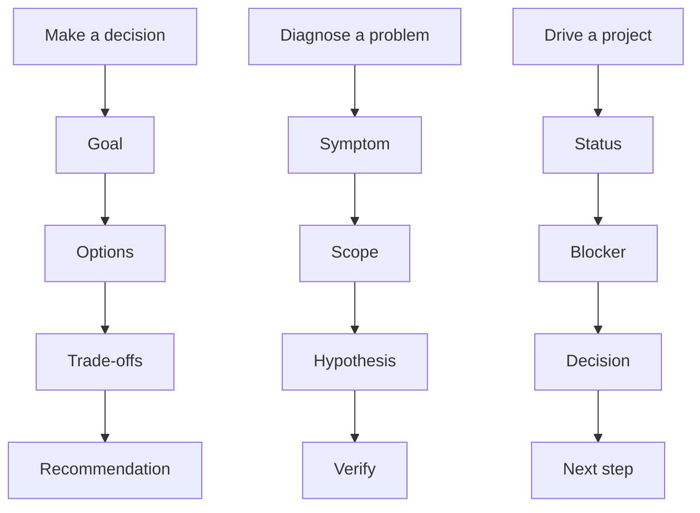

> This article expands on the "judgment" thread in [Management Retrospective](/writing/2026/08/management-retrospective/).

The topic of structured thinking came from a real one-on-one—talking about how it applies to problem analysis, problem decomposition, planning, and execution. Its purpose is to let others know: what you are answering, what your basis is, and where things still remain uncertain.

## Prepare Your Own Feelings

Do a round of "three questions in a row" first, then try to explain clearly what you have on hand.

- What is my personality like? What are my career ambitions? How do I expect to achieve my goals?
- Do I feel it's relatively hard to explain clearly where the difficulties in my own work lie? What makes them hard?
- Can I sort out my work clearly enough to explain it? (Break it into modules, break down the structure, set priorities)
- Can I share and present my own understanding and views? How do I plan to present them?
- Can I do a retrospective and review of my own growth experience?
- How do I deconstruct myself?

## Points to Discuss

From "what is structured thinking good for" to "how to train it," and then to concrete tools.

- What is structured thinking good for?
- How do you train structured thinking?
- What is the relationship between being structured and being systematic?
- How do you train the ability to grasp the key points?
- How do you break work into stages and align goals well?
- How do you communicate a goal well, along with the meaning behind it?
- How do you make yourself speak in a more organized way?
- How do you decompose requirements better?

## First Pick an Appropriate Skeleton

When you need to make a choice, use "goal—options—trade-offs—recommendation"; when you need to diagnose a problem, use "symptom—scope—hypothesis—verification"; when you need to push a project forward, use "status—blocker—decision—next step." The skeleton serves the problem; it must not work the other way, making the problem bend to fit a template.

Before a meeting, ask yourself four questions: What is the conclusion? Which facts does it depend on? Which hypotheses have not been verified? What should the other person do after reading? If you can't answer any one of these, don't start by lengthening the text—first fill in the evidence or narrow the problem.

## Venting and Feedback

- I tend to ramble when I speak and can't get to the point.
- I can't explain the hard parts of my work clearly, and I'm afraid of coming across as unprofessional.
- I want to learn structured thinking but don't know where to start.
- And ＿＿＿＿＿＿

Structure gives a discussion shared coordinates rather than suppressing differences of opinion. The best way to practice structured thinking is not reading books, but rewriting a real, scattered risk statement into a passage of "goal—risk—options—recommendation—what needs confirming," and then seeing whether others can point out exactly which part they disagree with.
