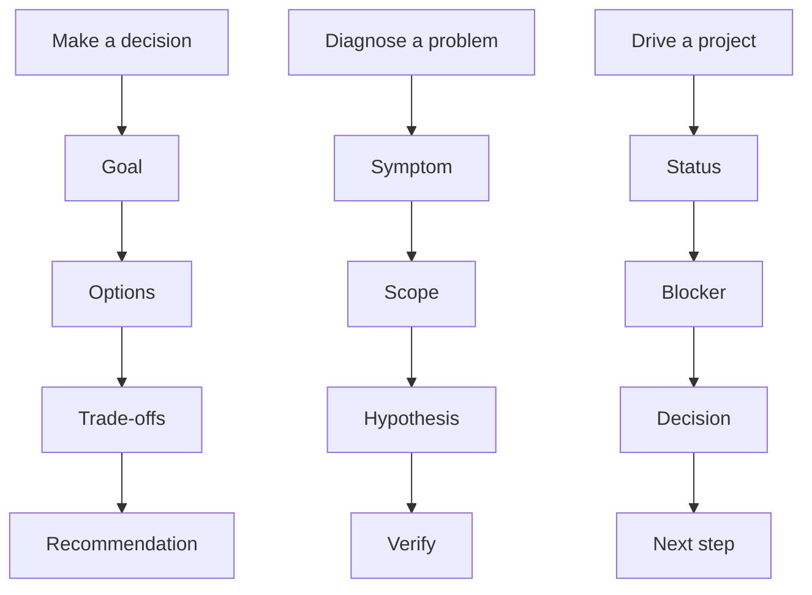

> 本文是[《管理复盘》](/writing/2026/08/management-retrospective/)中「判断」这条线的展开。

结构化思维这个话题，来自一次真实的一对一——聊到它在问题分析、问题拆解、做规划、做执行这些点上的应用。它的作用，是让别人知道：你在回答什么、依据是什么、哪些地方仍不确定。

## 准备自己的感受

先做一次"问题三连"，再试着把手里的东西讲清楚。

- 我的性格是怎样的？我的职业抱负是什么？我期望怎样达成目标？
- 感觉自己比较难讲清楚自己做的业务的难点在哪里？难在哪？
- 我能不能把手里的业务梳理清晰来讲？（拆模块、拆结构、排优先级）
- 我能否把自己的认知、看法进行分享、演讲？准备怎么讲？
- 我能否把自己的成长经历做一次回顾和 Review？
- 如何解构自我？

## 待沟通的点

从"结构化有什么用"聊到"怎么训练"，再到具体工具。

- 结构化思维有什么用？
- 如何训练结构化思维？
- 结构化与系统性之间的关系是什么？
- 如何训练抓重点？
- 如何做好阶段拆分、目标对齐？
- 如何传达好目标，以及目标背后的意义？
- 如何让自己说话更有条理？
- 如何更好地拆解需求？

## 先选一个恰当的骨架

当需要做选择，用"目标—选项—取舍—建议"；当需要排查问题，用"现象—范围—假设—验证"；当需要推进项目，用"状态—阻塞—决定—下一步"。骨架服务于问题，不能反过来让问题迁就模板。

会前问自己四个问题：结论是什么？它依赖哪些事实？还有哪些假设没验证？对方看完应该做什么？如果其中一项回答不出，不要先把文字写长，先补证据或缩小问题。

## 吐槽与反馈

- 我说话容易绕，抓不住重点。
- 讲不清业务难点，怕暴露自己不专业。
- 想学结构化但不知道从哪下手。
- 以及 ＿＿＿＿＿＿

结构给讨论提供共同坐标，而不是压缩不同意见。训练结构化思维，最好的练习不是读书，而是把一个真实的、散乱的风险说明改写成一段"目标—风险—选择—推荐—需要确认"的话，然后看别人能不能准确指出不同意的是哪一部分。
