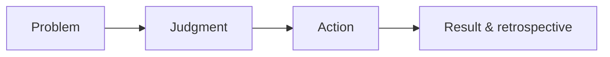

Campus recruitment preparation is often turned into a question-bank sprint: memorize more questions, solve more questions, collect more interview experiences. But the resume, the fundamentals Q&A, and the project discussion all ultimately answer the same thing: **when you face a problem with no standard answer yet, can you understand it, make a judgment, and push things through to a result?**

This piece brings together resume preparation, knowledge preparation, and project presentation, and also adds the perspective of screeners and technical interviewers. It is not any company's hiring rules, and even less a “standard answer for passing the interview.” Different roles, teams, and interviewers will have different emphases; what follows is what I think is worth preparing for in the long run in terms of abilities and traits.

## Interviews are not three separate exams

A resume, a fundamentals Q&A, and a project walkthrough are not testing three unrelated abilities.

| Stage | What the screener or interviewer wants to confirm | Evidence the candidate should provide |
| --- | --- | --- |
| Resume | Whether the experience is real and clear, and whether it is worth learning more about | A clear timeline, concrete boundaries of responsibility, and projects that can be followed up on |
| Fundamentals | Whether you understand the principles, and whether you can transfer knowledge to unfamiliar scenarios | Cause and effect, boundary conditions, and trade-offs — not just terminology |
| Project | Whether you truly took part in defining the problem, choosing the approach, and shipping it | Your own judgment, actions, and results, plus an honest retrospective |

Screeners face limited time and a lot of material. Their job is not to prove from one page of resume that you are “very excellent”; it is to judge whether this experience is credible and informative, and whether it is worth a deeper conversation.

Technical interviewers then continue to verify: whether the things on the resume were really done by you; whether your knowledge is understood rather than memorized; and whether the judgment shown in the project can transfer to the next unfamiliar problem. The questions may differ, but the risk they want to reduce is the same: after joining, can you reliably learn, collaborate, and deliver?

So the most effective preparation is not to memorize a polished answer for every question, but to make the three places of expression describe the same real person.

## 1. The resume: let a stranger quickly see the facts and the boundaries of responsibility

A resume is not a pile of experiences stacked by time, nor is it writing everything the team did under your own name. Its task is simple: to help someone who does not know you quickly learn what you have done, what you were responsible for in it, and why it is worth asking more.

The most basic structure can stay simple:

1. **Education and basic information**: a clear timeline in reverse chronological order;
2. **Experience**: for each entry, make the context, role, and responsibilities clear;
3. **Projects**: choose the projects that best represent your judgment and actions, rather than listing everything you participated in;
4. **Other information**: competitions, open source, work samples, or skills — keep only the content you can be asked about and are willing to elaborate on.

### What screeners are usually looking for when they read a resume

The first is **credibility**. Is the timeline continuous? Do the projects and roles make sense? Do the verbs distinguish clearly between “what I did” and “what the team did”? It does not matter if the writing is not flashy; a phrase like “big project,” “deep involvement,” or “significant improvement” that cannot be tied to your own responsibility actually makes people unsure where to begin asking.

The second is **problem awareness and result awareness**. A campus hire does not need every experience to produce astonishing business numbers, but should at least explain: what problem existed, why it needed to be done, and how the result was confirmed. When there is no reliable data, do not force a percentage; you can write clearly how a problem went from “cannot be located” to “reproducible,” how a process went from “manually handled every time” to “with a clear entry point and checks,” or how a capability was reused by later projects. Being able to explain how you verified and where the boundaries are is usually more credible than an isolated number.

Finally, the **granularity of personal contribution**. Interviewers do not expect an intern to have built an entire system alone; they want to know which part you actually took on in a collaborative system, what you aligned with whom, and how you moved things forward when problems arose. Being able to separate “I” from “we” is both honesty and collaboration ability.

### Replace the duty list with “problem—action—result”

A weak statement usually looks like this:

> Responsible for campaign page development, API integration, performance optimization, and online maintenance.

It is not wrong, but the reader cannot tell the difficulty, the contribution, or the result. It could be rewritten as:

> Refactored the frontend state management for a signup flow to fix the state inconsistency caused by duplicate submissions and retries on a weak network. I was responsible for sorting out the state transitions, adding tests for the critical path, and aligning idempotency constraints with the API team. After launch, the related errors went from “hard to reproduce” to locatable and replayable, and later iterations no longer needed to handle the same kind of problem repeatedly.

The point here is not to follow a template, but to leave hooks that invite follow-up: Why was the state inconsistent? How did you sort out the states? What exactly were the idempotency constraints? How do you know the problem improved? If you can answer all of these honestly, the resume has already done its most important work.

Let's look at a more detailed comparison. Suppose a candidate built an admin configuration page:

| Wording | What the interviewer can read from it |
| --- | --- |
| “Responsible for backend admin system development; built pages using React and a component library.” | They know the tech stack, but not the problem, the difficulty, or the personal contribution. |
| “Responsible for developing the campaign configuration page, improving operational configuration efficiency.” | There is a goal, but “efficiency” has no object and no way to verify it. |
| “A campaign had to be configured repeatedly in three places, and it often had to be redone because fields were inconsistent. I was responsible for sorting out the field sources and dependencies, consolidating the repeated configuration into one form, and adding pre-submit validation. After launch, operations could complete configuration in one place, and newly added fields had a clear place to be maintained.” | You can see the problem, the boundary of responsibility, the action, and the result; even without a percentage, there is enough detail to continue verifying. |

The third is not necessarily much more “impressive” than the first two, but it lets the screener know where to start asking, and it lets the candidate talk about their real work instead of reciting a string of technical terms.

You can self-check each project with five questions:

1. What problem was this project meant to solve, and why was it worth doing?
2. What exactly was I responsible for, rather than what the team as a whole did?
3. What was the most critical judgment or technical difficulty?
4. What actions did I take, and why did I choose them?
5. How was the result verified? If I could do it over, what would I change?

Passing off team achievements as personal achievements, or packaging things you never did as proficiency, might get you an interview in the short term, but it is hard to survive detailed follow-up questions later. Honesty is not a conservative strategy; it is the precondition for connecting your resume, your interview performance, and your actual ability.

## 2. Fundamentals: the interviewer does not just want to hear terms

Fundamentals questions certainly cover the knowledge scope: programming and data structures, browsers and networks, frameworks and state management, build and delivery, quality and stability. But what interviewers really want to distinguish is usually not “have you seen this term,” but whether you have a map that connects the knowledge points together.

Taking web engineering as an example, you could organize it like this:

| Layer | Questions to understand |
| --- | --- |
| Programming fundamentals | How do data structures, complexity, async, error handling, and testing affect code quality? |
| Browsers and networks | What happens between typing a URL and the page becoming usable? How do caching, rendering, and weak networks change the experience? |
| Frameworks and state | How do components update? How does state flow? How do side effects and performance problems arise? |
| Build and delivery | How is code built, split, released, rolled back, and observed? |
| Engineering quality | How do you handle testing, accessibility, stability, security, and maintainability? |
| System design | How do you make trade-offs among scale, latency, consistency, cost, and permissions? |

### Four things interviewers want to see when discussing fundamentals

**First, being able to trace from the phenomenon back to the principle.**

For example, when asked “why is the page slow,” an answer that only memorized knowledge points might list lazy loading, caching, and code splitting. A more informative answer first asks where the slowness is: first paint, interaction, API, or resource loading? Then it explains how to observe and locate it, and only finally discusses the approaches and their costs. The answer does not need to cover every optimization technique, but it must have a chain of cause and effect.

**Second, knowing the boundaries of an answer.**

“Caching improves performance” is correct, but it also brings stale data, invalidation strategies, and debugging costs; “splitting the bundle shrinks the initial bundle” can also increase requests and break cache hits. Being able to say when something should not be used shows that you do not treat conclusions as slogans.

**Third, being able to keep thinking when you hit a question you do not know.**

Campus recruitment interviews will definitely include questions you have not prepared for. Rather than bluffing, a more reliable approach is to first confirm the conditions and the goal, break the problem into the parts you do know, and then make clear which assumptions need to be verified. Interviewers do not require candidates to know everything; they care more about whether you can stay clear-headed, structured, and action-oriented in the face of the unknown.

**Fourth, being able to put knowledge back into real engineering.**

Learning about caching is not just to memorize response headers; you can ask: why is the first paint slow on a page with many images? Which resources are suitable for caching? How do you avoid users seeing a stale version when content updates? Learning state management is also not just comparing library names, but explaining why state spirals out of control in an interaction flow and how to protect its boundaries.

What these four things test is the same underlying ability: clear logic, and a willingness to adjust your judgment based on facts, rather than rushing to show that you “know everything.”

### The difference in answers to one fundamentals question

For example, the interviewer asks: “Why is the first paint slow on a page with many images?”

Answering only “do lazy loading, compress images, use a CDN” is not wrong, but it reads more like a list of techniques. A better answer can start from observation: first distinguish whether the images themselves are large, whether requests are queuing, whether rendering is blocked, or whether the API delivers the image URLs too late; then locate it through the network waterfall, performance metrics, and reproduction under different network conditions. If the main bottleneck is the large first-paint images, first consider appropriate sizes and formats and preloading the resources that are truly critical; defer non-first-paint resources to load later. At the same time, explain the costs: over-preloading grabs bandwidth, over-compression hurts clarity, and caching must handle invalidation after updates.

The value of this answer is not that the list is more complete, but that it contains **locate → judge → approach → cost**. Even if a candidate forgets a specific API, the interviewer can still see whether the thinking is sound.

### Practice with scenarios, not just drilling questions

System design does not mean memorizing one huge architecture diagram. You can start from a familiar scenario, such as “design a product capability that supports uploading large files.”

First clarify the constraints: file size, network environment, whether resumable upload is needed, who can access it, and how to prevent abuse. Then discuss layer by layer: how the client does chunking and retries; how the server validates and merges; where files are stored; how state is recorded; how to recover from failures; and how to monitor the success rate and latency.

What matters is not giving a single architecture, but being able to explain clearly what problem each choice solves and what cost it brings. Thinking about complex systems should also start from the problem and the constraints, not from component names.

## 3. Projects: what the interviewer wants to hear is your chain of judgment

“Tell me about a project you worked on recently” is a very open question. The most common answer recounts the development process: built the page, connected the API, used a certain framework, and finally shipped it. Such an answer contains a lot of information, but it is hard to see the candidate's judgment.

I prefer to organize a project into four parts.

### 1. Problem

First say what problem the project faced, who was affected, and why it needed to be solved now. Do not start from the technical approach.

For example: a content editor frequently loses unsaved content during long-form input, and users are afraid to leave the page. The core problem is not “should we use a certain state library,” but how to build a reliable state boundary between editing, saving, leaving, and recovery.

### 2. Judgment

Explain how you understood the problem, and what choices were available.

In this example, you could compare three approaches: frequent auto-save, saving only when the user takes an explicit action, and keeping a local draft that syncs after the network recovers. They respectively affect server pressure, data freshness, implementation complexity, and the user's sense of control. Explaining clearly why you chose one of them says more about your ability than listing technical details.

### 3. Action

Be clear about what you actually did: how you split the task, how you designed the boundaries, which exceptions you handled, with whom you aligned the constraints, and what tests or observability you added. You can certainly discuss technical details, but explain which judgment each one serves.

For example: add a version number to the draft to avoid overwrites, add an unsaved-changes prompt when leaving the page, keep a recoverable state for sync failures, and cover the critical path with tests that simulate network disconnection.

### 4. Result and retrospective

The result is not just “it shipped.” It can be that the problem was reliably reproduced and located, that user complaints decreased, that the delivery cycle shortened, that a key capability was reused later, or that an approach was disproven and you cut your losses in time.

Finally add a retrospective: if you did it again, what would you verify first? Which assumptions went unseen at the time? Being able to honestly talk about what was not done well is usually more persuasive than presenting a project with no regrets.

### What follow-up questions on a project are really verifying

When interviewers follow up along a project, they are not deliberately “grilling you on details.” They are usually verifying:

- **Ownership**: can you clearly state the scope, dependencies, and decisions you were responsible for?
- **Problem decomposition**: when facing an ambiguous phenomenon, what do you check first and how do you narrow the scope?
- **Technical judgment**: which approaches did you compare, and what were the basis and cost of each?
- **Result awareness**: how do you know the approach worked, and how do you handle it when it fails?
- **Collaboration**: when disagreements or dependencies arise, how do you move things forward?
- **Learning and recovery**: when you are wrong or do not know something, can you acknowledge the facts, adjust course, and keep moving?

The last one is easy to overlook. It is normal for a campus hire to have limited experience; the truly valuable signal is this: when you hit setbacks or expose gaps, you do not cover the problem with bravado, but acknowledge the boundaries, fill in the missing information, and quickly resume action. This kind of self-awareness and resilience says more about long-term potential than a project that happened to succeed.

### An example of follow-up questions on a project

The candidate says: “I added auto-save to the editor.” The interviewer will typically follow up: why is it needed? How often does it save? What happens when the network fails? Can simultaneous editing from multiple ends cause overwrites? Which part did you do?

A less persuasive answer is: “To prevent data loss, I used debouncing to call the API every few seconds, and the backend handles it.” It is not a wrong answer, but the key judgments still sit with someone else.

A more complete answer could be: “Users lose content when they leave the page after long-form input. We initially discussed submitting only when clicking save, but worried about interruption scenarios; we also discussed saving on every input, but that would mean too many requests. In the end I was responsible for the frontend's local draft, deferred submission, and leave prompt: input is written locally first, then synced after the user stops typing for a while; if the sync fails, the draft is kept and the user is prompted to retry. API idempotency and version conflicts were aligned with my backend teammate. After launch there is not yet enough data to judge how much churn it reduced, so I would first look at the save failure rate, the number of draft recoveries, and related feedback.”

This answer does not take all the credit for itself, nor does it invent impressive numbers, yet it lets the listener hear how the candidate faced constraints, how they collaborated, and how they honestly viewed the results.

## An AI-era addition: more weight on “putting your ability into real problems”

Today's screeners and interviewers usually pay more attention to a candidate's relationship with AI, but the focus is not “can you write prompts” or “how many tools you use.” What they really want to distinguish are three things: whether you can use AI to finish work faster; whether you know where it will go wrong; and whether you have a way to verify the results it produces.

Writing “used AI to improve development efficiency” on a resume carries very little information. Compared to that, it is more worthwhile to write clearly about the task, the boundaries, and the verification method, for example:

> Built an internal Q&A prototype for the customer-service knowledge base. I was responsible for organizing historical questions into searchable material and designing the interaction “answers come with cited sources, and refuse to answer when there is no basis”; I tested the hit rate and wrong answers with a set of manually labeled questions, found that answers about expired rules were unreliable, and therefore restricted it to an assisted-search entry point rather than replying to users directly.

In this experience, the interviewer can keep asking: how is the material updated? What counts as a “wrong answer”? How is the test set composed? Why not hand the answering directly to the model? The candidate does not need to claim to have trained a model, but should be able to explain how to put an uncertain capability into a controlled workflow.

A fundamentals conversation may also shift from “which models do you know” to a more practical question: **if you let AI help review a piece of configuration or generate a piece of code, how do you decide whether it can go live?** A reliable way of thinking is to first define the risk: low-risk summarization, classification, or drafts can be spot-checked by humans; operations that affect users, money, privacy, or security need stricter permissions, human confirmation, rollback, and auditing. Then add an evaluation method: prepare representative samples, define the cases of correct, unfounded, and should-not-answer, and continuously observe the types of errors, rather than looking only at a few demo results.

What you see here is still the same set of abilities from earlier in this article: problem decomposition, boundary awareness, verifying results, and honest retrospectives. AI changed the tools and the questions, but it did not change the matter of “whether you can work reliably.”

## 4. What screeners and interviewers want to see is not just “smart”

“Smart” is a word that is too broad. Placed in the campus recruitment context, I prefer to break it into several observable things:

- **Learning ability**: able to keep learning, and able to fit new knowledge into an existing system rather than just collecting fragments;
- **Thinking and expression**: able to distinguish facts, speculation, and opinions, and to explain complex problems clearly;
- **Sense of action**: knowing what to verify next, and able to break a big problem into small steps that can be moved forward;
- **Self-awareness**: knowing what you have done, what you have not done, and where you still fall short;
- **Resilience and recovery**: when facing the unknown, failure, or pressure, able to adjust rather than freeze;
- **Sincerity in collaboration**: respecting facts and others' contributions, and willing to communicate constraints and disagreements.

These traits should not be declared through “I handle pressure well” or “I learn quickly.” They will naturally appear in your details: how you explain an attempt that did not go well, how you describe a teammate's contribution, how you keep reasoning in front of a question you do not know, and how you break an ambiguous requirement into the next step.

## 5. When preparing, cross-validate yourself

Pick two or three of your most important projects, and for each do three things:

1. Write the “problem—action—result” in one or two sentences as it would appear on the resume;
2. Tell the complete “problem—judgment—action—result and retrospective” in three minutes;
3. List ten possible follow-up questions for each project, especially about your boundary of responsibility, the trade-offs in your approach, the failure paths, and the verification method.

Then pick a few fundamentals topics, and practice explaining — without piling up jargon — what problem each solves, how it works, its cost, and its applicable boundaries. If your resume, your fundamentals answers, and your project answers can corroborate each other, what the interviewer sees is no longer a set of hastily prepared answers, but a relatively stable way of working.

Campus recruitment does not require that a person has already worked on every complex system, and a single interview should not be seen as a permanent judgment about the future. The abilities truly worth taking away are these: describe your experience truthfully, build a knowledge map starting from the problem, and turn your projects into judgment and action — so that the next time you face an unfamiliar problem, you still know how to begin.
