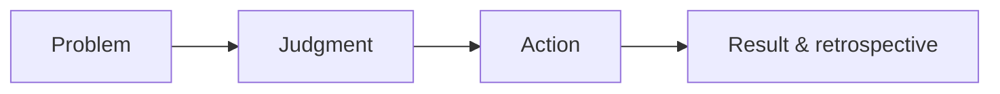

校招准备常常被做成题库冲刺：背更多题、做更多题、收集更多面经。但简历、基础问答和项目交流，最后都在回答同一件事：**当你遇到一个还没有标准答案的问题时，能不能理解它、作出判断，并把事情推进到结果？**

这篇把简历整理、知识准备和项目阐述放在一起，也补上筛选人和技术面试官的视角。它不是任何公司的招聘规则，更不是“通过面试的标准答案”。不同岗位、团队和面试官会有不同侧重；下面写的是我认为比较值得长期准备的能力和特质。

## 面试不是三场独立考试

一份简历、一次基础问答和一段项目讲解，看的并不是三种无关的能力。

| 环节 | 筛选人或面试官想确认什么 | 候选人应该给出的证据 |
| --- | --- | --- |
| 简历 | 经历是否真实、清楚，是否值得进一步了解 | 清晰的时间线、具体的责任边界、可追问的项目 |
| 基础 | 是否理解原理，能否把知识迁移到陌生场景 | 因果关系、边界条件、取舍，而不只是术语 |
| 项目 | 是否真正参与过问题定义、方案选择与落地 | 自己的判断、行动、结果，以及诚实的复盘 |

筛选人面对的是有限的时间和很多材料。其任务不是从一页简历里证明你“非常优秀”，而是判断：这份经历是否可信、有信息量，是否值得一次更深入的交流。

技术面试官则会继续验证：简历里的事情是不是你做的；你的知识是不是理解而不是记住；项目里的判断是否能迁移到下一个陌生问题。问题可能不同，但想降低的风险是同一个：入职后能不能可靠地学习、合作和交付。

所以，最有效的准备不是给每个问题背一段漂亮话，而是让三处表达说的是同一个真实的人。

## 一、简历：让陌生人快速看见事实和责任边界

简历不是把经历按时间堆起来，也不是把团队做过的事情全部写到自己名下。它的任务很朴素：帮助一个不认识你的人，在很短时间里知道你做过什么、在其中负责什么，以及为什么值得继续问下去。

最基础的结构可以保持简单：

1. **教育与基础信息**：时间线清楚、倒序排列；
2. **经历**：每段写清场景、角色和职责；
3. **项目**：选择最能代表判断与行动的项目，而不是罗列所有参与过的事；
4. **其他信息**：竞赛、开源、作品或技能，只保留能被追问、也愿意展开说明的内容。

### 筛选人看简历时，通常在找什么

首先是**可信度**。时间是否连贯，项目和角色是否说得通，动词是否分得清“我做的”和“团队做的”。写得不够华丽没有关系；一句无法落到自己责任上的“大项目”“深度参与”“显著提升”，反而会让人不知道从哪里问起。

其次是**问题意识和结果意识**。校招生不需要每段经历都带来惊人的业务数字，但至少应说明：当时有什么问题，为什么要做，结果怎样确认。没有可靠数据时，不要硬凑百分比；可写清问题从“无法定位”变成“可复现”，流程从“每次人工处理”变成“有明确入口和检查”，或能力被后续项目复用。能说明验证方式和边界，通常比一个孤立数字更可信。

最后是**个人贡献的颗粒度**。面试官不期待一个实习生独自完成全部系统；更想知道你在一个协作系统中到底承担了哪一块，和谁对齐了什么，遇到问题时如何推进。能把“我”与“我们”分清，既是诚实，也是协作能力。

### 用“问题—行动—结果”替换职责清单

弱表述通常像这样：

> 负责活动页面开发、接口联调、性能优化和线上维护。

它没有说错，但读者无法判断难点、贡献和结果。可以改成：

> 为一个报名流程重构前端状态管理，解决重复提交和弱网重试导致的状态不一致；我负责梳理状态转换、补充关键路径测试，并与接口方对齐幂等约束。上线后，相关报错从“难以复现”变为可定位和可回放，后续迭代不再需要重复处理同类问题。

这里的重点不是套模板，而是留下可追问的钩子：为什么会状态不一致？你怎么梳理状态？幂等约束具体是什么？如何知道问题改善了？如果这些问题都能如实回答，简历就已经完成了它最重要的工作。

再看一个更细的对比。假设候选人做过一个后台配置页面：

| 写法 | 面试官能读到什么 |
| --- | --- |
| “负责后台管理系统开发，使用 React 和组件库完成页面搭建。” | 知道技术栈，但不知道问题、难度和个人贡献。 |
| “负责活动配置页开发，提升运营配置效率。” | 有目标，但“效率”没有对象，也没有验证方式。 |
| “一个活动需在三个入口重复配置，且常因字段不一致返工。我负责梳理字段来源和依赖关系，将重复配置收敛到一个表单，并补上提交前校验；上线后，运营同学可在一个入口完成配置，新增字段也有明确的维护位置。” | 能看到问题、责任边界、行动和结果；即使没有百分比，也有足够细节可继续验证。 |

第三种未必比前两种“厉害”得多，但它让筛选人知道该从哪里开始问，也让候选人能讲自己的真实工作，而不是背一串技术名词。

每个项目可以用五个问题自查：

1. 这个项目要解决什么问题，为什么值得做？
2. 我在其中具体负责什么，而非团队整体做了什么？
3. 最关键的判断或技术难点是什么？
4. 我采取了哪些行动，为什么这样选？
5. 结果如何验证；如果重来一次，会改什么？

把团队成果说成个人成果、把没做过的内容包装成熟练，短期也许能获得一次面试，后续却很难经得起顺着细节的追问。诚实不是保守策略，而是让简历、面试表现和实际能力能连起来的前提。

## 二、基础：面试官不是只想听到名词

基础题当然会考到知识范围：编程与数据结构、浏览器和网络、框架与状态管理、构建与交付、质量与稳定性。可面试官真正要区分的，通常不是“你是否见过这个名词”，而是你有没有一张能把知识点连起来的地图。

以 Web 工程为例，可以这样整理：

| 层次 | 需要理解的问题 |
| --- | --- |
| 编程基础 | 数据结构、复杂度、异步、错误处理与测试如何影响代码质量？ |
| 浏览器与网络 | 从输入 URL 到页面可用经历了什么？缓存、渲染和弱网会怎样改变体验？ |
| 框架与状态 | 组件如何更新，状态如何流动，副作用与性能问题如何出现？ |
| 构建与交付 | 代码如何被构建、拆分、发布、回滚和观测？ |
| 工程质量 | 如何处理测试、可访问性、稳定性、安全与可维护性？ |
| 系统设计 | 在规模、延迟、一致性、成本和权限之间如何做取舍？ |

### 聊基础时，想看到的四件事

**第一，能从现象推回原理。**

例如问“页面为什么慢”，一个只背过知识点的回答可能会列出懒加载、缓存、代码分包。更有信息量的回答会先追问慢在哪里：首屏、交互、接口还是资源加载？再说明如何观察和定位，最后才讨论手段及其代价。答案不必覆盖所有优化技巧，但要有因果链。

**第二，知道答案的边界。**

“缓存能提升性能”没错，但也会带来陈旧数据、失效策略和调试成本；“拆包能缩小首包”也可能增加请求、破坏缓存命中。能说出何时不适合用，说明你不是把结论当口号。

**第三，遇到不会的题能继续思考。**

校招面试一定会遇到没准备过的问题。比起硬撑，一个更可靠的做法是先确认条件和目标，把问题拆成自己知道的部分，再明确哪些假设需要验证。面试官不要求候选人无所不知；更在意你在未知面前是否仍能保持清醒、结构和行动感。

**第四，能把知识放回真实工程。**

学习缓存，不只是为了背响应头；可以追问：图片很多的页面为什么首屏慢？哪些资源适合缓存？内容更新时怎样避免用户看到过期版本？学习状态管理，也不只是比较库的名字，而是解释一个交互流程里状态为何会失控、怎么保护边界。

这几件事背后考的是同一种能力：逻辑清楚，愿意基于事实调整判断，而不是急着表现自己“都懂”。

### 一个基础题的回答差别

例如，面试官问：“为什么一个图片很多的页面首屏会慢？”

只回答“做懒加载、压缩图片、上 CDN”并不算错，但它更像一份手段清单。一个更好的回答可以从观察开始：先区分是图片资源本身大、请求排队、渲染被阻塞，还是接口让图片地址下发得太晚；通过网络瀑布、性能指标和不同网络环境复现来定位。若主要瓶颈是首屏大图，优先考虑合适尺寸和格式、预加载真正关键的资源；非首屏资源再延后加载。与此同时也要说明代价：过度预加载会抢占带宽，压缩过度会影响清晰度，缓存则要处理更新后的失效。

这段话的价值不在于列得更全，而在于它包含了**定位 → 判断 → 方案 → 代价**。即使候选人忘记某个具体 API，面试官依然能看到其思路是否可靠。

### 用场景练习，而不是只刷题

系统设计并不等于背一张巨大的架构图。可以从熟悉的场景开始，比如“设计一个支持大文件上传的产品能力”。

先澄清约束：文件大小、网络环境、是否需要断点续传、谁能访问、如何防止滥用。再逐层讨论：客户端分片与重试如何做；服务端如何校验与合并；文件放在哪里；状态如何记录；失败怎样恢复；怎样监控成功率与耗时。

重要的不是给出唯一架构，而是能说清每个选择在解决什么问题，又带来什么代价。复杂系统的思考也应从问题和约束开始，而不是从组件名开始。

## 三、项目：面试官想听的是你的判断链

“讲讲你最近做的项目”是一个很开放的问题。最常见的回答是按开发流程复述：做了页面、接了接口、用了某个框架、最后上线了。这样的回答信息很多，却很难看见候选人的判断。

我更喜欢用四个部分组织项目。

### 1. 问题

先说项目面对什么问题，谁受影响，为什么现在要解决。不要从技术方案起手。

例如：一个内容编辑器在长文输入时经常丢失未保存内容，用户不敢离开页面。核心问题不是“要不要用某个状态库”，而是如何在编辑、保存、离开和恢复之间建立可靠的状态边界。

### 2. 判断

说明你如何理解问题，以及有哪些选择。

在这个例子中，可以比较三种路径：频繁自动保存、只在用户主动操作时保存、在本地保留草稿并在网络恢复后同步。它们分别影响服务压力、数据新鲜度、实现复杂度和用户可控感。讲清为什么选其中一种，比罗列技术细节更能说明能力。

### 3. 行动

说清自己真正做了什么：如何拆分任务，怎样设计边界，处理了哪些异常，和谁对齐了约束，补了什么测试或观测。技术细节当然可以讲，但要说明它服务于哪项判断。

例如：为草稿加版本号以避免覆盖，为离开页面增加未保存提示，为同步失败保留可恢复状态，并用模拟断网的测试覆盖关键路径。

### 4. 结果与复盘

结果不只等于“上线了”。可以是问题被稳定复现和定位、用户投诉减少、交付周期缩短、关键能力被后续复用，或者一次方案被证伪后及时止损。

最后补一句复盘：如果重来，最先会验证什么？哪些假设当时没有被看见？能诚实讲出未做好的地方，通常比把项目讲得毫无遗憾更有说服力。

### 项目追问，其实在验证什么

面试官沿着项目追问，并不是故意“拷打细节”。他通常在验证：

- **所有权**：你能说清自己负责的范围、依赖和决策吗？
- **问题拆解**：面对模糊现象时，你先查什么、怎么缩小范围？
- **技术判断**：你比较过哪些方案，依据和代价分别是什么？
- **结果意识**：如何知道方案有效，失败时如何处理？
- **协作方式**：分歧或依赖出现时，你怎样把事情往前推？
- **学习与恢复**：做错或不会时，是否能承认事实、调整路径并继续推进？

最后一项很容易被忽略。校招生经验有限很正常；真正有价值的信号是：遇到挫折或暴露缺口时，不靠逞强把问题盖过去，而能承认边界、补齐信息、快速恢复行动。这种自我认知和恢复力，会比一个偶然做成的项目更能说明长期潜力。

### 一个项目追问的例子

候选人说：“我给编辑器加了自动保存。”面试官往往会顺着问：为什么需要它？多久保存一次？网络失败怎么办？多端同时编辑会不会覆盖？你做了哪一部分？

比较没有说服力的回答是：“为了防止丢数据，我用防抖每隔几秒请求一次接口，后端会处理。”它不是错误答案，但关键判断都还在别人那里。

更完整的回答可以是：“用户在长文输入后离开页面会丢内容。我们一开始讨论过只在点击保存时提交，但担心中断场景；也讨论过每次输入都保存，但请求太多。最后我负责前端的本地草稿、延迟提交和离开提示：输入后先落本地，停止输入一段时间再同步；同步失败保留草稿并提示重试。接口幂等和版本冲突由我与服务端同学对齐。上线后还没有足够数据判断它减少了多少流失，所以我会先看保存失败率、草稿恢复次数和相关反馈。”

这个回答没有把所有功劳揽到自己身上，也没有虚构漂亮数字，却能让人听到候选人如何面对约束、如何协作，以及怎样诚实地看待结果。

## AI 时代补充：更看重“把能力用进真实问题”

现在的筛选人和面试官，通常会更留意候选人与 AI 的关系，但关注点并不是“会不会写提示词”或“用了多少工具”。真正想区分的是三件事：你能否借助 AI 更快地完成工作；你是否知道它会在哪里出错；以及你有没有办法验证它带来的结果。

简历上写“使用 AI 提升研发效率”信息量很低。比起这个，更值得写清楚任务、边界和验证方式，例如：

> 为客服知识库搭建内部问答原型。我负责把历史问题整理成可检索的资料，并设计“回答附引用来源、无依据时拒答”的交互；用一组人工标注的问题测试命中率和错误回答，发现对过期规则的回答不可靠，因此将其限制为辅助检索入口，而不是直接对外回复。

这段经历里，面试官可以继续问：资料如何更新？什么叫“错误回答”？测试集怎样构成？为什么不直接交给模型回答？候选人不需要声称自己训练了模型，但应该能说明如何把一个不确定的能力放进可控的工作流。

基础交流也可能从“你知道哪些模型”变成一个更实际的问题：**如果让 AI 帮助审核一段配置或生成一段代码，你怎样决定它能否上线？** 一个可靠的思路是先界定风险：低风险的摘要、分类或草稿可以人工抽查；影响用户、资金、隐私或安全的操作则需要更严格的权限、人工确认、回滚和审计。再补充评估方法：准备有代表性的样本，定义正确、无依据和不应回答的情况，持续观察错误类型，而不是只看几次演示效果。

这里看见的仍然是文章前面那套能力：问题拆解、边界意识、验证结果和诚实复盘。AI 改变了工具和题目，没有改变“能否可靠地工作”这件事。

## 四、筛选人和面试官想看到的，不只是“聪明”

“聪明”是一个太宽泛的词。放到校招场景，我更愿意把它拆成几件能观察到的事：

- **学习能力**：能持续学习，也能把新知识放进已有体系，而非只收集碎片；
- **思维与表达**：能区分事实、推测和观点，把复杂问题说清楚；
- **行动感**：知道下一步要验证什么，能把大问题拆成可推进的小步骤；
- **自我认知**：知道自己做过什么、没做过什么、哪里还不够；
- **韧性与恢复力**：面对未知、失败或压力时，能调整而不是僵住；
- **合作的诚意**：尊重事实与他人的贡献，愿意沟通约束和分歧。

这些特质不应该靠“我很抗压”“我学习能力强”来声明。它们会自然出现在你的细节里：你怎样解释一次没做好的尝试，怎样说明同伴的贡献，怎样在不会的问题面前继续推演，怎样把一项模糊需求拆成下一步。

## 五、准备时，给自己做一次交叉验证

挑两到三个最重要的项目，分别做三件事：

1. 用简历的一两句话写出“问题—行动—结果”；
2. 用三分钟讲完整的“问题—判断—行动—结果与复盘”；
3. 给每个项目列出十个可能的追问，尤其是自己的责任边界、方案取舍、失败路径和验证方式。

再挑几个基础主题，练习不用术语堆砌地解释它解决什么问题、工作原理、代价和适用边界。如果简历、基础题和项目回答之间能互相印证，面试官看到的就不再是一套临时准备的答案，而是一种比较稳定的做事方式。

校招不要求一个人已经做过所有复杂系统，也不应该把一次面试看成对未来的永久判断。真正值得带走的能力是：如实描述经历，能从问题出发建立知识地图，能把项目讲成判断与行动；下一次面对陌生问题时，仍知道如何开始。
