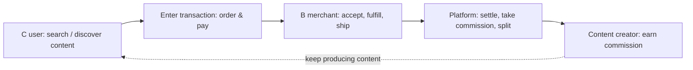

When first entering an unfamiliar field, the easiest thing to do is to start from the technical entry point you already know: first look at the repository, the interfaces, and the errors. I've done this too—and the result was a fragmented map that told me how the system runs, but not why it exists, who depends on it, or where change is most worthwhile.

Later I developed a habit: whenever I enter any unfamiliar direction, I first draw a one-page value chain map, then decide where it's worth digging deeper. This essay explains that method, and it's also a reminder to myself: understanding the full chain does not require mastering every detail.

## Start from the task, not the feature

Suppose you take over a booking back-office system. Don't first ask "what framework does this page use"; first ask: who comes here to accomplish what task? What steps does a request go through from submission to receiving the result? Who provides the input, who consumes the output, and who handles it when something fails?

Draw these answers as the simplest possible flow diagram. It doesn't need to be precise down to every field, but it should let you see where value begins, at which nodes it is passed along, and where it stalls or is lost.

For example, a typical content e-commerce transaction chain can be drawn as:

On this chain, value begins with "user search," is passed segment by segment through "transaction," "fulfillment," and "settlement," and finally flows back to the content creator as "commission." If any segment breaks—irrelevant search, failed payment, poor fulfillment, or settlement disputes—value stalls or is lost right there. Once you've drawn this far, you know which links to ask about first and which evidence to verify.

## Fill in five kinds of information

A useful first-version map includes at least:

- who the users and collaborators are;
- the tasks they want to accomplish and their success criteria;
- the key inputs, outputs, and upstream/downstream dependencies;
- the constraints, risks, and manual fallbacks in the current process;
- what evidence determines whether results improve or worsen.

For example, an "import failed" problem might look like it belongs to file parsing; but if you follow the map, you may find that the real loss happens when users don't know which records failed and operations staff can't locate the cause. The technical point still matters, but it is now understood within the complete task. This kind of misjudgment—"technical on the surface, but really about the chain"—is why I've made a habit of drawing the map first.

## The map is for asking questions, not for pretending to know everything

The first map will inevitably have blanks. Marking the unknown matters more than rushing to fill it in: who decided this rule? What is the definition of this metric? Why is manual approval needed here? Take these blanks with you to interviews, observation, reading documentation, and looking at data, and the learning will gradually converge.

Building the map doesn't have to be completed all at once in a fixed order. Usually you can first interview or observe real users, then look at the process, upstream/downstream, and data, and only finally go into the code and implementation details; but what matters more is letting the map fill in gradually along with the evidence.

Understanding the full chain doesn't require everyone to master every detail. What it requires is that, before making a local decision, you know which segment of the chain you're in and where that decision will take whom. Every time you enter an unfamiliar direction, you can first draw this one-page map, then decide where it's worth digging deeper—the value of that page is that it lets you know what to ask before you start.
