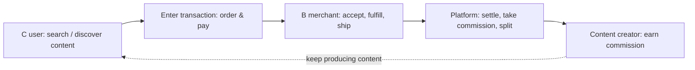

刚进入一个陌生领域时，最容易做的事是从自己熟悉的技术入口开始：先看仓库、接口和报错。我也这样做过——结果是得到一张零散的地图，知道系统怎样运行，却不知道它为什么存在、谁依赖它、哪里最值得改变。

后来我养成一个习惯：进入任何陌生方向，先画一张一页纸的价值链地图，再决定值得深挖哪里。这篇讲的就是这套方法，也提醒自己：理解全链路并不要求掌握所有细节。

## 从任务，而不是功能开始

假设你接手一个预约后台。不要先问"这个页面用什么框架"，先问：哪些人来这里完成什么任务？从提交请求到收到结果经历哪些步骤？谁提供输入，谁消费输出，失败后由谁处理？

把这些回答画成最简单的流程图。它不需要精确到每个字段，但应能看出价值从哪里开始、在哪些节点被传递、在哪里停住或损失。

我真正被这套方法逼出来的一次，是接手电商交易相关业务那阵。之前做的都是内容和搜索方向的增长，链路相对干净；交易不一样，履约、售后、生态治理绞在一起，复杂程度完全是另一个量级。我此前没有交易背景，一上来连该问什么都不知道。

我做的事大致是这样几步：

- 先去找懂这块业务的人聊——有交易背景的同事，问他们这个领域原本是怎么运转的、踩过哪些坑；
- 同时找到能解决当下具体问题的人，看不同背景的人怎么判断同一件事，他们的分歧本身就是信息；
- 跟产品、运营、市场逐个聊，搞清楚各自的目标是什么、正面对什么局面、真正的压力和痛点在哪里；
- 信息攒到一定量之后，还要在实际做事的过程中持续跟进这个系统是怎么演化的——哪些改动真的能带动指标，哪些看起来合理却推不动；
- 同时看清这个过程里积累了多少"债务"——哪些是当下能解决的问题，哪些其实是历史遗留、或者正在孵化的新系统留下的包袱。本质上是在应对一个不断变化的系统，既要从中找到真正该做的事，又不能被这些债务拖垮自己。

把这些谈话和观察拼起来，链路大致是这样的：买家先搜索、比较，决定进入交易——下单、支付；商家接单、履约、发货；平台在中间完成结算、抽取佣金、处理售后和纠纷；履约体验和纠纷处理结果，又反过来影响买家下次还愿不愿意交易。价值就在这几段里传递——搜索不准、支付卡住、履约延迟、结算有争议，价值都会在那一段停住或流失。画到这一步，才知道该优先找谁核实、该优先问哪个环节。

## 补齐五类信息

一张有用的第一版地图至少包含：

- 使用者与协作者分别是谁；
- 他们想完成的任务与成功标准；
- 关键输入、输出和上下游依赖；
- 当前流程中的限制、风险和人工兜底；
- 用什么证据判断结果变好或变坏。

例如，某个"导入失败"问题看起来属于文件解析；沿着地图追下去，可能发现真正的损失发生在用户不知道哪些记录失败、运营人员又无法定位原因。技术点仍然重要，但它已经回到完整任务中被理解。这类"表面在技术、实际在链路"的误判，是我习惯先画地图的原因。

## 地图用于提问，不用于假装全知

第一张地图一定有空白。标出未知比急着填满更重要：这个规则是谁决定的？这个指标的口径是什么？为什么此处需要人工审批？带着这些空白去访谈、观察、读文档和看数据，学习才会逐步收敛。

建图不必按固定顺序一次完成。通常可以先访谈或观察真实使用者，再看流程、上下游与数据，最后才进入代码和实现细节；但更关键的是让地图随证据逐步补齐。

理解全链路并不要求每个人掌握所有细节。它要求你在进入一个局部决定前，知道自己正处于哪一段链路，以及这个决定会把谁带向哪里。每次进入一个陌生方向，都可以先画这张一页纸地图，再决定值得深挖哪里——这张纸的价值，是让你在动手前先知道该问什么。
