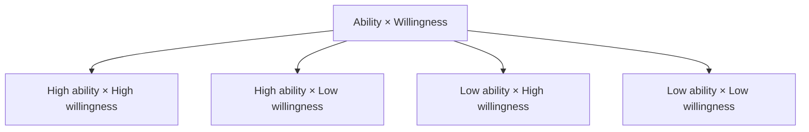

The background for this topic is very real: in a less-than-friendly environment, I've talked with many people, and the vast majority expressed anxiety and pressure (often both at once). The goal here is not to fully resolve anxiety and pressure, but to talk through a cognitive approach — drawing on "Rational Emotive Therapy" from psychology — to offer some channeling and relief.

**First, set the boundary clearly: one-on-ones at work are not counseling.** The roles and expectations are not symmetrical, so don't set your expectations too high or expect to resolve your complex problems in a single sitting. This kind of conversation only involves explaining, sharing, and guiding — not recovery plans, regular follow-ups, or the like. If your emotions are persistently affecting your life, sleep, or safety, please contact qualified local professional support or emergency help.

## Preparing How You Feel

First separate "anxiety" from "concrete pressure" — don't mix the two.

- Is what I'm worried about **abstract, future-oriented** trouble, fear, and unease, or fear of **something concrete in the present**?
- What is the recent concrete pressure coming from? Is it a fact, or a story I'm telling myself?
- Can I break this thing down into: what do I know, what can I influence, and what is not up to me?
- Have I been able to eat and sleep well lately?

## Points to Discuss

Start from the cognitive definitions, then move to the concrete working conditions.

- On the definition of anxiety: abstract, future-oriented trouble, fear, and unease; plain fear targets only the thing itself in the present.
- Talk about the concrete pressure: which thing, which point in time, which working relationship?
- On sorting out your own state: the Ability × Willingness four-quadrant — am I short on ability right now, or short on willingness?
- A few points from Rational Emotive Therapy:
  - Rough indicators of mental health: consistency between the subjective and the objective, consistency in how one perceives the world, and personality stability.
  - Sources of negative emotions: absolutizing, overgeneralizing, and catastrophizing.
  - The golden rule: "Treat others the way you would want them to treat you"; the reverse golden rule (a fallacy): "How I treat others is how they must treat me."
- Maintaining work boundaries amid anxiety: break uncertainty back down into discussable parts. First record the signals ("requirements changed twice this week," "unable to finish focused tasks for several days in a row"), then discuss what they mean for workload, priorities, and the kind of support needed; don't ask the other person to share private details they'd rather not.

One way to open the conversation:

> There's been a lot of change lately, and I find myself constantly switching, so the deep work I'd planned isn't getting done. I don't need to resolve every uncertainty right away; this week I'd like to confirm two priorities, push back one non-critical task, and agree to review on Friday whether it helped.

The responder doesn't need to play therapist. The most helpful moves are usually to hear the problem clearly, adjust working conditions together, and avoid treating extra commitments as proof.

## Venting and Feedback

- Work pressure has been too heavy lately.
- Feeling troubled about career growth.
- It feels like too much of a rat race inside the company.
- And ＿＿＿＿＿＿

If low mood, fear, insomnia, or tension keeps affecting your life and work, or if thoughts of self-harm, harming others, or immediate safety risks arise, please contact a qualified local mental-health professional, emergency services, or a trusted supporter. This piece only discusses boundaries and support in work collaboration and is not a substitute for medical or psychological treatment.
