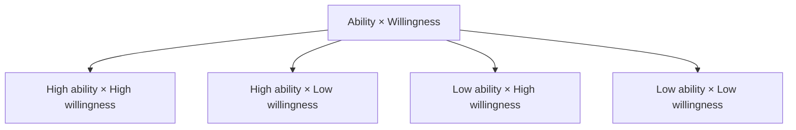

这个话题的背景很现实：在大环境不那么友好的情况下，跟许多人聊天，绝大部分人都表达了焦虑和压力（这两者并存）。这个主题的目的不是彻底解决焦虑与压力，更多是聊一下从认知角度的解法——参考心理学中"合理情绪疗法"，给到部分疏导和缓解。

**先说清边界：工作中的一对一不是心理咨询。** 角色和预期并不对等，不用报太高预期，指望一次性解决自己的复杂问题。这类对话只做讲解、分享和引导，不包含恢复计划、定期跟进等内容。如果情绪已持续影响生活、睡眠或安全，请联系当地合格的专业支持或紧急帮助。

## 准备自己的感受

先把"焦虑"和"具体的压力"分开，不要混在一起谈。

- 我担心的，是**对未来的、抽象的**烦恼、恐惧和不安，还是**当下具体事物**的恐惧？
- 最近具体的压力来自哪件事？它是一个事实，还是一个我讲出来的故事？
- 我能不能把这件事拆成：哪些是我知道的、哪些是我能影响的、哪些是我决定不了的？
- 我最近能好好吃饭、好好睡觉吗？

## 待沟通的点

从认知层面的定义聊起，再到具体的工作条件。

- 关于焦虑的定义：对未来、抽象的烦恼、恐惧和不安；单纯的恐惧只针对当下的事物本身。
- 聊一下具体的压力：是哪件事、哪个时间点、哪个协作关系？
- 关于自身状态的梳理：能力 × 意愿 的四象限——我现在是能力不足，还是意愿不足？
- 合理情绪疗法里的几个点：
  - 心理健康的大致表现：主客观一致性、认知世界一致性、人格稳定性。
  - 负面情绪的来源：绝对化、过度概括、糟糕至极。
  - 黄金法则："像你希望别人如何对待你那样去对待别人"；反黄金法则（误区）："我对别人怎样，别人就必须对我怎样"。
- 在焦虑中保持工作边界：把不确定性拆回可讨论的部分。先记录信号（"本周需求变化两次""连续几天无法完成专注任务"），再讨论它对负荷、优先级和支持方式意味着什么；不要求对方讲出不愿分享的私人细节。

一次可以这样开口：

> 最近变化很多，我发现自己在反复切换，原定的深度工作无法完成。我不需要立刻解决所有不确定性；这周希望确认两个优先级、把一个非关键任务延后，并约定周五复盘是否有效。

回应者不必扮演治疗者。最有帮助的动作通常是听清问题、共同调整工作条件、避免把额外承诺当成证明。

## 吐槽与反馈

- 最近工作压力太大了。
- 对职业成长有困扰。
- 在公司内感觉太卷了。
- 以及 ＿＿＿＿＿＿

如果低落、恐惧、失眠或紧绷持续影响生活和工作，或出现自伤、伤害他人的念头、即时安全风险，请联系当地合格的心理健康专业人士、紧急服务或可信赖的支持者。这篇只讨论工作协作中的边界与支持，不替代医疗或心理治疗。
