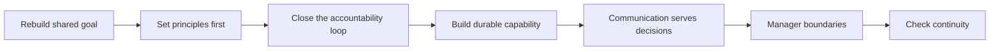

Sometimes a team that once ran smoothly loses its continuity because of shifting goals, changes in key roles, or long-term attrition. The most common mistake at such a moment is to understand "starting over" as redrawing a division-of-labor chart, or immediately filling the void with a list of tasks.

What truly needs rebuilding is not a chart but a bench: people who understand the shared goal, shoulder clear responsibilities, and keep judgment, delivery, and collaboration continuous even as the environment changes. A bench does not grow on its own; it has to be chosen, developed, calibrated, and adjusted when necessary.

So the first thing when building a team from zero is not "which person to add," but to look at the current situation from scratch: what capabilities already exist, where the gaps are, which habits are eroding trust, and what will reestablish order next. Below is the sequence of thinking I actually follow when rebuilding a team; it only discusses principles that can be shared and reused, and offers no specific plan.

## First Rebuild a Shared Sense of Purpose

A team should not be just a group of people who receive tasks. Everyone needs to know what problem their work is solving, what user experience it serves, and how to judge in the end whether it really created value.

A complete goal breakdown should at least answer:

- what task the user is trying to accomplish and where the most critical difficulty lies;
- what outcome you want to change, rather than only listing the features or projects to build;
- which links can be influenced through improvements in engineering, experience, or process;
- what evidence to look at afterward to judge that the effort has not merely turned into busyness.

This does not mean everyone should make decisions on behalf of other disciplines; it means no one should shrink themselves into a narrow execution interface. Understanding upstream and downstream, taking part in judging approaches, and reviewing together when results fall short of expectations — that is where a team truly starts taking responsibility for its goal.

The goal needs to be communicated repeatedly, and also translated repeatedly. If a direction from above cannot be broken down into value the team can actually influence, and then into concrete, verifiable actions, it easily turns into a slogan in transmission; conversely, if local tasks cannot explain how they serve the overall goal, they will gradually lose any basis for prioritization.

The team's shape should serve this closed loop, not the other way around, with the goal bending to the division of labor. When the environment is changing quickly, first make the shared standards and foundational capabilities solid, to avoid duplicated work and mutual waiting; as problems gradually come into focus, bring a fuller loop of responsibility closer to the real problems. Whatever division of labor you adopt, the test is always: does it make important problems easier to see, decide, and finish?

## Set Principles Before Dividing Work

In the early stage of rebuilding, what most needs to be unified first is not job titles but the principles of how work is done.

- **Treat members as adults who can be accountable for their choices.** Make expectations clear and provide necessary support, but also require everyone to take responsibility for their own judgment, commitments, and improvement; do not let management become arranging other people's fates for them.
- **Respect rules and quality.** Quality is not just a check before delivery; it also includes the reliability of the process, how things perform after launch, and how problems are fixed once they appear. Bottom lines such as safety, privacy, and compliance must not give way to short-term efficiency; rules also must not be remembered only after something goes wrong.
- **Take responsibility for results.** Don't only ask "Did I finish?"; also ask whether the approach was sound, whether the user experience actually works, why expectations were not met, and how to improve next time. "I just did my part" cannot be the endpoint when the result fails to hold up.
- **Be oriented toward solving problems.** Planning should start from real problems, and avoid replacing judgment with grand but hollow construction.
- **Respect collaboration.** Discuss shared interests and the full context; when disagreements arise, return first to the problem you set out to solve rather than draining energy on trivial details.

There are two more principles that are easy to overlook.

First, always look at problems from the user's full path of completing a task. You cannot stare only at the piece of logic you own; a local optimization that forces users to pay a higher cost in adjacent steps is not a real improvement. Staying curious about the usage path — and walking through it yourself when necessary — lets many problems invisible on paper surface earlier.

Second, quality, efficiency, and effectiveness often cannot all be maximized at once. When they conflict, first spell out the most important goal and the cost you are willing to bear, then reach agreement with your collaborators. Delays, rework, quality problems, or delivery failures are usually not caused by any single link alone; check both whether the requirements are clear and worth doing, and whether the implementation, verification, and release process has appropriate entry and exit conditions.

Principles are not values pinned to a wall. They should show up in everyday judgment: whether requirements and approaches have gone through the necessary clarification and review, whether risks are exposed truthfully, and whether, after a problem occurs, you fix the system first rather than hunt for a scapegoat.

## Make Responsibility Truly Close the Loop

Boundaries are not territory; they exist so problems are neither overlooked nor handled twice. Whatever the division of labor, a piece of work should have a clear loop: who organizes the facts, proposes the approach, coordinates dependencies, exposes risks, and drives it to a concluded state.

You can check against the responsibility card below:

| Element | What it should clarify |
| --- | --- |
| Problem | What is being solved, not just what is being delivered. |
| Result | What counts as improvement, and which signals prove it holds. |
| Responsibility | Who drives decisions, coordinates dependencies, exposes risks, and closes the loop. |
| Collaboration | Which roles provide professional judgment, and who needs to be kept in sync. |
| Boundary | Be explicit about what not to do, and how to handle things beyond the boundary. |

"Someone is responsible" does not mean one person does all the work. It means that when something gets stuck, what remains is not just a chain of forwarded messages; the people involved know who is driving, and the owner has enough goal clarity, boundary, and support to make the judgment.

Responsibility boundaries also need periodic review. Two teams doing the same thing, or a piece of work repeatedly falling between boundaries, both signal that the current division of labor no longer serves the problem itself. At that point, don't rush to pin down "whose it is"; instead re-explain along the full chain: why this capability exists, what result it serves, where the interface is, and how to adjust to reduce duplication and omission.

## Build Durable Capability with Limited Resources

Whether a team can endure depends not only on how much it can finish right now, but also on whether capability can be seen, developed, and passed on.

This requires doing several things continuously:

- Identify which capabilities and responsibilities matter most to the team, and don't let development become a slogan about equal distribution;
- Proactively choose people who are willing to grow and able to take responsibility, and give them challenges, feedback, and support that are concrete enough;
- Keep standards clear and consistent, so contributions, improvements, and shortcomings can all be discussed concretely;
- Let capability form in more people through delegation, rather than having a few people serve indefinitely as the only ones who fill the gaps.

Development is not the same as excessive intervention. A manager can guide, remind, and create opportunities, but cannot do the growing for others. Help should come with good intentions, and should also acknowledge a person's right to choose their own path; likewise, when someone still cannot carry the corresponding responsibility after clear feedback and reasonable support, expectations, duties, or the mode of collaboration should be adjusted promptly, rather than letting ambiguity keep draining the team.

Resources are equally limited. Not every request should be promised, and not every investment has the same priority. What matters is making the trade-offs explicit: why this work is being done now, what is being postponed for it, and how the result will be verified once it is done. A demand beyond your capability and scope does not automatically become a reliable commitment just because it was once agreed to; the manager has a duty to spell out the limits before committing, rather than leaving the pressure to whoever executes last.

When rebuilding the bench, you also need to keep your judgment of people restrained and clear. Don't judge someone by a single abstract label; what is more worth observing is whether they are willing to learn on their own, whether they can take responsibility for their own judgment, how they handle disagreement, and whether they can keep improving with support. Everyone should receive basic feedback and guidance, but the scarcer challenges, mentoring, and key opportunities should go to those willing to take responsibility and able to create long-term impact.

Standards also cannot be explained only after results are in. What counts as achieved, what still needs improvement, how to get support, and when a role or task needs to change should all be spelled out as early as possible. This is not to replace judgment with rules, but to avoid turning evaluation into a vague impression, or letting problems drag on until everyone has lost room to choose.

## Make Communication and Meetings Serve Decisions

Communication is not the flow of messages; it is helping different roles take action around the same problem. An effective communication habit usually includes: syncing important changes and risks promptly; returning to the shared goal when disputes arise; preparing complete options, costs, benefits, and trade-offs before a decision is needed; and clarifying the next step and responsibilities once it is over.

Meetings should be the same. Content that can be finished by reading need not take up everyone's sync time; what truly needs discussing should focus on judgment, choices, and risk. More attendees is not necessarily better; the key is to have present the people who need to make decisions, provide key facts, and carry out follow-up actions.

When collaboration spans locations or time zones, closing the loop is especially important. Keep stable information channels and clear response windows for key issues, and avoid letting waiting, guessing, and repeated syncing become the norm of remote collaboration. Things that can be resolved locally should be closed locally as much as possible; things that need cross-region coordination should have their interfaces, timing, and responsibilities written out more clearly.

What remote collaboration fears most is not distance, but responsibility and context scattered across different places. For work that needs to be pushed forward over the long term, it is best to establish a stable point of contact, traceable decision records, and a predictable escalation path. Syncing should not happen only when something breaks; important progress, quality signals, risks, and dependencies should all have fixed channels for surfacing. That way, even when collaborators are not in the same place, the work does not run on ad-hoc reaching out and repeated confirmation.

## What a Manager Should and Should Not Do

In the stage of rebuilding a team, a manager's behavior quickly becomes the team's default way of working.

- **Step in when you should step in.** Facing key deliveries, risks, and collaboration conflicts, directly clarify the facts, organize communication, drive the decision, and bear the consequences; "delegation" cannot be an excuse for being absent at critical moments.
- **Stabilize the fundamentals first.** First get the most important duties running reliably, then gradually handle more complex cross-domain problems.
- **Keep regular and concrete communication.** Understand the stage each person is at, the difficulties they face, and their development aspirations; don't ask for the first time only after problems have piled up beyond repair.
- **Delegate appropriately.** Once goals and boundaries are clear, hand over real decision-making authority and provide support when needed; delegation is not one-way passing down of risk and responsibility.
- **Uphold fairness.** At key points, don't overstep, and don't replace shared standards with personal preferences; respect reasonable arrangements, and reconcile the parts that are genuinely unreasonable.
- **Push back against blame and scapegoating.** Neither dodge problems, nor let attacking others become the team's way of handling them.

The boundaries of management matter equally: don't turn every choice into something requiring your approval, and don't meddle too much in other people's lives. Good management is not walking for the team, but giving the team the conditions to walk farther on its own.

This also requires the manager to keep a sense of proportion at key points. Don't dodge responsibilities you should carry; don't force your way across professional boundaries you shouldn't cross just because of your title. Faced with concrete arrangements, focus first on the overall result and unreasonable conflicts, rather than turning your own preferences into everyone's way of working. Fairness is not giving everyone exactly identical treatment, but making the standards, boundaries, and decision-making process explainable.

## Finally, Check Whether the Bench Has Regained Continuity

Rebuilding does not end once a division of labor is finished. After some time, it is worth looking back:

- Is the shared goal still clear, or has it once again been reduced to a task list?
- Has responsibility truly closed the loop, or does it still rely on a few people constantly filling the gaps?
- Is key capability being passed on, or does it depend heavily on individual experience?
- Have standards been put into everyday practice, or are they only mentioned in reviews?
- Can the team keep collaborating through change, rather than falling back into fatigue, blame, and waiting?

If these questions can be discussed continuously and honestly, the team need not rely on a chart that merely looks complete or on a few people's stubborn effort. It will gradually become a bench that can restore order amid change, develop new capability, and keep delivering on its commitments.
