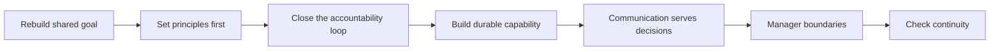

有时，原本顺畅的团队会因为目标变化、关键角色变动或长期消耗而失去连续性。此时最容易犯的错，是把“重新开始”理解成重新画一张分工图，或者马上用一串任务填满空白。

真正要重建的不是图，而是一套梯队：它能理解共同目标、承担清楚的责任，在环境变化后仍保持判断、交付和协作的连续性。梯队不是自然长出来的；它需要被选择、培养、校准，也需要在必要时被调整。

因此，从零搭团队的第一件事不是“补齐谁”，而是归零地看待现状：已有的能力是什么，缺失的环节在哪里，哪些习惯正在消耗信任，接下来要靠什么重新建立秩序。

举例来说，假设一个团队原本的负责人离职，剩下三名工程师和一名产品经理，手上还压着两个没交付完的项目。这时候如果直接把空出来的职位补齐、把任务表重新排一遍，往往几周之后又会回到老问题：没人真正对结果负责，遇到分歧还是习惯性甩给“等新负责人来定”。比较靠谱的做法是倒过来——先弄清楚这几个人各自能扛住什么、目标感有多清楚、彼此的信任消耗在哪，再决定要不要引入新角色、怎样引入。下面几节大致是我在类似情况下会依次走一遍的思路，只谈可以公开复用的原则，不涉及具体人员和方案。

## 先重建共同的目标感

团队不应只是一组接收任务的人。每个人都需要知道，自己参与的工作要解决什么问题、服务怎样的用户体验，以及最终怎样判断它是否真的产生了价值。

一个完整的目标拆解，至少要回答：

- 用户正在完成什么任务，最关键的困难在哪里；
- 希望改变的结果是什么，而不是只列出要做的功能或项目；
- 哪些环节可以通过工程、体验或流程的改进产生影响；
- 完成之后看什么证据，才能判断努力没有只变成忙碌。

这并不意味着每个人都要代替其他专业做决策，而是不能把自己缩成某个局部的执行接口。理解上下游、参与方案判断、在结果不如预期时一起复盘，才是团队真正对目标负责的开始。

目标需要被反复传达，也需要被反复翻译。上层的方向如果不能拆成团队可以干预的价值，再落到具体而可验证的行动，就很容易在传递中变成口号；反过来，局部任务如果无法解释自己怎样服务整体目标，也会逐渐失去优先级判断。

团队的形态应当服务于这种闭环，而不是反过来让目标迁就分工。环境快速变化时，先把共同标准和基础能力做扎实，避免重复建设和相互等待；当问题逐渐聚焦时，再让更完整的责任闭环靠近实际问题。无论采用何种分工，判断标准始终是：它是否让重要问题更容易被看见、决策和完成。

## 先立原则，再谈分工

重建的早期，最需要先统一的不是职位名称，而是做事的原则。

首先是怎么看待“人”：把每个成员当作能为自己选择负责的成年人，明确期望、提供必要支持，同时也要求每个人为自己的判断、承诺与改进负责——管理不是替别人安排命运。其次是对规则和质量的态度不能松：质量不仅是交付前的检查，也包括过程可靠性、上线后的表现和出问题之后的修复，安全、隐私、合规这些底线不能为短期效率让路，规则更不能只在出事之后才被想起来。

再往下是结果意识。不能只问“我做完了吗”，还要问方案是否合理、使用体验是否成立、预期为什么没有实现，以及下一次怎样改善；“我只是完成了分内工作”不能成为结果不成立时的终点。规划也应该从真实问题出发，而不是用宏大而空泛的建设去替代判断。最后是怎么处理协作中的分歧——讨论共同利益和完整上下文，发生争执时先回到最初要解决的问题，而不是把精力耗在细枝末节的对错上。

还有两条容易被遗漏的原则。

第一，始终从用户完成任务的完整路径看问题。不能只盯住自己负责的一段逻辑；一个局部优化若让用户在前后环节付出更高成本，就不能算真正改善。对使用路径保持好奇，必要时亲自走一遍，能让许多纸面上看不见的问题更早出现。

第二，质量、效率与效果往往不能同时最大化。遇到冲突时，应先把最重要的目标和愿意承担的代价说清楚，再与协作方达成一致。所有延迟、返工、质量问题或交付失误，通常都不是某一个环节单独造成的；既要检查需求是否清楚、是否值得做，也要检查实现、验证和发布过程是否有合适的准入与准出条件。

原则不是贴在墙上的价值观。它应当出现在日常判断里：需求和方案是否经过必要的澄清与评审，风险有没有被如实暴露，问题发生后能否先修复系统而非寻找替罪者。

## 让责任真正形成闭环

边界不是领地，而是为了让问题不被遗漏、不被重复处理。无论怎样分工，一件事都应有清楚的闭环：谁负责组织事实、提出方案、协调依赖、暴露风险，并推动它到有结论的状态。

举例来说，假设团队里新招了一名工程师，试用期两个月里交付都能按时完成，但每次遇到需求本身有歧义、或者上下游意见不一致时，他会选择先按自己理解的版本做完，出了问题再解释“需求当时没说清楚”。这种情况很难简单归为“能力不行”，更像是责任闭环没搭起来——他不清楚自己被期待在分歧出现的当下就去追问、协调，而不是等结果出来后再补一个理由。与其等考核期结束才谈这件事，不如提前把“谁该在什么时候把问题挑明”说清楚，再观察调整之后的实际表现。

判断一件事的责任有没有真正闭环，大致可以从几个角度检查：正在解决的问题是什么，而不只是要交付的东西是什么；怎样才算改善，有哪些信号可以证明它成立；谁来推动决策、协调依赖、暴露风险并把事情收尾；哪些角色需要提供专业判断，哪些人只需要被同步；以及明确不做什么，超出边界之后又该怎么处理。这几件事想清楚了，“谁负责”才不会变成一句空话。

“有人负责”不等于由一个人包办所有工作。它意味着当事情卡住时，不会只剩下一串转发的消息；相关的人知道谁来推动，负责人也有足够的目标、边界和支持去完成判断。

责任边界也需要定期复盘。两个团队做了同一件事，或一件事在边界之间反复掉落，都说明现有分工已经不再服务问题本身。此时不应急着追究“到底是谁的”，而应先沿着完整链路重新解释：这项能力为何存在，它服务什么结果，接口在哪里，怎样调整才能减少重复与遗漏。

## 用有限资源培养可延续的能力

团队能否持续，不只取决于眼前能完成多少事，也取决于能力能否被看见、培养和传递。

这需要持续做几件事：

- 识别哪些能力与责任对团队最关键，不把培养变成平均分配的口号；
- 主动选择愿意成长、能够承担责任的人，并给足够具体的挑战、反馈与支持；
- 让标准清楚且一致，使贡献、改进和不足都能被具体讨论；
- 通过授权让能力在更多人身上形成，而不是让少数人长期充当唯一的补位者。

培养不等于过度干预。管理者可以指导、提醒和创造机会，但不能替别人完成成长。帮助应当带着善意，也应当承认个人有选择自己路径的权利；同样地，在获得清楚反馈和合理支持后，仍无法承担相应责任时，也应当及时调整期待、职责或协作方式，而不是让含混持续消耗团队。

资源同样有限。并非每一个请求都该被承诺，也并非每一项投入都有同样的优先级。重要的是把取舍说清楚：现在为什么做这件事，为此推迟什么，完成后怎样验证结果。超出能力与范围的要求，不会因为被答应过就自动变成可靠的承诺；管理者有责任在承诺之前说清限制，而不是把压力留给最后执行的人。

重建梯队时，还需要对人才判断保持克制而清晰。不要只用一个抽象标签判断一个人；更值得观察的是他是否愿意主动学习、能否为自己的判断承担责任、怎样处理分歧、是否能在支持下持续改进。每个人都应得到基本的反馈与指导，但更稀缺的挑战、带教和关键机会，应当投入到愿意承担并能形成长期影响的地方。

标准也不能只在结果出来之后才被解释。什么是达成、什么是仍需改进、如何获得支持、何时需要调整角色或任务，都应该尽量提前说清楚。这样做不是为了用规则替代判断，而是为了避免把评价变成含混的印象，或让问题长期拖到彼此都失去选择空间。

## 让沟通和会议服务于决策

沟通不是消息流转，而是帮助不同角色围绕同一个问题做出行动。一个有效的沟通习惯，通常包括：及时同步重要变化与风险；在争议发生时回到共同目标；在需要决策前准备完整的选项、成本、收益与代价；在结束后明确下一步和责任。

会议也应如此。能阅读完成的内容不必占用所有人的同步时间；真正需要讨论的，应聚焦于判断、选择和风险。参会者不必越多越好，关键是让需要做决定、提供关键事实、承担后续行动的人在场。

当协作跨越地点或时区时，闭环尤其重要。应当为关键问题保留稳定的信息渠道和明确的响应窗口，也要避免把等待、猜测和重复同步变成远程协作的常态。能在局部解决的事应尽量在局部闭环；需要跨区域协同的事，则把接口、时点和责任写得更清楚。

远程协作最怕的不是距离，而是责任与上下文都散在不同地方。对一项需要长期推进的工作，最好明确一个稳定的对接窗口、可追溯的决策记录和可预期的升级方式。同步不应只发生在出现故障时；重要进度、质量信号、风险和依赖都应有固定的暴露渠道。这样即使协作对象不在同一地点，也不会靠临时找人和反复确认维持运转。

## 管理者的做与不做

在重建团队的阶段，管理者的行为会迅速成为团队默认的工作方式。

最基本的一条是该下场时要下场：面对关键交付、风险和协作冲突，直接澄清事实、组织沟通、推动决定并承担后果，不能把“授权”当作关键时刻缺席的理由。但下场不代表事事都要抓在手里——更合理的顺序通常是先让最重要的职责可靠运转，再逐步处理更复杂的跨领域问题，而不是一开始就想把所有环节都收拾利落。

日常里则要靠定期而具体的沟通去了解每个人所处的阶段、面临的困难和发展诉求，不要等问题积累到不可收拾时才第一次询问；同时也要在目标与边界清楚之后，把真正的判断权交出去，并在需要时提供支持——授权不是把风险和责任单向下放。遇到分歧时守住公平，在重要节点不越界，不用个人好恶替代共同标准，对合理的安排保持尊重，只协调真正不合理的部分。既不回避问题，也不让攻击他人成为团队处理问题的方式，这一条说起来容易，真出事时往往最难守住。

管理的边界同样重要：不要把每个选择都变成自己的批准，也不要过多干预他人的人生。好的管理不是替团队走路，而是让团队有条件自己走得更远。

这也要求管理者在关键节点保持分寸。该承担的责任不能躲开；不该越过的专业边界也不应凭职位强行介入。面对具体安排时，先关注整体结果和不合理的冲突，而不是把自己的偏好变成所有人的工作方式。公平不是让每个人得到完全相同的对待，而是让标准、边界和判断过程能够被解释。

## 最后，检查梯队是否恢复了连续性

重建不是完成一次分工就结束。过一段时间，值得回头看：共同目标是否仍然清楚，还是又只剩下任务列表；责任是否真正闭环，还是仍靠少数人不断补位；关键能力是否在传递，还是高度依赖个别经验；标准是否落实到日常，还是只在复盘里被提起；团队能否在变化中保持合作，而不是重新落入疲惫、指责和等待。

这些问题不会有一次性的答案，多数时候也没有整齐的“已解决”或“未解决”，更像是要隔一段时间就老老实实问一遍、诚实地承认哪里还没做到。回到前面那个例子：如果那名新工程师后来确实学会了在分歧出现时先开口，团队的责任闭环就往前走了一小步；如果没有，也不必急着下结论，先看看是期待没说清楚，还是这件事本来就不适合他。梯队的连续性，大概就是这样一次次具体地补回来的，而不是靠一次重建就能一劳永逸。
