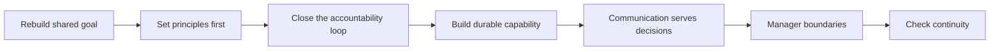

有时，原本顺畅的团队会因为目标变化、关键角色变动或长期消耗而失去连续性。此时最容易犯的错，是把“重新开始”理解成重新画一张分工图，或者马上用一串任务填满空白。

真正要重建的不是图，而是一套梯队：它能理解共同目标、承担清楚的责任，在环境变化后仍保持判断、交付和协作的连续性。梯队不是自然长出来的；它需要被选择、培养、校准，也需要在必要时被调整。

因此，从零搭团队的第一件事不是“补齐谁”，而是归零地看待现状：已有的能力是什么，缺失的环节在哪里，哪些习惯正在消耗信任，接下来要靠什么重新建立秩序。下面是我在重建团队时实际遵循的思考顺序；它只讨论可公开复用的原则，不提供任何具体方案。

## 先重建共同的目标感

团队不应只是一组接收任务的人。每个人都需要知道，自己参与的工作要解决什么问题、服务怎样的用户体验，以及最终怎样判断它是否真的产生了价值。

一个完整的目标拆解，至少要回答：

- 用户正在完成什么任务，最关键的困难在哪里；
- 希望改变的结果是什么，而不是只列出要做的功能或项目；
- 哪些环节可以通过工程、体验或流程的改进产生影响；
- 完成之后看什么证据，才能判断努力没有只变成忙碌。

这并不意味着每个人都要代替其他专业做决策，而是不能把自己缩成某个局部的执行接口。理解上下游、参与方案判断、在结果不如预期时一起复盘，才是团队真正对目标负责的开始。

目标需要被反复传达，也需要被反复翻译。上层的方向如果不能拆成团队可以干预的价值，再落到具体而可验证的行动，就很容易在传递中变成口号；反过来，局部任务如果无法解释自己怎样服务整体目标，也会逐渐失去优先级判断。

团队的形态应当服务于这种闭环，而不是反过来让目标迁就分工。环境快速变化时，先把共同标准和基础能力做扎实，避免重复建设和相互等待；当问题逐渐聚焦时，再让更完整的责任闭环靠近实际问题。无论采用何种分工，判断标准始终是：它是否让重要问题更容易被看见、决策和完成。

## 先立原则，再谈分工

重建的早期，最需要先统一的不是职位名称，而是做事的原则。

- **把成员当作能为选择负责的成年人。** 明确期望、提供必要支持，也要求每个人为自己的判断、承诺与改进负责；不把管理变成替他人安排命运。
- **敬畏规则与质量。** 质量不仅是交付前的检查，也包括过程可靠性、上线后的表现和出现问题后的修复。安全、隐私、合规等底线不能为短期效率让路；规则也不能只在出事后才被想起。
- **对结果负责。** 不只问“我做完了吗”，还要问方案是否合理、使用体验是否成立、预期为什么没有实现，以及下一次怎样改善。不能把“我只是完成分内工作”当作结果不成立时的终点。
- **以解决问题为导向。** 规划应从真实问题出发，避免用宏大而空泛的建设替代判断。
- **尊重合作。** 讨论共同利益与完整上下文；发生争执时，先回到最初要解决的问题，而不是把精力耗在细枝末节上。

还有两条容易被遗漏的原则。

第一，始终从用户完成任务的完整路径看问题。不能只盯住自己负责的一段逻辑；一个局部优化若让用户在前后环节付出更高成本，就不能算真正改善。对使用路径保持好奇，必要时亲自走一遍，能让许多纸面上看不见的问题更早出现。

第二，质量、效率与效果往往不能同时最大化。遇到冲突时，应先把最重要的目标和愿意承担的代价说清楚，再与协作方达成一致。所有延迟、返工、质量问题或交付失误，通常都不是某一个环节单独造成的；既要检查需求是否清楚、是否值得做，也要检查实现、验证和发布过程是否有合适的准入与准出条件。

原则不是贴在墙上的价值观。它应当出现在日常判断里：需求和方案是否经过必要的澄清与评审，风险有没有被如实暴露，问题发生后能否先修复系统而非寻找替罪者。

## 让责任真正形成闭环

边界不是领地，而是为了让问题不被遗漏、不被重复处理。无论怎样分工，一件事都应有清楚的闭环：谁负责组织事实、提出方案、协调依赖、暴露风险，并推动它到有结论的状态。

可以用下面这张责任卡检查：

| 要素 | 要说明的内容 |
| --- | --- |
| 问题 | 正在解决什么，而不只是要交付什么。 |
| 结果 | 怎样才算改善，哪些信号可以证明它成立。 |
| 责任 | 谁推动决策、协调依赖、暴露风险并闭环。 |
| 协作 | 哪些角色提供专业判断，哪些人需要被同步。 |
| 边界 | 明确不做什么，以及超出边界后如何处理。 |

“有人负责”不等于由一个人包办所有工作。它意味着当事情卡住时，不会只剩下一串转发的消息；相关的人知道谁来推动，负责人也有足够的目标、边界和支持去完成判断。

责任边界也需要定期复盘。两个团队做了同一件事，或一件事在边界之间反复掉落，都说明现有分工已经不再服务问题本身。此时不应急着追究“到底是谁的”，而应先沿着完整链路重新解释：这项能力为何存在，它服务什么结果，接口在哪里，怎样调整才能减少重复与遗漏。

## 用有限资源培养可延续的能力

团队能否持续，不只取决于眼前能完成多少事，也取决于能力能否被看见、培养和传递。

这需要持续做几件事：

- 识别哪些能力与责任对团队最关键，不把培养变成平均分配的口号；
- 主动选择愿意成长、能够承担责任的人，并给足够具体的挑战、反馈与支持；
- 让标准清楚且一致，使贡献、改进和不足都能被具体讨论；
- 通过授权让能力在更多人身上形成，而不是让少数人长期充当唯一的补位者。

培养不等于过度干预。管理者可以指导、提醒和创造机会，但不能替别人完成成长。帮助应当带着善意，也应当承认个人有选择自己路径的权利；同样地，在获得清楚反馈和合理支持后，仍无法承担相应责任时，也应当及时调整期待、职责或协作方式，而不是让含混持续消耗团队。

资源同样有限。并非每一个请求都该被承诺，也并非每一项投入都有同样的优先级。重要的是把取舍说清楚：现在为什么做这件事，为此推迟什么，完成后怎样验证结果。超出能力与范围的要求，不会因为被答应过就自动变成可靠的承诺；管理者有责任在承诺之前说清限制，而不是把压力留给最后执行的人。

重建梯队时，还需要对人才判断保持克制而清晰。不要只用一个抽象标签判断一个人；更值得观察的是他是否愿意主动学习、能否为自己的判断承担责任、怎样处理分歧、是否能在支持下持续改进。每个人都应得到基本的反馈与指导，但更稀缺的挑战、带教和关键机会，应当投入到愿意承担并能形成长期影响的地方。

标准也不能只在结果出来之后才被解释。什么是达成、什么是仍需改进、如何获得支持、何时需要调整角色或任务，都应该尽量提前说清楚。这样做不是为了用规则替代判断，而是为了避免把评价变成含混的印象，或让问题长期拖到彼此都失去选择空间。

## 让沟通和会议服务于决策

沟通不是消息流转，而是帮助不同角色围绕同一个问题做出行动。一个有效的沟通习惯，通常包括：及时同步重要变化与风险；在争议发生时回到共同目标；在需要决策前准备完整的选项、成本、收益与代价；在结束后明确下一步和责任。

会议也应如此。能阅读完成的内容不必占用所有人的同步时间；真正需要讨论的，应聚焦于判断、选择和风险。参会者不必越多越好，关键是让需要做决定、提供关键事实、承担后续行动的人在场。

当协作跨越地点或时区时，闭环尤其重要。应当为关键问题保留稳定的信息渠道和明确的响应窗口，也要避免把等待、猜测和重复同步变成远程协作的常态。能在局部解决的事应尽量在局部闭环；需要跨区域协同的事，则把接口、时点和责任写得更清楚。

远程协作最怕的不是距离，而是责任与上下文都散在不同地方。对一项需要长期推进的工作，最好明确一个稳定的对接窗口、可追溯的决策记录和可预期的升级方式。同步不应只发生在出现故障时；重要进度、质量信号、风险和依赖都应有固定的暴露渠道。这样即使协作对象不在同一地点，也不会靠临时找人和反复确认维持运转。

## 管理者的做与不做

在重建团队的阶段，管理者的行为会迅速成为团队默认的工作方式。

- **该下场时下场。** 面对关键交付、风险和协作冲突，直接澄清事实、组织沟通、推动决定并承担后果；不能把“授权”当作关键时刻缺席的理由。
- **先稳住基本盘。** 先让最重要的职责可靠运转，再逐步处理更复杂的跨领域问题。
- **保持定期而具体的沟通。** 了解每个人所处的阶段、面临的困难和发展诉求，不在问题积累到不可收拾时才第一次询问。
- **适度授权。** 在目标与边界清楚后，把真正的判断权交出去，并在需要时提供支持；授权不是把风险和责任单向下放。
- **守住公平。** 在重要节点不越界，不用个人好恶替代共同标准；对合理的安排保持尊重，协调真正不合理的部分。
- **反对指责与甩锅。** 既不回避问题，也不让攻击他人成为团队处理问题的方式。

管理的边界同样重要：不要把每个选择都变成自己的批准，也不要过多干预他人的人生。好的管理不是替团队走路，而是让团队有条件自己走得更远。

这也要求管理者在关键节点保持分寸。该承担的责任不能躲开；不该越过的专业边界也不应凭职位强行介入。面对具体安排时，先关注整体结果和不合理的冲突，而不是把自己的偏好变成所有人的工作方式。公平不是让每个人得到完全相同的对待，而是让标准、边界和判断过程能够被解释。

## 最后，检查梯队是否恢复了连续性

重建不是完成一次分工就结束。过一段时间，值得回头看：

- 共同目标是否仍然清楚，还是又只剩下任务列表；
- 责任是否真正闭环，还是仍靠少数人不断补位；
- 关键能力是否在传递，还是高度依赖个别经验；
- 标准是否落实到日常，还是只在复盘里被提起；
- 团队能否在变化中保持合作，而不是重新落入疲惫、指责和等待。

如果这些问题能被持续而诚实地讨论，团队就不必依赖一张看起来完整的图或少数人的硬撑。它会慢慢成为一个能在变化中恢复秩序、培养新能力，并持续完成承诺的梯队。
