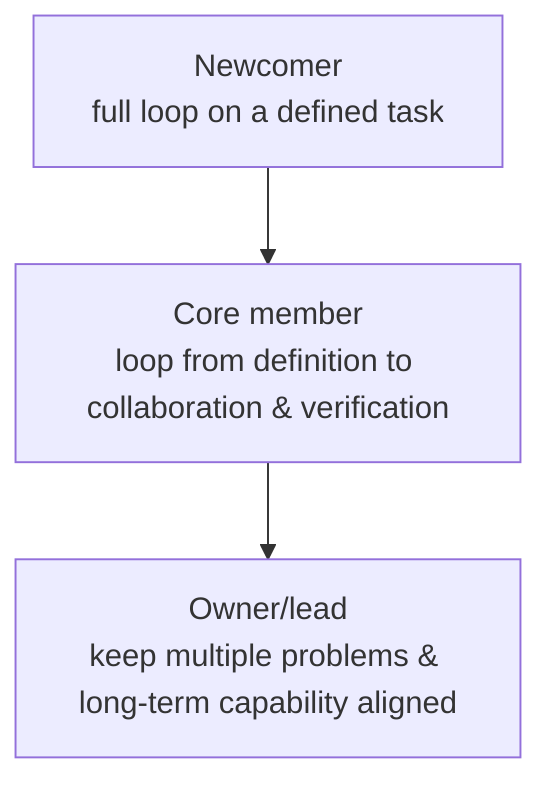

> This article expands on the "Team and Growth" thread in [Management Retrospective](/en/writing/2026/08/management-retrospective/).

When a team discusses growth paths, it is easy to start by drawing a hierarchy: from junior to senior, from member to lead, with each level listing more skills and greater influence. It provides direction, but it can also create misunderstanding: as if everyone must walk the same path, or as if completing a checklist item by item is the same as growing.

A more useful path design is not to label people with stages, but to explain **how responsibility expands, how judgment changes, and how support should adjust**. The same person may be at different stages in different areas: able to own complex problems in a familiar system, yet still needing to start from basic tasks in an unfamiliar domain.

The three paths below are not any organization's job-level standard, but a framework usable when designing development opportunities: newcomers first build reliable completion ability; core members begin to own problems and collaboration; leads enable more people to independently take responsibility.

## Newcomers: From Completing Tasks to Understanding Problems

A newcomer's first goal should not just be to "get up to speed quickly." More important is to establish a reliable working rhythm: being able to understand why a task exists, complete the part they own thoroughly, and, when facing the unknown, articulate it clearly and ask for help in time.

What this stage needs most is not a vague big goal, but sufficiently concrete context.

- What problem does this work solve, and who is affected?
- What counts as done, and how is it verified?
- What constraints and existing practices are currently in place?
- Which decisions can you make on your own, and which need to be synced early?

A lead can break the task into a series of observable exercises: first understand and restate the boundaries of an existing module, then complete a small change and verify it; next take on a closed-loop task and write down their own approach and risks; finally, in a retrospective, explain where the result matched expectations and where it differed.

The most important ability here is not "never asking questions," but gradually learning to ask good questions. A good question includes what has already been looked up, what the current understanding is, and which choice one is stuck on. In this way, asking for help shifts from handing the problem over to jointly calibrating judgment.

A common mistake at the newcomer stage is letting someone face an overly large, ambiguous problem alone too early. In the short term it looks like giving them space, but in reality it may leave them groping by luck alone. A better approach is to first provide relatively clear boundaries, then gradually remove the scaffolding: from well-defined tasks, to tasks that require defining subproblems yourself, to tasks that require adjusting the path according to the goal.

### Example: Turning "Follow Along" into a Small Closed Loop

For example, a new member receives a change that looks simple: add validation hints to a form. Just having them copy from similar pages does deliver quickly, but it is hard to know what they understood. The task can be turned into a small closed loop: first ask them to trace the input's path from the page to the server and explain when the user would fail; then ask them to propose where the hint should appear and how to verify the original flow is not broken; after completing it, run through a real erroneous input and write down one question they are still unsure about.

In this process, the lead does not need to explain every step. If the newcomer cannot find an entry point, demonstrate how to start from logs, call relationships, or existing tests; if the hint copy they propose is unsuitable, ask whether it actually helps the user complete the task. The task itself is still small, but the object of practice has shifted from "changing a piece of code" to "understanding a user path and verifying one's own change."

## Core Members: From Completing Work to Owning Problems

Once someone can reliably complete tasks, the next step is not simply to take on more tasks, but to begin owning a problem's full loop. They need to be able to explain: why this matter is important, what alternative paths exist, what each costs, how to validate as early as possible, and how to adjust when things change.

At this point, the change in ability usually shows in three aspects.

### Put the Solution Back into Goals and Constraints

A core member should not only offer "how to do it," but also be able to explain "why do it this way." The same technical solution may have different answers under different goals, timelines, and risk conditions. A mature proposal should make clear: what the problem is, what alternatives exist, why the current choice is more appropriate, what is explicitly given up, and how the result will be observed.

### Surface Risks Early, Not Explain Them at the End

Reliability is not promising that nothing will ever go wrong, but being able to see uncertainty early. A core member should gradually master this kind of expression: which dependency is not yet verified, what result it affects, and what the next checkpoint is; if the condition does not hold, what fallback or alternative paths exist.

In this way, project syncs are no longer just progress reports, but input that helps the team make choices. The earlier risks become visible, the more options remain available.

For example, a feature depends on an external system providing new data. Reporting only "development is almost done" is meaningless; a more useful sync is: "The page and local validation are complete, but there are still no real samples of the new data; if the format cannot be confirmed by this Wednesday, we will first ship a version that does not depend on this field and defer the related display." This is not leaving oneself an escape route, but handing the team the information needed for decisions in time. An important sign of a core member's growth is being able to translate this uncertainty into choices.

### Make Collaboration Clearer

Once a problem crosses individual boundaries, collaboration itself becomes part of the work. A core member needs to be able to confirm goals, responsibilities, inputs and outputs, decision methods, and completion standards; they also need to be able, when disagreements arise, to pull the discussion back to facts, impact, and trade-offs rather than positions or emotions.

When developing core members, the kind of responsibility worth giving is a "small direction": for example, running a cross-role collaboration, hosting a solution comparison, establishing a reusable quality check, or leading a retrospective after a project ends. The focus of evaluation is not just whether the result is good, but also whether they made judgment, risk, and collaboration clearer.

### What Core Members Practice Is Not "Taking On More," but "Making Trade-offs"

Imagine an experience optimization where the team finds three problems at once: a slow first screen, vague failure hints, and some settings that are hard to understand. Resources are only enough to handle one item in the current cycle. Someone still at the execution stage might estimate each item's time and wait for others to prioritize; someone who has begun to own problems should proactively fill in the judgment: which item affects the most frequent task, whether data or feedback already supports it, what the fix cost and risk each are, and what would be given up if only one is done.

In the end, they may not choose the technically most challenging change. Perhaps improve the failure hint first, because it immediately reduces the probability of users getting stuck; perhaps handle the first screen first, because it affects everyone's first step. The key is not the conclusion itself, but whether the core member can base the conclusion on goals, facts, and constraints, and check after the results come in whether their prioritization needs updating.

## Leads: From Owning Problems to Enabling Others to Take Responsibility

A lead is not "a stronger executor." If every key judgment in a direction must be made by the lead personally, it remains fragile. The lead's core work is to organize goals, division of labor, rhythm, and feedback into a functioning system, so that different people know what they should take on, when they need to collaborate, and how to get support.

This means three shifts.

First, from local optimum to overall trade-offs. A lead must see where limited resources are most valuable, and also make clear what not to do; when external conditions change, they must be able to lead the team to recalibrate goals, rather than stacking new demands on top of old commitments.

Second, from doing it yourself to building up leads. For the core members on the team, the lead needs to provide complete context and real decision space, allowing them to own problems, surface risks, and make some trade-offs; while calibrating boundaries at key points. Delegation is not pushing pressure down, but keeping responsibility, authority, information, and support in match.

Third, from solving individual problems to maintaining the working system. Which experiences should be kept, which collaboration interfaces repeatedly cause rework, which risks are always discovered too late, whether the team has people who can back each other up — these are all things a lead needs to continuously observe and improve.

The easiest trap for a lead to fall into is turning themselves into the team's ultimate safety net. In the short term this maintains speed, but in the long term it makes everyone wait for their judgment. A healthier approach is: make decisions where responsibility is truly needed, while deliberately leaving the learnable judgment process within the team.

### Example: What a Delegation Should Hand Over

Suppose a lead wants a core member to begin owning a new direction. If they only say "you're responsible for this," the other person usually gets a pile of tasks, not responsibility. A more complete handover includes at least: the goal this direction serves and the boundaries of what not to do; the key constraints and historical background currently known; the scope they can decide autonomously; the risks that need to be synced and when; who can provide information or collaboration; and what results and process signals to review against in the first month.

Afterwards, the lead does not need to attend every discussion, but should calibrate at a few key points. For example, when the core member is about to commit to a larger scope, review the assumptions and resources together; when a cross-team conflict arises, help clarify decision authority rather than negotiating on their behalf; at the end of a phase, discuss which mechanisms should be left to the next participant. In this way, delegation neither lets go entirely, nor becomes merely swapping in another executor while the lead still decides item by item.

## Between the Three Paths Lies the Handover of Responsibility

These three paths are not isolated from each other. Newcomers need to see how core members compare solutions and handle risk; core members need to see how leads make trade-offs between goals and resources; leads need to test, by developing newcomers and core members, whether their own judgment can truly be passed on.

Therefore, when designing paths, you can establish a few stable handover points:

| Stage | Primary responsibility | Typical practice | Support |
| --- | --- | --- | --- |
| Newcomer | Complete well-defined tasks and understand their problem context | Small closed-loop tasks, reading and restating, implementation and verification, short retrospectives | Give clear context and completion standards; demonstrate and answer questions at key points |
| Core member | Own a problem, make trade-offs, and organize collaboration | Solution comparison, surfacing risks early, cross-role advancement, retrospective and distillation | Provide challenging responsibility; use questions to calibrate judgment rather than replace conclusions |
| Lead | Keep the team continuously solving important problems and cultivate more owners | Goal/resource trade-offs, delegation, developing leads, improving the collaboration system | Calibrate direction and boundaries together; retain necessary decision support and feedback |

The purpose of the table is not to pin people into boxes, but to avoid treating everyone the same way. Newcomers need clearer boundaries, core members need more room for judgment, and leads need more systematic feedback. Giving the wrong support often produces two results: those who should be guided are left on their own, and those who should be empowered are over-controlled.

In practice, you can also use a "radius of responsibility" to check whether an opportunity fits. A newcomer owns the full loop of a well-defined task; a core member owns the loop of a problem from definition through collaboration and verification; a lead owns keeping multiple problems, multi-person collaboration, and long-term capability from conflicting with one another. An expanding radius of responsibility does not require someone to suddenly become capable of everything, but requires them to recognize the unknown, mobilize support, and bear trade-offs across a larger scope.

## Calibrate with Periodic Reviews, Not Year-End Summaries

Growth paths must allow for change. The complexity of tasks changes, an individual's interests and rhythm change, and the team's needs change. If you only review at the end of a long cycle, many problems will have accumulated to the point of being hard to adjust.

A lighter approach is to regularly ask a few questions:

- Has the responsibility taken on recently stepped out a little further than before?
- Which judgment or collaboration ability has shown an observable change?
- Is the current task over-stretched, just right as a challenge, or already lacking in learning?
- What is the one ability most worth practicing next, and what support does it need?

The answers need not become complex evaluation material. Their purpose is to let the person and their supporters see together: growth is not waiting for some title, but continuously expanding the scope one can reliably take responsibility for.

## Conclusion

A good growth path neither promises that everyone advances at the same pace, nor equates expanding responsibility with endlessly piling on more. What it provides is a clear next step: from completing tasks, to owning problems, to enabling more people to complete important work.

If a team can continuously design such opportunities and pass experience, feedback, and responsibility among its members, development is no longer a separate project but becomes the way the team's capability grows naturally.
