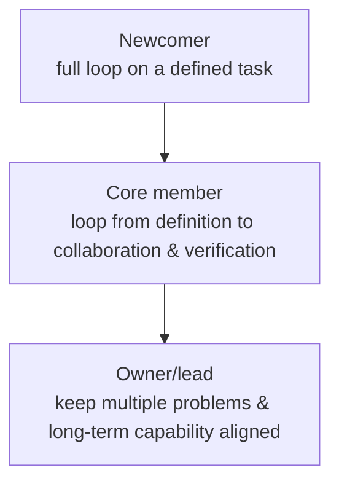

> 本文是[《管理复盘》](/writing/2026/08/management-retrospective/)中「团队与成长」这条线的展开。

团队谈成长路径时，很容易先画出一张层级图：从初级到资深，从成员到负责人，每一层列出更多技能和更大影响力。它能提供方向，却也容易造成误解：仿佛每个人都要走同一条路，或只要逐项完成清单，就完成了成长。

更有用的路径设计，不是给人贴阶段标签，而是说明**责任如何扩大、判断如何变化、支持应当如何调整**。同一个人也可能在不同领域处于不同阶段：在熟悉的系统里能够经营复杂问题，在陌生领域仍需要从基本任务开始。

下面三条路径不是任何组织的职级标准，而是设计培养机会时可用的框架：新人先建立可靠的完成能力；骨干开始经营问题与协作；负责人则让更多人能够独立承担责任。

## 新人：从完成任务，到理解问题

新人的第一目标不应只是“尽快上手”。更重要的是建立一种可靠的工作节奏：能理解任务为什么存在，能把自己负责的部分做完整，遇到未知时能够说清楚并及时求助。

这一阶段最需要的不是模糊的大目标，而是足够具体的上下文。

- 这项工作要解决什么问题，谁会受到影响？
- 什么算完成，怎样验证？
- 当前有哪些约束和已有做法？
- 哪些决定可以自己做，哪些需要尽早同步？

带领者可以把任务拆成一段段可观察的练习：先读懂并复述一个已有模块的边界，再完成一次小改动和验证；接着负责一个闭环任务，写下自己的方案和风险；最后在复盘中解释结果与预期哪里一致、哪里不同。

这里最重要的能力不是“从不提问”，而是逐渐学会提出好问题。好的问题包含已经查过什么、当前的理解是什么、卡在哪一个选择上。这样，求助会从把问题交出去，变成共同校准判断。

新人阶段常见的误区，是过早让人独自面对过大的模糊问题。短期看似给了空间，实际却可能让他只能凭运气摸索。更好的方式是先提供相对清楚的边界，再逐步移除脚手架：从明确的任务，到需要自己定义子问题的任务，再到能够根据目标调整路径的任务。

### 例子：把“跟着做”变成一个小闭环

例如，新成员接到一项看起来简单的改动：为一个表单增加校验提示。只让他照着类似页面复制，确实能很快交付，却很难知道他理解了什么。可以把任务换成一个小闭环：先请他找出这条输入从页面到服务端的路径，说明什么情况下用户会失败；再让他提出提示应该出现在哪里、如何验证没有破坏原有流程；完成后，用实际的错误输入走一遍，并写下一个他仍不确定的问题。

在这个过程中，带领者不必把每一步都讲完。若他找不到入口，可以示范怎样从日志、调用关系或已有测试开始；若他提出的提示文案不合适，可以追问它是否真的帮助用户完成任务。任务本身仍然很小，但练习的对象已经从“改一段代码”变成“理解一条用户路径，并验证自己的改动”。

## 骨干：从完成工作，到经营问题

一个人能够稳定完成任务后，下一步不是简单地接更多任务，而是开始负责一个问题的完整闭环。他需要能解释：为什么这件事重要，有哪些可选路径，各自的代价是什么，最早如何验证，出现变化时该怎样调整。

这时，能力的变化通常体现在三个方面。

### 把方案放回目标和约束中

骨干不应只给出“怎么做”，还要能说明“为什么这样做”。同一个技术方案在不同目标、时间和风险条件下，答案可能不同。一个成熟的方案应当能讲清：问题是什么、有哪些替代选择、为什么当前选择更合适、明确放弃了什么，以及结果如何被观察。

### 把风险提前，而不是最后解释

可靠不是承诺永远不出问题，而是能尽早看见不确定性。骨干要逐渐掌握这种表达：哪一项依赖尚未验证，它会影响什么结果，下一次检查点是什么；如果条件不成立，有哪些降级或替代路径。

这样，项目同步不再只是进度报告，而成为帮助团队作选择的输入。越早让风险可见，可用的选择越多。

例如，一项功能依赖外部系统提供新数据。只报告”开发得差不多了”没有意义；更有用的同步是：”页面和本地验证已完成，但新数据尚无真实样本；若本周三前不能确认格式，将先交付不依赖该字段的版本，并把相关展示延后。”这不是给自己留退路，而是把决策所需的信息及时交给团队。骨干成长的重要标志，就是能把这种不确定性翻译成选择。

### 让协作变得更清楚

问题一旦跨越个人边界，协作本身就是工作的一部分。骨干需要能确认目标、责任、输入输出、决策方式和完成标准；也需要能在出现分歧时把讨论拉回事实、影响与取舍，而非立场或情绪。

培养骨干时，适合给出的是一类“小方向”的责任：例如负责一次跨角色协作、主持一次方案比较、建立一个可复用的质量检查，或在项目结束后带领复盘。评价重点不只是结果好不好，也包括他是否让判断、风险和协作变得更清楚。

### 骨干要练习的，不是“多扛”，而是“会取舍”

设想一次体验优化，团队同时发现三处问题：首屏较慢、失败提示模糊、某些设置难以理解。资源只够在当前周期处理一项。还停在执行阶段的人，可能会分别估时后等待别人排序；开始经营问题的人，应当主动补齐判断：哪一项影响最高频的任务，是否已有数据或反馈支持，修复成本和风险分别是什么，若只做一项会放弃什么。

最终未必选择技术上最有挑战的改动。也许先改善失败提示，因为它能立即降低用户卡住的概率；也许先处理首屏，因为它影响所有人的第一步。关键不在结论本身，而在于骨干能否把结论建立在目标、事实与约束上，并在结果出来后检查自己的排序是否需要更新。

## 负责人：从经营问题，到让他人也能承担

负责人并不是“更厉害的执行者”。如果一个方向所有关键判断都必须由负责人亲自完成，它依然很脆弱。负责人的核心工作，是把目标、分工、节奏和反馈组织成一个能运行的系统，让不同的人知道自己该承担什么、何时需要协作、怎样获得支持。

这意味着三种转换。

第一，从局部最优走向整体取舍。负责人要看到有限资源放在哪里最有价值，也要明确不做什么；当外部条件变化时，能够带领团队重新校准目标，而不是把新的要求叠加在旧承诺上。

第二，从自己完成走向建立负责人。对于团队里的骨干，负责人需要提供完整的上下文和真实的决策空间，允许他们主持问题、暴露风险、作出部分取舍；同时在关键节点校准边界。授权不是把压力下放，而是让责任、权力、信息和支持保持匹配。

第三，从解决单个问题走向维护工作系统。哪些经验应留下，哪些协作接口反复造成返工，哪些风险总是太晚被发现，团队是否有人能相互备份——这些都是负责人需要持续观察和改善的对象。

负责人最容易掉进的陷阱，是把自己变成团队的最终兜底。短期内这能维持速度，长期却会让所有人等待他的判断。更健康的做法是：在真正需要承担的地方做决定，同时有意识地把可学习的判断过程留在团队里。

### 例子：一次授权应当交出什么

假设负责人希望一位骨干开始负责一个新方向。若只说“这块你来负责”，对方得到的通常是一堆任务，而不是责任。更完整的交接至少包括：这个方向服务的目标和不做的边界；当前已知的关键约束与历史背景；他可以自主决定的范围；需要何时同步的风险；有哪些人可提供信息或协作；第一个月以什么结果和过程信号来回看。

之后，负责人不必参加每次讨论，却应在少数关键节点校准。例如骨干准备承诺一个较大范围时，一起审视假设和资源；出现跨团队冲突时，帮助明确决策权而非代为谈妥；阶段结束时，讨论哪些机制应留给下一位参与者。这样，授权既不是放手不管，也不会变成换一个人执行、负责人仍然逐项决策。

## 三条路径之间，靠的是责任的交接

这三种路径并非彼此隔离。新人需要看到骨干如何比较方案、如何处理风险；骨干需要看到负责人怎样在目标和资源之间取舍；负责人则需要通过培养新人和骨干，检验自己的判断是否真正可被传递。

因此，设计路径时可以建立几个稳定的交接点：

| 阶段 | 主要责任 | 典型练习 | 支持方式 |
| --- | --- | --- | --- |
| 新人 | 把明确任务做完整，并理解其问题背景 | 小闭环任务、阅读与复述、实现和验证、短复盘 | 给清楚上下文与完成标准，在关键节点示范和答疑 |
| 骨干 | 经营一个问题，作出取舍并组织协作 | 方案比较、风险前置、跨角色推进、复盘与沉淀 | 提供挑战性责任，用问题校准判断，而非替代结论 |
| 负责人 | 让团队持续解决重要问题，并培养更多承担者 | 目标与资源取舍、授权、负责人培养、改进协作系统 | 共同校准方向和边界，保留必要的决策支持与反馈 |

表格的目的不是把人固定在格子里，而是避免用同一套方式对待所有人。新人需要更多清楚的边界，骨干需要更多判断空间，负责人需要更多系统性的反馈。把支持给错了，常常会出现两种结果：该被引导的人被放任，该被授权的人被过度控制。

实践中还可以用“责任半径”来检查机会是否匹配。一个新人负责的是明确任务的完整闭环；骨干负责的是一个问题从定义到协作和验证的闭环；负责人负责的是让多个问题、多人协作和长期能力彼此不冲突。责任半径扩大，并不要求一个人突然无所不能，而是要求他能在更大的范围内识别未知、调动支持并承担取舍。

## 用周期性回顾校准，而不是年终才总结

成长路径必须允许变化。任务的复杂度会变，个人的兴趣和节奏会变，团队的需要也会变。若只在很长的周期末才回顾，许多问题已经积累到难以调整。

更轻量的做法是定期问几个问题：

- 最近承担的责任，是否比之前多跨出了一小步？
- 哪一项判断或协作能力有了可观察的变化？
- 当前的任务是过度拉伸、刚好挑战，还是已经缺少学习？
- 接下来最值得练习的一个能力是什么，需要怎样的支持？

答案不必变成复杂的评估材料。它的作用是让当事人和支持者共同看到：成长不是等待某个称号，而是持续扩大自己能够可靠承担的范围。

回到开头那张容易让人误解的层级图：真正该问的从来不是一个人处在哪一格，而是他手上的责任能不能再往外扩一点、扩大之后有没有人接得住反馈。定期问一遍这几个问题，比等年终盘点更早发现该调整的地方——也让新人、骨干和负责人之间的差距，慢慢变成一条可以走过去的路，而不是一道跨不过去的门槛。
