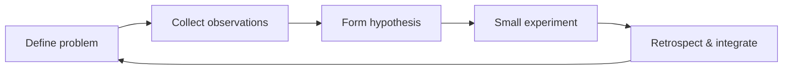

"Self-iteration" is easily turned into a demand to keep accelerating: learn faster, do more, become stronger. But if it is only about putting pressure on yourself, it usually ends up as anxiety.

I prefer to understand it as a feedback system: whether a person can see clearly what problem they are trying to solve, observe what results their actions produce, accept uncomfortable feedback, and then adjust their next choices accordingly.

It is certainly related to motivation, execution, and learning ability, but it is not the same as any one of them. The truly difficult part is: when no one gives you a clear answer and there is no immediate reward, you can still tell what you should change, what you want, and what price you are willing to pay for it.

## Iteration is not treating yourself as a project

The word "iteration" has an engineering flavor, as if a person only needs to set goals, execute, and review in order to steadily level up. But a person is not a system whose parameters can be tuned at will.

We all have boundaries shaped by personality, experience, energy, and circumstances. Some people are good at starting quickly, others at polishing over the long term; some can express themselves in public, others need more time to form a judgment. These traits should not be crudely divided into strengths and weaknesses. Many of them simply show different costs in different situations.

Therefore, the purpose of self-iteration should not be to reshape yourself into some standard answer, but to understand yourself more accurately: where I am effective, where I repeatedly lose balance; where I truly want to go, and which expectations are merely borrowed from the outside.

## A runnable feedback loop

I now break down one effective self-iteration into five steps:

1. **Define the problem**: Don't just say "I'm not good enough"; describe the specific situation. Is it insufficient information when making decisions, a lack of focus when expressing yourself, or an inability to articulate your boundaries in a conflict?
2. **Collect observations**: Look at your own feelings, verifiable facts, and feedback from others at the same time. All three matter, and all three can be incomplete.
3. **Form a hypothesis**: What do I think the cause is? What alternative explanations are there?
4. **Run a small experiment**: You don't have to change all of your behavior at once. Give yourself one small, observable action — for example, write down three conclusions before the next sync, or restate the other person's goals after a discussion.
5. **Retrospect and integrate**: What did this action change? Does it suit me, and is it worth keeping? If it had no effect, that is still a piece of feedback, not proof of failure.

The key to this loop is specificity. Vague self-blame cannot guide action; only by narrowing the problem down to something you can try once do you get a chance to gain new information.

For example, if you notice that every discussion ends with rework, don't immediately attribute it to "poor communication skills." For two consecutive weeks, keep a record: in which kinds of discussions did the rework appear, and which decisions were not clearly stated at the time; then hypothesize that the problem may not be the speed of expression but that the conclusion, the owner, and the next step were not made explicit. Before the next discussion ends, spend one minute confirming these three things; two weeks later, look again at whether rework has decreased. If there is no improvement, continue checking whether the pre-meeting information was insufficiently prepared. In this way, even if the experiment fails, what you get is a more accurate question for the next round, rather than an even heavier round of self-blame.

## Example: From "never finishing" to redefining the problem

I went through a period of being constantly pushed along by tasks. At the time, the most intuitive conclusion was: I'm not efficient enough, and I should work harder. But every time I sped up, the work still piled back up.

Only later, looking back, did I realize the problem was not just speed. Goals kept changing, tasks had no ordering among them, and some critical dependencies were not surfaced in advance; I mistook "catching every single thing" for responsibility. What I really needed to practice was: first confirm what the most important outcome of this week is, which work must be done by me, and which requires negotiating scope or waiting for conditions to mature.

Since then, at the end of each phase I ask myself: what were the three things that most affected the outcome during this period? Was it a problem of judgment, a problem of communication, or a problem of the order of investment? This question did not make me calm overnight, but it replaced "I'm not good enough" with clues I could work on.

## Example: From one skill to a career

Early on, I often equated my ability with the single technology I was best at. It brought a sense of certainty: the more I did the familiar parts, the more I could prove I was useful.

But as problems grew more complex, I began to encounter things that could not be solved by that skill alone: an experience problem might come from interface constraints; a seemingly technical dispute was actually not aligned with the user's problem; a post-launch anomaly required understanding the usage path, the data, and the way people collaborate, all at once.

This forced me to redefine my professional identity. Not to abandon the technology I was good at, but to move from "I'm responsible for this layer" toward "I'm here to help the problem get solved." What I need to learn next is no longer determined only by a list of technologies, but by what kind of responsibility I want to take on.

## Self-motivation does not mean doing it alone

In the past, I easily understood "self-iteration" as not depending on anything external: being able to judge independently, grow independently, ideally without needing anyone to keep pushing me along. That judgment was only half right.

External feedback is not the opposite of self-motivation. Mentors, peers, readers, users, and even a single outcome that falls short of expectations all give a person angles from which they cannot see themselves. For example, when a proposal is not adopted, rather than immediately proving you are right, first ask clearly: is the other party worried about the goal, the risk, the cost, or the way the proposal was presented? Only by putting their answers together with your own judgment do you know which piece to fill in next time. The problem is not accepting feedback, but treating external evaluation directly as the only source of your self-worth.

I have seen a common scene: someone comes with a big confusion and asks "what should I do next?", expecting to receive a complete route. The help one can offer is often only breaking the problem into smaller pieces together, filling in background, pointing out a blind spot, or giving an opportunity to try once. The real choosing, bearing, and reviewing can still only be done by the person themselves.

This is also a way of working I increasingly agree with: give enough context, rather than controlling the other person. Helping someone build their own judgment is more useful than making the judgment for them; but this cannot be hastily imposed on anyone.

## Which abilities make the feedback loop turn more steadily

Different people take different paths, but several abilities make this loop more reliable.

- **Distinguish the short term from the long term**: An urgent task at hand is not necessarily the most important; a big long-term goal does not mean there is no small step to take today. For example, when ad hoc requests flood in, first confirm whether they will affect this week's most important outcome; if not, agree on a time to handle them, rather than letting them swallow the planned investment. When you want to turn toward an unfamiliar direction, you don't have to make a thorough change immediately; you can first spend a weekend finishing an introductory piece or interviewing three practitioners.
- **Separate facts from interpretations**: When others disagree with me, is it a difference of fact, position, interest, or expression? Only by separating these first can the discussion continue. For example, when the other person says "this proposal won't work," the fact may simply be that the budget is insufficient; only by asking clearly about budget, risk, and preference separately will you avoid mistaking a resource constraint for a denial of your ability.
- **Be willing to reset and imitate**: When you encounter an unfamiliar problem, admit that you don't know how; first find someone or a pattern that has already done it right, then form your own version. For example, the first time you're responsible for a cross-team collaboration, first observe how a more experienced colleague sets the rhythm, records decisions, and surfaces risks, then try to copy it on a small piece of work, rather than inventing a whole process from scratch.
- **Be able to withstand friction**: Pushing forward is not the same as stubbornly holding on. It includes continuing to act under pressure, and it also includes admitting, stopping, and adjusting when you find the direction is wrong. For example, when a proposal you've already invested a lot of time in keeps failing to get support from key data, continuing to work overtime perfecting it is not necessarily responsible; pausing, explaining the uncertainty, and re-validating the hypothesis may be the harder but more effective action.

These abilities are both shaped by experience and partly trainable. We cannot choose our past, but we can practice describing problems more precisely, listening to feedback more seriously, and experimenting in smaller steps. Training cannot guarantee that a person becomes someone else, but it can make the abilities you already have more visible and more usable.

## Don't turn "potential" into a label

When evaluating a person, people love to look for a label that predicts the future: education, resume, manner of expression, one success, or one mistake. But none of these is the ability to self-iterate itself.

What is more worth observing is behavior: when faced with something he doesn't know, does he fill in the information? After receiving opposing opinions, can he update his judgment? When he encounters failure, does he push the responsibility onto the environment, or can he distinguish which parts can be redone? After gaining an opportunity, can he consolidate the experience into an ability usable next time? For example, when a project falls short of expectations, what is worth looking at is not whether he delivers a polished review, but whether he can fill in the missing user information, admit where his original judgment did not hold, and write the next checkpoint into concrete action.

Even so, one must remain humble. A person's development is affected by opportunity, resources, health, family, and luck, and no short-term observation should be a reason to pass final judgment on someone. At most, so-called "potential" is a temporary hypothesis, not a verdict.

## This is still a one-sided view

I still believe self-iteration is a very important ability; it determines whether a person, when external forces are limited, can keep knowing themselves, adjusting direction, and making opportunities their own.

But it is not the only important ability, nor should it be packaged as a moral requirement for everyone. What someone needs most right now is not faster growth, but rest, asking for help, repairing a relationship, or admitting that a certain path does not suit them.

The meaning of a feedback system is not to demand that people always climb upward, but to help people reduce aimless waste. See yourself clearly, see the environment clearly, and make the choices you are capable of and willing to bear; leave the rest to time, to others, and to luck.
