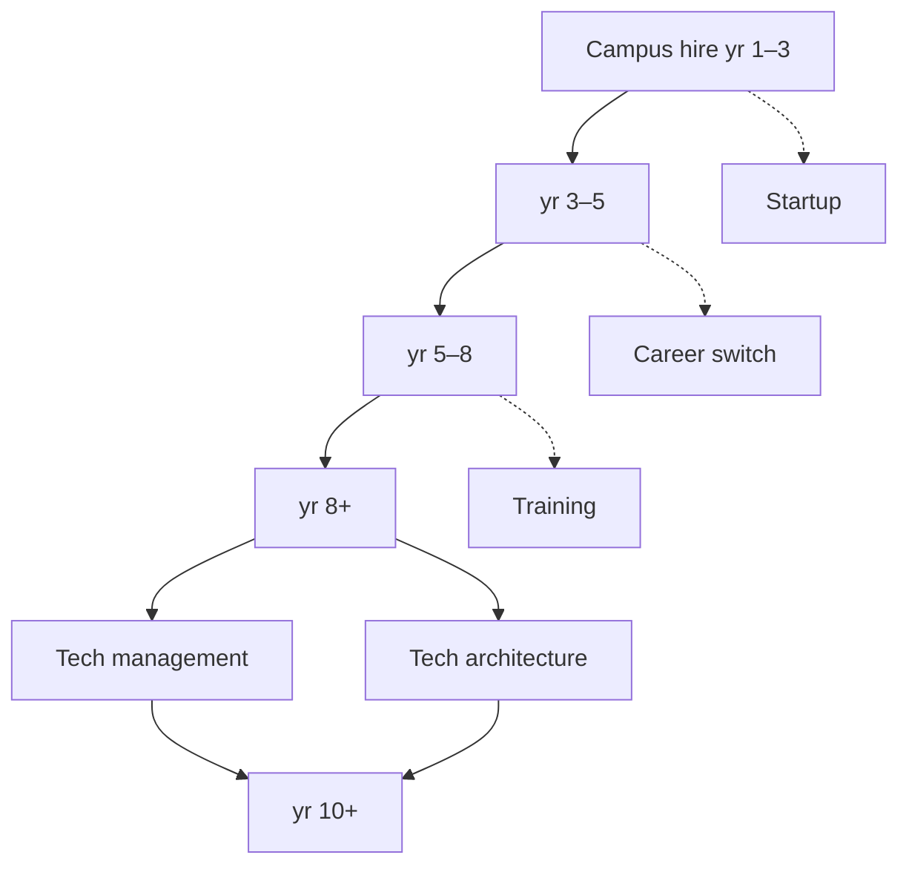

A frontend engineer's growth is not about climbing from one fixed title to the next. Some prefer making complex interactions reliable; others become long-term maintainers of design systems or engineering efficiency; still others take their technical skills into management, architecture, startups, teaching, or adjacent industries.

> **Source note:** This article originated from a draft frontend career-development roadmap I organized around 2021. The original existed as whiteboards and discussions, and the full text was never systematically saved, so what follows is a reconstruction based on the discussion directions I noted at the time combined with my observations from the past few years—it is not a verbatim transcription of the original document. The year ranges, the split of the main path, and the side branches are all frameworks I reorganized for public writing, not a promise or an industry standard.

The "development possibilities map" below has a main line that runs from execution toward systems judgment: not just shipping requirements, but gradually being able to define problems, explain trade-offs, connect collaboration, and update your judgment based on results.

## Campus hire through years 1–3: building a reliable execution loop

The most important thing at this stage is not mastering every framework as quickly as possible, but building a trustworthy baseline of delivery ability: understanding requirements and designs, breaking down tasks, writing maintainable pages and components, handling common states and compatibility issues, and taking responsibility for the results after launch.

It's worth deliberately practicing three things:

- **Go from a static mockup to the complete state.** Don't just build the happy path; also handle loading, empty, failure, permission, weak-network, and fallback paths.
- **Go from "it runs" to "it's maintainable."** Let naming, module boundaries, types, tests, and commit history help the people who come later understand your changes.
- **Go from receiving tasks to clarifying tasks.** Before you start, ask about user goals, acceptance criteria, data sources, and error behavior; surface doubts as early as possible instead of patching them at the last minute.

A good sign you've reached this stage: when someone hands you a relatively well-defined piece of work, they don't need to keep watching over the process; you can proactively surface risks, give progress and completion criteria, and deliver it completely.

## Years 3–5: from senior engineer to independent ownership

Once you have some project experience, the question is no longer just "can it be done," but "how should it be done to be most worth it." At this point you can start owning a complete user path, a medium-sized module, or a well-defined class of engineering problems.

The core change is turning an implementation plan into a conditional choice:

| What needs to be clear | Questions worth asking |
| --- | --- |
| Goal | What user outcome or engineering outcome are we trying to improve this time? |
| Constraints | What do time, compatibility, existing systems, and risk limit? |
| Trade-offs | What are we deliberately not doing, and what cost are we accepting for that? |
| Validation | What will we observe after launch to know whether the choice holds up? |

For example, when facing a complex form, there's no standard answer for whether to use an off-the-shelf tool, extend an existing component, or build a new abstraction. A one-off, low-risk flow might suit a lightweight implementation; reuse is only worth investing in when multiple scenarios need it and the rules will keep growing; and high-stakes operations should prioritize error recovery, state persistence, and accessibility.

This stage should also begin to build collaboration skills: confirming dynamic states with design rather than just handing off static mockups; aligning data contracts and failure semantics with the backend rather than just field names; and turning "I think" into a testable hypothesis in reviews. Being senior doesn't mean doing everything yourself—it means enabling the relevant people to work effectively around the same problem.

## Years 5–8: staff engineer, owning cross-module systems judgment

At this stage in frontend work, you typically encounter problems that local optimization can no longer solve: duplicated construction across multiple business lines, complex state that's hard to trace, recurring performance or stability issues, and rules between design and engineering that keep getting lost.

The value of a staff engineer often lies in seeing the relationships among these problems and driving change at the right scope. Directions you might go deep on include: design systems and experience consistency, performance and stability, client engineering, cross-platform architecture, complex business modeling, developer experience, and so on.

When judging code quality, you also need to shift from "does it look good" to "what's the future cost of collaboration": when changing a common requirement, is the blast radius predictable? Can an online failure be traced to the user action and state change that caused it? Are the key rules written into types, tests, or documentation rather than living only in someone's head?

Here you should guard against two extremes: abstracting every repetition into a one-size-fits-all solution, or pushing all historical costs onto the future. A better approach is to make the debt explicit: why we're doing a local implementation first this time, under what conditions it will break down, and when we should come back to consolidate. That way, technical judgment can both respect the current delivery and protect long-term evolution.

## Years 8+: two main branches—technical management or technical architecture

Once you've accumulated enough experience, many people choose where to put their focus between the two main paths. They can reinforce each other, and you don't have to choose one or the other once and for all.

### Technical management: helping more people keep getting things done

The core of technical management is not turning yourself into a task dispatcher, but building a system that produces steadily: whether goals are clear, responsibilities match, information flows, risks can be seen early, and members receive honest feedback and growth opportunities.

Managers still need technical judgment, but their day-to-day output shows up more in people and mechanisms. For example, turning a vague goal into a problem people can collaborate on, turning a retrospective into an actionable improvement for next time, and turning key knowledge from a few people's heads into a team capability. When measuring yourself, you can ask less "how much did I do for the team" and more "after I leave, can the team still make decisions more clearly and more safely?"

### Technical architecture: keeping systems evolvable amid change

Technical architecture isn't drawing one big diagram or mandating that everyone use the same technology. It's continuously answering: which boundaries must stay stable and which places should allow change; which capabilities are worth building as shared foundations and which should stay on the business side; and how to reduce risk through incremental migration rather than a single big rewrite.

Architects need to translate technical language into decision language: cost, risk, user impact, migration path, and stop conditions. Truly useful architecture lets the team keep delivering in the short term while keeping long-term complexity from spiraling out of control.

## Years 10+: second-line managers or senior architects, designing capability systems at a larger scope

When your scope of responsibility spans multiple teams or systems, the scarcest ability is usually no longer fluency in a particular framework, but handling conflicting goals: local efficiency versus overall consistency, short-term revenue versus long-term investment, standardization versus business autonomy, and people's growth versus critical delivery.

Second-line managers need to design organizational capability: how to build an effective bench of leaders, how to make hiring, development, collaboration, and delivery support one another, and how to avoid information only flowing upward and never returning to the field. Senior architects need to maintain the coherence of the technical direction: identifying the real shared problems, establishing clear evolution principles, and letting different teams coordinate without losing their autonomy.

Whichever path you take, the key is not having a larger span of control, but letting more decisions happen closer to the site of the problem, with enough transparent context and clear risk boundaries.

## More than one main line: startups, career switches, and training

The route above is not the only answer of "staying and leveling up." The user perspective, abstraction ability, engineering habits, and communication skills trained in frontend work can transfer to many directions.

### Independent founders: connecting technical ability to real market feedback

When founding a company, the frontend advantage is turning ideas into tangible products quickly; the challenge is not mistaking "we built it" for "someone needs it." Beyond building ability, you also need to practice discovering problems, understanding the motivation to pay or use, controlling scope, getting feedback, and making trade-offs. The safest starting point is usually not one big gamble, but a product or service small enough to validate one real need.

### Career switches: recognizing transferable abilities, not just resetting your skill list

You can move into product, design engineering, developer relations, technical writing, data products, solutions engineering, or into an industry you're more interested in. A career switch is not a repudiation of your existing experience. First write down what you've repeatedly been able to accomplish: structuring vague problems, connecting different roles, building tools, improving experiences, explaining complex systems. Then find real tasks in the target direction that can validate these abilities, and gradually fill in the knowledge and evidence for unfamiliar domains.

### Training and education: helping others build judgment, not just delivering answers

People willing to teach can organize their experience into bootcamps, courses, mentorship, or internal development programs. Good training isn't just lecturing on framework APIs; it's designing exercises, feedback, and retrospectives so that learners form their own judgment under real constraints. You should also respect boundaries: you can't compress individual differences, industry opportunities, and personal choices into one obligatory path.

## Use years as a reference, not a substitute for your own judgment

Years can hint at which more complex problems you should be exposed to, but they can't answer for you whether you're ready. Instead of asking "what step should I be at after how many years," it's worth asking regularly:

1. Is what I've recently solved a task defined by someone else, or did I take part in defining the problem?
2. Can I explain a solution's goal, constraints, trade-offs, and how it will be validated?
3. Am I leaving behind a one-off delivery, or capabilities, knowledge, or mechanisms that others can reuse?
4. Is my next step to expand my scope of responsibility, deepen my expertise, or explore a new field?

A frontend career can start with writing a good piece of UI, but its endpoint doesn't have to be confined by the word "frontend." Whether you choose management, architecture, founding, switching careers, or teaching, the common thread of sustained growth is the same: understanding problems more accurately, facing trade-offs more honestly, and more effectively enabling people and systems to produce results together.
