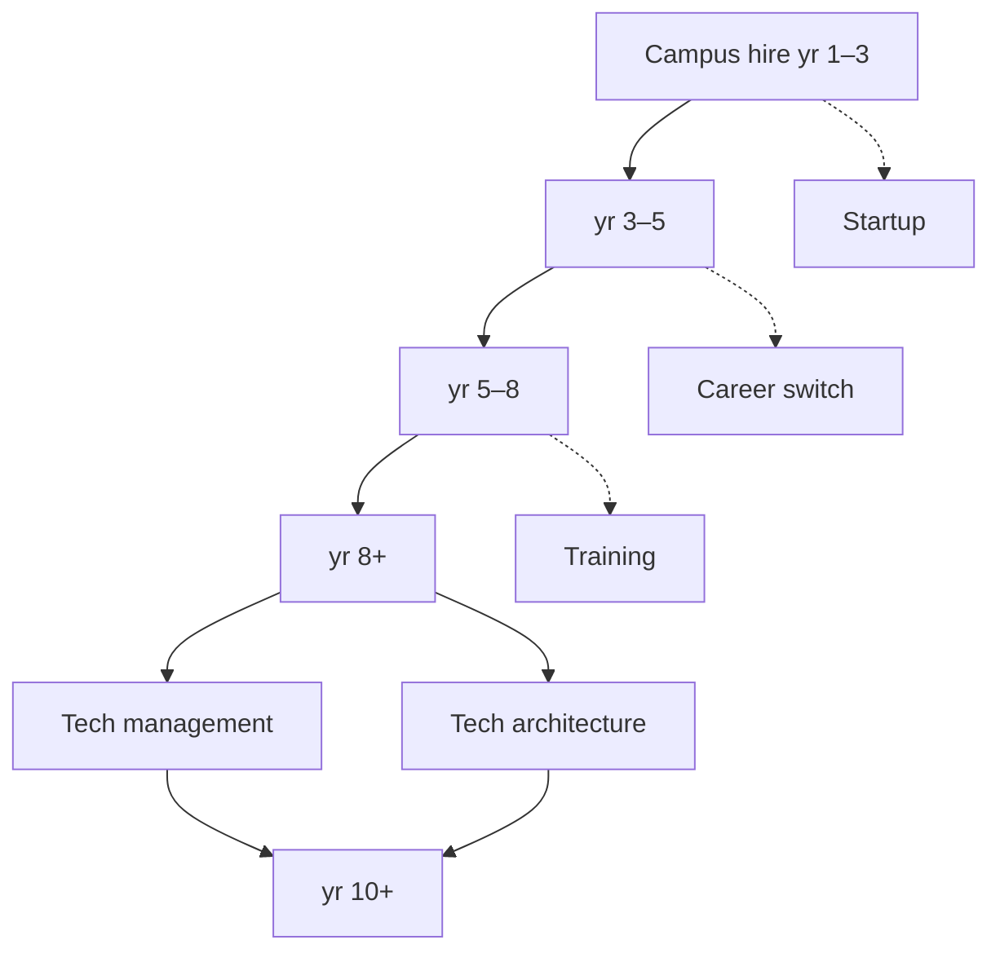

前端工程师的发展，并不是从一个固定头衔爬到另一个固定头衔。有人更喜欢把复杂交互做得可靠，有人会成为设计系统或工程效率的长期维护者；也有人会把技术带进管理、架构、创业、教学，或者转向相邻行业。

> **来源说明**：本文源自我在 2021 年前后整理的一份前端职业发展路线草稿。原文以白板和讨论的形式存在，完整正文没有被系统保存下来，因此下面的内容是我根据当时记下的讨论方向、并结合这几年的实际观察重新整理的，不是对原文档的逐字转述。年限划分、主线分叉和几条旁路都是我为公开写作重新组织的框架，不是一份承诺或行业标准。

下面这张"发展可能性地图"，主线是从执行走向系统判断：不仅把需求做出来，也逐渐能定义问题、说明取舍、连接协作，并从结果中更新判断。

## 校招至 1—3 年：建立可靠的执行闭环

这个阶段最重要的不是尽快掌握所有框架，而是建立可信赖的基本交付能力：能读懂需求和设计、拆分任务、写出可维护的页面与组件、处理常见状态和兼容性问题，并在上线后对结果负责。

建议刻意练习三件事：

- **从静态稿走到完整状态。** 不只完成正常页，也能处理加载、空态、失败、权限、弱网和回退路径。
- **从"能运行"走到"可维护"。** 让命名、模块边界、类型、测试和提交记录帮助后来的人理解改动。
- **从接收任务走到澄清任务。** 在开始前问清用户目标、验收条件、数据来源和异常行为；有疑问尽早暴露，而不是在最后一刻补救。

一个很好的阶段信号是：别人交给你一块相对明确的工作时，不需要持续盯着过程；你能主动暴露风险、给出进度和完成标准，并把它完整交付出去。

## 3—5 年：从高级工程师走向独立负责

有了一定项目经验后，问题不再只是"能不能做"，而是"怎样做才更值得"。此时可以开始负责一条完整用户路径、一个中等规模模块，或一类明确的工程问题。

核心变化是把实现方案变成带条件的选择：

| 需要说清的部分 | 可以追问的问题 |
| --- | --- |
| 目标 | 这次要改善的用户结果或工程结果是什么？ |
| 约束 | 时间、兼容性、已有系统和风险限制了什么？ |
| 取舍 | 我们主动不做什么，为此接受了什么代价？ |
| 验证 | 上线后观察什么，才能知道选择是否成立？ |

例如，面对一个复杂表单，选现成工具、扩展已有组件还是做新的抽象，没有标准答案。一次性低风险流程可能适合轻量实现；多个场景都要使用、规则会持续增长时，才值得投入复用；高损失操作则要优先考虑错误恢复、状态保存与可访问性。

这个阶段也应开始培养协作能力：和设计确认动态状态而不只交接静态稿；和后端对齐数据契约和失败语义而不只对字段；在评审中把"我觉得"变成可验证的假设。高级不等于一个人包办一切，而是能让相关的人围绕同一问题有效工作。

## 5—8 年：资深工程师，承担跨模块的系统判断

前端到这个阶段，通常会遇到不再能靠局部优化解决的问题：多条业务线重复建设、复杂状态难以追踪、性能或稳定性持续反复、设计和研发之间的规则不断丢失。

资深工程师的价值，常常在于看见这些问题之间的关系，并以合适的范围推动改变。可以选择深耕的方向包括：设计系统与体验一致性、性能与稳定性、客户端工程化、跨端架构、复杂业务建模、开发者体验等。

判断代码质量时，也需要从"好不好看"转向"未来协作成本"：修改常见需求时影响范围是否可预估？线上失败能否定位到用户动作和状态变化？关键规则是否写进类型、测试或文档，而不是只存在某个人脑中？

这里要警惕两个极端：把每个重复都抽象成万能方案，或把所有历史成本都留给未来。较好的做法是明确债务：这次为什么先做局部实现，它在哪些条件下会失效，何时应该回头整合。这样，技术判断才能既尊重当下交付，也保护长期演进。

## 8 年以上：技术管理或技术架构，两种主要分叉

经验积累到一定程度，很多人会在两条主路径之间选择重心；它们可以互相借力，也不必一次性、永久地二选一。

### 技术管理：让更多人能持续做成事

技术管理的核心不是把自己变成任务分发器，而是建设一个能稳定产出的系统：目标是否清楚、职责是否匹配、信息是否流动、风险是否能提早被看见、成员能否得到真实反馈和成长机会。

管理者依然需要技术判断，但日常产出会更多体现在人和机制上。例如把模糊目标转成可协作的问题，把复盘变成下一次可执行的改进，把关键知识从少数人脑中沉淀为团队能力。衡量自己时，可以少问"我替团队做了多少"，多问"离开我之后，团队是否仍能更清楚、更安全地做决策"。

### 技术架构：让系统在变化中仍然可演进

技术架构不是画一张大图或规定所有人用同一种技术。它是持续回答：哪些边界必须稳定，哪些地方应该允许变化；哪些能力值得做成公共基础，哪些应该留在业务侧；如何用渐进迁移而不是一次大重写降低风险。

架构师需要把技术语言翻译成决策语言：成本、风险、用户影响、迁移路径和停止条件。真正有用的架构，既能让团队在短期内继续交付，也能让长期复杂度不失控。

## 10 年以上：二线管理者或资深架构师，设计更大范围的能力系统

当责任范围跨越多个团队或多个系统，最稀缺的能力通常不再是对某个框架的熟练度，而是处理相互冲突的目标：局部效率与整体一致性、短期收入与长期投入、标准化与业务自主、人员成长与关键交付。

二线管理者要设计组织能力：怎样形成有效的负责人梯队，怎样让招聘、培养、协作和交付彼此支撑，怎样避免信息只向上汇总却无法回到现场。资深架构师则要维护技术方向的连贯性：识别真正的共性问题，建立清晰的演进原则，并让不同团队在不失去自主性的前提下协同。

不论是哪条路，关键都不是拥有更大的控制范围，而是让更多决策在更接近问题现场的地方发生，同时有足够透明的上下文和风险边界。

## 不止一条主线：创业、转行与培训

上述路线不是"留下来继续升级"的唯一答案。前端训练出的用户视角、抽象能力、工程习惯和沟通能力，可以迁移到许多方向。

### 独立创业者：把技术能力接到真实的市场反馈

创业时，前端优势在于能快速把想法变成可体验的产品；挑战则是不能把"做出来"误认为"有人需要"。除了构建能力，还要练习发现问题、理解付费或使用动机、控制范围、获得反馈和做取舍。最稳妥的起点往往不是一次豪赌，而是用一个足够小的产品或服务验证一条真实需求。

### 转行：识别可迁移能力，而不只重置技能清单

可以转向产品、设计工程、开发者关系、技术写作、数据产品、解决方案工程，或进入一个更有兴趣的行业。转行不是否定已有经验。先写清自己已经反复做成过什么：把模糊问题结构化、连接不同角色、搭建工具、改善体验、解释复杂系统。再找目标方向中能够验证这些能力的真实任务，逐步补齐陌生领域的知识和证据。

### 培训与教育：帮助别人建立判断，而不只是传递答案

愿意教学的人，可以把经验整理成训练营、课程、导师支持或内部培养机制。好的培训不只是讲框架 API，而是设计练习、反馈和复盘，让学习者在真实约束中形成自己的判断。也要尊重边界：不能把个体差异、行业机会和个人选择压缩成一条必经路线。

## 用年限作参考，不让年限替你判断

年限能提示你该接触哪些更复杂的问题，却不能替你回答"是否已经准备好"。比起问"几年应该到哪一步"，不妨定期问：

1. 我最近解决的是别人定义好的任务，还是我也参与了问题定义？
2. 我能否解释一个方案的目标、约束、取舍和验证方式？
3. 我留下的是一次性交付，还是他人也能复用的能力、知识或机制？
4. 我的下一步是想扩大责任范围、加深专业深度，还是探索新的场域？

前端职业发展的起点可以是写好一段界面，终点却不必由"前端"二字限制。无论选择管理、架构、创业、转行还是教学，持续增长的共同部分都是：更准确地理解问题，更诚实地面对取舍，更有效地让人和系统一起产生结果。
