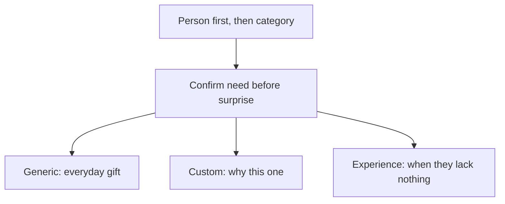

## Before We Start

Taking stock of the gifts I've given over the years, I send out dozens in a single year. After giving so many, I gradually realized: gifting isn't about "buying whatever looks expensive" — it's about first figuring out what the other person likes, what they've been lacking lately, and what occasion the gift is meant for.

This piece doesn't recommend any particular product; it's an operating guide forged from my own mistakes. First, keep three principles in mind:

- **Look at the person first, then the category.** Their zodiac sign, birth animal, favorite colors, pets, works, cities, sports, occupation, and daily habits are all clues.
- **Confirm the need first, then create surprise.** For things with strong personal preference — clothes, makeup, perfume, electronics — it's best to ask first; don't treat "guessing wrong" as a test of rapport.
- **Gifts fall into three categories.** The generic category solves what to give for everyday occasions; the custom category solves how to make a gift memorable; the experience category solves "the person actually lacks nothing."

Set the budget ahead of time. A gift is an expression, not a way to pressure each other; whether a few hundred yuan, a few thousand yuan, or even a handwritten card, it can be given well.

## Generic Gifts

The hard part of generic gifts isn't the category itself but whether that category lands on preferences the person already has. The rule of thumb is simple: **if you'd have to guess their skin type, shade, taste, or physical condition, ask first — don't gamble.** Below are the directions I've given that have basically never missed.

- **Flowers and scents**: roses, sunflowers, mixed bouquets, or aromatherapy and perfume. Fragrance is highly preference-driven; choosing from what the person already uses is safer than buying something that "looks premium."
- **Skincare and makeup**: lipstick is relatively easy to give, but you need to know their color family; foundation, eyeshadow, and contour depend on skin type and shade, so don't buy blind if you're not familiar. Rather than giving cosmetics, offer to do their makeup for them — far more reliable than guessing a shade.
- **Food and drink**: for snacks, ask about taste and dietary restrictions first; a few things they clearly like beat a sprawling gift pack. For chocolate, mind the origin and flavor; for tea, give the good stuff; for red wine and sparkling wine, check whether they drink and rely on your own taste in wine.
- **Health and relaxation**: neck-and-shoulder and lower-back massagers are practical; a foot-soaking tub depends on how into wellness they are; vitamins and fish oil are personal health choices, so don't give them casually unless the person clearly already uses them.
- **Jewelry and accessories**: for necklaces, earrings, and bracelets, first check whether they usually wear gold or silver and whether they prefer minimal or bold; pearls go with everything; rings carry strong sizing and meaning, so don't give one unless the relationship and occasion are clear.
- **Plushies and cultural goods**: start from the works, pets, and zodiac signs they already like; popular new Jellycat-style items are basically a safe bet; for museum and scenic-spot merchandise, picking some up while traveling on business is more natural than deliberately hunting for souvenirs.
- **Home and everyday items**: for mugs and tea sets, pick a single piece that suits the person; for fridge magnets, choose ones tied to them (a place, a pet, a photo); a jewelry organizer is genuinely useful.
- **Gadgets and hobbies**: earbuds, keyboards, instant cameras, and e-readers should only go to someone with clear usage habits, or let them pick the model themselves. Camera lenses involve deep expertise — from wide-angle to telephoto it's all a minefield, so don't decide for them.
- **Clothing and accessories**: scarves and hats are relatively low-risk; bags, wallets, sunglasses, and clothes are too personal — best bought together while shopping.

## Custom Gifts

The generic category answers "what to give"; custom gifts answer "why this one." Custom doesn't have to be expensive — the point is whether there are clues between you that can be built into it.

- **Handwriting and records**: send postcards casually when you're away from home, and keep up handwritten notes for years; handwritten letters work for all kinds of occasions; arranging train and movie ticket stubs onto a page — authenticity is enough.
- **Birthday-related**: a birthday newspaper, a customized moon for their birthday (single and double versions both exist), and a birthday cake — for the cake, flavor and sugar matter more than the decoration.
- **Photos and shared experiences**: photo albums, custom puzzles, a photo wall, or turning a special photo into an oil painting; picking a few meaningful ones looks better than cramming in everything at once. Night lights, film rolls, and figurines made from photos suit people who like a lighthearted style.
- **Geography and travel**: puzzles of the cities where you two studied or lived; airline and admission ticket stubs saved from trips taken together; a self-made travel map marking the places you've been and want to go.
- **Design and pets**: for custom necklaces and rings, first collect the elements, materials, and daily outfits the person likes before designing; pet portraits and pet plushies only mean something if the person enjoys displaying them.
- **Songwriting and custom websites**: use AI to compose the melody and polish the lyrics yourself; use vibe coding to build a small web page that belongs only to the two of you. Sincerity matters more than technical polish.

What custom gifts share in common: **they carry information only the two of you understand.** Without that, customization just degrades into another product.

## Experience Gifts

When the person lacks nothing, an experience is often better than an object. What you're giving isn't a "possession" but a stretch of time to share.

- Movies, musicals, plays, and opera; exhibitions, museums, and aquariums; baths, massages, and hot springs; skiing, courses, and workshops.
- A thoughtfully arranged meal, or a short trip — don't overpack the itinerary; leave room for the other person to say "no."
- First check whether they enjoy this kind of thing and whether the timing works; don't package your own hobbies as a gift.

## In Closing

There are actually many ways to give gifts; what matters most is figuring out their likes, tastes, and preferences — what they've been lacking lately or have mentioned — and confirming that they really want it, so that it adds to something already good.

Giving gifts isn't about seeking something in return but about expressing affection. So keep the scope, your expectations, and the money budget in check; being able to talk openly about "what they liked, what they didn't, and how they'd like to be celebrated next time" is more useful than memorizing a perfect list.
