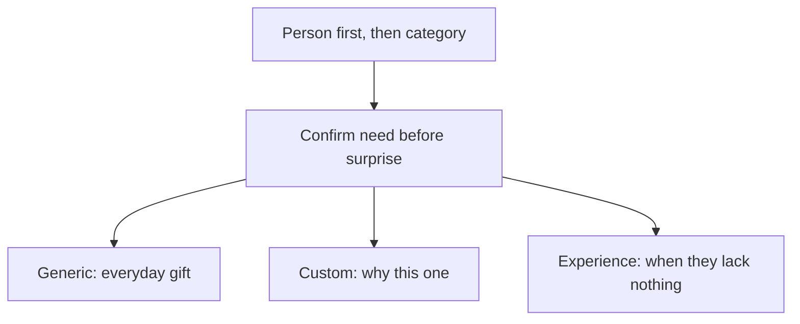

## 写在开始

盘点一下这些年送过的礼物，一年能送出去几十件。送多了慢慢发现：送礼不是"看见什么贵就买什么"，而是先搞清楚对方喜欢什么、最近缺什么、这份礼物准备在什么场景送。

这篇不是推荐某个商品，而是一个自己踩坑踩出来的操作指南。先记住三个原则：

- **先看人，再看品类。** 星座、生肖、喜欢的颜色、宠物、作品、城市、运动、职业和生活习惯，都是线索。
- **先确认需求，再制造惊喜。** 衣服、彩妆、香水、数码这类个人偏好强的东西，最好先问；不要把"猜错"当作默契测试。
- **礼物分三类。** 通用类解决日常送什么；定制类解决怎样送得有记忆；体验类解决"对方其实不缺东西"。

预算提前定好。礼物是表达，不是给彼此制造压力；几百元、几千元，甚至一张手写卡片，都可以送得很好。

## 通用类

通用礼物的难点不是品类，而是"这个品类是否踩在对方已有的偏好上"。判断标准很简单：**需要替对方猜肤质、色号、口味或身体状况的，就先问，不要赌。** 下面是我送过、且基本不踩雷的方向。

- **鲜花与气味**：玫瑰、向日葵、组合花束，或香薰、香水。味道很看偏好，从对方已经在用的方向选，比买一个"看起来高级"的更稳妥。
- **护肤与彩妆**：口红相对好送，但要知色系；粉底、眼影、修容依赖肤质和色号，不熟不建议盲买。与其送化妆品，不如帮对方画一个妆——比猜色号可靠得多。
- **食物与饮品**：零食先问口味和忌口，几样明确喜欢的比大而全的礼包好；巧克力看产地口味；茶叶送贵的；红酒起泡酒看对方是否喝、以及你自己的选酒品味。
- **健康与放松**：肩颈、腰部按摩仪实用；泡脚桶看养生程度；维生素、鱼油这类是个人健康选择，除非对方明确在用，否则不随便送。
- **首饰与配饰**：项链、耳饰、手链先看平时戴金还是银、偏好简洁还是夸张；珍珠百搭；戒指尺寸和含义很强，关系和场合不明确就不送。
- **玩偶与文创**：从对方已经喜欢的作品、宠物、星座切入；Jellycat 之类的新款热门款基本稳妥；博物馆和景区的文创周边，出差时顺路买，比刻意找纪念品更自然。
- **家用与日常**：杯子、茶具选一件顺手的单品；冰箱贴选和对方相关的（地点、宠物、照片）；首饰收纳盒是真的实用。
- **数码与兴趣**：耳机、键盘、拍立得、阅读器，只送给已有明确使用习惯的人，或让对方自己选型号。相机镜头学问多，从广角到长焦都是坑，别替人做主。
- **穿搭**：围巾、帽子相对低风险；包、钱包、墨镜、衣服太私人，最适合一起逛了买。

## 定制款

通用类回答"送什么"，定制款回答"为什么是这一份"。定制不一定贵，重点是你们之间有没有可被放进去的线索。

- **手写与记录**：明信片出门在外随手寄，手写记录可以坚持很多年；手写信各种日子都可以写；车票、电影票根整理成一页，真实就够了。
- **生日相关**：生日报、生日定制的月亮（单人、双人的都有）、生日蛋糕——蛋糕口味和糖分比造型重要。
- **照片与共同经历**：相册、定制拼图、照片墙、把特殊照片画成油画；挑少量有意义的比一次塞满好看。相片做成的夜灯、胶卷、小人，适合喜欢轻松风格的人。
- **地理与旅行**：两个人读书、生活过的城市的拼图；一起旅行留下的机票、门票存根；自制旅行地图，标记一起去过和想去的地方。
- **设计与宠物**：定做项链、戒指，先收集对方喜欢的元素、材质和日常穿搭再设计；宠物肖像、宠物玩偶，只在对方乐于展示时才有意义。
- **写歌与自定义网站**：用 AI 写曲、自己调歌词；用 vibe coding 做一个只属于两个人的小网页。真诚比技术效果重要。

定制款的共同点是：**它携带只有你们俩懂的信息。** 没有这条信息，定制就退化成另一件商品。

## 体验类

对方不缺东西时，体验往往比物品更好。送的不是一个"拥有"，而是一段可共同使用的时间。

- 电影、音乐剧、话剧、歌剧；展览、博物馆、水族馆；泡澡、按摩、温泉；滑雪、课程、工作坊。
- 一次认真安排的饭，或一次短途旅行，行程不要太满，留出对方说"不"的空间。
- 先看对方是否喜欢这类内容、时间是否好安排；不要把自己的爱好包装成礼物。

## 写在最后

送礼的方式其实很多，最重要的是搞清楚喜好、口味、偏好，最近缺什么、或者聊到过什么，以及确认对方是真的想要，才能锦上添花。

送礼物不是为了寻求回报，而是为了表达情感。所以控制好范围、心理预期和金钱预算；能聊开"喜欢哪一点、不喜欢什么、下次想怎样被庆祝"，比记住一份完美清单更有用。
