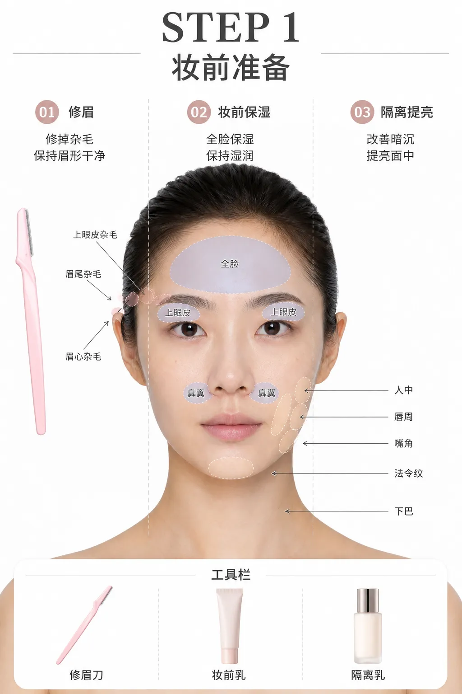
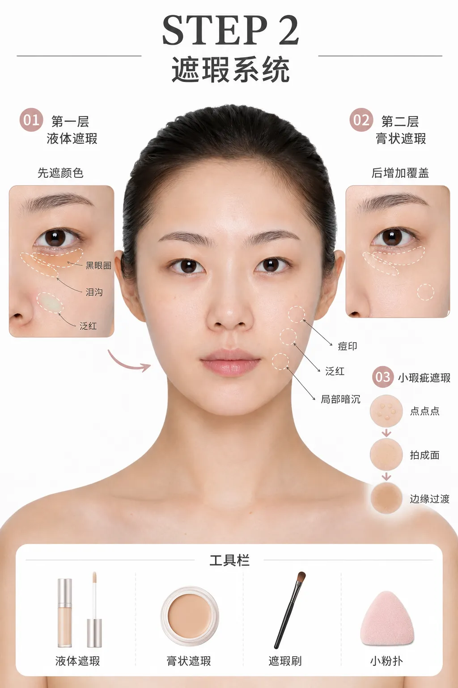
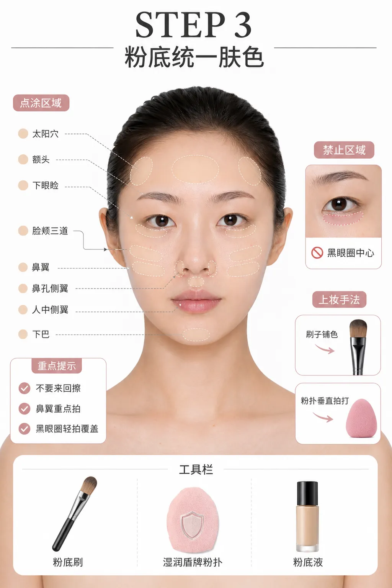
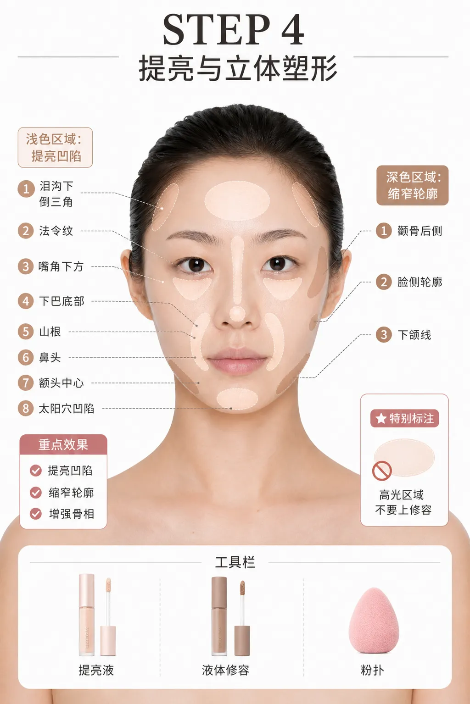
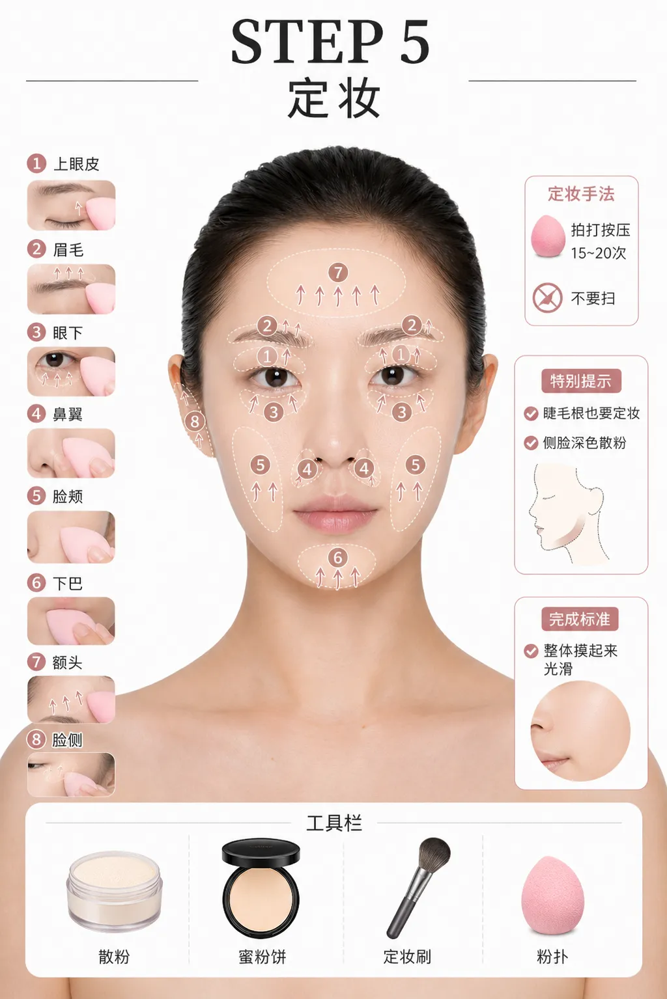
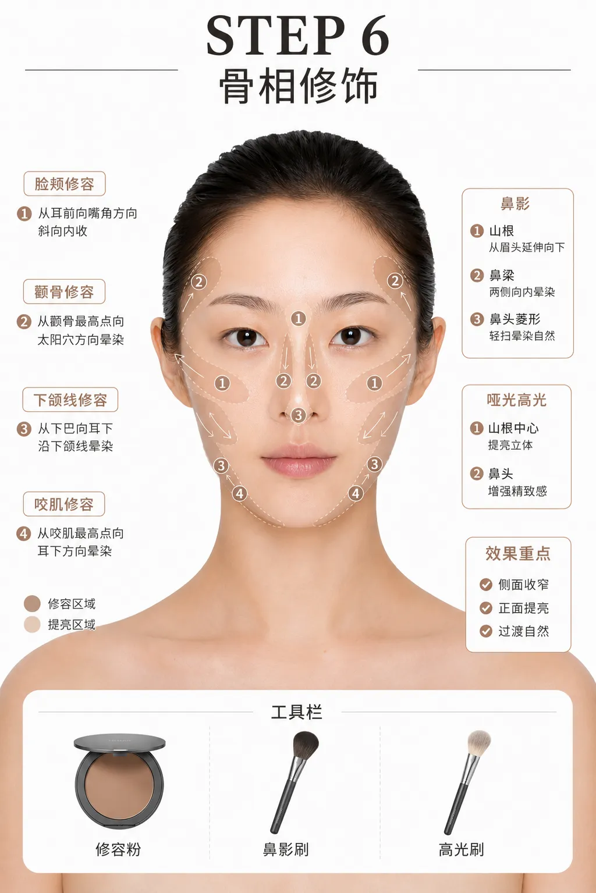
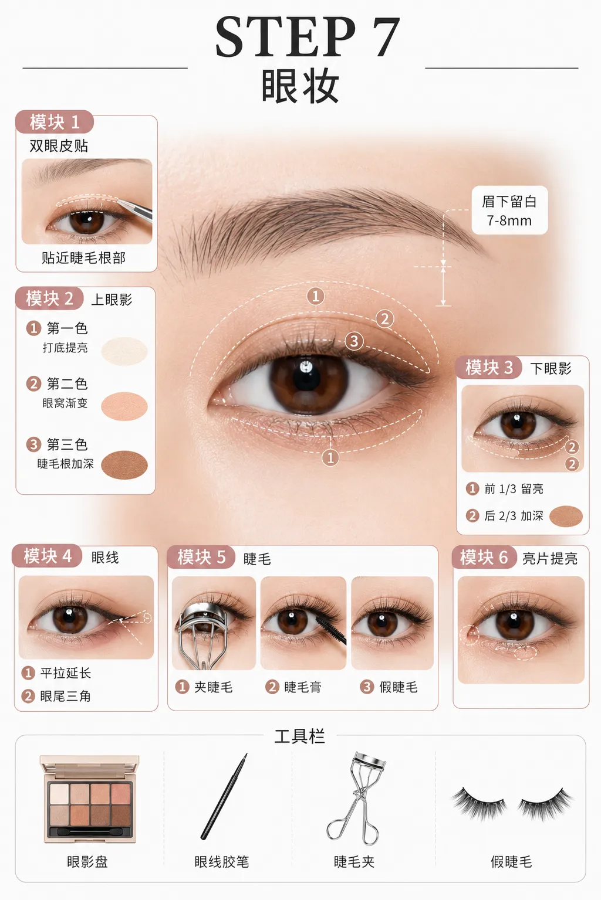
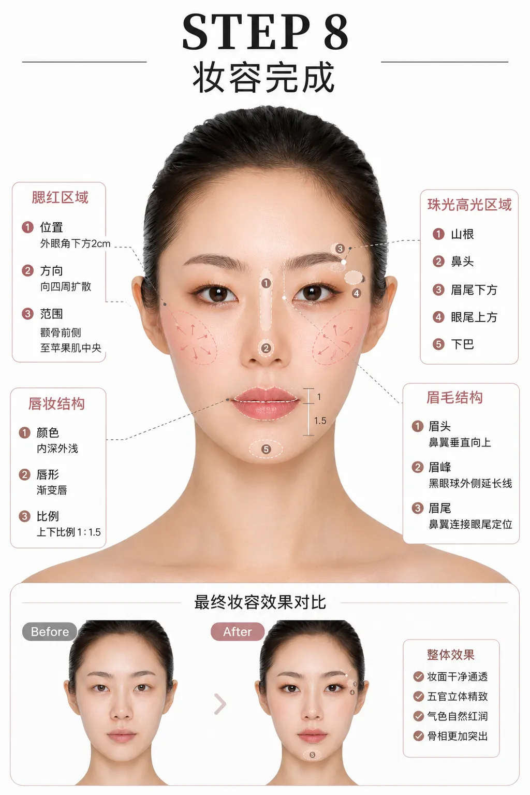

## How to Read This

This is a personal process note written after studying, leaning toward a natural makeup look and a long-wear approach for normal-to-dry skin, with emphasis on bone-structure definition. Different skin conditions, facial features, and products will all affect the result; treat it as a starting point for practice, not as the only standard.

The illustrations in this article are AI-generated reference images, used only to show makeup areas and order, and they do not constitute any assessment of skin tone, skin type, or appearance. If a product causes persistent discomfort, stop using it; for skin-related issues, please consult an appropriate medical professional.

## Makeup Process

### Pre-Spell Wind-Up

First wash your face and pat it dry, leaving just a little natural moisture. If you use sunscreen daily, apply it according to the product instructions before makeup and wait for it to form a film.

## STEP 1: Skin Prep

### Brow Grooming

Remove stray hairs on the upper eyelid, at the tail of the brow, and between the brows; brow-tail hairs that are too long can be trimmed short. Keep the brow shape clean and natural.

### Makeup Primer / Moisturizer

Spread over the whole face with your hands, also reaching the upper eyelids and the sides of the nose. Don't rub back and forth; if it has dried or been wiped off, add another thin layer.

### Color-Correcting Base / Brightening Around the Lips to Conceal Dullness

Use a pink, white, or purple color-correcting product, applying a small amount around the lips, the corners of the mouth, the chin, the philtrum, and the nasolabial fold area to neutralize localized dullness.

## STEP 2: Concealer System

### Covering Major Blemishes / Dark Circles

First use a liquid concealer on the darkest line of the dark circles, then layer a cream concealer on top. The key is "dot, pat, blend": the goal is to neutralize dullness, not to brighten the under-eye area too much.

## STEP 3: Foundation to Even Out the Skin Tone

### Foundation

Apply with a flat brush, then blend with a dampened, squeezed-out puff using vertical patting motions. Avoid the dark-circle area with its key concealer; work the cheeks, sides of the nose, philtrum, temples, lower eyelids, and forehead in sections. The sides of the nose can be gently rubbed first and then patted out; use only a small amount of foundation above the under-eye concealer.

### Setting Spray

Hold it about 30 cm from the face and spray evenly according to the product instructions. You can dry it with a fan for about 10 seconds to form a film, or wait 30–60 seconds naturally before moving on to the next step.

### Covering Minor Blemishes

Use a small puff to pat the concealer into a soft "plane," treating the dark tear-trough line, redness, and minor blemishes. Use little product under the eyes to avoid settling into fine lines.

## STEP 4: Highlighting and Sculpting

### Highlighting

Apply a small amount of highlight to the inverted triangle below the tear trough, the nasolabial folds, the lower corners of the mouth, the bottom of the chin, the bridge of the nose, the tip of the nose, the center of the forehead, the temples, and any recessed areas of the face. Dot it on with your fingers, then pat it out vertically with a small puff.

### Fine Concealing of the Tear Trough

Use a detail concealer brush on the darkest groove of the tear trough, then gently blend the upper and lower edges so the color and light reflection flow more smoothly.

### Liquid Contour

Dot a small amount slightly behind the cheekbones and lightly sweep a little along the jawline, then blend it out with a puff pressed against the skin. Don't layer contour over highlighted areas.

## STEP 5: Setting the Makeup

### Setting with Loose Powder

Set the brow tails, chin, and T-zone first, then the upper eyelids, brows, under-eye area, sides of the nose, cheeks, chin, and forehead. Press instead of sweeping; pat each area about 15–20 times, and about 10–15 times under the eyes. For the sides of the face you can use a slightly deeper powder, pressing about 20–30 times with a large brush.

## STEP 6: Contour and Nose Shadow

### Powder Cheek Contour

Use a round stippling brush to sweep across the cheekbones from back to front, then lightly carry it over the jawbone and masseter muscles. The standard is for the profile to be slightly deeper while the front stays clean, with no obvious edges.

### Nose Shadow Contour

Push forward from the side of the nose bridge, then blend downward along the edges of the bridge; connect the bridge up to just below the inner brows. The tip of the nose can be shaped with a soft diamond, but there's no need to chase perfect symmetry or distinct lines.

### Matte Highlight

Dot a small amount on the center of the nose bridge and the tip of the nose, then lightly tap 1–2 times with a round brush or your finger.

## STEP 7: Full Eye Makeup

### Applying Eyelid Tape

Hold the eyelid tape with tweezers and place it along the double-eyelid crease, as close to the lash line as possible. If the two eyes are uneven, adjust the tape's position slightly to balance the effect once the eyes are open.

### Upper Eyeshadow

Do an overall semicircular gradient with the eyeshadow, leaving about 7–8 mm between the upper lid and the brow. Use the first shade as a brightening base, deepen layer by layer with the second and third shades, and place the darkest shade close to the lash line; finally add a little glitter as needed.

### Lower Eyeshadow

Use the first shade or a matte highlight as a base, then sweep the second shade from the outer corner forward to below the pupil, covering about the back 2/3 of the lower lid; leave the front 1/3 for highlight or glitter, and draw a narrow little arc at the inner corner.

### Eyeliner and Lashes

Draw a small triangle at the outer corner with eyeliner or the darkest eyeshadow, keeping the tail level and not drooping; a gel liner can be pressed right along the lash line to fill it in. Curl the lashes, brush them apart in order, and finally apply false lashes if needed.

## STEP 8: Finishing Touches

### Blush

Apply blush after the eye makeup. Place the center point about 2 cm below the outer eyeliner, between the cheekbone and the highlight, keeping the area no lower than the base of the nose; pat it out in place first, then blend outward.

### Shimmery Highlight

Sweep down from about 2 cm below the outer corner of the eye, curving into a vertical arc toward the sides of the nose near the base of the nose; then dot a small amount on the nose bridge, the tip of the nose, the bottom of the chin, below the brow tails, and above the tail of the eyelid.

### Brows

For the brow tail, follow the "nose-wing-to-outer-eye extension line," filling in along your natural hair growth and keeping the overall shape gentle and natural.

### Lipstick

Aim for a visual ratio of about 1:1.5 between the upper and lower lips, with a deeper color on the inside and a lighter one on the outside to create a gradient. Keep the lip color, blush, and eyeshadow in a similar tone for a more cohesive overall look.

## Makeup Removal

Once you're done wearing makeup, thoroughly remove the makeup and sunscreen according to the product instructions, then cleanse and moisturize in a way that suits you. Any step that makes your skin uncomfortable, visibly builds up, or can't be explained can be removed or adjusted.
