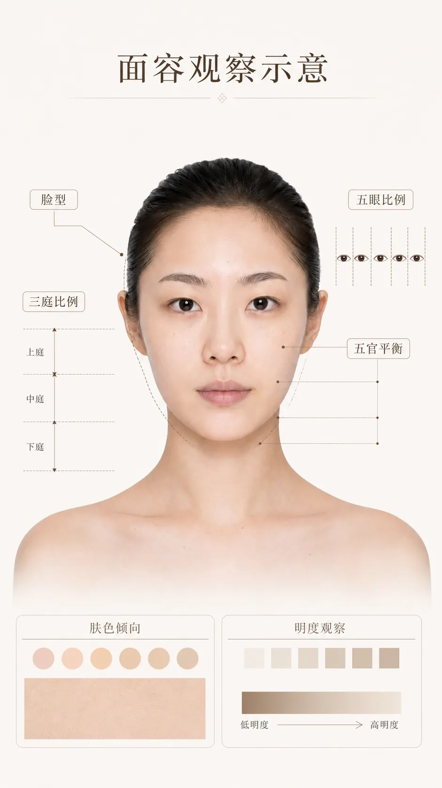
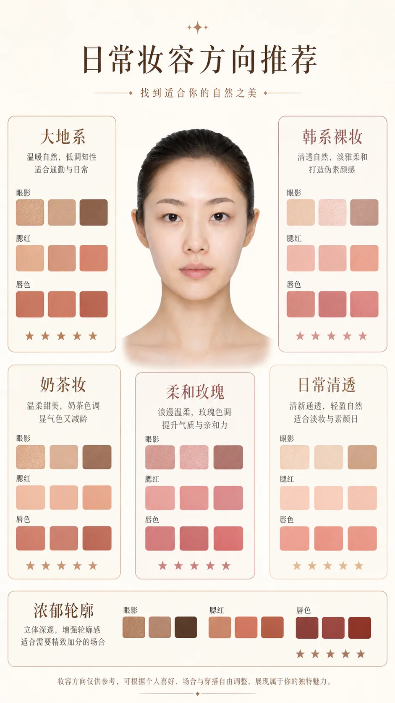
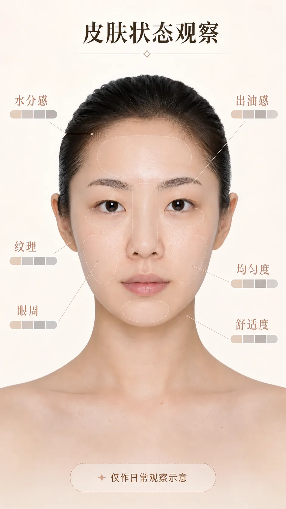

## First, define what "suits you" means

Makeup choices are easily pulled along by shade numbers, trending looks, and other people's swatches, but what really determines the outcome is usually three plainer questions: does it harmonize with my skin tone, does it feel comfortable on my skin, and does it fit today's occasion.

This is a framework of observation and trial I've organized from personal learning; it is not medical or skin diagnosis and does not represent a professional makeup artist's opinion. Skin tone, skin type, and aesthetics have no better or worse; the categories below only help narrow your choices, not label people.

> Image note: the illustrations in this article are AI-generated diagrams (no photos of real people are used), meant to illustrate the thinking behind observing and testing colors; they do not judge any specific skin tone or product. This article contains no brand recommendations or paid endorsements.

## In natural light, first observe three dimensions

Don't rush to ask, "Am I cool-toned or warm-toned?" In natural light near a window, with no heavy filter or obvious color reflection on your face, first observe the three dimensions below. They are more useful than a single conclusion.

### 1. Lightness: lighter, deeper, or somewhere in between?

Lightness refers to the overall sense of light and dark, not "how fair you are." When testing foundation, the most important thing is whether it blends naturally into the jawline and neck; an overly light base may look brightening, but it can also disconnect the face from the body. Blush, contour, and lip color are also affected by lightness: when the skin tone is lower in lightness, overly light colors tend to look ashy; when the skin tone is higher in lightness, overly deep or heavy colors can look jarring.

### 2. Warm-cool tendency: more pink, more yellow, or close to neutral?

Warm and cool are relative tendencies, not an identity you must choose between. Observe the overall feel of your neck, jawline, and cheeks: some people lean toward pink, rose, or bluish undertones, some lean golden, yellow, or olive, and some appear close to neutral under different lighting.

You can treat the color of your wrist veins or jewelry preferences as clues, but don't treat them as a verdict. More reliable is actual color testing: whether a color makes the skin look even and lively, rather than making one spot look "fairer."

### 3. Saturation and contrast: how strong a color can you carry?

Some faces look calmer in low-saturation, more muted colors, while others need brighter, cleaner colors to avoid looking washed out. You can also observe the contrast among your hair, brows, and skin tone: people with naturally strong contrast can carry clearer edges in their brows and lip color; people with soft contrast usually harmonize better with soft-focus, gradient, and low-contrast color schemes.

This is not a restriction. You can certainly wear a high-saturation lipstick or bold eyeshadow; it only explains why the same color looks "just right" on some people, while others need to adjust the amount, the edges, or the pairing.

> Caption: under the same natural light and the same camera settings, abstract color swatches illustrate foundation lightness, warm-cool direction, and low/high-saturation blush.

## Choose texture by how your skin feels first, then choose color

"Skin type" is not a permanent ID card either. Some people get oily in summer and dry in patches in winter; some people's foreheads and the sides of their noses differ from their cheeks. So product choice should start with how your skin feels that day and how long the result needs to last.

| Observation that day | What to prioritize when choosing | The more important action when applying |
| --- | --- | --- |
| Dry, flaky in patches | Thin, spreadable products with a glow or natural finish | Apply a small amount by section and press to blend; avoid repeatedly layering powders |
| Prone to oiliness, needs long wear | Wear performance, lightness, whether it can be set locally | Lay down a thin layer first, then set lightly only where it gets oily |
| Obvious texture or expression lines | A thin texture that doesn't cake easily | Narrow the concealer range, avoid piling it onto texture |
| Unstable condition or discomfort | Ingredients, usage instructions, and personal tolerance | Pause trying irritating new products; stop using if discomfort occurs |

Product claims are only a reference. When testing, rather than immediately judging "does it cover," it's more worth seeing how it performs after some time: whether it oxidizes and changes color, whether it settles into the sides of the nose or under-eye lines, whether it still feels comfortable, and whether it clashes with your sunscreen or skincare.

## Separate the job of each product category

When one product is asked to moisturize, conceal, brighten, contour, and set at the same time, it tends to get layered on thicker and thicker. Separate the tasks and choosing becomes much simpler.

### Base makeup: match the jawline, don't chase instant brightening

When testing foundation, apply a thin layer of two or three close shades between the jawline and the neck, rather than only testing on the back of your hand. Wait a few minutes, then look at the boundary, color change, and skin texture in natural light. The shade closest to your skin tone may not look the brightest at first glance, but it is more likely to become an everyday choice.

If you need to brighten, do it with a small amount of a local product rather than choosing a lighter all-over foundation. As for tone, pink, yellow, or neutral should all be judged by how well they blend with the neck, not by the name on the packaging.

### Concealer: address color first, then coverage

Under-eye dullness, redness, and acne marks differ in color, so they need different concealer approaches. When choosing, first see whether it can neutralize the obvious color difference, then look at coverage; many spots only need a thin layer. A concealer that is too bright may make the under-eye area stand out more, while one that is too thick tends to crease with expression.

### Blush, eyeshadow, and lip color: let warm and cool echo each other

You don't need the three to be exactly the same color, but you can keep them in a similar color direction. For example, a group leaning rose, berry, and mauve often brings a softer cool feel; a group leaning apricot, peach, and brown-orange often brings a warmer feel. Neutral skin tones can try both sides and then see which one makes you look more lively.

When a color is too strong, first reduce the amount, diffuse the edges, or switch to a thinner texture, rather than immediately deciding "this color family doesn't suit me." Lip color can also be adjusted in intensity through dabbing, layering, or working the lip-line edges.

### Contour and highlight: choose "shadow" and "reflect," not a copied face shape

Contour is closer to natural shadow, so it should usually avoid colors that are clearly red, orange, or too bright; for highlight, look at the reflective particles, base color, and skin texture. For daily use, test a thin layer on the side of the face or a small area, step back to see the whole, then decide whether to add more. Their job is to emphasize the contours you already have, not to reshape the face into some standard form.

> Caption: an illustration of matching cheeks, eyeshadow, and lip color in the same color family (color blocks or partial illustration, avoiding treating a single skin tone as the "correct model").

## Treat AI as a second pair of eyes

An observation framework takes time to practice. Another practical approach is to have AI run a structured analysis on the same front-facing photo as a check against your own observation. Its value is not in "making the decision for you" but in forcing you to describe clearly your face shape, facial proportions, skin tone, and skin condition, and then narrow product choices from there. The five prompts below are ones I used while organizing my notes, for reference; analysis with a better model is usually more reliable. When using them, protect your privacy: upload only photos you are willing to share, and avoid uploading photos of others, photos that haven't been de-identified, or images containing sensitive information.

**① Facial analysis chart (teaching version)** — analyze face shape, three-part/five-eye proportions, facial feature ratios, cool/warm/neutral undertone, and skin brightness:

```text
Use the uploaded portrait as the exact face reference.

Do NOT change:
face shape, facial proportions, eye shape, nose shape, lip shape, skin tone, hairstyle.

Create a professional facial analysis chart.

Layout:
TOP TITLE: 《AI智能面容分析》
CENTER: Original face portrait

Overlay professional beauty annotations:
① Face Shape Analysis — 鹅蛋脸 / 圆脸 / 方脸 / 长脸 / 菱形脸
② Three-Part Facial Ratio — 三庭比例
③ Five-Eye Proportion — 五眼比例
④ Facial Symmetry
⑤ Facial Features Analysis — forehead, eyebrow shape, eye shape, nose shape, lip shape, jawline
⑥ Skin Undertone Analysis — 冷皮 / 暖皮 / 中性皮
⑦ Skin Brightness Level — Ⅰ 白皙 Ⅱ 自然肤色 Ⅲ 健康小麦色

Use arrows, guidelines, measurement lines, semi-transparent overlays.
White background. Professional beauty consulting report style. Luxury cosmetic clinic aesthetic.
Chinese labels only. Ultra detailed. 9:16 vertical.
```



*Sample output illustration: it organizes the observation items from the prompt into a comparable layout; it does not constitute biometric identification or professional diagnosis.*

**② Suitable makeup recommendation board** — assess the fit of earth-tone, milk-tea, Korean no-makeup, pure-sultry, Japanese magazine-style, and Western-style makeup:

```text
Use the uploaded portrait as the exact face reference.

Create a professional makeup suitability analysis board.

Title: 《适合我的妆容风格》
Center: Original portrait.

Surrounding recommendation panels:
① 大地系妆容 ★★★★☆  ② 韩系裸妆 ★★★★★  ③ 奶茶妆 ★★★★★
④ 纯欲妆 ★★★★☆  ⑤ 日杂妆 ★★★★☆  ⑥ 欧美浓颜妆 ★★☆☆☆

For each style show: suitability score, recommended eyeshadow colors, recommended blush colors, recommended lipstick colors.

Use professional makeup color swatches. Chinese labels. Beauty consultant report style. White background. Magazine quality. 9:16.
```



*Sample output illustration: the swatches are for comparing different makeup directions, not a verdict on personal fit.*

**③ Personal color analysis chart** — determine the Spring/Summer/Autumn/Winter color system:

```text
Use the uploaded portrait as the exact face reference.

Create a personal color analysis chart.

Title: 《个人色彩诊断》

Analyze: Spring, Summer, Autumn, Winter. Highlight the best matching season.

Show: recommended colors, recommended lipstick shades, recommended blush shades, recommended hair colors, recommended clothing colors.

Include color palettes. Professional image consultant style. Chinese labels. White background. Luxury beauty report. 9:16.
```


*Sample output illustration: the four-season colors are only a starting point for exploring color direction; the actual effect still needs to be confirmed by testing colors in natural light.*

**④ Skin analysis chart** — hydration, oil, pores, sensitivity, skin-tone evenness, dark circles, nasolabial folds, and skin type:

```text
Use the uploaded portrait as the exact face reference.

Create a skincare diagnostic chart.

Title: 《皮肤状态分析》

Analyze: 水分, 油脂, 毛孔, 敏感度, 肤色均匀度, 黑眼圈, 法令纹, 肤质类型 (干皮 / 油皮 / 混合皮 / 中性皮).

Use heat maps, semi-transparent overlays, beauty clinic visualization.
Chinese labels. Medical beauty report style. White background. Ultra realistic. 9:16.
```



*Sample output illustration: this is framed as daily condition observation and does not replace skin testing, medical advice, or diagnosis.*

**⑤ Final recommended makeup simulation** — generate a post-makeup simulation based on face shape, skin tone, and features, as a reference for choosing a direction:

```text
Use the uploaded portrait as the exact face reference.

Do NOT change identity.

Create a professional makeover simulation.

Apply the most suitable makeup style based on: face shape, skin tone, facial proportions, undertone, eye shape, lip shape.

Recommended style: Korean soft glam makeup — natural skin finish, soft contour, earth tone eyeshadow, defined lashes, natural brows, soft peach blush, MLBB lipstick.

Split-screen layout: LEFT Before, RIGHT After.
Use arrows and labels. Chinese annotations: 肤色提亮, 眼部放大, 轮廓优化, 气色提升.

White background. Beauty academy textbook style. Ultra realistic. 9:16.
```


*Sample output illustration: the "after" part shows only one low-intensity makeup direction; actual products, techniques, and results vary with lighting, skin feel, and personal preference.*

These five analyses can be strung into one complete flow: first clarify face shape and the three-part/five-eye proportions, then determine the color system and skin type, and finally land on a specific makeup direction. Like the manual observation above, AI output is only a hypothesis; in the end it is still your actual feel in natural light, after wearing the makeup for a while, that counts.


## Build your own swatch records instead of collecting conclusions

The most useful product file doesn't need to be complicated. After each trial, write down these things:

- the date, weather, and how long the makeup was worn;
- whether the skin that day was dry, oily, stable, or uncomfortable;
- the product's shade, texture, and the sunscreen/base it was paired with;
- the color and texture right after application, two or three hours later, and before removal;
- what to keep, reduce, or change next time.

When taking photos, try to fix the window position, the time, and the camera settings, and avoid beauty filters. After a few times, you'll know the foundation lightness range you usually use, the blush placement you like, and the lip-color direction you find most flattering. This is more reliable than picking blindly from other people's "must-buy lists."

## A pre-purchase checklist

Before placing an order or bringing a new product home, ask yourself:

- Is the problem I want it to solve about color, texture, or wear time?
- Can it work with my existing base makeup, tools, and makeup-removal routine?
- Can I test the color first, buy a sample, or start from a similar product I already have?
- Am I judging it under natural light and after some wear time?
- Does it make me more comfortable and at ease, or does it only briefly match some trend?

If persistent discomfort or an abnormal reaction occurs after using any product, stop using it and consult an appropriate medical professional as needed. Makeup can help express a style, but it does not need to take on the job of treating skin problems.

From skin observation to product selection, the goal in the end is not a never-changing "personal color answer." It is more like a set of observation methods you can restart at any time: when today's light, skin, occasion, and mood change, your choices can change with them.
