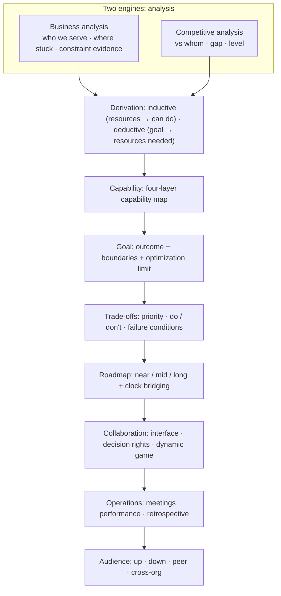
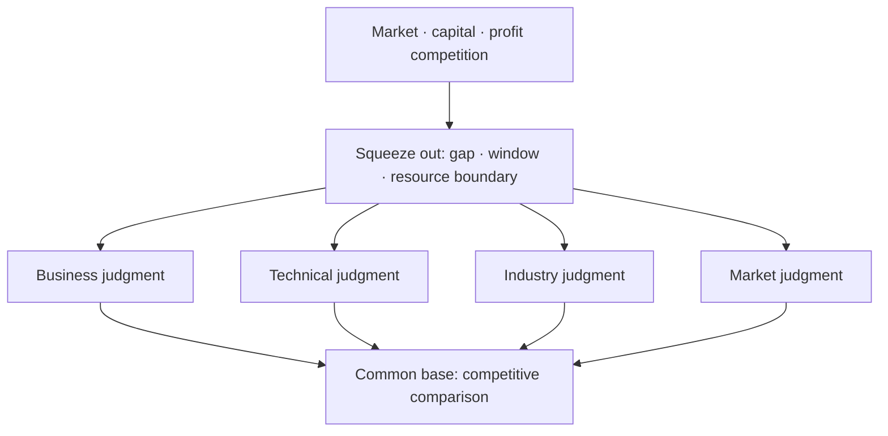
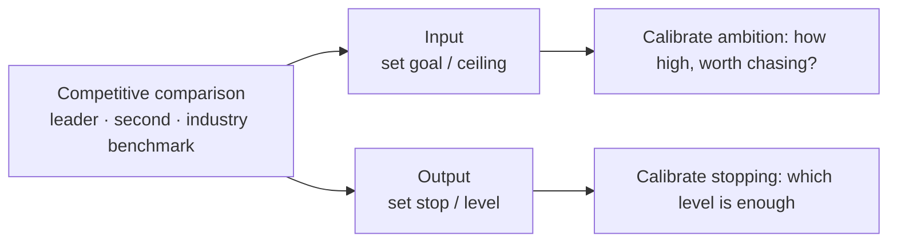
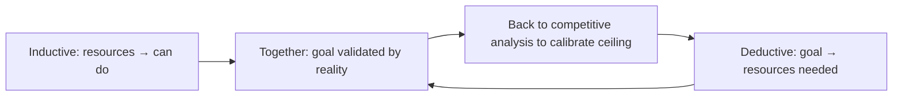
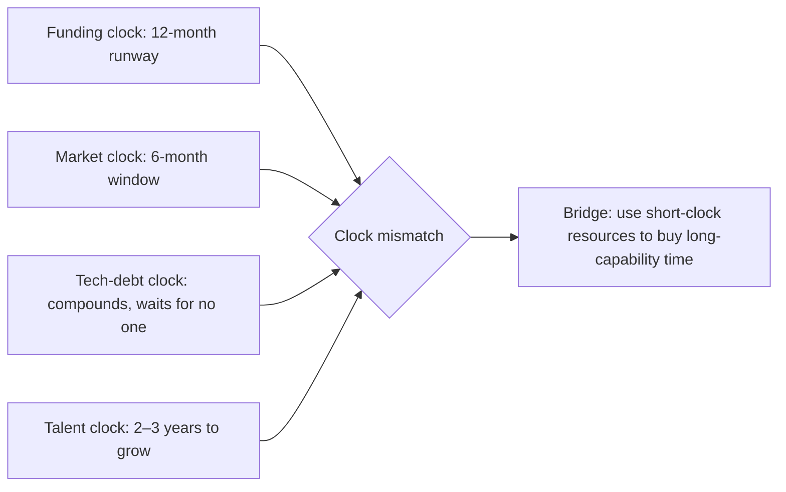
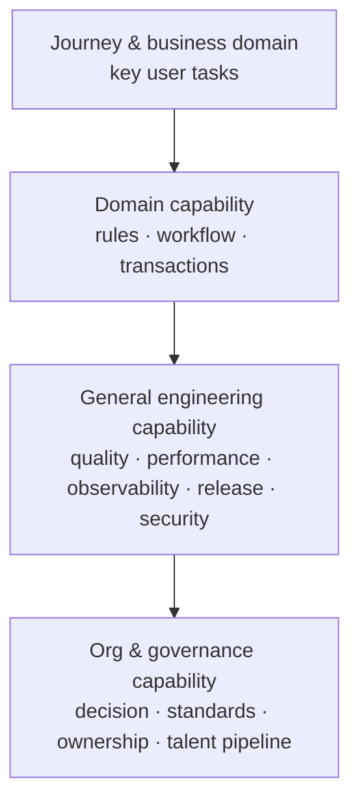
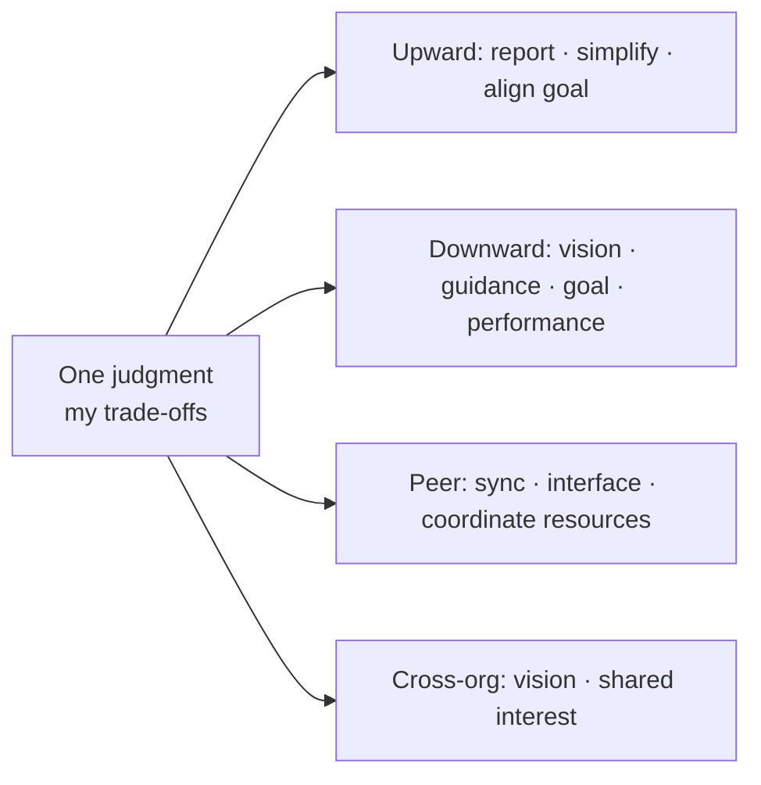

Many technical plans end up becoming a quarterly project list: what to upgrade, what to build, what to optimize. It looks complete, but it often can't answer the most important question: why invest in these things now, rather than some other things? I've been stumped by this question myself — after writing a "comprehensive" plan, when faced with "why these," I couldn't articulate the basis for the trade-offs.

Over time I came to see clearly: the essence of technical planning is really just two things — **business analysis** and **competitive analysis**.

- **Business analysis** answers "whom do we serve, where are we stuck now, and what is changing";
- **Competitive analysis** answers "whom are we comparing against, where is the gap, and what level counts as good enough".

Everything else — goals, capabilities, trade-offs, roadmap, mechanisms, external communication — is the output of these two engines. Without business analysis, the plan becomes a self-indulgent technical wish list; without competitive analysis, the plan loses its external coordinates, knowing neither the ceiling nor when to stop. The two together form a traceable causal chain:

The method below can be used for annual, semi-annual, or key-business-phase planning. It does not depend on a particular product form or tech stack; the point is to make technical planning a tool that aids decisions, not reporting material.

## 1. Business Analysis: Understanding Whom We Serve and Where We Are Stuck

Business analysis is not writing a business plan for the product team; it is describing, in your own language, how the business operates. Otherwise, words like "stability," "platformization," and "AI efficiency" easily detach from context and become unfalsifiable truisms.

### 1.1 The Business Landscape: Five Questions

For each important business domain, answer five questions:

1. **Whom do we serve, and what key task do we accomplish?** Describe the key journey of users or partners, not feature names.
2. **What is the current stage?** Is it validating value, expanding supply, improving conversion, scaling operations, or pursuing efficiency and cost? Different stages call for different optimal engineering investments.
3. **What is blocking growth or delivery?** It could be experience, supply, compliance, delivery speed, system capacity, reliability, or cross-team collaboration.
4. **What changes are coming?** Changes in scale, market, end devices, content forms, rules, and dependent systems. They are not a checklist of predictions, but scenarios we need to prepare for.
5. **What happens if we do nothing?** Spell out the opportunity cost, risk exposure, or future switching cost, to avoid mistaking "valuable" for "must do immediately."

The output should be a one-page business landscape, not a compilation of materials. The point of the diagram is not to show how complex the system is, but to help participants judge: where does a problem occur, whom does it affect, and which layer of capability should resolve it. A common trap in the business landscape is "disguising a collaboration problem as a technical problem" — slow delivery and heavy rework may look like engineering problems, but are actually requirements repeatedly getting distorted at boundaries. If this step is imprecise, the capability judgments that follow will be built on the wrong root cause.

### 1.2 Evidence of the Current State: Constraint–Consequence–Evidence

For business analysis to land on a decision-ready current state, a problem needs to be written in a three-part form:

- **Constraint**: the specific limitation of the current system, process, capability, or way of collaborating;
- **Consequence**: how it affects business outcomes, user experience, risk, or R&D efficiency;
- **Evidence**: data, cases, recurring events, or assumptions explicitly marked as not yet verified.

For example, don't just write "release efficiency is low"; keep asking: which types of changes are slow? At which stage are they slow? Is what's affected the frequency of experimentation, the risk of incidents, or cross-team waiting? Is there evidence sufficient to support a priority judgment?

The value of "constraint–consequence–evidence" is turning the current state from "a string of complaints" into "input that can participate in comparison." A constraint without a consequence is just a statement of the status quo; a consequence without evidence is just an opinion. Only when all three are present can a "current state" truly enter the trade-off table that follows.

## 2. Competitive Analysis: Understanding Whom We Compare Against, the Gap, and the Level

Tech leads often narrow competitive analysis to "seeing what technology competitors use." But true competitive analysis must be broader: it answers **where the competition comes from, the gap between us and the reference point, and what level counts as good enough**. It consists of three layers of competition and a common base.

### 2.1 Three Layers of Competition: Market, Capital, and Profit

Goals do not grow out of technical judgment; they are squeezed out of three kinds of external competition:

| Competitive dimension | The question it forces you to answer | The judgment it directly squeezes out |
| --- | --- | --- |
| Market competition | Whom are users or customers choosing between us and? Who bears the cost first if they don't choose us? | Business judgment, industry judgment, window period |
| Capital competition | Where does the money come from, how long can we keep burning it, and who is racing to fund this direction? | Resource boundary, the "resource" ceiling in the inductive view, priority |
| Profit competition | Does this investment ultimately yield revenue, cost, or valuation and survival? | ROI, optimization limit, stop condition, do/don't |

These three have an order: **market competition decides "where to fight," while capital and profit competition decide "whether we can afford to fight and whether it's worth fighting."** No matter how correct a technical judgment is, if the capital won't last until the inflection point, or the profit model doesn't hold, it is not a goal for this moment. This also explains where the legitimacy of "asking for resources" comes from: your reason for asking for resources is ultimately not "technically sound," but "capital and profit competition force us to bet here right now." Technical judgment here is a **translator**, not an **engine**.

### 2.2 Four Judgments: Translating Competition into Decision-Ready Conclusions

For competitive pressure to become goals, it must pass through the translation of four judgments:

| Judgment | What it judges | The reference point it compares against | Typical way it fails |
| --- | --- | --- | --- |
| Business judgment | What stage we're in, what's blocking us, which step the user task is stuck on | The user's alternatives (not necessarily competitors; it could be "not using it or using a clumsy workaround") | Treating internal wishes as user needs |
| Technical judgment | Technical debt, risk, capability gaps, feasibility | The industry's technical level, open source, mature paths | Treating "new" as "value" |
| Industry judgment | Where we stand, what level counts as enough | The leader, the runner-up, the industry baseline | Copying peers without knowing why they are where they are |
| Market judgment | Window, timing, supply and demand, competitor moves | Market window changes, competitor cadence, demand shifts | Treating trends as certainties, overestimating the window |

The common base of the four judgments is **competitive comparison**:

Watch out for one trap: **comparison is often narrowed down to "looking at competitors."** The true reference points come in four types — users' alternatives, mature technical paths, industry benchmarks, and market supply and demand. Competitors are just one thread; without the other three, comparison degrades into imitation benchmarked against competitors.

### 2.3 Competitive Comparison Appears Twice: The Input Sets the Ceiling, the Output Sets When to Stop

This is the most easily overlooked, yet most leveraged, point in competitive analysis. Competitive comparison appears twice along the whole chain:

Most people use it only at the output end (benchmarking, setting thresholds), and rarely pull it back to the input end to "set goals." The same external benchmark calibrates ambition at one end and calibrates stopping at the other — a plan that lights up both ends dares to chase and also knows when to stop. Without the input-end comparison, goals will be set too high or too low; without the output-end comparison, optimization sinks into an arms race of "forever chasing number one" or the self-satisfaction of "good enough internally."

## 3. From Analysis to Goals: Inductive and Deductive Reasoning

Business analysis tells us "where we're stuck," and competitive analysis tells us "where the gap and the ceiling are." To turn these two into investment, there are two opposite but mutually required ways of derivation.

**Inductive view**: extrapolate what can be done from existing resources. This is execution-level planning — how much money there is, how many people there are, what these people can do; what can be done is naturally limited. Its value is honesty, and its danger is conservatism: starting only from resources, it's easy to write the plan as "a schedule of existing capabilities," and miss larger possibilities.

**Deductive view**: work backward from the result you want to achieve to the resources you need. First define the goal, then break it down, then go ask for resources. Its value is the courage to set goals, and its danger is wishful thinking: without constraints and evidence to support them, goals turn into rhetoric for "asking for resources."

The two views are not either/or, but two halves of the same loop:

Spinning only in induction, the team loses the ceiling; floating only in deduction, the team won't get resources. The ideal state is: **deduction translates competitive pressure into goals, induction pulls goals back to reality for testing, and the two repeatedly hedge against each other.** But each of these two views has a correction that must be fixed first, or both will be distorted.

### 3.1 Correction One: Clock Mismatch

After elevating capital competition to the very upstream, the framework suddenly gains a dimension it has never seriously handled: **different things run on different clocks.**

One of the essential contradictions of planning is that these clocks are never in sync: capital only lasts 12 months, but the capability gap you need to fill takes 18 months to grow; the window closes in 6 months, but the key person only arrives in 4 months. The real planning move, much of the time, is **using resources on a short clock to bridge a capability that can only grow on a long clock**. Ignore clock mismatch, and induction will miscalculate resources while deduction sets the wrong cadence.

### 3.2 Correction Two: People Supply Is the Hardest Resource

In induction and deduction, "resources" are often assumed to be money plus headcount. But the hardest resource is **people with specific capabilities, and the time it takes to grow them**:

- Money can be raised and headcount can be approved, but "the person who can carry this thing" can't be manufactured — you can only wait or poach.
- **Critical few**: who must personally step in for this thing? Without them, the plan is just paper.
- **Organizational bandwidth**: the same person can't be fully loaded by three plans at once.
- **Willingness**: performance manages appraisal, but not willingness. Whether the key person treats this as their own thing decides whether the breakdown quietly deforms during execution.

This directly overrules the inductive view: in "extrapolate what can be done from resources," the first thing to check is not money, but **whether there are people, and whether they are willing**. Without this, induction overestimates capability, and deduction ends up asking for a pile of "people we can't use."

## 4. Capability Map: Translating Goals into Engineering Investment

The core translation work of planning is converting business language into capability language. The goal is not "building a platform," but enabling a certain kind of business change to be completed with lower risk, a shorter path, or more stable quality.

A practical capability map can usually be divided into four layers; the lower you go, the more easily they are overlooked:

- **Journey & business domain**: key user tasks and the business links that support them;
- **Domain capability**: the rules, workflows, content, or transaction capabilities each business domain repeatedly needs;
- **General engineering capability**: horizontal capabilities such as quality, performance, observability, release, data, security, and cross-platform;
- **Org & governance capability**: architecture decisions, standards, ownership, collaboration interfaces, and the talent pipeline.

The last layer is the easiest to overlook. As system complexity grows, many "architecture problems" actually come from blurred ownership, standards that can't be implemented, or excessive cross-team decision costs. If a technical plan doesn't explain how these capabilities are maintained, it often only temporarily relieves local symptoms.

Writing a short capability contract for each capability helps distinguish "common capabilities worth building" from "local logic that is not yet stable and should stay within the domain":

| Field | The question it answers |
| --- | --- |
| Service target | Which business domains, roles, or systems will use it? |
| Input and output | What does the user submit, and what explicit result do they get? |
| Service boundary | What does it solve, and what does it not solve? |
| Quality commitment | What are the requirements for speed, reliability, security, compatibility, or availability? |
| Ownership | Who maintains and evolves it, and who can decide exceptions? |
| Verification method | How are adoption rate, wait time, failure rate, or reuse results observed? |

When there is no clear service target or reuse path, preferring a local solution is often more honest than building an abstract platform ahead of time.

## 5. Goals: Outcome, Boundaries, and Optimization Limit

### 5.1 Outcome and Boundaries, Not Just Deliverables

Technical goals are often written as "complete the migration," "build a platform," "integrate a tool." These are means, not outcomes. A more reliable goal format is:

> In a specific business scenario, improve an observable outcome; achieve it through a certain kind of engineering capability; and at the same time hold the boundary of quality, cost, or risk.

Goals can be broken down into four kinds of outcomes: **business enablement** (shortening the path from idea to validation for new scenarios), **reliable delivery** (reducing the impact of failures, regressions, and uncontrollable releases), **efficiency and leverage** (reducing repetitive work and covering more deterministic work), and **long-term optionality** (reducing the future cost of switching technologies, entering new scenarios, or handling scale changes).

Not every goal needs a precise number, but every goal must have an observable acceptance method. For items that have no baseline yet, make "establishing a baseline and defining thresholds" the first-stage goal; don't manufacture certainty with a number that looks precise but no one understands.

### 5.2 Optimization Limit: Industry Comparison + ROI

Technical optimization is not "the more extreme, the better," but "**which level is enough to optimize to**." Judging the level requires looking at two things together:

- **Industry comparison**: reach Top 1, exceed the runner-up by x%, or achieve 80% of the leader. It gives an external coordinate that turns "good enough" from a feeling into a discussable number.
- **Investment ROI**: whether one more notch of optimization is still worth the marginal investment.

Only together do these two form a complete stop condition. Industry comparison alone sinks into an arms race of "forever chasing number one"; ROI alone sinks into the self-satisfaction of "good enough internally." **Industry comparison sets the ceiling, and ROI sets the stopping point** — this is exactly how the "competitive comparison appears twice" from Section 2.3 lands at the goal level.

### 5.3 There Are Only Two Kinds of Optimization: Performance and Strategy

Optimizations that technology can make come down to two kinds at the bottom:

- **Performance (architecture)**: make the system faster, more stable, cheaper, and able to carry more. It changes "how it runs."
- **Strategy**: make the system decide more intelligently — what to recommend, what to block, how to allocate resources, how to handle exceptions. It changes "how it chooses."

The two are often intertwined (no matter how smart the strategy, if performance can't support it, it's useless), but when judging value they should be asked separately: does this optimization improve "running faster" or "choosing more correctly"? Mixing the two together makes it easy to use "better performance" to cover up "the strategy didn't actually get smarter."

## 6. Trade-offs: Portfolio, Priority, Do/Don't, and Failure Conditions

Resources are always insufficient, so the value of planning lies not in collecting every reasonable demand, but in making trade-offs public.

### 6.1 Configure as a Portfolio First, Not Item-by-Item Ranking

Ranking alone leads to "do all the urgent ones." First put candidate items into four categories by their nature, then compose a balanced investment portfolio:

| Type | What it solves | The bias to avoid |
| --- | --- | --- |
| Direct enablement | Remove the bottleneck in the current key business or user journey | Being completely occupied by short-term demands |
| Health and risk | Reduce instability, security, compliance, and system fragility | Investing only after an incident happens |
| Leverage building | Let multiple business domains deliver faster and more consistently | Abstracting prematurely into a platform no one uses |
| Exploration and validation | Validate uncertain but potentially important directions at small cost | Treating a research prototype as a long-term commitment |

Three questions are especially useful when making trade-offs: if this item is delayed one cycle, what is the loss? What premises does it depend on, and can it be stopped or shrunk if the premise fails? Which future choices does it make easier, or harder?

### 6.2 Priority: First Distinguish Four Kinds of Decisions, Then Compare Along Six Dimensions

The truly hard part is not ranking items from P0 to P2, but letting people of different backgrounds examine the judgment behind that ranking. A plan mixes decisions of different natures; throwing them into the same review often leads to "urgent" overwhelming "important."

| Decision type | Typical question | Evidence needed | Appropriate cadence |
| --- | --- | --- | --- |
| Opportunity selection | Which scenario is most worth supporting first? | User value, window, expected impact | Reviewed with the business cycle |
| Risk handling | Which vulnerability must be addressed before an incident? | Failure history, exposure scope, recovery difficulty | Continuously logged, escalated in time |
| Capability investment | Which common capability is worth building ahead of time? | Repeated needs, reuse path, maintenance cost | Portfolio evaluated quarterly |
| Approach selection | Which technical path should be taken to reach the goal? | Constraints, alternatives, experiment results | Decided before implementation |

Their common language is "outcome, cost, and uncertainty." For candidate items not yet scheduled, write a lightweight card along six dimensions, with the point being to expose differences and unknowns:

| Dimension | The question it answers | Low-score signal |
| --- | --- | --- |
| Impact | After success, whose outcome specifically improves, and how large is the impact? | Can only say "experience is better" or "technology is more advanced" |
| Urgency | What is the quantifiable or describable loss of delaying one cycle? | Only "everyone hopes it's done soon" |
| Confidence | Is the conclusion supported by data, recurring events, experiments, or guesses? | No baseline and no validation plan |
| Investment | Does it include migration, learning, coordination, maintenance, and opportunity costs? | Only estimates development effort |
| Dependency and risk | What are the preconditions, external teams, compliance, or operational risks? | Dependencies written as "to be coordinated" |
| Reversibility | If it fails, can it be shrunk, rolled back, or replaced? At what cost? | Irreversibly locks in interfaces, data, or organizational commitments |

Among these, **confidence** and **reversibility** are the two dimensions most people miss when ranking, yet they are the best at exposing false consensus. There is no need to force the six dimensions into a single score: for an item with low confidence but high potential value, the reasonable conclusion is usually not "put it last," but "first invest in a validation with a stop condition."

### 6.3 Write "Not Doing It for Now" as a Formal Conclusion

A plan's credibility comes from choices, not from coverage. Every major problem not invested in should be recorded as one of the following three:

- **Deferred**: the value holds, but the current opportunity cost is higher; write down the date or trigger signal for reassessment.
- **Decide after validation**: the direction may hold, but key evidence is missing; write down the minimal validation, success conditions, and budget cap.
- **Explicitly abandoned**: the benefit isn't worth the cost, or a more suitable alternative path already exists; write down the reasoning at the time, to keep the issue from repeatedly returning to the table.

The opposite of "not doing it for now" is not "never doing it," but "quietly deleting it." The difference between silently erasing a demand and writing it down as a formal conclusion is that the latter preserves the boundary of the judgment: next time someone wants to reopen it, the discussion shifts from "is it important" to "which known assumption has it changed, and which investment in the portfolio is it willing to replace."

### 6.4 Set Failure Conditions for Every Decision

The most dangerous state of a plan is when the environment has changed but the team is still completing old conclusions. Important decisions need to mark, right now, when they should be reopened: the target user or scale assumption changes, a key dependency can't be delivered on schedule, validation metrics show no improvement over the long term, or maintenance cost exceeds the preset boundary.

This is not leaving room for excuses in execution, but turning changing one's mind from personal will into a pre-agreed mechanism. A decision record should include at least: the conclusion, owner, evidence, alternatives, valid premises, next review time, and failure conditions. That way, those who come later can both understand why this was chosen then, and judge whether it should still be chosen now.

## 7. Roadmap: Near/Mid/Long Term and Clock Bridging

### 7.1 Three Layers, Without Fabricating Certainty

The annual roadmap is not a list of commitments for the next twelve months. The farther out, the more it should express direction, premises, and decision points, rather than false date precision:

- **Near term**: scope, owner, dependencies, and acceptance conditions are clear enough to commit to delivery;
- **Mid term**: goals and direction are clear, but scope needs to be adjusted at key nodes based on results;
- **Long term**: describe the capabilities to acquire and the signals to monitor, without locking in the approach.

Every important item should have a minimal closed loop: what to change, who owns it, whom it depends on, how to verify it, and what signals trigger expanding, shrinking, or stopping. Writing these next to the roadmap prevents "completion rate" from replacing "whether the problem is solved."

### 7.2 Write Clock Mismatch into the Roadmap

Near/mid/long term is only spatial layering; it hasn't handled clock mismatch yet. The roadmap must additionally answer once: **among the funding clock, market clock, tech-debt clock, and talent clock, which is shortest, which is longest, and where does the mismatch occur?**

A typical problem: capital only lasts 12 months, but the capability gap takes 18 months to grow; the window closes in 6 months, but the key person only arrives in 4 months. The planning move here is not "compress 18 months into 12," but finding a **bridge solution deliverable on a short clock**: first hold the present with external procurement, manual fallback, or a narrow-scenario pilot, while buying time for the long-term capability. The roadmap should explicitly mark the "bridge point" and "when the capability arrives," or the team will repeatedly break promises in the gap between two clocks.

## 8. Collaboration: Interfaces, Decision Rights, and Dynamic Games

Collaboration is not adding a page of "coordination needed" at the end of the roadmap. Whenever a result depends on multiple teams, the collaboration mechanism is itself part of the delivery system.

### 8.1 Outcome Ownership and Capability Ownership

Business-domain teams are usually closest to the user journey and outcomes; platform or infrastructure teams are usually closest to horizontal capabilities and long-term costs. These two kinds of ownership cannot substitute for each other. The same thing can have multiple participants, but a result must have a clear owner; the same capability can serve multiple teams, but someone must maintain it. Separating the two kinds of ownership avoids "everyone is responsible, so no one is responsible."

### 8.2 Write Collaboration Interfaces as Executable Agreements

The most common failure of cross-team dependencies is not that the other side is unwilling to cooperate, but that the two sides understand "delivery" differently. For each key dependency, at least agree on: what specific input or decision is needed (rather than "please support us"); the provider's boundary, quality standard, and expected availability time; how the consumer accepts it, and the feedback path when it doesn't meet expectations; and who, when the dependency is delayed, has the right to adjust scope, escalate risk, or decide on an alternative. A dependency table, a decision record, or an interface description is enough — the key is turning implicit expectations into checkable commitments.

### 8.3 Add a Decision-Rights Map

What the collaboration section most often misses is **power**. The audience axis answers "how to talk to the four sides," but not "who has the power to make this thing fail." A decision-rights map should be drawn at the very start of planning:

- Who has **veto power** and must be present, not just "kept in sync"?
- Whose KPI or incentives will be **passively touched** by this thing (even if they themselves don't realize it)?
- Which key decision-maker, if absent, makes the review a sham?

Most planning failures are not from writing the wrong content, but from key veto-holders not being aligned, or someone whose interests are shaken only jumping out to object at execution time. This is one layer below "the value of upward management": reporting is not just simplification and alignment, but **getting decisions and authorization**.

### 8.4 Remember That Competition Is a Dynamic Game

The industry comparison on the roadmap is a static snapshot, but competitors move, react, and place bets at the same time as us. The plan must answer at least once: "**If I bet and the competitor also bets, is my plan worth more or less?**" and "If someone comes around us, what is our fallback path?"

This upgrades the failure condition from "the environment changed" to "**the competitor moved and we were bypassed**." What the plan needs is not a more accurate benchmark table, but a prediction of the competitor's next move and a fallback path — at least make it an explicitly discussed assumption, rather than assuming by default that competitors stand still.

## 9. Operating Mechanisms: Meetings, Performance, and Retrospectives

Publishing the planning document is not the end. A truly effective plan is continuously corrected by evidence during execution.

### 9.1 Three Kinds of Meetings, Each Managing One Thing

| Cadence | The problem it solves | Main output |
| --- | --- | --- |
| Planning review | Is it worth investing, and do the trade-offs hold? | Goals, portfolio, not-now items, and key assumptions |
| Execution check | Have dependencies, risks, or scope changed? | Updated milestones, responsibilities, and escalation items |
| Retrospective calibration | Did the outcome happen, and where did the original judgment fail? | Keep/expand/stop decisions and process improvements |

Don't merge the three meetings into a generic weekly meeting: planning review needs decision rights in the room, execution check needs the people who actually own the dependencies in the room, and retrospective needs to allow evidence to overturn previous conclusions. Meeting notes should record only the decisions, reasons, and owners that change subsequent actions; status information should be updated asynchronously as much as possible.

### 9.2 Tie Performance to Outcomes, Not Completion Rate

Progress tracking must land in meetings, and also in performance — performance is the hook that makes the breakdown truly land on individuals. But there is a trap to guard against: **once performance is tied to completion rate, people optimize "deliverables" rather than "outcomes."**

The correct binding order is: tie performance to outcomes and milestones, not to the number of tasks completed. This is why milestones should be written as "externally observable state changes" (for example, "the first scenario can complete changes autonomously within the agreed boundary," "key failure modes can be automatically detected and located"), rather than task counts. Task completion counts can hardly prove whether a plan is close to succeeding.

### 9.3 Three Cadences + Retrospective That Interrogates Judgment

It is recommended to establish three cadences: **monthly signal check** (have baselines, risks, dependencies, and key assumptions changed), **quarterly portfolio review** (whether investment needs to be reallocated among enablement, health, leverage, and exploration), and **end-of-cycle retrospective** (did goals produce the expected outcomes, and which judgments were confirmed or overturned).

The retrospective should interrogate judgment, not just tally completion: why did we believe this investment was worth it at the time? What evidence was missing? Did we mistake correlation for causation? What should be kept, expanded, stopped, or replaced in the next cycle? Only then does the plan become an input to organizational learning, rather than last year's archive.

### 9.4 Leave a Renegotiation Mechanism for Standing Tensions

Tensions like short-term vs. long-term, delivery vs. quality, and business vs. platform **are never "solved," only repeatedly renegotiated**. A mature plan doesn't pretend to balance them once and for all, but sets a renegotiation cadence and an arbiter for them — who reopens the topic, when, and based on what signal. Otherwise these tensions will keep breaking the public trade-offs in the form of "cutting in line at the last minute."

## 10. External Value: Upward, Downward, to Peers, and Cross-Organization

A plan's value is not only internal execution, but also that it is consumed by different people. The same trade-off must be told once in each of four languages — the judgment stays the same, while the wording and the hooks change.

| Audience | What they want | Your action | Emotional/rational mix |
| --- | --- | --- | --- |
| Upward (direct manager) | A decision-ready compressed version: judgment + trade-offs + which decisions need whom | Report, simplify, align goals | Rationality first, emotion anchors "why these" |
| Downward (team) | A sense of direction + a hook of personal meaning + executable commitments | Vision, guidance, goal-setting, performance | Open with emotion, land with rationality |
| Peers (collaborators) | Checkable commitments + mutual boundaries | Sync, interface agreements, coordinate resources | Pure rationality, landing on input/output/timepoint/who decides on delay |
| Cross-organization (higher level) | A larger shared interest, so multiple parties are willing to step in together | Painting the vision, reaching shared interest, a community of interest | Emotion paints the vision, rationality gives shared losses and shared opportunities |

"Sweet-talking" and "reporting" are actually two polarities of the same mechanism — both translate "my trade-offs" into "the other party's gains and losses." The only difference is the translation target: downward, into growth and meaning; upward, into goals and risks; to peers, into interfaces and commitments; cross-organization, into shared losses and opportunities.

To make painting the vision land, there is a minimum threshold: **whether the vision you paint is something both sides "fear losing" or "both want to win."** A vision where only I want to win and the other side is indifferent is an empty picture; a vision that clearly explains both the shared loss (not doing it will hurt together) and the shared opportunity (what each side gains by doing it) truly constitutes a community of interest — this is also the minimum condition for a cross-team, cross-organization community of interest to hold. And this vision must withstand the test of Section 2: it corresponds to real market/capital/profit pressure, not just a vision.

## A Usable Planning Skeleton

If you need to draft from scratch, you can use the following order. Each part should be short enough to be discussed and long enough to support a decision.

1. **Summary**: the most important judgments, trade-offs, and the consensus to reach this cycle.
2. **Business analysis**: whom we serve, where we're stuck, stage and changes, and "constraint–consequence–evidence."
3. **Competitive analysis**: what market/capital/profit competition squeezed out; what conclusion each of the four judgments reached; where the gap and the level are.
4. **Derivation and corrections**: the goals set by deduction, the checks from induction, and the two corrections of clock mismatch and people supply.
5. **Capability map**: whether the capability gap lies in the business domain, general engineering, or org and governance layer.
6. **Goals and investment portfolio**: outcomes, boundaries, optimization limit, priority, not-now items, and reasons.
7. **Roadmap and dependencies**: the three near/mid/long layers, clock bridge points, owners, verification methods, and failure conditions.
8. **Collaboration and decision rights**: interface agreements, veto-holders and passively affected parties, and predictions of the competitor's next move.
9. **Operating mechanisms**: meetings, how performance is tied, retrospective cadence, and the renegotiation points of standing tensions.

## Recognizing Whether a Plan Has Failed

Check document quality with a few reverse questions: if you delete the project names, can the reader still understand why to invest? If resources are cut by a third, does the team know what to give up first? If a key assumption is overturned, does the roadmap know where to adjust? If the funding clock suddenly shortens, does the plan know what to cut first? If the owner changes a year later, can the successor understand the trade-offs made at the time?

If these questions can't be answered, the problem is usually not that the plan isn't detailed enough, but that it is missing one link among business analysis, competitive analysis, constraint evidence, capability logic, or verification mechanisms.

The most important product of technical planning is not a pretty roadmap, but a shared judgment: amid limited resources and uncertain competition, why the team spends its time here, how it knows it is truly worth it, and when it should honestly change its mind.
