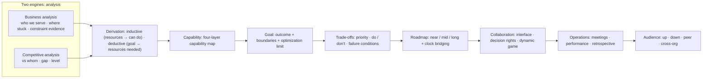
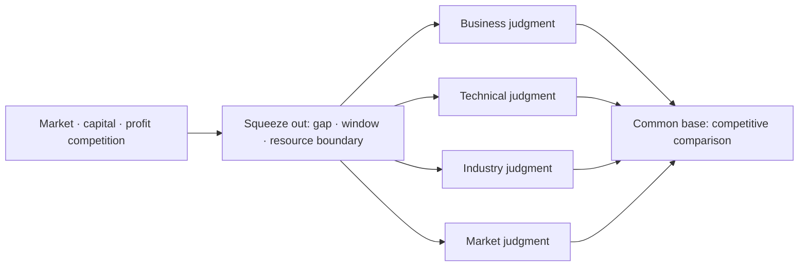
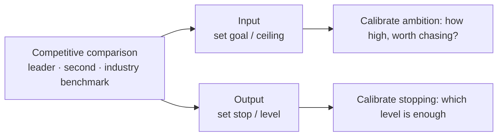
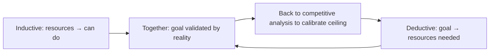
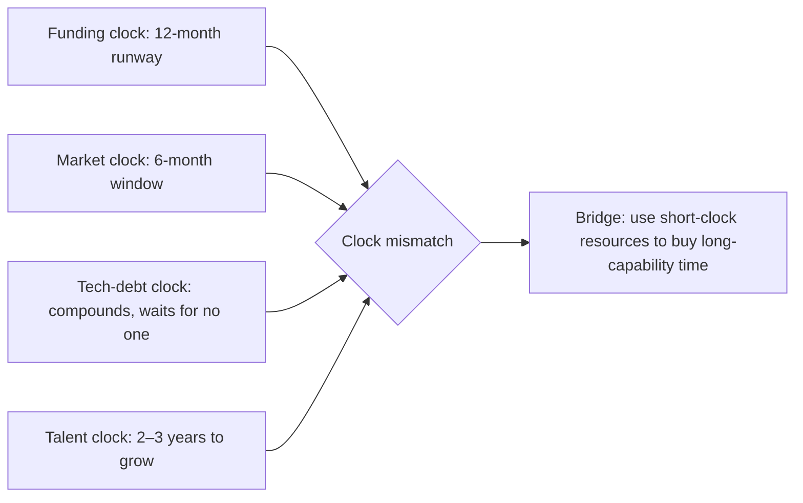
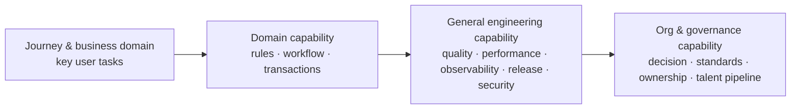

很多技术规划写到最后，会变成一张按季度排列的项目表：要升级什么、建设什么、优化什么。它看起来很完整，却经常回答不了最重要的问题：为什么此刻应该投入这些事，而不是另外一些事？这个问题我自己就被问住过——写完一份"很全"的规划，面对"为什么是这些"时，说不清取舍的根据。

后来我慢慢看清：技术规划的本质，其实只有两件事——**业务分析**和**竞品分析**。

- **业务分析**回答"我们要服务谁、现在卡在哪、什么正在变化"；
- **竞品分析**回答"我们在和谁比、差距在哪、做到什么水位才算够"。

其余所有东西——目标、能力、取舍、路线图、机制、对外沟通——都是这两个引擎的输出。业务分析缺席时，规划最容易变成一份自嗨的技术愿望清单；而一旦竞品分析也跟着缺席，规划就连外部坐标都没有了，天花板在哪、什么时候该收手，全靠感觉。两者合起来，才构成一条可追溯的因果链：

下面这套方法可用于年度、半年度或关键业务阶段的规划。它不依赖某种产品形态或技术栈，重点是让技术规划成为帮助决策的工具，而不是汇报材料。

## 1. 业务分析：理解我们要服务谁、卡在哪

业务分析不是替产品写商业计划，而是用自己的语言描述业务运行的方式。否则"稳定性""平台化""AI 提效"之类的词很容易脱离场景，变成不可证伪的正确话。

### 1.1 业务全景：五个问题

为每个重要业务域回答五个问题：

1. **服务谁，完成什么关键任务？** 描述用户或合作方的关键旅程，而不是功能名。
2. **当前阶段是什么？** 是验证价值、扩大供给、提升转化、规模化运营，还是追求效率与成本？不同阶段的最优工程投入不同。
3. **增长或交付被什么卡住？** 可能是体验、供给、合规、交付速度、系统容量、可靠性，或跨团队协作。
4. **什么变化正在到来？** 规模、市场、终端、内容形态、规则和依赖系统的变化。它们不是预测清单，而是需要为之准备的情景。
5. **不做会怎样？** 说明机会成本、风险暴露或未来的切换成本，避免把"有价值"误写成"必须立刻做"。

产物应是一页业务全景，而非资料汇编。图的目的不是展示系统有多复杂，而是帮助参与者判断：一个问题发生在哪里、会影响谁、该由哪一层能力解决。业务全景里常见的一类陷阱，是把"协作问题伪装成技术问题"——交付慢、返工多，表面看是工程问题，实际可能是需求在边界上反复失真。这一步做不准，后面的能力判断就会建在错误的根因上。

### 1.2 现状证据：约束—后果—证据

业务分析要落到可决策的现状，需要把问题写成三段式：

- **约束**：当前系统、流程、能力或协作方式的具体限制；
- **后果**：它怎样影响业务结果、用户体验、风险或研发效率；
- **证据**：数据、案例、重复发生的事件，或明确标注为尚待验证的假设。

例如，不要只写"发布效率低"；应继续追问：是哪些类型的改动慢？慢在哪个环节？影响的是试错频率、故障风险还是跨团队等待？是否存在足以支持优先级判断的证据？

"约束—后果—证据"的价值，在于把现状从"一串抱怨"变成"可参与比较的输入"。没有后果的约束只是现状陈述，没有证据的后果只是观点，三者齐全，一个"现状"才能真正进入后面的取舍表。

举例来说（下面是一个构造场景，用来说明这一步容易在哪里出错，不是真实事件）：某规划评审上，"发布效率低"被列为头号约束，理由是"研发同学天天抱怨"。追问下去才发现，慢的其实只是某一条业务线的改动——因为它涉及一个需要人工合规审批的环节，跟 CI/CD 流程本身关系不大。如果当时没有拆开问"是哪些类型的改动慢""慢在哪个环节"，规划很可能会把预算投进一次没必要的发布系统重构，而真正该做的是把那个审批环节数字化。这也是"约束—后果—证据"最容易失效的地方：约束写得越笼统，越容易被最响亮的抱怨牵着走，而不是被证据牵着走。

## 2. 竞品分析：理解我们和谁比、差距与水位

技术负责人常把竞品分析窄化成"看对手用了什么技术"。但真正的竞品分析要更宽：它要回答的是**竞争的来源、我们与参照物的差距、以及做到什么水位才算够**。它由三层竞争和一个共同底座构成。

### 2.1 三层竞争：市场、资金与盈利

目标不是从技术判断里长出来的，而是从三类外部竞争里被压出来的：

| 竞争维度 | 它在逼你回答的问题 | 直接压出的判断 |
| --- | --- | --- |
| 市场竞争 | 用户或客户在替我们和谁选？不选我们的代价谁先承受？ | 业务判断、行业判断、窗口期 |
| 资金竞争 | 钱从哪来、还烧得起多久、谁抢着给这个方向投钱？ | 资源边界、推衍视角的"资源"上限、优先级 |
| 盈利竞争 | 这个投入最终换来的是收入、成本，还是估值与续命？ | ROI、优化极限、停止条件、做/不做 |

这三样有先后：**市场竞争决定"打哪里"，资金与盈利竞争决定"打不打得起、值不值得打"。** 一个技术判断再正确，如果资金撑不到拐点，或盈利模型不成立，它就不是此刻的目标。这也解释了"去要资源"这一步的合法性从哪来：你要资源的理由，最终不是"技术上合理"，而是"资金和盈利竞争逼我们此刻必须在这里下注"。技术判断在这里是**翻译器**，而不是**发动机**。

### 2.2 四种判断：把竞争翻译成可决策的结论

竞争压力要变成目标，需要经过四种判断的翻译：

| 判断 | 判断的是 | 对比的参照物 | 典型失效方式 |
| --- | --- | --- | --- |
| 业务判断 | 处在什么阶段、被什么卡住、用户任务卡在哪一步 | 用户的替代方案（不一定是竞品，可能是"不用或用笨办法"） | 把内部愿望当用户需求 |
| 技术判断 | 技术债、风险、能力缺口、可行性 | 行业技术水位、开源、成熟路线 | 把"新"当"价值" |
| 行业判断 | 我们处在什么位置、什么水位算够 | 头部、第二、行业基准线 | 抄同行，但不知道对方为什么在那儿 |
| 市场判断 | 窗口、时机、供需与对手动作 | 市场窗口变化、对手节奏、需求迁移 | 把趋势当确定性、高估窗口 |

四种判断的共同底座是**竞争对比**：无论是判断"用户在替我们和谁选"，还是"我们的技术水位在行业里算什么位置"，最终都要回到一个具体的参照物上，否则判断就只是自我感觉。

打个比方（同样是构造场景，不是真实事件）：一份规划把目标定为"对标行业第一"，评审时被追问"这个'第一'是谁——是行业公认的头部产品，还是我们自己脑补出来的假想敌？我们的用户真的在拿我们和它比吗？"结果发现，用户真正的替代方案根本不是那个知名同行，而是"干脆不用，靠人工表格对付"。目标于是从"对标某家公司的某个功能"改成了"把用户从人工表格里拉出来"——参照物变了，要建的能力也完全不同。这说明四种判断里最容易踩空的是业务判断：把"对手在做什么"当成了"用户在和谁比"。

**对比常被窄化成"看对手"**，这是竞品分析里最常见的陷阱。真正的参照物有四类——用户的替代方案、技术成熟路线、行业基准、市场供需。对手只是其中一条线索；少了另外三类，对比就退化成对标竞品的模仿。

### 2.3 竞争对比出现两次：输入端定天花板，输出端定收手

这是竞品分析里最容易被忽略、也最有杠杆的一点。竞争对比在整条链里出现两次：

大多数人只在输出端用它（做对标、设阈值），很少把它拉回输入端去"定目标"。同一份外部基准，一头校准野心，一头校准收手——两头都点亮的规划，才既敢追、也知道何时停。如果只在输出端用，目标本身可能一开始就定得过高或过低，事后再怎么对标都是在纠正一个方向错了的起点。

## 3. 从分析到目标：推衍与演绎

业务分析告诉我们"卡在哪"，竞品分析告诉我们"差距和天花板在哪"。要把这两者变成投入，有两种相反、但必须同时具备的推导方式。

**推衍视角**：根据现有资源，去推衍能做什么。这是执行层的规划——钱有多少、人有多少、这些人会什么，能做的事天然有限。它的价值是诚实，危险是保守：只从资源出发，很容易把规划写成"现有能力的排期"，看不见更大的可能性。

**演绎视角**：根据你想达成的结果，反推需要哪些资源。先定义目标，再拆解，最后去要资源。它的价值是敢于设定目标，危险是空想：目标若没有约束和证据支撑，就会变成"要资源"的话术。

两种视角不是二选一，而是同一个循环的两半：推衍算出的目标，要拿回竞品分析里校准天花板；演绎定的目标，要拿回推衍里检验能不能落地，如此反复。

一个团队如果只在推衍里打转，会渐渐失去天花板，规划变成对存量能力的排期；如果只在演绎里飘，则会不断提要求、却要不到匹配的资源。理想状态是：**演绎负责把竞争压力翻译成目标，推衍负责把目标拉回现实检验，两者反复对冲。** 但这两个视角各自有一个必须先修的修正项，否则都会失真。

### 3.1 修正一：时钟错配

把资金竞争提到最上游之后，框架突然多出一个它从没认真处理过的维度：**不同东西跑在不同的时钟上。**

规划的本质矛盾之一，就是这几个时钟从来不同步：资金只够 12 个月，但你要补的能力缺口要 18 个月才能长出来；窗口 6 个月就关，但关键人要 4 个月才到位。真正的规划动作，很多时候是**用短时钟里的资源，去桥接一个长时钟才能长出来的能力**。忽略时钟错配，推衍会算错资源、演绎会定错节奏。

### 3.2 修正二：人的供给是最硬的资源

推衍与演绎里，"资源"常被默认为钱加编制。但最硬的资源是**特定能力的人，以及培养周期**：

- 钱能融、编制能批，但"能扛这件事的人"造不出来，只能等或挖。
- **关键少数**：这件事里谁必须亲自下场？他不在，规划就是纸。
- **组织带宽**：同一个人不能被三份规划同时塞满。
- **意愿**：绩效管得住考核，管不住意愿。关键人是不是把这件事当成自己的事，决定了拆解会不会在执行里悄悄变形。

这直接改判推衍视角："根据资源推衍能做什么"里，最该先查的不是钱，而是**有没有人、以及人愿不愿意**。没有它，推衍会高估能力，演绎会要到一堆"用不上的人"。

## 4. 能力地图：把目标翻译成工程投资

规划的核心翻译工作，是把业务语言转为能力语言。目标不是"做一个平台"，而是让某类业务变化能以更低风险、更短路径或更稳定的质量完成。

一个实用的能力地图通常可分为四层，越往下越容易被忽略：

- **旅程与业务域**：关键用户任务和支撑它们的业务环节；
- **领域能力**：各业务域反复需要的规则、工作流、内容或交易能力；
- **通用工程能力**：质量、性能、可观测性、发布、数据、安全与跨端等横向能力；
- **组织与治理能力**：架构决策、标准、所有权、协作接口和人才梯队。

最后一层最容易被忽略。系统复杂度增长时，许多"架构问题"其实来自所有权模糊、标准无法落地，或跨团队的决策成本过高。技术规划若不说明这些能力如何被维护，往往只能短暂解决局部症状。

为每项能力写一个简短的能力契约，能区分"值得建设的共性能力"和"尚未稳定、应留在领域内的局部逻辑"：

| 字段 | 要回答的问题 |
| --- | --- |
| 服务对象 | 哪些业务域、角色或系统会使用它？ |
| 输入与输出 | 使用者提交什么，获得什么明确结果？ |
| 服务边界 | 它解决什么，不解决什么？ |
| 质量承诺 | 速度、可靠性、安全、兼容性或可用性要求是什么？ |
| 所有权 | 谁维护演进，谁能决定例外？ |
| 验证方式 | 采用率、等待时间、故障率或复用结果怎样观察？ |

没有清楚的服务对象与复用路径时，优先做局部方案，往往比提前建设一个抽象平台更诚实。

## 5. 目标：结果、边界与优化极限

### 5.1 结果与边界，而不只是交付物

技术目标常写成"完成迁移""建设平台""接入工具"。这些是手段，不是结果。更可靠的目标格式是：

> 在明确的业务场景中，改善一个可观察的结果；通过某类工程能力实现；同时守住质量、成本或风险边界。

目标可以拆成四类结果：**业务使能**（缩短新场景从想法到验证的路径）、**可靠交付**（降低故障、回归和不可控发布的影响）、**效率与杠杆**（减少重复劳动，覆盖更多确定性工作）、**长期选择权**（降低未来更换技术、进入新场景或应对规模变化的成本）。

并非每个目标都要有精确数字，但必须有可观察的验收方式。对尚无基线的事项，把"建立基线并明确阈值"作为第一阶段目标；不要用一个看似精确、实则无人理解的数字制造确定性。

### 5.2 优化极限：行业对比 + ROI

技术优化不是越极致越好，而是"**优化到哪个水位就够了**"。判断水位需要两样东西一起看：

- **行业对比**：做到 Top 1、超过第二 x%、或达到头部八成。它给出一个外部坐标，把"够不够好"从感觉变成可讨论的数字。
- **投入 ROI**：再往上优化一档，边际收益是否还值得投入。

这两样合起来才是完整的停止条件：光看行业对比，容易陷入永远追第一的军备竞赛；只算 ROI，又容易滑向内部觉得够用就行的自我满足，忘了外面的水位早就变了。**行业对比定天花板，ROI 定收手点**——这正是 2.3 节说的"竞争对比出现两次"在目标层的落地。

### 5.3 优化只有两类：性能与策略

技术能做的优化，追到底就是两类：

- **性能（架构）**：让系统更快、更稳、更省、更能承载。它改的是"怎么跑"。
- **策略**：让系统更聪明地决定——什么该推荐、什么该拦截、资源怎么分配、异常怎么处理。它改的是"怎么选"。

两者常常互相牵连（策略再聪明，性能撑不住也白搭），但判断价值时要分开问：这个优化改善的是"跑得更快"还是"选得更对"？把两者混在一起，很容易用"性能更好"掩盖"策略其实没有变聪明"。

## 6. 取舍：组合、优先级、做/不做与失效条件

资源永远不足，所以规划的价值不在于收集所有合理诉求，而在于公开取舍。

### 6.1 先按组合配置，而不是逐项排序

光排序会导向"全做紧急的"。先把候选事项按性质放进四类，再组成一个平衡的投资组合：

| 类型 | 要解决的事 | 应避免的偏差 |
| --- | --- | --- |
| 直接使能 | 解除当前关键业务或用户旅程的瓶颈 | 被短期需求完全占满 |
| 健康与风险 | 降低稳定性、安全、合规和系统脆弱性 | 等事故发生才投入 |
| 杠杆建设 | 让多个业务域更快、更一致地交付 | 过早抽象成无人使用的平台 |
| 探索验证 | 用小成本验证不确定但可能重要的方向 | 把研究原型当作长期承诺 |

取舍时特别有用的三个问题：这个事项若延后一个周期，损失是什么？它依赖什么前提，前提不成立时能否停止或缩小？它会让未来哪些选择变容易，或变困难？

举例来说（构造场景，不是真实事件）：某次规划评审上，三个候选项目都被各自的负责人标成"P0"，理由都是"很重要"。评审要求先别争排序，把三项各自放进上面四类里再看——结果其中一项原本按"直接使能"申请资源，实际内容却是"验证一个还没人用过的新场景能不能跑通"，性质上属于探索验证，理应用小成本、设停止条件去试，而不是像使能类项目那样按全量交付去要预算。分类先做对，排序的争吵往往会小一半，因为很多"谁更重要"的分歧，本质是"这到底是哪类决定"的分歧。

### 6.2 优先级：先分清四类决定，再用六个维度比较

真正困难的不是给事项排一个从 P0 到 P2 的顺序，而是让不同背景的人能检查这个顺序背后的判断。规划里混杂了不同性质的决定，把它们混在同一场评审里，往往导致"紧急"压倒"重要"。至少要分清四类：**机会选择**（哪个场景最值得优先支持，靠用户价值、窗口和预期影响判断，随业务周期复核）、**风险处置**（哪项脆弱性必须在事故前处理，靠故障历史和暴露范围判断，需要持续登记、及时升级）、**能力投资**（哪种共性能力值得提前建设，靠重复需求和复用路径判断，按季度评估组合）、**方案选择**（达成目标该走哪条技术路径，靠约束和备选方案判断，在实施前一次性决策）。四类决定需要的证据、节奏和翻盘难度都不同，混在同一场会议里比较，几乎注定吵不清楚。

它们的共同语言是"结果、成本和不确定性"。对尚未排期的候选事项，用六个维度写一张轻量卡片，重点是暴露差异和未知项：

| 维度 | 要回答的问题 | 低分信号 |
| --- | --- | --- |
| 影响 | 成功后具体改善谁的什么结果？影响面多大？ | 只能说"体验更好"或"技术更先进" |
| 紧迫性 | 延后一个周期的可量化或可描述损失是什么？ | 只有"大家都希望尽快" |
| 置信度 | 结论由数据、重复事件、试验还是猜测支撑？ | 没有基线，也没有验证计划 |
| 投入 | 包含迁移、学习、协调、维护和机会成本吗？ | 只估开发工期 |
| 依赖与风险 | 前置条件、外部团队、合规或运行风险是什么？ | 依赖写成"待协调" |
| 可逆性 | 失败后能否收缩、回退或替换？代价多大？ | 一次性锁死接口、数据或组织承诺 |

其中**置信度**和**可逆性**是大多数人排序时会漏、却最能暴露假共识的两个维度。不必把六维强行加总为一个分数：一个低置信度但高潜在价值的事项，合理结论通常不是"排到最后"，而是"先投资一个有停止条件的验证"。

### 6.3 把"暂不做"写成正式结论

规划的信用来自选择，而不来自覆盖率。每个未投入的重大问题，都应记录为下列三种之一：

- **延后**：价值成立，但当前机会成本更高；写明重新评估的日期或触发信号。
- **验证后再定**：方向可能成立，但缺少关键证据；写明最小验证、成功条件和预算上限。
- **明确放弃**：收益不值得成本，或已有更适合的替代路径；写明当时的理由，避免问题反复回到讨论桌。

"暂不做"的反义词不是"永远不做"，而是"悄悄删掉"。把一个诉求无声抹掉，和把它写成正式结论的差别，就在于后者保留了判断的边界：下次有人想翻案时，讨论从"它重不重要"变成"它改变了哪条已知假设，愿意替换组合中的哪项投入"。

### 6.4 为每个决定设置失效条件

一份计划最危险的状态，是环境已经变化，团队仍在完成旧结论。重要决定需要在当下就标出何时应被重新打开：目标用户或规模假设变化、关键依赖不能按期提供、验证指标长期无改善，或维护成本超过预设边界。

这不是给执行留推诿空间，而是把改变主意从个人意志变成事先约定的机制。决策记录至少应包含：结论、负责人、证据、替代方案、有效前提、下次复查时间和失效条件。这样，后来的人既能理解当时为何这样选，也能判断现在是否仍应这样选。

## 7. 路线图：近中远与时钟桥接

### 7.1 三层，不伪造确定性

年度路线图不是对未来十二个月的承诺清单。离得越远，越应该表达方向、前提和决策点，而不是虚假的日期精度：

- **近期**：范围、负责人、依赖和验收条件已经足够清楚，可以承诺交付；
- **中期**：目标和方向清楚，但需要在关键节点根据结果调整范围；
- **远期**：描述要获得的能力和需要监测的信号，不把方案锁死。

每个重要事项都应有一个最小闭环：要改变什么、谁拥有它、依赖谁、用什么验证、出现什么信号时扩张、收缩或停止。把这些写在路线图旁边，能防止"完成率"替代"是否解决问题"。

### 7.2 把时钟错配写进路线图

近中远只是空间分层，还没处理时钟错配。路线图要额外回答一次：**资金时钟、市场时钟、技术债时钟、人才时钟之间，哪个最短、哪个最长，错配发生在哪里？**

典型问题：资金只够 12 个月，但能力缺口要 18 个月才长出来；窗口 6 个月就关，但关键人要 4 个月才到位。此时规划的动作不是"把 18 个月压成 12 个月"，而是找一个**短时钟可交付的桥接方案**：先用外部采购、人工兜底或窄场景试点撑住当下，同时为长能力争取时间。路线图上应显式标出"桥接点"和"能力到位的时点"，否则团队会在两个时钟的夹缝里反复失约。

## 8. 协作：接口、决策权与动态博弈

协作不是在路线图最后增加一页"需要配合"。只要一个结果依赖多个团队，协作机制本身就是交付系统的一部分。

### 8.1 结果所有权与能力所有权

业务域团队通常最接近用户旅程和结果；平台或基础团队通常最接近横向能力和长期成本。这两类所有权不可互相替代。同一件事可以有多名参与者，但一个结果必须有明确负责人；同一项能力可以服务多个团队，但必须有维护它的人。把两种所有权分开，能避免"大家负责，因此没人负责"。

### 8.2 把协作接口写成可执行的约定

跨团队依赖最常见的失败，不是对方不愿配合，而是双方对"交付"理解不同。对每个关键依赖，至少约定：需要的输入或决策具体是什么（而非"支持一下"）；提供方的边界、质量标准和预计可用时间；消费方如何验收，以及不符合预期时的反馈路径；依赖延迟时，谁有权调整范围、升级风险或决定替代方案。一份依赖表、一个决策记录或一个接口说明就足够，关键是把隐含预期转为可检查的承诺。

### 8.3 补一张决策权地图

协作章节最常被漏掉的是**权力**。受众轴回答"怎么跟四方说话"，但没回答"谁有权让这事不成"。规划开始时就应画一张决策权地图：

- 谁有**否决权**，必须在场，不能只"被同步"？
- 谁的 KPI 或激励会被这件事**被动地触碰**（哪怕他自己没意识到）？
- 哪个关键决策者若不在场，评审就是假的？

规划的失败，多数不是内容写错，而是关键否决者没被对齐，或某个利益被动摇的人直到执行期才跳出来反对。这就是"对上的价值"再往下一层：汇报不只是精简对齐，更是**拿到决策和授权**。

### 8.4 记住竞争是动态博弈

路线图上的行业对比是一张静态照片，但对手会动、会反应、会跟我们同时下注。规划至少要回答一次："**如果我下注时对手也下注，我的计划是更值还是更不值？**" 以及"如果有人绕过来，我们的备选路径是什么？"

这把失效条件从"环境变了"升级成"**对手动了、我们被绕过了**"。规划需要的不是一张更准的基准表，而是对对手下一步的预判和备选路径——至少让它成为一个被显式讨论的假设，而不是默认对手站在原地。

## 9. 运行机制：会议、绩效与复盘

规划文档发布不是结束。真正有效的规划，会在执行中持续被证据修正。

### 9.1 三类会议，各管一件事

| 节奏 | 要解决的问题 | 主要产出 |
| --- | --- | --- |
| 规划评审 | 是否值得投入，取舍是否成立？ | 目标、组合、暂不做项与关键假设 |
| 执行检查 | 依赖、风险或范围是否改变？ | 更新后的里程碑、责任与升级项 |
| 复盘校准 | 结果是否发生，原判断哪里失效？ | 保留/扩大/停止的决定和流程改进 |

不要把三种会议合并为泛泛的周会：规划评审需要选择权在场，执行检查需要真正拥有依赖的人在场，复盘则需要允许证据推翻原有结论。会议纪要只记录改变后续行动的决定、理由和责任人，状态信息尽量异步更新。

### 9.2 绩效绑结果，不绑完成率

进度跟进要落到会议，也要落到绩效——绩效是让拆解真正落到人身上的钩子。但这里有一个必须防的坑：**绩效一旦绑定完成率，人就会优化"交付物"而非"结果"。**

正确的绑定顺序是：绩效绑结果与里程碑，不绑任务完成数。这也是为什么里程碑要写"外部可观察的状态变化"（例如"第一个场景可以在约定边界内自主完成变更""关键失败模式能被自动发现并定位"），而不是任务数。任务完成数几乎不能证明一项规划是否接近成功。

### 9.3 三个节奏 + 复盘追问判断

建议建立三个节奏：**月度信号检查**（基线、风险、依赖和关键假设是否变化）、**季度组合复核**（是否需要在使能、健康、杠杆和探索之间重新分配投入）、**周期末复盘**（目标是否产生预期结果，哪些判断被证实或推翻）。

复盘应追问判断，而不只盘点完成情况：当时为什么相信这个投入值得？哪些证据缺失？有没有把相关性当作因果？下一个周期应保留、扩大、停止还是替换什么？这样，规划才会成为组织学习的输入，而不是上一年度的存档。

### 9.4 给常设张力留出重谈判机制

短期与长期、交付与质量、业务与平台这些张力，**永远不会被"解决"，只会被反复重谈判**。成熟规划不假装能一次配平，而是给它们设好重谈判的节奏和仲裁人——谁在什么时候、依据什么信号，重新打开这个话题。否则这些张力会以"临时插队"的形式不断破坏已经公开的取舍。

## 10. 对外价值：对上、对下、对平级、对跨组织

一份规划的价值不止于内部执行，还在于它要被不同的人消费。同一次取舍，要换成四种语言各讲一遍——判断不变，措辞和钩子变。

| 受众 | 他们要什么 | 你的动作 | 感性/理性配比 |
| --- | --- | --- | --- |
| 对上（直属） | 一个能决策的压缩版：判断 + 取舍 + 需要谁做什么决策 | 汇报、精简、对齐目标 | 理性为主，感性立住"为什么是这些" |
| 对下（团队） | 方向感 + 个人意义的钩子 + 可执行的承诺 | 愿景、指导、定目标、绩效 | 感性开场，理性落地 |
| 平级（合作方） | 可检查的承诺 + 双方边界 | 同步、接口约定、协调资源 | 纯理性，落到输入/输出/时点/延迟谁说了算 |
| 跨组织（更高层） | 更大的共同利益，让多方愿意一起下场 | 画饼、共同利益达成、利益共同体 | 感性画愿景，理性给共同损失与共同机会 |

"忽悠"和"汇报"其实是同一个机制的两个极性——都是把"我的取舍"翻译成"对方的得失"。差别只在翻译对象：对下翻译成成长与意义，对上翻译成目标与风险，平级翻译成接口与承诺，跨组织翻译成共同的损失与机会。

画饼要能落地，有一个最低门槛：**画出的饼是不是双方"都怕输"或"都想赢"的事。** 只有我想赢、对方无感的饼是空画；能同时讲清共同损失（不做会一起痛）和共同机会（做了各自得到什么）的饼，才真正构成利益共同体——这也是跨团队、跨组织利益共同体能成立的最低条件。而且这个饼要经得起第 2 节的检验：它对应的是真实的市场/资金/盈利压力，而不只是愿景。

## 一份可用的规划骨架

如果需要从零起草，可以用下面的顺序。每部分都应短到足以被讨论，长到足以支持决策。

1. **摘要**：本周期最重要的判断、取舍和需要达成的共识。
2. **业务分析**：服务谁、卡在哪、阶段与变化，以及"约束—后果—证据"。
3. **竞品分析**：市场/资金/盈利竞争压出了什么；四种判断各得出什么结论；差距与水位在哪。
4. **推导与修正**：演绎定的目标、推衍的校验，以及时钟错配与人的供给两个修正。
5. **能力地图**：能力缺口位于业务域、通用工程还是组织治理层。
6. **目标与投资组合**：结果、边界、优化极限、优先级、暂不做事项和理由。
7. **路线图与依赖**：近中远三层、时钟桥接点、负责人、验证方式和失效条件。
8. **协作与决策权**：接口约定、否决者与被动相关方、对对手下一步的预判。
9. **运行机制**：会议、绩效绑定方式、复盘节奏和常设张力的重谈判点。

## 识别一份规划是否失效

用几个反向问题检查文档质量：如果删掉项目名，读者还能理解为什么要投入吗？如果资源减少三分之一，团队知道先放弃什么吗？如果一个关键假设被推翻，路线图知道在哪里调整吗？如果资金时钟突然缩短，规划知道先砍哪里吗？如果一年后换了负责人，后来者能否理解当时的取舍？

若这些问题无法回答，问题通常不在于规划写得不够详细，而在于它缺了业务分析、竞品分析、约束证据、能力逻辑或验证机制中的某一环。

技术规划最重要的产物不是一张漂亮的路线图，而是一种共同判断：在有限的资源与不确定的竞争里，团队为何把时间花在这里，怎样知道它确实值得，以及何时应诚实地改变主意。
