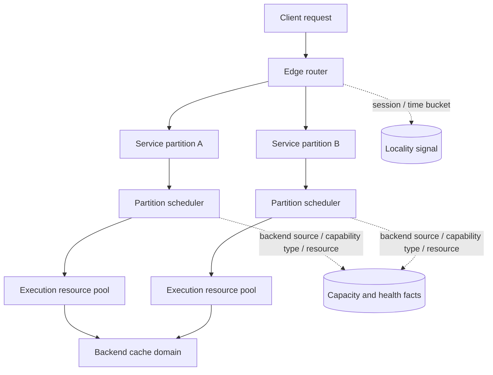
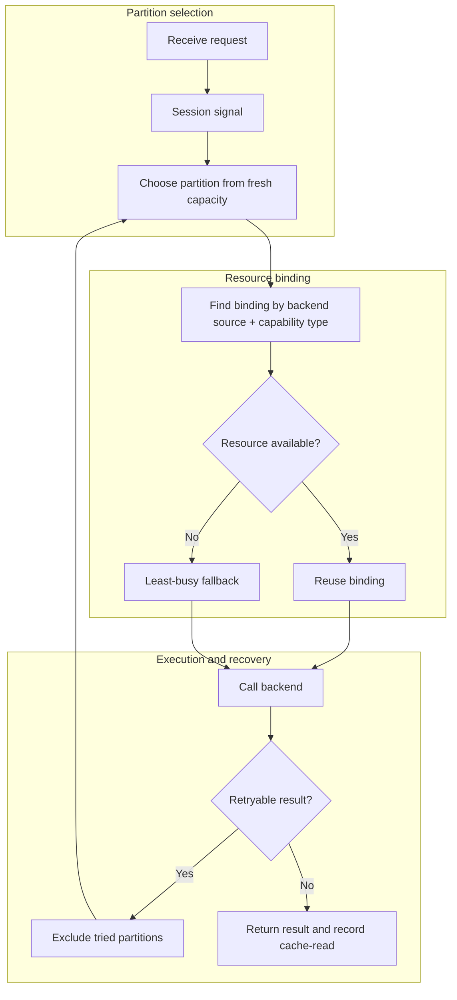
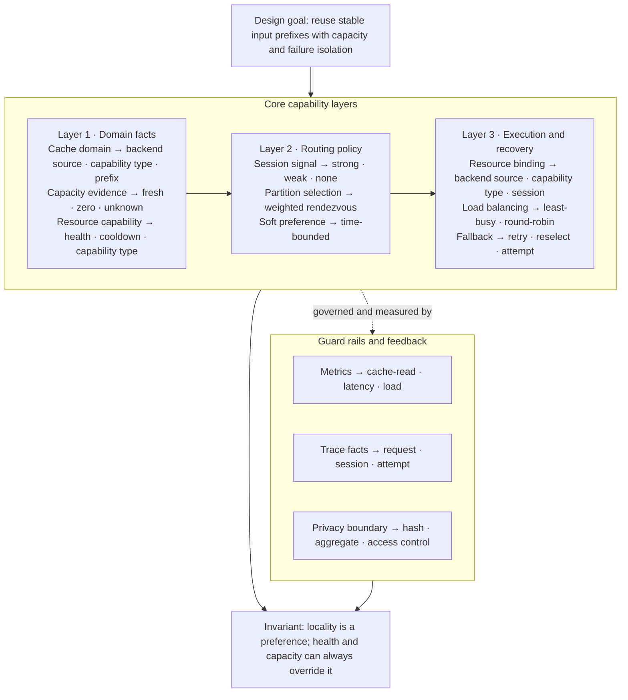

Cache optimization easily starts with a number: What is the hit rate? If the hit rate is not enough, extend the TTL, add a layer of Redis, and stick more requests to the same machine. This sequence often keeps people busy for a long time without actually answering the question.

When I recently re-examined a set of multi-layer execution services, I discovered a more basic question: where is the cache? I initially thought of it as "send the request to the same place as much as possible", but later I discovered that an external request will go through at least four places that may affect reuse: request identity, edge routing partition, execution resources selected by the scheduler in the partition, and input cache maintained by the backend source itself. They are not the same cache, nor the same scheduler.

~~~text
请求
  -> 请求/session 身份
  -> 边缘路由层：服务分区局部性
  -> 分区调度器：执行资源局部性
  -> 后端来源 + 能力类型 + 稳定输入前缀
  -> 后端输入缓存
~~~

If any layer is broken up, the next layer may become cold again. In turn, forcibly binding all requests to one place will also create hot spots and long tails. What really needs to be defined here is not a certain cache component, but the facts, identities, and invalidation conditions; after the boundaries are clear, it makes sense where to put the cache.

The most easily overlooked thing in the picture is the two sets of dotted lines: the locality signal only tells the route "where to get closer first", and the capacity and health facts determine "whether it can go there now". Neither of them is the input cache itself.

Go through a request completely and the boundaries will be clearer. Assume that the client brings a stable session identity: the edge router first combines it with the current time bucket into a sticky key, and then selects a service partition with fresh capacity evidence; if all snapshots are expired, the partition is regarded as unknown, instead of directly determining that there is no capacity. After the request enters the partition, the scheduler then uses `backend source + capability type + session identity` to find the execution-resource binding. If the bound resource is still available, keep this locality; if the resource is unavailable, let the least-busy selector choose another one and record this switch in `attempt`. Finally, only the cache-read fact returned by the backend can prove that the input cache actually hit.

There are three results that cannot be confused in this path: successful routing does not mean that the input cache is hit; execution resource switching does not mean that the session ends; and the final success of the request does not mean that the backend only tried once. Each subsequent design is to protect one of the boundaries.

## A counterexample: the hit rate has gone up, but the system has not improved

There is a class of callers that send nearly the same long template over and over again without providing a real conversation ID. The system can only generate a stable hash from the first few messages, and then treat this hash as a short-term session signal. This initially looks like an efficient optimization: requests for the same template are sent to the same service partition, and the backend cache-read will increase. The problem soon appeared in another way. This hash represents "template", not "conversation". The larger the template traffic, the easier it is to be concentrated into the same partition; the resource binding within the partition keeps some requests in the same lane. Other partitions and resources are obviously idle, but because backend snapshots, edge stickiness, and intra-partition scheduling do not know each other's choices, they can only wait for TTL expiration, resource cooling, or request failure before redistribution.

Later, if the time bucket is shortened, hot spots will be alleviated; if unavailable resources are handed over to least-busy, faults will also converge. But this is just a few patches stacked on top of each other. The real problem is: a signal that does not represent a dialogue is used to affect multiple scheduling layers at the same time, and each layer regards its own local optimum as global locality. The hit rate is improved, but the tail latency and capacity utilization are not necessarily improved.

The conclusion left by this counterexample is that weak identity can only be used as a soft preference at best and cannot be a cross-layer hard binding; the service partition and the resources within the partition cannot each have a set of sticky states that are unaware of each other. You must first answer "What determines the backend cache domain?" and then decide which layer is responsible for sending requests to this cache domain.

## First confirm what you are measuring

If each record has `input_tokens` and `cache_read_tokens`, a common token cache hit rate is:

$$
cache\_hit\_rate = \frac{\sum cache\_read\_tokens}{\sum input\_tokens}
$$

The denominator already includes the input token read from the cache, the uncached input token, and the token newly written to the cache, so the cache token cannot be added again. More importantly, you should sum and then divide, rather than calculating the percentage of each request and then averaging.

This rate and request hit rate answer different questions: request hit rate focuses on how many requests have at least one cache read; token hit rate focuses on how many input tokens are covered by cache reads. A large input may contribute the vast majority of tokens, so a few large requests can significantly change the token hit rate. It is suitable for answering how much the input cost is reused, but it cannot directly answer how much faster the user request is.

Capability mixing can make this number even more misleading. Assume that one capability type accounts for most input tokens, but its backend cache-read signal is close to zero; another capability type maintains a high hit rate across multiple service partitions. Combining them into one overall number tells you mostly about traffic composition, not necessarily about the quality of the caching strategy.

Therefore I will look at at least three tables at the same time:

| Perspective | Questions suitable to answer |
| --- | --- |
| Partition total | How many of the current input tokens have been read and reused? |
| Backend source × capability type | Which capabilities differ across which partitions? |
| Fixed capability type weight | If the traffic composition remains unchanged, has the strategy itself become better? |

Simple averaging cannot be used directly between partitions. When one partition processes a lot of tokens and the other processes very little, averaging over multiple percentages makes no business sense. The weight should come from the denominator of the same indicator, and partitions with different traffic sizes cannot be regarded as several experimental groups of equal size.

## The first thing: separate the request identity and session identity

A request requires a request ID for auditing and idempotence; a conversation requires a session identity for locality. The two cannot be substituted for each other.

Edge routing will generate a server UUID for each request and concatenate it with the request/trace ID of the internal scheduler. The request ID passed by the client can only be used for debugging and cannot be used as the trace primary key because the client can send the same value repeatedly. Similarly, a hash of the input content can help with ad hoc routing, but cannot impersonate the real conversation ID.

The priority of session identity should be fixed and the source noted:

~~~text
后端特有的 session header
  -> 后端 metadata 中的 session
  -> 兼容客户端的 session header
  -> generic session header
  -> affinity header
  -> client request correlation ID
  -> body.session_id / sessionId
  -> prompt_cache_key
  -> conversation / conversation.id
  -> metadata.user_id
  -> conversation_id
  -> opening messages 的稳定 hash
~~~

The key to this chain is not to "find as many strings as possible", but that strong signals must come before weak signals. `metadata.user_id` often represents an entire user or account, not a conversation; the hash of opening messages may allow all independent runs using the same template to share an identity. They can be used as short-term routing hints, but they do not have the same life cycle as real sessions.

Three small things need to be done when implementing: remove blanks from explicit IDs, reject control characters and long values; add a namespace to the ID, such as `source-a:...`, `source-b:...`, and `cache:...`; return `{ id, source }` instead of just returning a string. The namespace prevents collisions between identical opaque IDs from different protocols, and the source allows the trace to explain "why this request is stuck."

If you want to use session facts for billing or reconciliation, you cannot directly save the original text. An independent secret should be used for versioned HMAC, and only hash, source, confidence, and version number should be persisted. The current route stickiness can only exist in memory and the trace summary; session-level reports must define coverage separately, and sticky keys cannot be upgraded to historical session facts afterward.

## The second thing: partition stickiness of edge routing

Edge routing is responsible for answering "Which service partition should the request go to first?" and is not responsible for selecting specific execution resources within the partition. Candidate partitions come from a capacity snapshot table: each `(partition, backend source)` has `ready_count`, `cooling_count`, `total_count` and `updated_at`.

Candidate judgment needs to distinguish three states:

~~~text
fresh snapshot + ready > 0       -> 正常候选
fresh snapshot + ready == 0      -> 有证据证明没有容量，排除
没有 fresh snapshot              -> 未知；允许探测，不要替网关返回 503
~~~

This "unknown does not equal empty" rule is important. There may be no data temporarily due to newly added service partitions, snapshot table truncation, or refresh-task failure. If no snapshot is treated as zero capacity, the failure of the refresher itself will be magnified into unavailability of the entire site. The authoritative capacity view belongs to the scheduler within the partition; when the edge route does not know enough, the request should be handed to the scheduler for judgment.

`cooling` is not equal to null either. A service partition may still have execution resources, but they are waiting for a cooling window with temporary throttling. You can use the normal available number as the weight; if all resources are cooling, give the partition a small minimum weight instead of deleting it immediately. In this way, a partition with a real headroom will clearly win, but when the entire service pool is briefly cooling down, traffic can still reach the place where it is most likely to recover quickly.

When there is a session key, it is suitable to use weighted rendezvous hashing:

$$
score(c) = \frac{-\ln(H(sessionKey, c))}{weight(c)}
$$

Get the partition with the smallest score. `H` must be a stable hash that relies only on input, and cannot use random state in isolate. In this way, the same key will stably fall into the same partition when the candidate set remains unchanged; when adding or removing a partition, only the affected keys need to be migrated, and all keys will not be changed together like `hash(key) % N`. When there is no session key, it degenerates into random selection weighted by capacity.

The session key also requires an absolute time bucket:

~~~text
strong conversation signal -> session-id + hour bucket
weak user/message signal     -> signal + short bucket
no signal                    -> weighted random
~~~

The time bucket is not the idle timeout, but the upper limit of forced re-bucketing. A long session that is never quiet cannot occupy the same partition permanently; a weak signal especially cannot put all the traffic of a fixed input template on one resource pool. In practice, fixed-template traffic is easily concentrated in a single partition for a long time. Short buckets are designed to solve this problem of "seemingly high hit rate but actual capacity imbalance".

## The third thing: resource stickiness within the partition

After the request reaches the partition, the work of edge routing has been completed. Only the scheduler in the partition can see which execution resources are available locally, which resources are cooling, and whether a certain capability type is unavailable on a particular resource. So don't let edge routers select resources based on a snapshot from a few seconds ago; that would duplicate an existing scheduler and introduce a more serious stale-state problem.

The session affinity of the scheduler in the partition can be understood as "caching with fallback":

~~~text
cache key = backend source + session identity + capability type

cache hit + bound resource still available
  -> reuse the resource
cache hit + bound resource unavailable
  -> fallback selector chooses another available resource, rebind
cache miss
  -> fallback selector chooses resource, then bind
~~~

Here you must put the backend source and capability type into the key. The same session may first request one capability type and then another that is supported by only some execution resources; if you use only the session ID, an incorrect binding may skip resources that are actually available or mix different backend sources together.

There are two types of fallback selectors for partition schedulers: round-robin and least-busy. Round-robin is suitable for situations where the request costs are close; however, a long streaming turn may occupy execution resources for several minutes, while a short classification request only takes up one second. In this case, rotation based on the number of requests will continue to send new requests to already busy resources. least-busy maintains the `inFlight` count of each execution resource, selects the smallest value among the candidates, and then uses round-robin to break the tie.

`Acquire` must occur before the actual call to backend, and `Release` must cover success, error, timeout, client cancellation and end of stream. It is best to wrap the release function with once: streaming requests often have multiple ending paths, and repeated releases will make the resources appear to be more idle than they actually are, and then all traffic will be sucked through.

session-affinity should not bind weak identities permanently. Keys such as `message-hash` and `user` can participate in the partition stickiness of short TTL at most; in the partition, durable resource binding can even be directly bypassed and handed over to least-busy. Otherwise, the fixed template will merge different conversations into one resource, and the user identity will put the entire heavy users on one resource.

## Resource stickiness, hot spots and warm set

Single binding works well for serial sessions: successive requests for the same session land on the same execution resource, and the input cache has a chance to stay warm. But concurrent sessions expose its boundaries. When two requests arrive at the same time, they may both read the same bound resource and occupy this lane together; if both requests fail and then fallback respectively, the binding may be overwritten repeatedly. If the business does have high concurrency and long sessions, the single binding can be evolved into a warm set with an upper limit: one primary, plus one secondary; it will only be expanded when concurrency pressure is observed. Don't scale by lifetime request count, since a session that's a few thousand per day but always serial doesn't constitute a hotspot; scale by active request, reservation, and duration.

This solution requires an explicit concurrency protocol:

1. Read the lane in the lock and count `reserved + active` into the pressure.
2. Reserve candidate lanes in the lock to prevent two requests from considering the same resource free at the same time.
3. Call the fallback selector after releasing the lock. Network calls cannot be placed in the lock.
4. Use generation or CAS to confirm that the candidate still belongs to the current binding; if it is taken away by others, reselect it.
5. Only resources that successfully complete a request can become durable warm lanes; failed fallback should not pollute the next request.
6. Set a hard cap, idle TTL, and failed eviction rules for the warm set.

Warm set is a compromise between capacity and locality, rather than letting each session light up the entire resource pool. It is an evolution after the single-binding solution is squeezed out of the bottleneck by real concurrency; without observational proof, single primary + fallback is easier to explain and easier to recover.

## Failover must log attempt

Stickiness can never become hard binding. Partition snapshots may be stale, execution resources may happen to trigger temporary throttling, and network links may be interrupted. Requests should be made with a set of `tried partitions` for limited failover, rather than excluding only the machine from the last attempt: the weighted rendezvous score is stable, and if all tried partitions are not excluded, the next round may immediately select back the place that just rejected it.

Only retry results that clearly indicate "this service partition is temporarily unavailable", such as transmission failure, temporary unavailability, or throttling; errors actually returned by the backend do not necessarily mean that the partition can be safely retried. Each attempt records at least:

~~~text
trace_id, attempt_no, partition_id, scheduler_request_id,
started_at, completed_at, status, transport_ok, outcome
~~~

The end user receiving a successful response does not mean that the backend only made one attempt. Stuffing `initial_partition`, `final_partition`, and a piece of JSON into the trace can work at first, but if you want reliable reconciliation, the attempt should ultimately be a first-class fact. Failed failover attempts cannot be miscalculated as user consumption; the session summary should only aggregate traces that ultimately meet the billing criteria.

Execution resources within the partition can also return stable internal attribution headers. Edge routing reads them for attribution and troubleshooting, then strips all internal routing headers before returning to the client. Public APIs should not reveal internal resource numbers, management information, or routing details; if compatibility with old headers is required, those headers should also be cleaned up at the boundary layer.

## single-flight, TTL and expiration

Locality solves "where it should go" but does not solve cache reconstruction under concurrency. When multiple requests find the same snapshot at the same time or the aggregation result expires, single-flight is required: the first call registers the in-flight promise, subsequent calls share it, and finally write it back only once.

Registration must occur before the first `await`. Otherwise, both calls can read the miss first and hand over the execution right before registration, and single-flight will be useless. The in-flight key must also contain all parameters that affect the calculation results; the same cache key cannot mask different backend sources, capability types, or permissions.

Single-flight typically only covers one edge running instance or one in-partition gateway process. Cross-machine shared KV/Redis is suitable for pool-load snapshots with short TTL, but is not suitable for carrying resource ownership that must be strongly consistent. When the shared cache read fails, the local result must be returned; writeback can be best effort, and a recoverable observation-cache failure cannot be turned into a user request error.

TTL determines both "how long values ​​can be reused" and "how long errors can be hidden". Can be layered semantically:

| Data | Suggestion Semantics |
| --- | --- |
| pool-load / partition snapshot | Short TTL; bounded stale-if-error allowed on source failure |
| Model catalog or aggregated results | Medium TTL; expires and refreshed by next access |
| Facts inside request/turn | Do not write long-term shared cache |
| Execution-resource ownership and security status | Do not replicate to a cache that cannot interpret ownership merely to improve hit rate |

The stale-if-error must preserve the original `updated_at` and mark the route trace with `stale=true`. The success of the current read does not mean that the old snapshot is newer; if no evidence is retained, the scheduler will quietly regard the capacity a few minutes ago as the real-time capacity.

Failure can also race against ongoing computations:

~~~text
generation = 7
  -> 计算 A 读取 generation 7
  -> invalidate: generation = 8, delete old value
  -> 计算 B 写入新值
  -> 计算 A 完成，不能把 generation 7 写回
~~~

Therefore, the generation is remembered at the beginning of the calculation and compared before writing back; the generation is incremented when it fails. If a race condition may still occur between checking and writing, you can check again after writing and delete the value just written if it is found to be invalid. Caching is not about "reading and writing a few lines of code". As long as calculations are delayed and invalidations can occur concurrently, you must define when the old value cannot be returned.

## The observation contract must cover the entire chain

Only recording the final cache hit is not enough to locate the problem. Each request should be able to associate at least:

~~~text
request_id / trace_id
source, capability_type
session source（不一定是原文）
sticky bucket
initial partition, candidate partitions, final partition
snapshot age, ready_count, cooling_count, selection reason
attempt list and failover reason
internal resource id（内部/受限）
cache read/write tokens, input tokens
TTFT/total latency, status, timeout, throttling
~~~

Only aggregated results are displayed externally. The session hash, internal resource identification, inputs, Authorization, API keys, and raw headers should not enter public reporting or alerting systems. The log should be able to answer "Why was it not reused this time?", but it should not copy private facts to more places in order to answer it.

It is recommended to put the following indicators in the same analysis table:

| Level | Indicator |
| --- | --- |
| session → partition | session coverage, partition switching rate, sticky source distribution |
| partition → resource | resource cache hit, binding miss, unavailable reselect, in-flight p95 |
| resource → backend source | capability/cache key compatibility rate, current limit/cooldown, backend TTFT |
| Overall | token hit rate, request hit rate, p50/p95 TTFT, failover, success rate |

If the production database does not yet hold strict session facts, report `not_collected` explicitly rather than using partition, client request ID, or temporal proximity to infer a seemingly complete session. Real-time deductions should still use trace as the only fact; session can only be a recalculated aggregation and interpretation dimension.

## Privacy and information boundaries

Observability and attribution for execution service systems require preservation mechanisms but should not expose system maps. External descriptions retain only roles and algorithms, not values that could locate the actual deployment: repository name, domain, IP, machine name, partition number, resource count, capacity limit, traffic proportion, time window, log path, management interface, key name, or the original name of an internal header. The `edge router`, `scheduler`, `partition-a`, and `internal resource id` in the example are just roles and placeholders.

Privacy boundaries do not just mean removing inputs. Session/conversation IDs, request IDs, API keys, Authorization, OAuth information, account emails, user IDs, exact IPs, user agents, original headers, complete requests/responses, reversible hashes, and combinations of fields that could reconstruct several requests belonging to one user should not enter external materials, screenshots, sample logs, or public datasets. When statistics need to be displayed, use aggregated proportions or ranges and suppress small samples; when relationships need to be shown, use newly generated pseudonymous IDs rather than truncating real values until they merely look anonymous.

Internal systems can retain finer traces and backend attribution, but external interfaces and technical descriptions only describe field categories, lifecycles, and access boundaries. This allows the algorithm to be reproduced without exposing specific sources, deployment topology, capacity scale, or real user behavior.

## Is this the optimal solution?

Not necessarily. More precisely, the previous solution is a progressive repair of an existing multi-layer execution system: first, let the edge router and partition scheduler stop fighting each other, then use observation to confirm where caching actually helps. Its advantage is that the changes are small and can be rolled out layer by layer; the cost is that two sets of scheduling state, two capacity views, and two kinds of expiration still exist. A session has one binding at the edge layer and may have another inside the partition, and either layer can overturn the previous layer's decision because of staleness or unavailability.

If it could be redesigned, I would prioritize "cache domain" over "multi-level stickiness":

~~~text
cache domain = backend source + capability type + compatible input prefix
                         + resource capability

one scheduler prefers a cache domain
  -> chooses a service partition with fresh capacity
  -> chooses a compatible execution resource inside it
  -> falls back when load, health, or capability disagrees
~~~

The focus here is an authoritative scheduler and a soft preference. A session is not directly bound to an account or machine; it only improves the score of a cache domain. Load, health, capacity, and cooling status can override that preference at any time. The partition is responsible only for providing available execution locations. It no longer reinvents a set of session bindings unrelated to the edge layer, or at least passes the edge selection through as an explicit routing lease instead of leaving downstream components to guess.

This direction is generally cleaner than the current solution, but it is not unconditionally better. It requires a unified scheduling protocol, shared or propagatable capacity facts, and sufficiently stable backend cache keys. If resource credentials can only remain on the local machine and the backend cache does not guarantee reuse across resources, the scheduler cannot pretend to own a global cache domain. In that case, the most reliable design is for the partition scheduler to control the final selection while the edge layer handles only coarse-grained health and capacity routing.

Therefore, the judgment criterion is not "the more stickiness, the better", but three questions: does the cache domain really correspond to the backend's reuse boundary; does the component selecting that domain have sufficiently fresh capacity facts; and can the system complete fallback in a clear place when the soft preference fails? When the three answers cannot all be yes, no matter how elegant rendezvous hashing is, it only makes the wrong layering more stable.

This picture does not draw the system into several services, but breaks it down into several types of capabilities that must be separately responsible. The upper layer first defines reuse boundaries and capacity facts. The middle layer turns sessions into time-limited soft preferences. The lower layer is responsible for actual execution and recovery. The bottom layer stipulates which facts can be observed and which information must be isolated. The most important constraint is: locality can increase priority, but health and capacity can always override it.

## A reusable implementation sequence

If it is a gradual transformation, a similar system is suitable to be implemented in the following order instead of adding Redis at the beginning:

If it is a new system, the "cache domain, capacity fact and unique scheduling right" should be written into the interface contract first, and then decide whether the following compatibility layers are needed; otherwise, it is easy to solidify temporary patches into the architecture.

1. First write pure functions and tests: session-identity priority, namespace, weak-signal TTL, capability type, stable hash, candidate set, and failover exclusion.
2. Record the initial and final partition, candidates, snapshot age, attempt, and final resource attribution in the request trace; first make "where the cache is" visible.
3. Implement fresh/unknown/zero capacity rules and weighted rendezvous for edge routing; keep weighting random when there is no session.
4. Implement the TTL binding of `backend source + session + capability type` in the partition scheduler, and return unavailable resources to least-busy/round-robin.
5. Add Acquire/Release pairs to least-busy, and test cancellation, timeout, repeat end and stream error.
6. Add single-flight, generation invalidation and bounded stale-if-error to snapshot/aggregation results.
7. Shadow first, then run a small traffic canary; compare by backend source/capability type, partition, and fixed traffic weight instead of looking only at a fleet-wide hit rate.
8. Only increase the warm set with an upper limit after observation proves that concurrent sessions are indeed suppressing the primary lane.
9. If session-level reports are needed, add HMAC session facts and coverage separately; do not turn a routing heuristic directly into settlement facts.

Acceptance should also be a constraint, not a single target: while token hit rate improves, partition/resource switching must remain bounded, p95 TTFT, rate limiting, timeout, and failover must not worsen, hotspots must not hold a single lane for too long, and an unavailable cache must not block the main process. Especially when the cache-read signal for one capability type is close to zero, first confirm the backend cache semantics and instrumentation before deciding whether the route needs to change.

Cache optimization ultimately comes back to a simple judgment: first figure out where reuse occurs, then decide what should stay together, when movement is allowed, and when old values must be discarded. The cache is not an isolated Redis; it is a locality system composed of request identity, capability type, resource, partition, time, and concurrency.
