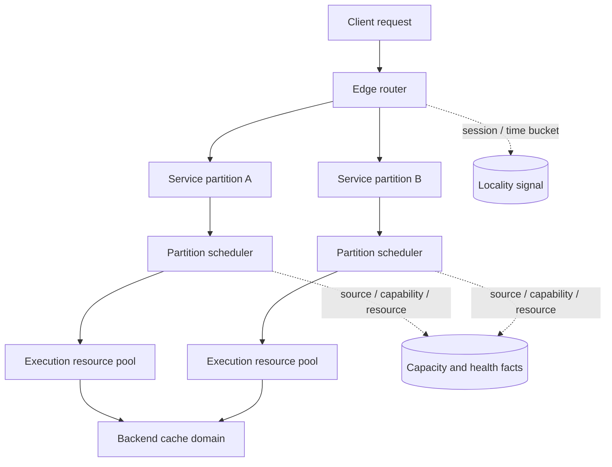
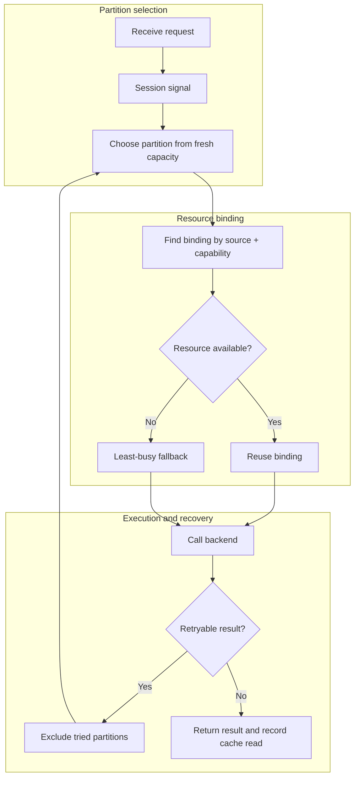
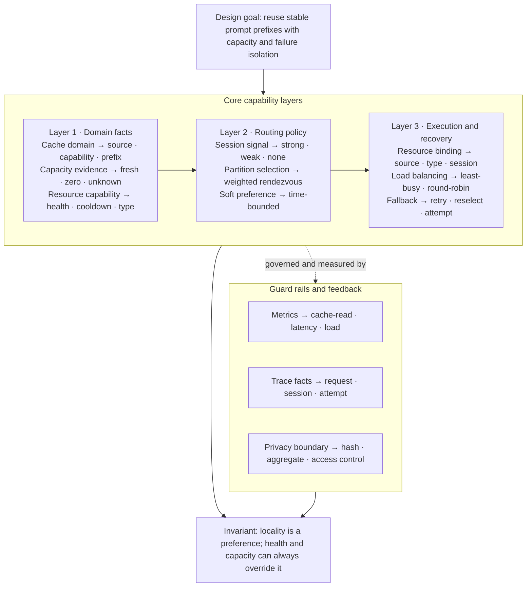

缓存优化很容易从一个数字开始：命中率是多少？如果命中率不够，就延长 TTL、加一层 Redis、把更多请求粘到同一台机器。这个顺序经常让人忙很久，却没有真正回答问题。

重新看一套多层执行服务时，我发现更基础的问题是：缓存到底在哪里。我一开始也把它看成“把请求尽量送到同一个地方”，后来才发现，一个请求从外部进入后，至少会经过四个可能影响复用的地方：请求身份、边缘路由选择的服务分区、分区内调度器选择的执行资源，以及后端服务自己维护的输入缓存。它们不是同一个缓存，也不是同一个调度器。

~~~text
请求
  -> 请求/session 身份
  -> 边缘路由层：服务分区局部性
  -> 分区调度器：执行资源局部性
  -> 后端来源 + 能力类型 + 稳定输入前缀
  -> 后端输入缓存
~~~

任何一层被打散，下一层都可能重新变冷。反过来，强行把所有请求绑定在一个地方，也会制造热点和长尾。这里真正需要先定义的不是某种缓存组件，而是事实、身份和失效条件；边界清楚之后，缓存放在哪里才有意义。

图里最容易被忽略的是两组虚线：局部性信号只告诉路由“优先靠近哪里”，容量与健康事实才决定“现在能不能去那里”。它们都不是输入缓存本身。

把一个请求完整走一遍，边界会更清楚。假设客户端带来了一个稳定的会话标识：边缘路由先把它和当前时间桶组合成 sticky key，再从有新鲜容量证据的服务分区中选择一个；如果所有快照都过期，就把分区视为未知，而不是直接判定没有容量。请求进入分区后，调度器再用“后端来源 + 能力类型 + 会话标识”查找执行资源绑定。绑定资源仍可用，就保持这条局部性；资源不可用，就交给负载较低的候选重新选择，并把这次切换记进 attempt。最后，只有后端返回的缓存读取事实才能证明输入缓存真的命中了。

这条路径里有三个不能混淆的结果：路由选择成功，不等于输入缓存命中；执行资源切换，不等于 session 结束；请求最终成功，也不等于后端只尝试过一次。后面的每个设计，都是在保护其中一个边界。

## 一个反例：命中率上去了，系统却没有变好

有一类调用方会反复发送几乎相同的长模板，但没有提供真正的会话标识。系统只能从开头几段内容生成一个稳定 hash，再把这个 hash 当作短期的 session 信号。这样做起初很像是有效优化：相同模板的请求被送到同一个服务分区，后端的缓存读取也会增加。

问题很快出现在另一张图上。这个 hash 代表的是“模板”，不是“会话”。模板流量越大，越容易被集中到同一个服务分区；分区内的资源绑定又把一部分请求继续留在同一条 lane。其他分区和资源明明有空闲，却因为容量快照、边缘粘性和分区内调度彼此不知道对方的选择，只能等 TTL 到期、资源冷却或请求失败后才重新分布。

后来把时间桶缩短，热点会缓解；把不可用资源交给 least-busy，故障也会收敛。但这只是把几个补丁叠在一起。真正的问题是：一个不代表对话的信号，被同时拿来影响多个调度层，而每一层都把自己的局部最优当成了全局局部性。命中率改善了，尾延迟和容量利用却没有必然改善。

这个反例留下的判断是：弱身份最多只能作为 soft preference，不能成为跨层硬绑定；服务分区和分区内资源也不能各自拥有一套互不知情的粘性状态。要先回答“后端缓存域到底由什么决定”，再决定哪一层负责把请求送进这个缓存域。

## 先确认你测量的是什么

如果每条记录都有 `input_tokens` 和 `cache_read_tokens`，一个常见的 token cache hit rate 是：

$$
cache\_hit\_rate = \frac{\sum cache\_read\_tokens}{\sum input\_tokens}
$$

分母已经包含缓存读到的输入 token、未缓存的输入 token 和新写入缓存的 token，就不能再把 cache token 加一遍。更重要的是，应该先求和再除，而不是先算每个请求的百分比再做平均。

这和 request hit rate 回答的是不同问题：request hit rate 关注多少请求至少发生了一次缓存读取；token hit rate 关注多少输入 token 被缓存读取覆盖。一个很大的 prompt 可能贡献了绝大多数 token，因此几个大请求就能显著改变 token 命中率。它适合回答输入成本有多少被复用，却不能直接回答用户请求有多少变快。

能力类型混合会让这个数字更容易误导。假设某类能力占据绝大多数输入 token，但它的后端缓存读取信号接近于零；另一类能力在多个服务分区上都保持很高命中率。把它们合并成一个总体数字，得到的主要是流量构成，而不一定是缓存策略的质量。

因此我会至少同时看三张表：

| 视角 | 适合回答的问题 |
| --- | --- |
| 分区总计 | 当前输入 token 有多少被读取复用？ |
| 来源 × 能力类型 | 哪些能力在什么分区上有差异？ |
| 固定模型权重 | 如果流量构成不变，策略本身有没有变好？ |

集群之间也不能直接用简单平均。一个集群处理了很多 token，另一个处理得很少时，多个百分比的平均没有业务意义。权重应该来自同一指标的分母，不能把不同流量规模的集群当成几个等大的实验组。

## 第一件事：把请求身份和 session 身份分开

一次请求需要一个 request ID 做审计和幂等；一段对话需要一个 session identity 做局部性。两者不能互相替代。

边缘路由会为每次请求生成服务端 UUID，并把它和内部调度器的 request/trace ID 串起来。客户端传来的 request ID 只能用于调试，不能成为 trace 主键，因为客户端可以重复发送同一个值。类似地，输入内容的 hash 可以帮助临时路由，却不能冒充真正的 conversation ID。

session identity 的优先级应该固定，并且把来源记下来：

~~~text
后端特有的 session header
  -> 后端 metadata 中的 session
  -> 兼容客户端的 session header
  -> generic session header
  -> affinity header
  -> client request correlation ID
  -> body.session_id / sessionId
  -> prompt_cache_key
  -> conversation / conversation.id
  -> metadata.user_id
  -> conversation_id
  -> opening messages 的稳定 hash
~~~

这条链的关键不是“尽可能找一个字符串”，而是强信号必须排在弱信号前面。`metadata.user_id` 往往代表整个用户或账号，不是一段对话；opening messages 的 hash 可能让所有使用同一个模板的独立运行共享一个身份。它们可以作为短时间的路由提示，却不能获得和真实 session 相同的生命周期。

实现时要做三件小事：对显式 ID 去空白、拒绝控制字符和过长值；给 ID 加 namespace，例如 `source-a:...`、`source-b:...`、`cache:...`；返回 `{ id, source }` 而不是只返回字符串。namespace 防止不同协议里相同的 opaque ID 碰撞，source 则让 trace 能解释“为什么这次请求被粘住”。

如果要把 session 事实用于计费或对账，不能直接存原文。应该使用独立 secret 做版本化 HMAC，只持久化 hash、source、confidence 和版本号。当前路由粘性可以只在内存和 trace summary 中存在；session 级报表则必须另行定义覆盖率，不能把 sticky key 事后升级成历史 session 事实。

## 第二件事：边缘路由的分区粘性

边缘路由负责回答“请求先去哪一个服务分区”，不负责选择分区内的具体执行资源。候选分区来自一个容量快照表：每个“分区 × 来源”有可用、冷却、总量和更新时间等字段。

候选判断要区分三种状态：

~~~text
fresh snapshot + ready > 0       -> 正常候选
fresh snapshot + ready == 0      -> 有证据证明没有容量，排除
没有 fresh snapshot              -> 未知；允许探测，不要替网关返回 503
~~~

这条“未知不等于空”的规则很重要。新加的服务分区、快照表截断、刷新任务失败，都可能暂时没有数据。如果把没有快照当成零容量，刷新器自身的故障就会被放大成全站不可用。真正的容量权威在分区内调度器；边缘路由不知道时，应把请求交给调度器判断。

`cooling` 也不等于空。一个服务分区可能还有执行资源，只是它们正在等待暂时性限流的冷却窗口。可以把正常可用数作为权重；如果全部资源都在 cooling，则给这个分区一个很小的保底权重，而不是立即删除。这样有真实 headroom 的分区会明显胜出，但整个服务池短暂都在冷却时，流量仍然可以到达最可能很快恢复的地方。

有 session key 时，适合使用 weighted rendezvous hashing：

$$
score(c) = \frac{-\ln(H(sessionKey, c))}{weight(c)}
$$

取 score 最小的分区。`H` 必须是只依赖输入的稳定 hash，不能使用运行实例内的随机状态。这样同一个 key 在候选集合不变时会稳定落到同一个 partition；新增或移除一个 partition 时，只有受影响的 key 需要迁移，不会像 `hash(key) % N` 那样让所有 key 一起换家。没有 session key 时，再退化为按容量加权的随机选择。

session key 还需要绝对时间桶：

~~~text
strong conversation signal -> session-id + hour bucket
weak user/message signal     -> signal + short bucket
no signal                    -> weighted random
~~~

时间桶不是 idle timeout，而是强制重新分桶的上限。一个永远不安静的长会话也不能永久占住同一个服务分区；弱信号尤其不能把固定输入模板的全部流量压在一个资源池上。实践中，固定模板流量很容易长期集中到单一分区，短桶就是为了解决这种“看似命中率高、实际容量失衡”的问题。

## 第三件事：分区内资源粘性

请求到达分区之后，边缘路由的工作已经完成。分区内调度器才能看到本地有哪些执行资源、哪些资源正在 cooling、某种能力是否对某个资源不可用。因此不要让边缘路由根据几秒前的快照去选择资源；那会复制一个已经存在的调度器，并引入更严重的陈旧状态问题。

分区内调度器的 session-affinity 可以理解成“带回退的缓存”：

~~~text
cache key = backend source + session identity + capability type

cache hit + bound resource still available
  -> reuse the resource
cache hit + bound resource unavailable
  -> fallback selector chooses another available resource, rebind
cache miss
  -> fallback selector chooses resource, then bind
~~~

这里必须把后端来源和规范化后的能力类型放进 key。相同 session 可能先请求一种能力，再请求另一种只有部分执行资源支持的能力；如果只用 session ID，错误绑定会让本来可用的资源被跳过，或者把不同来源的身份混在一起。

分区内调度器的 fallback selector 有两类：round-robin 和 least-busy。round-robin 适合请求成本接近的情况；但一个长 streaming turn 可能占住执行资源几分钟，而一个短分类请求只占一秒，这时按请求次数轮转会把新请求继续送给已经很忙的资源。least-busy 维护每个执行资源的 `inFlight` 计数，在候选中先选最小值，再用 round-robin 打破平局。

`Acquire` 必须发生在真正调用后端前，`Release` 必须覆盖成功、错误、超时、客户端取消和流结束。释放函数最好用 once 包装：流式请求经常有多个结束路径，重复 release 会让资源看起来比实际更空闲，随后所有流量都会被吸过去。

session-affinity 不应把弱身份永久绑定。`message-hash` 和 `user` 这类 key 最多参与短 TTL 的集群粘性；在集群内甚至可以直接绕过 durable resource binding，交给 least-busy。否则固定模板会把不同对话合并到一个资源，用户身份又会把整个重度用户压在一个资源上。

## 资源粘性、热点和 warm set

单一绑定对串行会话很有效：同一对话连续请求落在同一执行资源，输入缓存有机会保持温热。但并发会话会暴露它的边界。两个请求同时到来时，都可能读到同一个绑定资源，然后一起占用这条 lane；如果两个请求都失败后再各自 fallback，还可能反复覆盖绑定。

如果业务确实存在高并发长会话，可以把单一绑定演进成有上限的 warm set：一个 primary，加一个 secondary；只有观察到并发压力时才扩展。不要依据 lifetime request count 扩展，因为一个每天几千次但始终串行的会话并不构成热点；应该依据 active request、reservation 和持续占用时间。

这个方案需要一个明确的并发协议：

1. 在锁内读取 lane，并把 `reserved + active` 计入压力。
2. 在锁内预留候选 lane，避免两个请求同时认为同一个账号空闲。
3. 释放锁后调用 fallback selector，不能把网络调用放在锁里。
4. 用 generation 或 CAS 确认候选仍然属于当前 binding；被别人抢走就重新选择。
5. 只有成功完成一次请求的账号才能成为 durable warm lane；失败的 fallback 不应污染下次请求。
6. 给 warm set 设置硬上限、空闲 TTL 和失败驱逐规则。

warm set 是容量和局部性的折中，不是让每个 session 点亮整个资源池。它属于在单绑定方案被真实并发压出瓶颈之后的演进项；没有观测证明时，单 primary + fallback 更容易解释，也更容易恢复。

## 故障转移必须记录 attempt

粘性永远不能变成硬绑定。分区快照可能陈旧，执行资源可能刚好触发暂时性限流，网络链路也可能中断。请求应该带着 `tried partitions` 集合做有限 failover，而不是只排除上一次尝试的机器：weighted rendezvous 的分数是稳定的，如果不排除全部已经尝试过的 partition，下一轮可能立刻选回刚刚拒绝它的地方。

只对明确表示“这个服务分区暂时不能服务”的结果重试，例如传输失败、暂时不可用或限流；后端真实返回的错误不一定代表分区可以安全重试。每个 attempt 至少记录：

~~~text
trace_id, attempt_no, partition_id, scheduler_request_id,
started_at, completed_at, status, transport_ok, outcome
~~~

最终用户收到一个成功响应，不代表后端只做了一次尝试。把 `initial_partition`、`final_partition` 和一段 JSON 塞进 trace 能够先工作，但如果要做可靠对账，attempt 最终应该是一等事实。失败转移的尝试不能被误算成用户消费；session 汇总应只聚合最终符合计费口径的 trace。

分区内的执行资源也可以返回稳定的内部 attribution header；边缘路由读取它用于归属和排障，然后在返回客户端前剥掉所有内部路由 header。公共 API 不应泄露内部资源编号、管理信息或路由细节；如果需要兼容旧 header，也应在边界层统一清理。

## single-flight、TTL 和失效

局部性解决“应该去哪里”，不解决并发下的缓存重建。多个请求同时发现同一个 snapshot 或聚合结果过期时，需要 single-flight：第一个调用登记 in-flight promise，后续调用共享它，最后只写回一次。

登记必须发生在第一次 `await` 之前。否则两个调用都能先读到 miss，在登记前交出执行权，single-flight 就形同虚设。in-flight key 也必须包含所有影响计算结果的参数；相同 cache key 不能掩盖不同来源、能力类型或权限。

single-flight 通常只覆盖一个边缘运行实例或一个分区内调度进程。跨机器的共享 KV/Redis 适合放短 TTL 的资源池负载快照，不适合承载必须强一致的资源归属。共享缓存读取失败时要退回本地计算；写回可以 best effort，不能让一个可恢复的观测缓存故障变成用户请求错误。

TTL 同时决定“值能复用多久”和“错误能隐藏多久”。可以按语义分层：

| 数据 | 建议语义 |
| --- | --- |
| resource-pool snapshot | 短 TTL；源失败时允许 bounded stale-if-error |
| 模型目录或聚合结果 | 中 TTL；过期后由下一次访问刷新 |
| request/turn 内事实 | 不写长期共享缓存 |
| 上游资源所有权和安全状态 | 不为命中率复制到无法解释所有权的缓存 |

stale-if-error 必须保留原始 `updated_at`，并在路由 trace 中标记 `stale=true`。当前读取成功不代表旧快照变新；如果不保留证据，调度器会悄悄把几分钟前的容量当成实时容量。

失效还会和正在进行的计算竞态：

~~~text
generation = 7
  -> 计算 A 读取 generation 7
  -> invalidate: generation = 8, delete old value
  -> 计算 B 写入新值
  -> 计算 A 完成，不能把 generation 7 写回
~~~

因此计算开始时记住 generation，写回前比较；失效时递增 generation。若检查与写入之间仍可能发生竞态，可以在写入后再检查一次，发现已经失效就删除刚写的值。缓存不是“读写几行代码”，只要计算有延迟、失效能并发发生，就必须定义旧值何时不能回来。

## 观测契约要覆盖整条链

只记录最终 cache hit 不够定位问题。每条请求至少应能关联出：

~~~text
request_id / trace_id
source, capability_type
session source（不一定是原文）
sticky bucket
initial partition, candidate partitions, final partition
snapshot age, ready_count, cooling_count, selection reason
attempt list and failover reason
internal resource id（内部/受限）
cache read/write tokens, input tokens
TTFT/total latency, status, timeout, throttling
~~~

对外展示时只给聚合结果。session hash、内部上游标识、prompt、Authorization、API key 和原始 header 不应进入公共报表或告警系统。日志要能回答“为什么这次没有复用”，但不能为了回答它而把隐私事实复制到更多地方。

推荐把以下指标放在同一张分析表里：

| 层级 | 指标 |
| --- | --- |
| session → partition | session 覆盖率、分区切换率、sticky source 分布 |
| partition → resource | resource cache hit、binding miss、unavailable reselect、in-flight p95 |
| resource → source | capability/cache key 兼容率、限流/cooldown、后端 TTFT |
| 整体 | token hit rate、request hit rate、p50/p95 TTFT、failover、成功率 |

如果生产数据库尚未保存严格 session fact，就要明确报告 `not_collected`，而不是用 partition、client request ID 或时间邻近推断出一个看似完整的 session。实时扣款仍应以 trace 为唯一事实；session 只能是可重算的归集和解释维度。

## 隐私与信息边界

执行服务系统的观测和归因需要保留机制，但不应暴露系统地图。对外说明只保留角色和算法，不暴露能够定位真实部署的值：仓库名、域名、IP、机器名、分区编号、资源数量、容量上限、流量比例、时间窗口、日志路径、管理接口、密钥名称或内部 header 的原名。示例里的 `edge router`、`scheduler`、`partition-a` 和 `internal resource id` 只是角色和占位符。

隐私边界也不只是删掉 prompt。session/conversation ID、request ID、API key、Authorization、OAuth 信息、账号邮箱、用户 ID、精确 IP、UA、原始 header、完整 request/response、可逆的 hash、以及能把多个请求重新拼回同一用户的组合字段，都不应进入对外材料、截图、示例日志或公开数据集。需要展示统计时，使用经过聚合的比例或区间，并对小样本做抑制；需要展示关联关系时，使用新生成的伪造 ID，不能对真实值做“看起来匿名”的截断。

内部系统可以保留更细的 trace 和资源归因，但外部接口和技术说明只描述字段类别、生命周期和访问边界。这样既能复现算法，也不会暴露具体来源、部署拓扑、容量规模或真实用户行为。

## 这是不是最优解

不一定。前面的方案更准确地说，是对已有多层执行系统的渐进式修复：先让现有的边缘路由和分区调度器少互相打架，再用观测确认哪里真的有缓存收益。它的优点是改动小、可以逐层上线；代价是仍然存在两套调度状态、两份容量视图和两种失效时间。session 在边缘层有一个绑定，在分区内又可能有另一个绑定，任何一层都可能因为陈旧或不可用而推翻上一层的决定。

如果可以重新设计，我会优先考虑“缓存域”而不是“多级粘性”：

~~~text
cache domain = backend source + capability type + compatible input prefix
                         + resource capability

one scheduler prefers a cache domain
  -> chooses a service partition with fresh capacity
  -> chooses a compatible execution resource inside it
  -> falls back when load, health, or capability disagrees
~~~

这里的重点是一个权威调度器和一个软偏好。session 不直接绑定某个账号或某台机器，而是提高某个 cache domain 的分数；负载、健康、能力和冷却状态可以随时压过这个偏好。集群只负责提供可用的执行位置，集群内不再重新发明一套与边缘层无关的 session binding，或者至少要把边缘选择传成明确的 routing lease，而不是让下游猜测。

这个方向通常比当前方案更干净，但也不是无条件更好。它要求统一调度协议、共享或可传播的容量事实，以及后端缓存 key 足够稳定。如果执行凭据只能留在本地、缓存完全不保证跨资源复用，调度器就不能假装拥有一个全局 cache domain；这时最可靠的设计反而是让分区内调度器掌握最终选择，边缘层只做粗粒度的健康和容量路由。

所以判断标准不是“粘性越多越好”，而是下面三个问题：缓存域是否真的对应后端的复用边界；选择缓存域的组件是否拥有足够新鲜的容量事实；软偏好失效时，系统是否能在一个明确的地方完成 fallback。三个答案不能同时成立时，再漂亮的 rendezvous hashing 也只是把错误的分层变得更稳定。

这张图不是把系统画成若干服务，而是把它拆成几类必须分别负责的能力。上层先定义复用边界和容量事实，中间层把 session 变成有时间限制的软偏好，下层负责真正执行和恢复，最下面则规定哪些事实可以被观测、哪些信息必须被隔离。最重要的约束是：局部性可以提高优先级，但健康和容量永远可以推翻它。

## 一个可复用的实现顺序

如果是渐进式改造，类似系统适合按下面顺序落地，而不是一开始就加 Redis：

如果是新系统，则应把“缓存域、容量事实和唯一调度权”先写进接口契约，再决定是否需要下面这些兼容层；否则很容易把临时补丁固化成架构。

1. 先写纯函数和测试：session identity 优先级、namespace、弱信号 TTL、canonical model、stable hash、候选集和 failover 排除。
2. 在请求 trace 中记录 initial/final partition、candidate、snapshot age、attempt 和最终 resource attribution；先让“缓存在哪里”可见。
3. 实现边缘路由的 fresh/unknown/zero 容量规则和 weighted rendezvous；无 session 时保持加权随机。
4. 在分区内调度器实现 `source + session + capability` 的 TTL binding，并把不可用资源交回 least-busy/round-robin。
5. 给 least-busy 加成对的 Acquire/Release，并测试取消、超时、重复结束和 stream error。
6. 对 snapshot/聚合结果加入 single-flight、generation invalidation 和 bounded stale-if-error。
7. 先 shadow，再小流量 canary；按 source/capability、partition 和固定流量权重比较，而不是只看一个 fleet hit rate。
8. 只有在观测证明并发会话确实压住 primary lane 后，再增加有上限的 warm set。
9. 如果需要 session 级报表，单独增加 HMAC session fact 和 coverage；不要把路由 heuristic 直接变成结算事实。

验收也应该是约束，而不是单目标：缓存命中率提高的同时，partition/resource 切换率不能失控，p95 TTFT、限流、超时和 failover 不能恶化，热点不能长期压住单一 lane，缓存不可用也不能阻断主流程。特别是某类能力的缓存读取信号接近零时，先确认后端缓存语义和埋点解析，再决定是否需要改路由。

缓存优化最后还是回到一个朴素判断：先弄清楚复用发生在哪里，再决定应该把什么留在一起、什么时候允许移动、什么时候必须放弃旧值。缓存不是一个孤立的 Redis，它是请求身份、能力类型、资源、服务分区、时间和并发共同构成的局部性系统。
