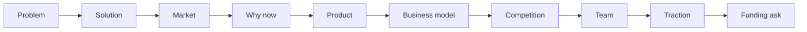

同样是"看一个项目"，其实有三种目的完全不同的视角，很容易混在一起。记下来：**商业模式画布是"做给自己看"，创业路演是"讲给别人听"，投资人尽调是"别人来查你"。** 前者偏"怎么做成"，后者偏"值不值得投"，中间的路演，是把"做成"包装成"值得投"的一次表达。

## 先看总图：三个镜头，不是一条流水线

| 维度 | 商业模式画布 | 创业路演 | 投资人尽调 |
|---|---|---|
| 做给自己看 | 讲给别人听 | 别人来查你 |
| 自洽 | 说服 | 验证 |
| "这生意成立吗" | "为什么值得投" | "值不值、值多少" |

三者是三个目的不同的镜头，**部分重叠、部分独立**，不是一条先后流水线（见第六节）。

## 一、商业模式画布：做给自己看

九个格子、以及"左右各四、中间夹一"的版式，见 [商业模式画布：九个格子](/writing/2026/08/business-model-canvas/)。

- 目的：把生意的逻辑画清楚，查有没有哪一格空着、哪两格互相打架；
- 视角：**结构自洽**（九格互相解释），但查不了"经验为真"——客户是不是真有这个痛、真愿付钱，要靠市场验证；
- 特点：一张快照，回答"这生意成立吗"，不回答"市场多大、人靠不靠谱、值多少钱"。

## 二、创业路演：讲给别人听

面向投资人，几分钟把"为什么现在、为什么是我、为什么值得投"讲成一个有节奏的故事。典型结构是一条十步流水线：问题 → 方案 → 市场 → 为什么现在 → 产品 → 商业模式 → 竞争 → 团队 → 牵引力 → 融资请求。

1. **问题** —— 用户有什么真实的痛
2. **解决方案** —— 你怎么解决
3. **市场** —— 空间多大（TAM / SAM / SOM）
4. **为什么现在** —— 时机为什么成熟
5. **产品** —— 演示 / 长什么样
6. **商业模式** —— 怎么赚钱（← 画布在这一页作为底稿出现）
7. **竞争** —— 对手是谁、你凭什么不同
8. **团队** —— 为什么是你们这几个人
9. **牵引力 / 数据** —— 已有的验证（收入、用户、增长）
10. **融资请求** —— 要多少、怎么花、达到什么里程碑

关键点：路演是**表达**，不是记录，重点是说服和节奏；商业模式画布只是其中"商业模式"那一页的底稿，不是全部。（这十页是红杉 Sequoia 推荐结构与 Guy Kawasaki「10/20/30」的合成，业界并无唯一标准。）

## 三、投资人尽调：别人来查你

判断"值不值得投、多少钱买"。尽调**每个阶段都做**，只是重点随阶段变（成熟期财务权重最大，见第七节）。要查的重点：

- **人 / 团队**
- **行业 / 赛道**：空间、增速、竞争格局、政策、周期位置
- **商业模式**：单位经济、护城河、毛利可持续性——它是增长、利润、壁垒这些数字背后的底层结构，不是并列的一小项
- **规模与增长**：收入体量、增速、市占率
- **利润与现金流**：毛利 / 净利、EBITDA、经营性现金流
- **资产**：资产负债表质量、轻重、负债与或有负债
- **壁垒 / 护城河**：技术、品牌、网络效应、牌照、切换成本
- **法律 / 税务 / 合规**：法务、知识产权、诉讼（成熟 PE 常把法律尽调、税务尽调单列）
- **估值与退出**：多少钱买、怎么退、回报倍数

尽调的本职不是"打假"，而是**独立验证承诺的成色、重新定价**——造假是少数特例，多数尽调的结论是"没造假，但值不了那个价"。

## 四、例子：瑞幸（反面）+ 美团（正面）

用瑞幸咖啡和美团各串一遍，能最直接看出三套东西问的完全不同。

### 4.1 瑞幸 · 画布：填得上，但单位经济存疑

| 格子 | 瑞幸 |
|---|---|
| 客户细分 | 追求性价比的白领、年轻人 |
| 价值主张 | 平价现磨咖啡，好喝不贵，App 下单快取 / 外卖 |
| 渠道通路 | 自营 + 加盟门店、App / 小程序、外送平台 |
| 客户关系 | App 会员、优惠券、私域裂变、复购 |
| 收入来源 | 现制饮品（咖啡 + 茶饮）、轻食、加盟 |
| 核心资源 | 门店网络、供应链（自建烘焙）、品牌、App 数据 |
| 关键业务 | 开店、供应链与产品、App 运营、营销获客 |
| 重要伙伴 | 供应商、加盟商、外送平台 |
| 成本结构 | 门店租金 / 人力、原材料、营销补贴、履约 |

九个格子都填得上，但"收入来源能不能盖过成本结构"这一格（单位经济）其实**存疑**——平价 + 补贴 + 小店快取，收入低、成本不低。画布这一关只算"填得上"，不算"过了"。

### 4.2 瑞幸 · 路演：讲得通

1. **问题**：中国人均咖啡消费远低于欧美，现磨咖啡贵、买着不方便
2. **方案**：平价现磨 + 小店快取 + App 全渠道
3. **市场**：咖啡渗透率提升的巨大空间
4. **为什么现在**：消费升级 + 移动支付 / 外卖基建成熟
5. **产品**：标准化的 App 下单、快取店
6. **商业模式**：低房租小店 + 数据选址 + 规模采购降本
7. **竞争**：错位星巴克，走"高性价比 + 便利"
8. **团队**：神州系，有扩张与执行经验
9. **牵引力**：开店数与交易用户高速增长
10. **融资请求**：持续融资撑开店与补贴，目标门店规模

这套叙事节奏完整、增长故事诱人——路演这一关，它**讲得通**。

### 4.3 瑞幸 · 尽调：栽在财务这一关

投资人要查的，是上面那些"故事"背后的证据：

- **收入真实性**：订单、流水、税务、发票，和系统数据对不对得上
- **单店经济**：日销、客单、坪效，是真盈利还是靠补贴堆出来的
- **供应链与成本**：采购是否真实、有没有关联方交易
- **现金流**：烧钱速度、现金余额、融资依赖
- **治理**：股权结构（神州系）、关联交易、审计意见

要先分清一件事：造假不是"投资人尽调"查出来的，而是**浑水做空报告 + 公司自曝**揭开的——2020 年 1 月浑水（Muddy Waters）发布做空报告，4 月瑞幸自曝 2019 年第 2–4 季度**虚增约 22 亿元交易额**，随后从纳斯达克退市。尽调这一关的意义不在"能不能抓到造假"（造假是少数特例），而在**独立验证承诺的成色、重新定价**——多数尽调的结论是"没造假，但值不了那个价"。

**这一篇的核心教训**：瑞幸的画布和路演都能讲圆，真正垮掉的是"承诺的成色"经不起独立验证。（注：瑞幸后来重组、门店和业绩已恢复，但不改变这一课。）

### 4.4 美团：正面，但也不是"干净"样本

把同一套三视角套到美团，结局不同：

- **画布**：多边平台（消费者 × 商家 × 骑手），九格见 [商业模式画布：九个格子](/writing/2026/08/business-model-canvas/) 里的"商业模式原型与例子"。
- **路演**：讲"高频外卖养用户，低频高毛利的到店 / 酒旅变现"的增长故事。
- **尽调**：重点查骑手履约成本、单均经济、商家抽佣、竞争格局——这些**经得起查**，所以过关。但美团也不是"干净"样本：2021 年"二选一"反垄断处罚、骑手用工与社保合规争议、长期亏损与新业务巨亏，都是尽调清单里"合规、现金流、盈利持续性"该查的红旗。

对照结论别写成"差别只在财务真不真"——更准的是：**两者画布和路演都能讲圆，真正的区分在尽调能否独立验证"承诺的成色"**（瑞幸栽在收入造假，美团立得住是因为关键数据经得起查；但多数失败项目并没有造假，只是高估了单位经济和护城河）。

## 五、三个视角的差异

| 维度 | 商业模式画布 | 创业路演 | 投资人尽调 |
|---|---|---|---|
| **目的** | 讲清生意怎么运转 | 说服"为什么值得投" | 验证"值不值得投、多少钱" |
| **谁在看** | 创业者自己 | 创业者 → 投资人 | 投资人 → 项目 |
| **核心重点** | 9 格自洽 | 问题→方案→市场→…→融资请求（十页） | 人、行业、财务、资产、估值、退出 |
| **画布的位置** | 全部 | 其中一页（底稿） | 作为底层结构，贯穿其余各项 |
| **口径** | 事实 / 假设 | 承诺 + 亮点 | 独立验证 + 重新定价 |
| **时间感** | 快照 | 现在 + 未来 | 历史 + 现在 + 未来 |

## 六、三者的关系：部分重叠，不是层层包含

三者不是"一条流水线"，也不是"画布 ⊂ 路演 ⊂ 尽调"的套娃——尽调并不包含路演或画布（法务、税务、工商沿革、供应商访谈从来不出现在路演里），画布也不是路演的前置步骤（很多成功融资根本没有画布）。更准的说法是**三个目的不同的镜头，部分重叠、部分独立**：

- 画布是路演里"商业模式"那一页的底稿之一；
- 画布和路演都是尽调的**输入之一**，但尽调的范围比两者都大，也不依赖它们；
- 越往尽调这一端，商业模式不是不重要，而是**换了形态**：早期靠"故事 + 团队"判断，后期靠"已被验证的单位经济 + 护城河"判断；财务是商业模式的结果，不是它的替代品。

## 七、投资人关注随阶段变化

| 阶段 | 主要看什么 |
|---|---|
| 早期 VC | **人** > 行业 > 产品/模式（利润、资产基本还没有） |
| 成长期 | 增长 + 单位经济 + 模式能否复制 |
| 成熟期 / PE | **规模、利润、现金流、资产** + 估值（财务权重最大） |

注意：这张表不是说"商业模式越往后越不重要"——恰恰相反，"单位经济""模式能否复制"本来就是商业模式。更准的说法是：**每个阶段用不同证据形式看同一件事——生意能不能持续赚钱**。

## 收口

从"商业模式画布"到"投资人关注"，中间差的不只是信息量，是**目的变了**：从"做成"到"说服"再到"验证"。画布回答"这生意成立吗"，路演回答"为什么值得投"，尽调回答"到底值不值、值多少"。
