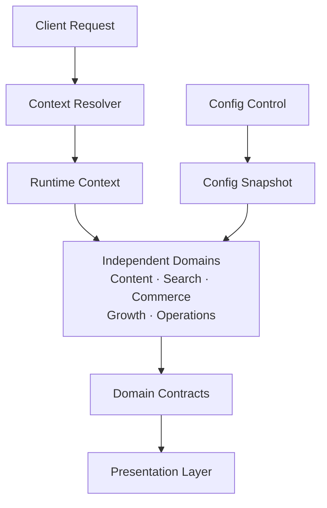
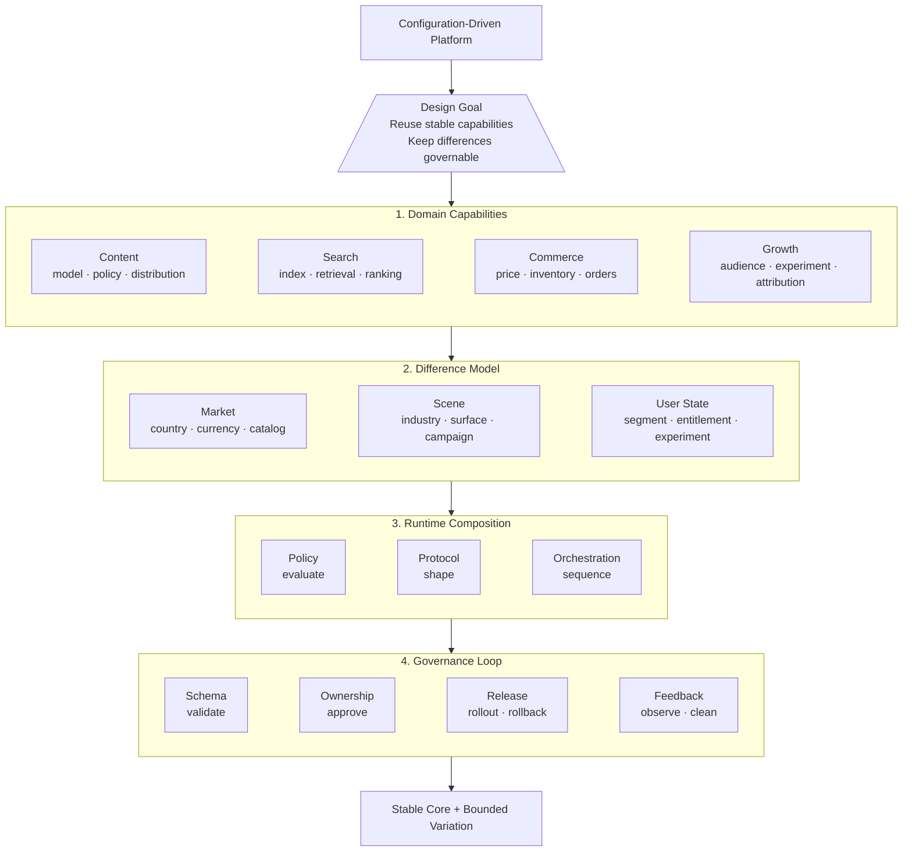
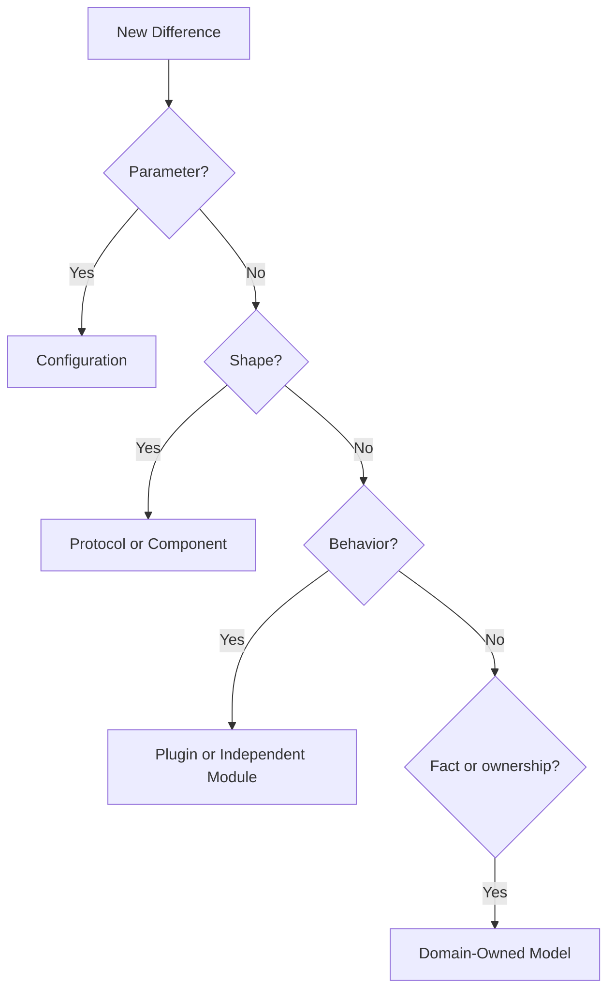
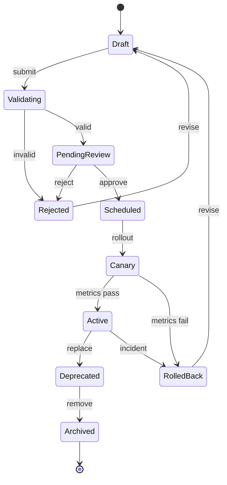

When I work on this type of system, the first thing I encounter is usually not "should I build a configuration center?" but an ever-growing area of ​​judgment. At first, it might just be that a certain page has one more field and one less entry. Later, search results, transaction prices, equity and growth activities also have their own exceptions. Each judgment makes sense when viewed individually, but when put together, no one can tell clearly: Is this a national difference, or is it the own rules of a certain business field?

Even more troubling is that the same condition can be reinterpreted in different places. The page is judged once, the search is judged again, and the transaction and growth are judged again. They may end up with the same result, or they may quietly fork after a certain change. The system did not break immediately, but each time a region or scene was added, the scope of the modifications became more difficult to estimate.

Later, I changed the question to another one: not "how to configure all regions", but "who should explain a difference and at which level it should end." The underlying capabilities need to be reused, and the upper-level expressions can be different, but the same difference cannot allow each page and each field to have its own explanation. What the multi-country, multi-business domain system really needs to solve is not to make everything look the same, but to make the differences stay in the correct layer.

Similar splits can be seen in publicly available commercial software. Shopify Markets understands markets as a set of conditions for matching buyers and allows shopping experiences such as currencies, catalogs, domains, languages, and prices to be configured at the market level; it also supports market inheritance instead of requiring each region to copy a set of configurations from scratch. [Shopify Markets Documentation](https://shopify.dev/docs/apps/build/markets) provides a public reference. This example is not to copy a certain product, but to illustrate that "market context" and "basic capabilities such as commodities and orders" can be modeled separately.

## Don’t rush to build a configuration center first

"Make differences into configurations" sounds natural, but configuration is the easiest way to go astray. Many systems just moved a few switches to the background at first, and later stuffed national judgments, industry rules, page structures, activity processes and temporary exceptions into one JSON. There are more and more configuration items, and the names are getting harder and harder to understand. In the end, the business code is just moved from the warehouse to a place that is more difficult to review.

The reason why this matter easily gets out of control is because "configuration" often assumes three responsibilities at the same time: determining whether the capability exists, determining how the business rules are executed, and determining how the page is ultimately displayed. They all look like fields, but have completely different lifecycles and responsibilities.

I'll separate them first:

- Capability configuration answers "whether this country, industry or field enables a certain capability";
- Business configuration answers "how the rules, supplies and processes operate after the capability is enabled";
- Presentation configuration answers "which fields, components and interactions the user ultimately sees";
- Orchestration configuration answers "in what order multiple capabilities are combined and at which stage they are called."This is not to add classification to the configuration system, but to prevent problems at one level from contaminating another level. If a certain region does not display an interest, it may only display the configuration; a certain type of commodity is not allowed to be supplied in a certain country, which may be a business rule; a certain transaction process requires a completely different state machine, so it should not continue to be disguised as a few Boolean switches.

Configuration does not necessarily only serve pages. LaunchDarkly's public documentation manages the same configuration in different environments and supports context-oriented, step-by-step release and approval processes. [Environment and Configuration Document](https://launchdarkly.com/docs/home/account/environment) and [Approval Document](https://launchdarkly.com/docs/home/releases/approvals/) illustrate an important boundary: the effective scope of the configuration, the release process and the responsible person should all be part of the system model, rather than relying on verbal agreements after release.

## First use a hypothetical system to explain the problem clearly

The problem can be abstracted into a digital content platform: it serves three countries, two industry scenarios and multiple clients at the same time. It has five areas: content, search, transaction, growth, as well as operation and merchant management. Let’s not discuss the specific business first, and focus on which level the difference should stay.

When a request enters the system, the country, industry, field, user status and activity stage are first parsed to generate a running context with a version. Each domain reads the configuration snapshot it is responsible for and provides its own domain capabilities; the presentation layer only consumes stable protocols and does not directly query other domain databases. The configuration control plane is responsible for verification, approval and release, and the running state only reads the published immutable version.



There are several deliberate restrictions in this diagram: the configuration control plane does not own content, products or orders; domain services do not directly modify other domain configurations; the presentation layer does not reimplement prices, rights or search rules; the event bus delivers facts and is not treated as a shared database. The value of doing this is to keep "reused configuration infrastructure" and "shared business judgment" at a distance.

In this type of design, I usually draw a "house diagram" first as an overview of capabilities: the top triangle is the design goal, and the layers below are divided into modules. Each layer is divided into modules, and the categories are listed inside the modules. It focuses on how the target is broken down into capabilities, rather than who calls whom at runtime. The dependency architecture diagram answers the latter question, so the two are complementary: the house diagram first allows people to understand the overall system, and the dependency diagram explains how the modules are connected.



This house diagram expresses a judgment: first have the design goals, and then decide which layers the system needs; first determine the module ownership, and then decide what can be configured. Configuration can change the expression in the market, scenarios and user status, but it cannot secretly rewrite domain facts; if a certain "configuration item" starts to write data across domains or determine complex transaction processes, it has crossed the boundary of the configuration layer.

## Turn an if-else into an architectural judgment

When looking at code like the following, the real problem is not that the conditional statement is long, but that the differences are not named:

```text
if country == A and channel == B and userState == C:
    use special flow
else:
    use default flow
```Before rewriting, ask four questions: Does it change parameters, expression structure, execution behavior, or domain facts? Which field owns it? What is its effective scope and life cycle? Will incorrect configuration affect the amount, rights, privacy or compliance?



For example, if a field is not displayed in a certain country, it is usually a display configuration; a certain type of commodity cannot be supplied and belongs to transaction or supply rules; the settlement steps are completely different, so it should enter a transaction plug-in or an independent process; whether a certain content can be accessed should be owned by the content management area. Don't put them in the same configuration table just because they can both be written as `boolean`.

No matter which layer the difference finally falls on, as long as it affects the amount, equity, privacy or large-scale traffic, it will require additional approval, audit, grayscale and rollback processes.

## Start transforming from a branch

You can use the international product page to go through this process. The public documentation of Shopify Markets configures the market context separately from the shopping experience such as currency, catalog, language, price, etc., and also supports market inheritance; this at least illustrates a modeling direction worth learning from: first determine which market the user belongs to, and then let the product and order capabilities return results based on the market context, rather than letting the page determine the country by itself. [Markets documentation](https://shopify.dev/docs/apps/build/markets) and [Internationalization pricing documentation](https://shopify.dev/docs/storefronts/headless/building-with-the-storefront-api/markets/international-pricing) are public materials. The following split is a general example based on this concept and is not an inference of its internal implementation.

Before the transformation, the code may write several changes in the same entry:

```text
if country == A and channel == B:
    hide some fields
    use local currency
    apply a special price
    enter another settlement flow
    send the user to campaign landing page
```

This code has at least five problems mixed into it. You can send them back to their own boundaries one by one during transformation:

1. `country` and `channel` are first parsed into versioned `market context`, without having to interpret them repeatedly for the page and each field.
2. The currency and price are calculated by the trading field according to the market context, and the price result with version is returned; the page does not recalculate the amount.
3. The visibility of fields is determined by the display agreement or page configuration. It only describes "what to display" and does not determine whether the product is available for sale.
4. If the settlement step only changes parameters, enter the transaction configuration; if the state machine is really different, enter the transaction plug-in.
5. Activity acceptance and experimental grouping are determined by the growth field, and the transaction field only receives clear activity or equity results.

The calling relationship after the transformation is roughly as follows:

```text
request
  -> resolve market context
  -> content policy: visibility
  -> commerce policy: price and availability
  -> growth policy: experiment and landing context
  -> presentation contract: fields and components
```

The most important thing here is not to change the code into several services, but that each result has a unique interpreter. Pages are only responsible for expression, growth is only responsible for grouping, transactions are only responsible for transaction facts, and market context is only responsible for providing conditions. No domain needs to know all if-else.This type of transformation can be carried out in six steps: first take stock of the regions, industries and channel branches in the core code; then mark the affected areas and risks for each branch; extract low-risk parameters into configurations with schema; extract structural changes into protocols and isolate process changes into plug-ins; add owner, version, preview and rollback to the configuration; finally delete the old branches and use compatibility testing to prove that the default path has not been changed. Don't build a configuration center that covers all services at the beginning. Start with a link that is most variable and error-prone.

## How to decouple various fields and where to draw boundaries

Domain decoupling is not about increasing the number of services, but about allowing each domain to have its own facts, rules, and failure responsibilities. An operational boundary is as follows:

| Domain | Facts owned by oneself | Can be read | Should not own |
| --- | --- | --- | --- |
| Content | Content status, visibility, review results, distribution strategy | User context, compliance configuration | Order amount, payment status |
| Search | Indexing, recall, sorting, result protocol | Content summary, scene configuration | Final writing rights for product inventory |
| Transactions | Items, prices, inventory, orders, equity | Country and industry context, transaction configuration | Page component order, experiment attribution |
| Growth | Crowds, experiments, reach, attribution | User context, acceptance scenarios | The final facts of orders and content |
| Operations and merchants | Resources, supply, approval, collaboration status | Editability in each field | Directly modify field operating status data |

Domains collaborate in three ways: querying stable read-only protocols, calling explicit command interfaces, or publishing domain events that describe fact changes. Don't create implicit dependencies through shared database fields, and don't let the Configuration Center be the final judge of all domain rules.

A common mistake is to let the growth system directly determine the transaction results, or let the page calculate the price itself in order to display the price. A more reliable way is: the growth system decides which experiment or undertaking scenario the user enters, the trading system returns the price results with version and applicable context, and the display layer is only responsible for expression. Each domain can be replaced, grayed out, and rolled back, and cross-domain processes are explicitly responsible for the orchestration layer.

## The configuration release itself must also have a state machine

The configuration does not end when it is written to the database. It should have a lifecycle like code, especially configurations that affect price, equity, content security, and large-scale traffic.



Each state should have entry and exit conditions instead of just displaying a "published" label in the background: the verification phase checks the schema and combination constraints, the approval phase confirms the owner and scope of influence, the grayscale phase observes the hit rate and business indicators, the rollback phase restores the previous immutable version, and the archiving phase cleans up configurations that are no longer referenced.

Only in this way can "anti-deterioration" be transformed from a one-time code reconstruction into a continuous operating mechanism. Configurations can also corrupt: dead switches, duplicate rules, exceptions that are never deleted, and fields that no one is responsible for will recreate another if-else.Preservation also needs to be inspected regularly. You can look at a few simple indicators for each version or once a month: whether the number of regional branches in the core domain code has dropped, whether configuration exceptions have continued to increase, whether there are configurations that no one is responsible for or long-term misses, how long it takes to roll back the configuration, and whether cross-domain direct writes have occurred. Indicators do not need to be set as beautiful goals from the beginning. Their role is to make "the system is becoming complex again" a fact that can be discovered.

## Extract common structures from business domains

Content, search, transactions, and growth do not share the same domain model. Forcing them into a "super business model" is usually more dangerous than repeated construction. What can really be shared is the structure in which they handle change.

Each business domain can start by answering four questions:

1. Which capabilities remain stable across multiple countries and scenarios?
2. Which changes are just parameters, fields, or visibility?
3. What changes have affected the process and should be carried by plug-ins or standalone modules?
4. Which configurations impact money, equity, privacy, or compliance and require a higher level of release control?

Viewed in an abstract manner, content systems share content models, publishing links, and basic distribution capabilities; search systems share retrieval, recall, and result protocols; trading systems share products, supplies, orders, and rights; and growth systems share reach, acceptance, experimentation, and attribution capabilities. Operations and merchant systems also handle resource, supply, approval and collaboration processes. Each of them has domain boundaries, but they may all be affected by countries, industries, fields, user status and activity stages.

Therefore, platforms should share “ways of handling change” rather than pretending that all businesses are the same.

## Four-layer architecture: capabilities, protocols, configurations, expressions

A relatively stable set of divisions is four levels.

### Domain capability layer

This layer is responsible for the real business facts and core capabilities such as content, merchandise, orders, inventory, search, user segmentation, marketing equity, and attribution. It should try to express the field itself, rather than making “what if it’s a certain country” judgments everywhere.

It’s not that the domain capability layer cannot have regional rules at all, but that regional rules must have clear ownership. Prices, inventory, and order status belong to the transaction field; whether a user can see certain content may belong to content governance; whether a user enters a growth experiment belongs to the experiment or growth field. Don't put all judgments at the page level for reuse, and don't put all rules into a middle-end service for convenience.

### Protocol and component layer

The data returned by domain services should not be directly equivalent to the final structure of a page. There needs to be stable protocols and reusable components in the middle.

Search results can be described by result protocols, product display can be described by product card protocols, and channels, shelves, and event venues can also have their own module protocols. The protocol agrees on capabilities and data boundaries, and the component is responsible for expressing them. In this way, the same product capability can use different display components in detail pages, channels, live broadcasts or recommendation portals, without duplicating a set of product services.The more general the protocol, the better. If a protocol is compatible with all businesses at the same time, it will often end up with only a large number of optional fields, and no one knows which field combination is effective. The protocol should be designed around stable consumption scenarios and retain extension points for truly different scenarios.

### Configuration and orchestration layer

This layer carries changes brought about by countries, industries, fields, user status and activity stages. It can determine the visibility of modules, field combinations, component order, policy switches, resource bits, experiment distribution and process orchestration.

The value of configuration is not only to release one version less, but more importantly, to have a traceable entrance for changes. A configuration change should be able to answer: who made the change, what was changed, which regions and scenarios are affected, what is the current effective version, how to preview, how to grayscale, and how to withdraw if a problem occurs.

When the configuration begins to affect order amounts, user rights, content security, or large-scale traffic, it is already close to code release in engineering terms, and it can no longer be treated as an ordinary form in the operation backend.

### Display and interaction layer

The top layer is the page, terminal and specific interaction. It determines what a scene will ultimately display based on the protocol and configuration.

The same basic capability appearing in different expressions in different places does not mean that the architecture has failed. A product can display the complete price and terms of service on the details page, only the selling points and starting price are displayed on the list, and the discount status and countdown are displayed on the event page. As long as these expressions come from clear protocols and configurations rather than national judgments scattered across multiple pages, they remain maintainable differences.

## The configuration system is not a free development platform

The most important boundary of configuration is that the configuration system cannot reinvent a programming language without constraints.

Simple differences are suitable for configuration: module switches, display fields, component order, country and industry adaptation, resource bits, strategy parameters, and experimental grouping. Complex differences should go into plug-ins or standalone modules: complete process changes, domain model changes, cross-system transactions, complex algorithms and business capabilities with independent life cycles.

A practical way to judge is to look at the explanation cost of configuration items. If a configuration item needs to explain the order of execution, relies on multiple system states, contains multiple levels of nested conditions, and produces cross-domain side effects, it is most likely not a configuration, but secretly writing business code using configuration files.

The granularity of configuration cannot be divided only by page. The page is the layer that changes the fastest. Today’s details page and tomorrow’s live broadcast shelf may be just different consumption methods of the same set of field capabilities. More stable divisions usually come from domain capabilities, scenario protocols, and dimensions of change: country, industry, field, user status, and activity stage.

## The most easily missed engineering issues in multi-country configuration

The first version of the configuration system often only focuses on "whether it can be configured", and it is only in the second version that "what should I do if the configuration is wrong". After truly entering multiple business domains, there are at least a few types of capabilities that cannot be omitted:- Schema verification to prevent configurations with incomplete structures or illegal field combinations from entering the running state;
- Permission isolation allows different business domains and regions to only modify the scope they are responsible for;
- Version and audit, able to trace configuration changes instead of just seeing the current value;
- Preview and simulation to see the final effect of a country, industry and field before actual release;
- Grayscale release, first let a small range of traffic use the new configuration;
- Rollback mechanism to quickly recover when price, equity, content or display errors occur;
- Observation in running state to know whether the configuration is loaded, which rules are hit, and what results are generated;
- Configure drift detection to find differences that should not exist between different regions or different environments.

Among them, preview and observation are particularly important. A configuration error may not necessarily cause the service to return 500. It may just cause one less price field to be displayed for products in a region, causing a group of users to not get their due rights, or causing the attribution of the growth link to be quietly broken. The service was healthy, but the business results were already wrong.

## Build once, call multiple places, but not without ownership

"Build once, call many places" is a common goal of configuration platforms, but the greater the scope of reuse, the less ambiguous ownership must be.

Public capabilities should have public maintainers, business rules should be the responsibility of the business domain, and national adaptation should have clear reviewers. A team can use the configuration capabilities provided by another team, but it cannot have arbitrary modification rights. The configuration platform also needs to record the scope of change, and cannot just record "someone changed a certain field".

Configuring the platform can easily become "anyone can put forward requirements, but no one is really responsible": the business side leaves the differences to the platform team, and the platform team is only responsible for making the fields. If any problems arise, the page developers will temporarily troubleshoot them. Such systems look increasingly generic, but in fact they just concentrate responsibility and complexity into a place that no one fully understands.

A good configuration platform should make responsibilities clearer rather than centrally managing all differences. What is shared is infrastructure, protocols, and governance mechanisms; business domains still have their own rules, and regional teams still need to be accountable to local facts.

## How would I judge a discrepancy now?

If I build a similar system again, I will first put the differences into a table instead of starting to design the configuration fields directly:

| Sources of differences | Affected objects | Suitable carrying methods | Required controls |
| --- | --- | --- | --- |
| Country or Region | Fields, Visibility, Compliance | Configuration or Policy | Permissions, Auditing, Grayscale |
| Industry | Products, processes, rules | Configuration and plug-ins | Templates, versions, rollbacks |
| Field | Page structure, component order | Protocol and arrangement | Preview, compatibility testing |
| User status | Grouping, experimentation, rights | Strategy services | Diversion, attribution, monitoring |
| Core process | State machine, transaction, domain model | Independent module | Independent life cycle and person in charge |The purpose of this table is not to neatly categorize the world, but to prevent us from using the same tools to deal with all changes. If the parameters are different, use configuration; if the structure is different, use protocols; if the behavior is different, use plug-ins; if the domain is different, let it have its own model and boundaries.

## Conclusion: Control the spread of differences

What multi-country, multi-business domain systems ultimately want to share is not every page or every business rule, but stable domain capabilities, clear protocol boundaries, and infrastructure that can be reused in multiple scenarios.

Content, search, transactions, and growth can have different domain models, but they all face the same architectural judgment: which changes should be configured, which changes should be orchestrated, and which changes are so complex that they must be modeled independently.

The value of configuration is not to save the business side from writing a few lines of code, but to control the spread of differences. Country differences should not spread to every page, industry differences should not contaminate the core domain model, and growth strategies and transaction links should not copy each other. Let the differences stay at the configuration level, provided that the configuration itself also has boundaries, ownership, and exit mechanisms.

If you want to look at the earlier boundary judgment issue of "Shared Core and Local Variation" first, you can go back to ["Shared Core and Local Variation: How Multi-region Systems Evolve"](/en/writing/2023/03/shared-core-and-local-variation/).
