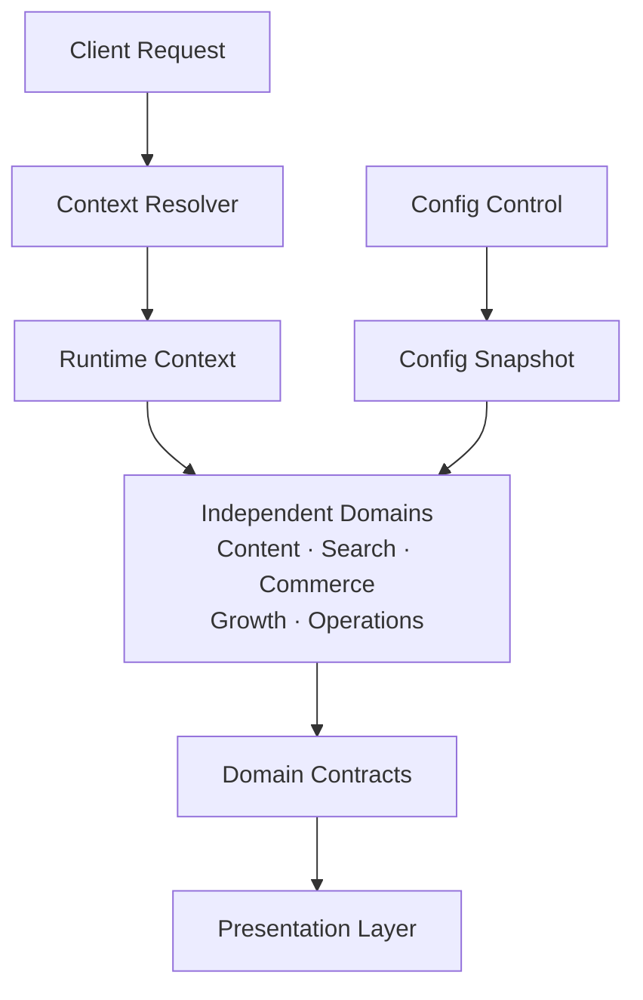
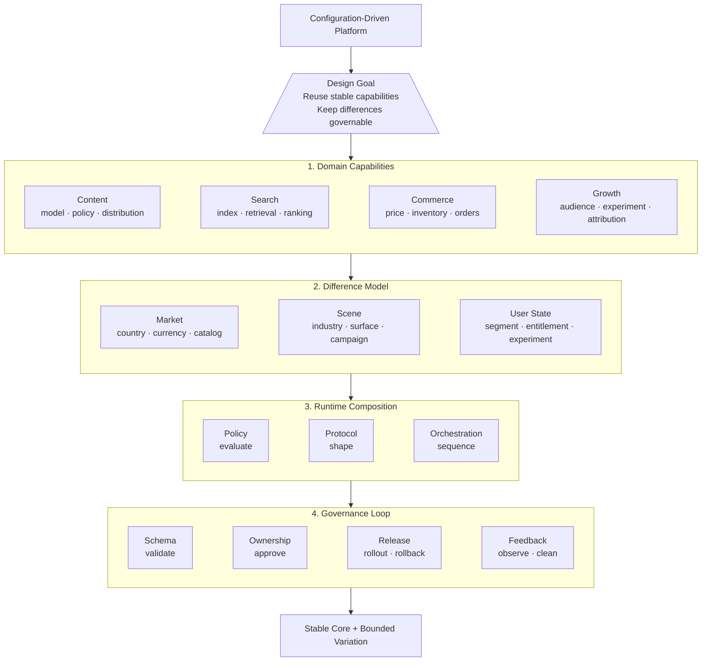
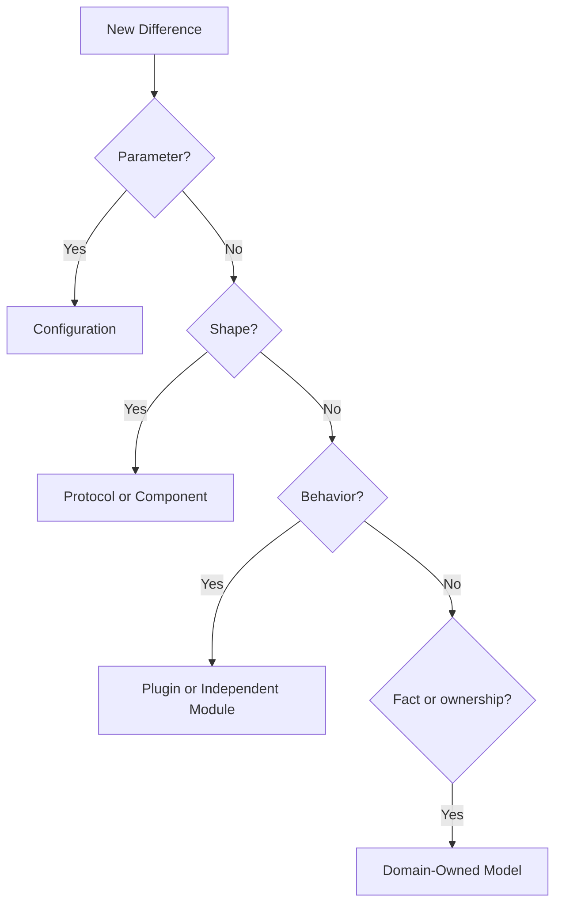
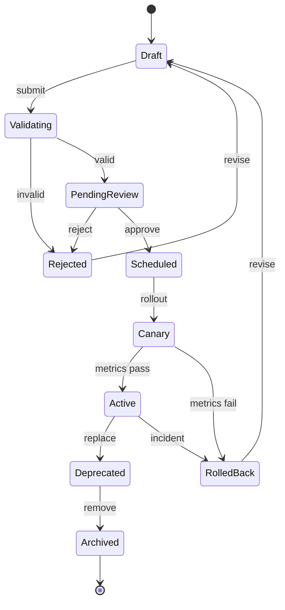

我做这类系统时，最先遇到的通常不是“要不要建设配置中心”，而是一段不断变长的地区判断。开始可能只是某个页面多一个字段、少一个入口，后来搜索结果、交易价格、权益和增长活动也各自出现了例外。每个判断单独看都说得通，放在一起却没人能说清楚：这到底是一个国家差异，还是某个业务域自己的规则？

更麻烦的是，同一个条件会在不同地方被重新解释。页面判断一次，搜索再判断一次，交易和增长又各自判断一次。它们最后可能得到相同结果，也可能在某次改动后悄悄分叉。系统没有立刻坏掉，只是每增加一个地区或一种场景，修改的影响范围就更难估计。

后来我才把问题换了一个问法：不是“怎样把所有地区配置起来”，而是“一个差异应该由谁解释，应该在哪一层结束”。底层能力需要复用，上层表达可以不同，但同一个差异不能让每个页面、每个领域都拥有一份自己的解释。多国家、多业务域系统真正要解决的，也不是让所有地方长得一样，而是让差异停留在正确的层里。

公开的商业软件也能看到类似的拆分。Shopify Markets 把市场理解成一组匹配买家的条件，并允许在市场层配置货币、目录、域名、语言和价格等购物体验；它还支持市场继承，而不是要求每个地区从零复制一套配置。[Shopify Markets 文档](https://shopify.dev/docs/apps/build/markets)提供了一个公开参照。这个例子不在于照搬某个产品，而在于说明“市场上下文”和“商品、订单等基础能力”可以被分开建模。

## 先别急着做一个配置中心

“把差异做成配置”听起来很自然，但配置化最容易走偏。很多系统一开始只是把几个开关搬到后台，后来又把国家判断、行业规则、页面结构、活动流程和临时例外全部塞进一个 JSON。配置项越来越多，名字越来越难懂，最后只是把业务代码从仓库搬到了一个更难审查的地方。

这件事之所以容易失控，是因为“配置”经常同时承担了三种职责：决定能力是否存在，决定业务规则如何执行，也决定页面最终如何展示。它们看起来都像字段，生命周期和责任却完全不同。

我会先把它们分开：

- 能力配置回答“这个国家、行业或场域是否启用某项能力”；
- 业务配置回答“能力启用后，规则、供给和流程怎样运行”；
- 展示配置回答“用户最终看到哪些字段、组件和交互”；
- 编排配置回答“多个能力以什么顺序组合，在哪个阶段被调用”。

这不是为了给配置系统增加分类，而是为了防止一个层次的问题污染另一个层次。某个地区不展示一项权益，可能只是展示配置；某类商品在某个国家不允许供给，可能是业务规则；某条交易流程需要完全不同的状态机，就不应该继续伪装成几个布尔开关。

配置也不一定只服务于页面。LaunchDarkly 的公开文档把同一配置放在不同环境中管理，并支持按上下文定向、逐步发布和审批流程。[环境与配置文档](https://launchdarkly.com/docs/home/account/environment)和[审批文档](https://launchdarkly.com/docs/home/releases/approvals/)说明了一个重要边界：配置的生效范围、发布过程和责任人，都应该是系统模型的一部分，而不是发布之后再靠口头约定补上。

## 先用一个假设系统把问题说清楚

可以把问题先抽象成一个数字内容平台：它同时服务三个国家、两种行业场景和多个用户端，里面有内容、搜索、交易、增长，以及运营和商家管理五个领域。先不讨论具体业务，把注意力放在差异应该停留在哪一层。

请求进入系统时，先解析国家、行业、场域、用户状态和活动阶段，生成一个带版本的运行上下文。各领域读取自己负责的配置快照，提供自己的领域能力；展示层只消费稳定协议，不直接查询别的领域数据库。配置控制面负责校验、审批和发布，运行态只读取已经发布的不可变版本。



这张图里有几个刻意的限制：配置控制面不拥有内容、商品或订单；领域服务不直接修改别的领域配置；展示层不重新实现价格、权益或搜索规则；事件总线传递事实，不被当成共享数据库。这样做的价值，是让“复用配置基础设施”和“共享业务判断”保持距离。

在这类设计里，我通常先画一张“房子图”作为能力总览：顶部三角形是设计目标，下面分层，每层拆成模块，模块内部再列出分类。它关注的是目标怎样拆成能力，而不是运行时谁调用谁。依赖架构图回答后一个问题，所以两者是互补的：房子图先让人看懂系统全貌，依赖图再说明模块如何连接。



这张房子图表达的是一个判断：先有设计目标，再决定系统需要哪些层；先确定模块归属，再决定哪些东西可以配置。配置可以改变市场、场景和用户状态下的表达，但不能偷偷改写领域事实；如果某个“配置项”开始跨领域写数据或决定复杂事务流程，就已经越过了配置层的边界。

## 把一个 if-else 变成一次架构判断

看到下面这种代码时，真正的问题不是条件语句长，而是差异没有被命名：

```text
if country == A and channel == B and userState == C:
    use special flow
else:
    use default flow
```

改写前先问四个问题：它改变的是参数、表达结构、执行行为，还是领域事实？它由哪个领域拥有？它的生效范围和生命周期是什么？错误配置会不会影响金额、权益、隐私或合规？



例如，某个国家不展示一个字段，通常是展示配置；某类商品不能供给，属于交易或供给规则；结算步骤完全不同，就应该进入交易插件或独立流程；某项内容能否被访问，应该由内容治理领域拥有。不要因为它们都可以写成 `boolean`，就把它们放进同一张配置表。

无论差异最终落在哪一层，只要它会影响金额、权益、隐私或大规模流量，就要额外进入审批、审计、灰度和回滚流程。

## 从一段分支开始改造

可以用国际化商品页面来走一遍这个过程。Shopify Markets 的公开文档把市场上下文和货币、目录、语言、价格等购物体验分开配置，也支持市场继承；这至少说明了一种值得借鉴的建模方向：先确定用户属于哪个市场，再让商品和订单能力根据市场上下文返回结果，而不是让页面自己判断国家。[Markets 文档](https://shopify.dev/docs/apps/build/markets)和[国际化价格文档](https://shopify.dev/docs/storefronts/headless/building-with-the-storefront-api/markets/international-pricing)是公开材料，下面的拆分是基于这个概念的通用示例，不是对其内部实现的推断。

改造前，代码可能把几种变化写在同一个入口：

```text
if country == A and channel == B:
    hide some fields
    use local currency
    apply a special price
    enter another settlement flow
    send the user to campaign landing page
```

这段代码至少混进了五个问题。改造时可以逐个把它们送回自己的边界：

1. `country` 和 `channel` 先被解析成带版本的 `market context`，不让页面和每个领域重复解释它们。
2. 货币和价格由交易领域根据市场上下文计算，并返回带版本的价格结果；页面不重新计算金额。
3. 字段显隐由展示协议或页面配置决定，只描述“展示什么”，不决定商品是否可售。
4. 结算步骤如果只是参数变化，进入交易配置；如果状态机真的不同，进入交易插件。
5. 活动承接和实验分组由增长领域决定，交易领域只接收明确的活动或权益结果。

改造后的调用关系大致是：

```text
request
  -> resolve market context
  -> content policy: visibility
  -> commerce policy: price and availability
  -> growth policy: experiment and landing context
  -> presentation contract: fields and components
```

这里最重要的不是把代码改成了几个服务，而是每个结果都有唯一的解释者。页面只负责表达，增长只负责分组，交易只负责交易事实，市场上下文只负责提供条件。任何一个领域都不需要知道全部的 if-else。

这类改造可以按六步推进：先盘点核心代码里的地区、行业和渠道分支；再为每个分支标注影响的领域和风险；把低风险参数提取成有 schema 的配置；把结构变化提取成协议，把流程变化隔离成插件；为配置补上 owner、版本、预览和回滚；最后删除旧分支，并用兼容性测试证明默认路径没有被改变。不要一开始就建设覆盖所有业务的配置中心，先从一条最常变、最容易出错的链路开始。

## 各领域怎样解耦，边界画在哪里

领域解耦不是把服务数量做多，而是让每个领域拥有自己的事实、规则和失败责任。一个可操作的边界如下：

| 领域 | 自己拥有的事实 | 可以读取 | 不应该拥有 |
| --- | --- | --- | --- |
| 内容 | 内容状态、可见性、审核结果、分发策略 | 用户上下文、合规配置 | 订单金额、支付状态 |
| 搜索 | 索引、召回、排序、结果协议 | 内容摘要、场景配置 | 商品库存的最终写入权 |
| 交易 | 商品、价格、库存、订单、权益 | 国家和行业上下文、交易配置 | 页面组件顺序、实验归因 |
| 增长 | 人群、实验、触达、归因 | 用户上下文、承接场景 | 订单和内容的最终事实 |
| 运营与商家 | 资源、供给、审批、协作状态 | 各领域的可编辑能力 | 直接修改领域运行态数据 |

领域之间通过三种方式协作：查询稳定的只读协议，调用明确的命令接口，或者发布描述事实变化的领域事件。不要通过共享数据库字段建立隐式依赖，也不要让“配置中心”成为所有领域规则的最终裁判。

一个常见的错误是让增长系统直接决定交易结果，或者让页面为了展示价格而自己计算价格。更稳妥的方式是：增长系统决定用户进入哪个实验或承接场景，交易系统返回带版本和适用上下文的价格结果，展示层只负责表达。每个领域都可以被替换、灰度和回滚，跨领域流程则由编排层明确负责。

## 配置发布本身也要有状态机

配置不是写入数据库就结束了。它应该像代码一样有生命周期，尤其是会影响价格、权益、内容安全和大规模流量的配置。



每个状态都应该有进入条件和退出条件，而不是只在后台显示一个“已发布”标签：校验阶段检查 schema 和组合约束，审批阶段确认 owner 和影响范围，灰度阶段观察命中率与业务指标，回滚阶段恢复上一个不可变版本，归档阶段清理不再被引用的配置。

这样才能把“防劣化”从一次性的代码重构，变成持续的运行机制。配置也会腐化：失效开关、重复规则、永不删除的例外和无人负责的字段，都会重新形成另一种 if-else。

防腐化还需要能被定期检查。可以每个版本或每个月看一次几项简单指标：核心领域代码里的地区分支数量是否下降，配置例外是否持续增加，是否存在无人负责或长期未命中的配置，配置回滚需要多久，跨领域直接写入是否发生。指标不需要一开始就设成漂亮的目标，它们的作用是让“系统又开始变复杂了”变成可以被发现的事实。

## 从业务域提炼共同结构

内容、搜索、交易和增长并不共享同一个领域模型。把它们强行合成一个“超级业务模型”，通常比重复建设更危险。真正可以共享的，是它们处理变化时的结构。

每个业务域都可以先回答四个问题：

1. 哪些能力在多个国家和场景中保持稳定？
2. 哪些变化只是参数、字段或可见性不同？
3. 哪些变化已经影响流程，应该由插件或独立模块承载？
4. 哪些配置会影响钱、权益、隐私或合规，需要更高等级的发布控制？

以抽象的方式看，内容系统共享的是内容模型、发布链路和分发基础能力；搜索系统共享的是检索、召回和结果协议；交易系统共享的是商品、供给、订单和权益；增长系统共享的是触达、承接、实验和归因能力。运营和商家系统还会处理资源、供给、审批和协作流程。它们各自有领域边界，但都可能受到国家、行业、场域、用户状态和活动阶段的影响。

因此，平台应该共享“处理变化的方法”，而不是假装所有业务都是同一种业务。

## 四层架构：能力、协议、配置、表达

一套比较稳定的划分是四层。

### 领域能力层

这一层负责真正的业务事实和核心能力，例如内容、商品、订单、库存、搜索、用户分群、营销权益和归因。它应该尽量表达领域本身，而不是到处出现“如果是某个国家就怎样”的判断。

领域能力层不是完全不能有地区规则，而是地区规则要有明确的归属。价格、库存和订单状态属于交易领域；用户是否能看到某种内容，可能属于内容治理；一个用户是否进入某个增长实验，属于实验或增长领域。不要为了复用，把所有判断都放到页面层，也不要为了方便，把所有规则都塞进一个中台服务。

### 协议与组件层

领域服务返回的数据，不应该直接等同于某个页面的最终结构。中间需要有稳定的协议和可复用的组件。

搜索结果可以通过结果协议描述，商品展示可以通过商品卡协议描述，频道、货架、活动会场也可以有各自的模块协议。协议约定的是能力和数据边界，组件负责把它们表达出来。这样，同一个商品能力可以在详情页、频道、直播或推荐入口中采用不同的展示组件，而不需要复制一套商品服务。

协议也不是越通用越好。一个协议如果同时兼容所有业务，最后往往只剩下大量可选字段，没人知道哪个字段组合才是有效的。协议应该围绕稳定的消费场景设计，并为真正不同的场景保留扩展点。

### 配置与编排层

这一层承载国家、行业、场域、用户状态和活动阶段带来的变化。它可以决定模块显隐、字段组合、组件顺序、策略开关、资源位、实验分流和流程编排。

配置的价值不只是少发一次版本，更重要的是让变化有一个可追踪的入口。一次配置变更应该能回答：谁改的、改了什么、影响哪些地区和场景、当前生效版本是什么、如何预览、如何灰度、出现问题后怎样撤回。

当配置开始影响订单金额、用户权益、内容安全或大规模流量时，它在工程上就已经接近代码发布，不能再把它当成运营后台里的普通表单。

### 展示与交互层

最上层才是页面、端和具体交互。它根据协议和配置，决定某个场景最终呈现什么。

同一个基础能力，在不同地方出现不同表达并不意味着架构失败。一个商品在详情页可以展示完整价格和服务条款，在列表里只展示卖点和起始价格，在活动页面里则展示优惠状态和倒计时。只要这些表达来自清楚的协议和配置，而不是散落在多个页面里的国家判断，它们就仍然是可维护的差异。

## 配置系统不是自由开发平台

配置化最重要的边界，是不能让配置系统重新发明一门没有约束的编程语言。

简单的差异适合配置：模块开关、展示字段、组件顺序、国家和行业适配、资源位、策略参数、实验分组。复杂的差异应该进入插件或独立模块：完整的流程变化、领域模型变化、跨系统事务、复杂算法和拥有独立生命周期的业务能力。

一个实用的判断方式是看配置项的解释成本。如果一个配置项需要解释执行顺序，依赖多个系统状态，包含多层嵌套条件，还会产生跨域副作用，它大概率已经不是配置，而是在用配置文件偷偷编写业务代码。

配置的颗粒度也不能只按页面划分。页面是变化最快的一层，今天的详情页、明天的直播货架，可能只是同一组领域能力的不同消费方式。更稳定的划分通常来自领域能力、场景协议和变化维度：国家、行业、场域、用户状态以及活动阶段。

## 多国家配置化最容易漏掉的工程问题

配置系统的第一版往往只关注“能不能配”，第二版才发现“配错了怎么办”。真正进入多个业务域之后，至少有几类能力不能省：

- schema 校验，阻止结构不完整或字段组合非法的配置进入运行态；
- 权限隔离，让不同业务域和地区只能修改自己负责的范围；
- 版本和审计，能够追溯配置变化，而不是只看到当前值；
- 预览与模拟，在真实发布前查看某个国家、行业和场域的最终效果；
- 灰度发布，先让小范围流量使用新配置；
- 回滚机制，出现价格、权益、内容或展示错误时可以快速恢复；
- 运行态观测，知道配置是否被加载、命中了哪些规则、产生了什么结果；
- 配置漂移检测，发现不同地区或不同环境之间不应该存在的差异。

其中，预览和观测尤其重要。配置错误不一定会让服务返回 500，它可能只是让一个地区的商品少展示了一个价格字段，让一批用户没有拿到应有的权益，或者让增长链路的归因悄悄断掉。服务是健康的，业务结果却已经错了。

## 一次建设，多处调用，但不能没有所有权

“一次建设，多处调用”是配置平台常见的目标，但复用范围越大，所有权越不能模糊。

公共能力应该有公共的维护者，业务规则应该由业务域负责，国家适配应该有清楚的审核人。一个团队可以使用另一个团队提供的配置能力，但不能因此拥有任意修改权。配置平台也需要记录变更影响范围，不能只记录“某人改了某个字段”。

配置平台很容易变成“谁都能提需求、没人真正负责”：业务方把差异交给平台团队，平台团队只负责把字段做出来，出了问题再由各页面开发同学临时排查。这样的系统看起来越来越通用，实际上只是把责任和复杂度集中到了一个没人能完整理解的地方。

好的配置平台应该让责任更清楚，而不是把所有差异都集中管理。共享的是基础设施、协议和治理机制；业务域仍然拥有自己的规则，地区团队仍然需要对本地事实负责。

## 我现在会怎样判断一项差异

如果再做一套类似系统，我会先把差异放进一张表，而不是直接开始设计配置字段：

| 差异来源 | 影响对象 | 适合的承载方式 | 需要的控制 |
| --- | --- | --- | --- |
| 国家或地区 | 字段、可见性、合规 | 配置或策略 | 权限、审计、灰度 |
| 行业 | 商品、流程、规则 | 配置加插件 | 模板、版本、回滚 |
| 场域 | 页面结构、组件顺序 | 协议与编排 | 预览、兼容性测试 |
| 用户状态 | 分群、实验、权益 | 策略服务 | 分流、归因、监控 |
| 核心流程 | 状态机、事务、领域模型 | 独立模块 | 独立生命周期和负责人 |

这张表的作用不是把世界分类得很漂亮，而是阻止我们用同一种工具处理所有变化。参数不同，用配置；结构不同，用协议；行为不同，用插件；领域不同，就让它拥有自己的模型和边界。

## 结语：控制差异的传播范围

多国家、多业务域系统最终要共享的，不是每一个页面，也不是每一条业务规则，而是稳定的领域能力、清楚的协议边界和可被多个场景复用的基础设施。

内容、搜索、交易和增长可以拥有不同的领域模型，但它们都需要面对同一个架构判断：哪些变化应该被配置，哪些变化应该被编排，哪些变化已经复杂到必须独立建模。

配置化的价值，不是让业务方少写几行代码，而是控制差异的传播范围。国家差异不应该扩散到每一个页面，行业差异不应该污染核心领域模型，增长策略也不应该和交易链路互相复制。让差异停留在配置层，前提是配置本身也有边界、所有权和退出机制。

如果想先看“共享核心与本地变化”这个更早的边界判断问题，可以回到[《共享核心与本地变化：多地区系统怎样演进》](/writing/2023/03/shared-core-and-local-variation/)。
