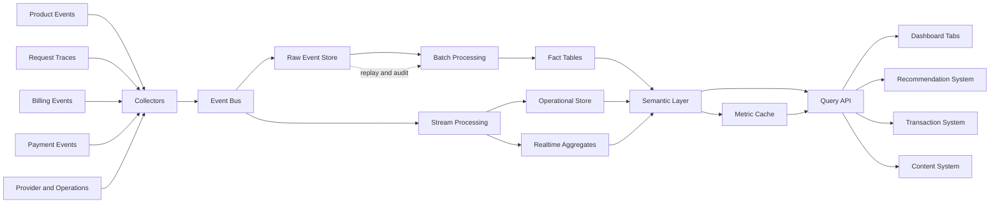
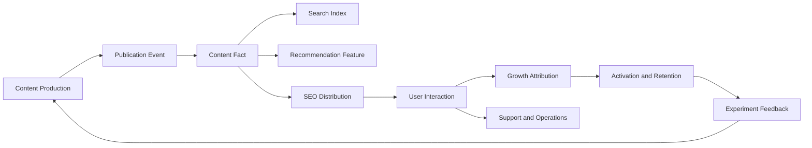
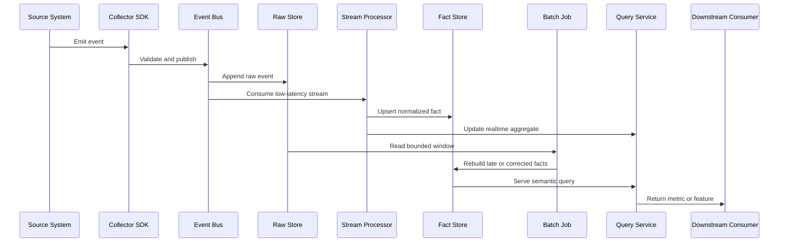

I have worked on data flows for a long time: content publishing, search, recommendations, growth, and transactions, as well as collection through clients and SDKs, server ingestion, data cleaning, cross-datacenter movement, table writes, migrations, and compliance. Business teams often see a report, a recommendation, or the answer to whether a transaction completed. I have more often worked on the chain behind those results: where the data came from, what processed it, where it ended up, and how it was handed to the next system.

That is why, when I think about a data center, I do not start with which cards should appear on a dashboard. The page is only the last layer. The more important questions are whether the data was received correctly, whether the raw record still exists, whether cross-datacenter and cross-region movement followed policy, whether cleaned data can still be traced back, and whether there is a recovery path when data is late or lost.

Analytics, recommendations, search, growth, transactions, advertising, messaging, and operations are all consumers of this infrastructure. They have different requirements: some need real-time data while others can use T+1; some need detail while others only need aggregates; some can accept sampling while data involving money or entitlements cannot be silently dropped. The job of a data center is to let these requirements coexist on the same data assets, rather than making every business system rebuild its own copy.

This article is an attempt to organize that entire path from data production to data consumption.

## Start with the metric method

When I wrote my earlier guide to measurement, I kept returning to one idea: a metric is not just a number on a report. It is a shared language for describing the same thing. Every metric should state what it measures, which event defines it, how it is calculated, what time range it covers, and what it can and cannot be used to conclude.

This matters especially in a data center. “Active user” might mean someone who logged in, sent a request, completed a task, or used the product repeatedly within a period. “Revenue” might mean user spending, cash collected, an amount receivable, or the platform amount left after a supplier share. Each can be a legitimate metric, but they cannot all occupy the same name.

The first design layer of a data center is therefore not the Tab. It is the metric dictionary. Every metric should specify:

- whether the measured object is a request, user, session, task, order, or settlement period;
- which events count as started, successful, failed, cancelled, or completed;
- its numerator, denominator, and deduplication rule;
- which versions, entry points, regions, and time windows it covers;
- when it becomes available and how late data is corrected;
- which decisions it supports and which conclusions it cannot support;
- who owns the definition and whether historical comparisons remain valid after a change.

With this layer in place, the data center does not have to force similar-looking numbers into one convenient story.

## Classify data before choosing latency and reliability

Teams often begin by arguing about whether they need a message queue or a real-time warehouse. The earlier question is more important: what does the company lose if this data disappears? Who makes the wrong decision if it arrives a day late? Can the system recover if it is modified incorrectly?

I would start with business consequences:

| Level | Typical data | Consequence of loss or error | Design requirement |
| --- | --- | --- | --- |
| S | Transactions, payments, balances, settlement, entitlements | Direct financial or legal responsibility | Transactional writes, idempotency, immutable facts, replay, reconciliation |
| A | Billing, ad conversions, core commercial metrics | Wrong business judgment or resource allocation | High completeness, versioned definitions, compensation, long retention |
| B | Recommendation feedback, search behavior, experiment events | Misjudged model or strategy performance | Tracked collection coverage, delayed processing allowed, backfill support |
| C | Diagnostic logs, temporary performance samples, low-value detail | Mainly affects debugging efficiency | Sampling, compression, and lifecycle cleanup are acceptable |

This classification is not a permanent label. The same event can have different levels in different businesses. A click may be important feedback for a recommendation model and irrelevant to cash settlement. A price change may be a dimension for content recommendations but a mandatory rule version for a transaction system.

Real-time guarantees, disaster recovery, storage cost, and privacy policy should follow from this classification. A data point should not get the most expensive real-time path simply because it looks important, and a daily report should not be used as a reason to delete the raw facts underneath it.

## Data center Tabs are not departments

I prefer to design Tabs around decisions rather than database tables or organizational structure. A data center for a multi-provider platform might begin with these questions:

| Tab | Question it answers | Main value |
| --- | --- | --- |
| Overview | What is happening now, and where should we look next? | Shared facts and daily priorities |
| Growth | Is usage becoming sustainable? | Scale, retention, and growth quality |
| Usage and Experience | What are users actually doing, and where does the experience degrade? | Connect business outcomes to requests and tasks |
| Cost and Supply | What do capabilities cost, and how reliable and available are they? | Unit economics and resource allocation |
| Marketing | What did an activity cost, and what incremental result did it produce? | Separate subsidy, attribution, and growth |
| Billing | How was a request measured, priced, and charged? | Protect billing facts and user trust |
| Reconciliation | Where do internal records and external facts disagree? | Turn differences into work items |
| Business and Value | Are scale, efficiency, and risk improving? | Operating and investment judgment |

This does not mean building eight pages on day one. It is a map for thinking. Every new card should explain which question it serves, and every new Tab should explain its boundary with the others.

## Draw the data center as a data flow first

When I worked on data flows, I usually started with where data was produced rather than with the cards a final page needed. A data center can be sketched like this:



The important part is not the component names. It is how many times the data changes shape. Product, request, billing, payment, and operations systems produce events. Collectors receive, validate, and add context. The event bus lets consumers read independently. Raw events remain available for replay and audit. Stream processing handles low-latency state and aggregates. Batch processing handles late data, historical recalculation, and complex joins. Only then does the semantic layer organize the result into metrics that pages and downstream systems can understand.

Kafka’s description of event streaming is close to this model: events are continuously captured, durably stored, processed in real time or retrospectively, and routed to different destinations. Producers and consumers are decoupled, and the same event can be read by multiple consumer groups.[Kafka event streaming](https://kafka.apache.org/documentation/)

That is very different from writing one large table and making every page query it directly. A large table may be quick at the beginning, but once recommendations, transactions, content, and business analysis use the same data, their refresh requirements, definitions, and failure tolerance begin to interfere with each other.

## Data starts with events, not metrics

The data center should not infer collection from the final metrics. Identify the stable events that happen in the systems first, then decide which metrics those events can support.

| Source | Typical events | What they can support |
| --- | --- | --- |
| Product interaction | Registration, login, search, submit, complete, cancel | Funnel, activation, retention, experience |
| Request path | Start, routing, attempt, response, retry, timeout | Success rate, latency, failure diagnosis |
| Resource usage | Tokens, storage, compute, bandwidth, cache hit | Usage, cost, capacity planning |
| Business transaction | Create, confirm, refund, allocate, settle, adjust | Billing, reconciliation, operating analysis |
| Marketing activity | Reach, eligibility, grant, use, clawback, experiment assignment | Campaign cost, attribution, incrementality |
| System operation | Deployment, version, health, queue backlog, job completion | Reliability, data quality, operations |

Every event needs at least an event ID, occurrence time, record time, subject or anonymous subject, source, version, and correlation ID. Request flows also need a trace or task relationship. Money or entitlements also need idempotency keys, state, and rule versions.

Event time and the time data entered the platform must not be confused. A user action in the afternoon may enter the warehouse through a batch job that night. An external payment or provider usage record may arrive late. The meaning of “today,” “this week,” and “conversion rate” depends on these two timestamps.

## How a content and search flow grows

Content is a useful example because it includes production, distribution, search, recommendation, and feedback. When an author writes an article, the first data produced is not a view count. It is a sequence of state changes: editing, saving a draft, submitting for review, publishing, revising, taking down, and republishing. Each state deserves its own event and timestamp instead of leaving only a final state in the article table.

After publication, the data keeps moving. Search needs the title, body, tags, language, update time, and searchable state. Recommendations need topics, author, content quality, exposure, and user feedback. Growth needs source, landing page, registration, and subsequent behavior. Support and operations need to know what a user saw and where the problem occurred.

```text
content authoring
    → publication events
    → content facts
    ├─ search indexing
    ├─ recommendation features
    ├─ SEO pages and discovery
    ├─ analytics and retention
    └─ editorial and support operations
```

Content publication succeeding does not mean that search has indexed it. A page being crawled does not mean a user saw it. A user seeing it does not mean they finished reading it, and finishing it does not mean the content accomplished its intended task. The data center has to keep these states separate to show whether the problem is publication, indexing, distribution, access, or the content itself.

SEO is not just a traffic-source field. It includes page identity, crawling, indexing, search exposure, clicks, page consumption, and later conversion. Each layer has a different delay: a page can be published immediately, search may process it later, and user behavior happens later still. Compressing all of that into “users from SEO” hides the uncertainty in between.

Content and search systems therefore need two kinds of facts: facts about the content itself, such as version, author, topic, and publication state; and facts about discovery and consumption, such as exposure, click, open, reading, save, share, and return. The first answers “what did we publish?” The second answers “was it seen, understood, and valuable?”

## Growth systems: paid and free are not two numbers

A growth system is usually much more complicated than an advertising page. Paid channels may include advertising, partnerships, purchased traffic, paid activities, and different forms of channel sharing. Free channels may include search, content, organic visits, recommendations, communities, and existing-user referrals. Their costs, intent, latency, and abuse patterns differ.

I would separate growth into four chains rather than grouping everything by channel name:

| Chain | Question | Common data |
| --- | --- | --- |
| Arrival | Where did the user come from, and did they reach the target page? | source, campaign, landing, visit |
| Activation | Did the user complete the first valuable action? | signup, activation, first task |
| Value | Did the user create revenue, content value, or a durable relationship? | payment, retention, usage, contribution |
| Cost | What did it take to produce these results? | media cost, incentive, operation, risk |

The same user might arrive through free content and later receive a paid offer. They may see an advertisement, click a search result, receive a message, and complete a transaction elsewhere. If attribution keeps only the last channel, content, search, and messaging appear worthless. If every touchpoint receives full credit, every channel is overstated.

Growth data must therefore preserve touchpoints and attribution rules rather than only a final source. First-touch, last-touch, linear, position-based, and experiment-based attribution can all be useful, but the system must state which rule is being used and which decision it can support.

Paid channels also need a connection between media cost and business outcomes. Many clicks may mean compelling creative; many registrations may mean a large reward; short-term payment may be subsidy-driven. If long-term retention and contribution do not improve, the activity should not automatically be called successful. Free channels are not cost-free either: content production, SEO, servers, operations, and maintenance all have costs, even when they do not appear at the time of each click.

The growth Tab should therefore show a connected chain:

```text
source
    → exposure
    → visit
    → activation
    → first value
    → repeat use
    → paid or business outcome
    → retention and contribution
```

Every stage needs sample size, coverage, and a time window. Without them, “conversion improved” may only mean that the denominator became smaller or that a slower downstream event has not arrived yet.

## External integrations: mapping is harder than calling an API

A data center may integrate with advertising platforms, payment channels, content platforms, search engines, messaging services, support systems, third-party data sources, and partners. It first looks like a few API calls. The difficult work is usually in field meaning and state mapping.

External systems may use different user IDs, order IDs, time zones, currencies, state enums, and retry rules. One system’s `success` may mean only `accepted` in another. One system’s creation time may correspond to another system’s posting time. One sends events per order while another sends a batch invoice.

I would split an external integration into five steps:

1. Save the raw response or event, including source, receive time, and external event ID.
2. Build identity and entity mappings between external and internal IDs.
3. Convert external fields into controlled internal states and types.
4. Put unrecognized, duplicate, late, and incomplete records into quarantine.
5. Produce an internal event in the fact layer and let downstream systems consume that fact.

```text
external event
    → raw payload
    → identity mapping
    → schema and status mapping
    → validation
    ├─ accepted fact
    └─ quarantine / retry / manual review
```

Business pages should not each understand an external API. If an external field is renamed, a new state is added, or an API becomes slow, search, growth, transactions, and support will otherwise grow separate compatibility rules. The adapter layer isolates external change at the boundary and keeps internal facts stable.

An integration also needs repeatable synchronization. Jobs should record cursors, pagination positions, last successful time, retry counts, and input ranges. If an external API supports time-window pulls, retain overlapping windows to absorb late events. Re-fetching is not an error; posting the same fact twice is.

## A typical consumption chain

To connect these layers, consider a typical content and growth consumption chain. The content system emits a publication event, search builds an index from the content version, recommendations read content features and user behavior, growth connects sources and touchpoints to later actions, and support and operations read the same context when something goes wrong.



There are at least three different kinds of success in this chain: content publication succeeded, the user successfully consumed the content, and the business objective was completed. One field cannot represent all three. The publishing system confirms that a version was saved; search confirms that its index was updated; recommendations care about exposure and feedback; growth waits for later behavior; support needs to reconstruct a specific user or task context.

For a “user opened a content page” event, the definition might look like this:

| Field | Meaning | Constraint |
| --- | --- | --- |
| event_id | Unique ID for one open event | Upload retries must not create duplicate facts |
| occurred_at | When the user actually opened it | Stored separately from `received_at` |
| received_at | When the platform received the event | Used to measure delay and lateness |
| anonymous_user_id | De-identified user ID | Original identity is not stored |
| content_id | Stable content ID | Version is recorded separately |
| source | Search, recommendation, message, or direct visit | Controlled enum |
| content_version | Version the user actually saw | Supports experiments and replay |
| session_id | Related task or session | May be empty, but missingness is measured |
| schema_version | Event structure version | Backward-compatible evolution only |

These fields can support opens, unique openers, source distribution, version differences, and exposure-to-open conversion. They cannot by themselves prove that the content had value or that the user finished reading. That requires other events such as dwell, scroll, completion, save, or return.

Real-time recommendations may use the event within seconds to update short-term interest. An operations report may aggregate it at minute or hour granularity. An editorial team studying search and retention a month later needs a complete offline window. A late event may miss the immediate recommendation opportunity, but the offline job should still absorb it during recalculation.

The point is that the same event is consumed at different speeds by different systems. Events, facts, versions, sources, and timestamps have to remain available so those systems can share stable meaning.

## Support and operations: data eventually reaches people

The downstream of a data center is not only machine learning and automation. Support, review, operations, and management consume data too, usually while handling the most irregular problems: a user did not receive an entitlement, an order says successful while the page is stale, an activity looks abusive, content was taken down incorrectly, or a record does not match the user’s account.

Support needs more than a user profile. It needs a permission-controlled timeline: what happened, what the system returned, which tasks succeeded, which events were late, whether a person intervened, and what can happen next. Operations needs actionable objects in addition to aggregates: activities waiting for review, abnormal channels, backlogged jobs, entitlements to resend, and tickets past their deadline.

This means the data center needs two entrances:

- a statistical entrance for trends, distributions, ratios, and groups;
- an evidence entrance for the history of one user, order, task, or event.

With only statistics, support cannot explain an individual case. With only evidence, operations cannot prioritize. A useful data center lets people move from “the whole system looks abnormal” to “which objects need attention,” then back to “did the system improve after handling them?”

## Storage layers: not everything belongs in one table

I would separate storage into four layers instead of treating databases, caches, and warehouses as equivalent:

| Layer | What it stores | Main readers | Can it be overwritten? |
| --- | --- | --- | --- |
| Raw | Raw events, receipts, collection errors, immutable payloads | Replay, audit, reprocessing | Preferably no |
| Fact | Deduplicated, normalized, related request, user, usage, and transaction facts | Analysis, reconciliation, long-term queries | Express corrections as new versions or facts |
| Semantic | Metric definitions, dimensions, formulas, permissions, quality status | Query APIs, analysts, business users | Maintain with versioning |
| Service | Daily and real-time aggregates, materialized results, caches | Dashboards, alerts, online systems | Rebuildable |

The raw layer answers “what did we receive?” The fact layer answers “what does this record mean in the business?” The semantic layer answers “how do we calculate the same metric?” The service layer answers “how do we serve different consumers fast enough?” If one business table is asked to answer all four questions, it usually cannot replay reliably or serve high-concurrency queries consistently.

A cache belongs to the service layer, not the fact layer. It can expire, be rebuilt, and be evicted. A fact cannot disappear just because the cache expired. A dashboard with a high cache-hit rate can still show a stale judgment if it does not show its generation time and coverage.

## Real time, queues, and scheduled jobs

A data center should not make every piece of data real time. Real-time processing has cost, complexity, and consistency tradeoffs. Reserve it for data where being a few minutes late changes the action.

| Data | Better approach | Why |
| --- | --- | --- |
| Current request state, errors, queue backlog | Real-time stream or short-interval query | Fast discovery and response |
| Capacity, rate limits, health | Real-time snapshot with short-TTL cache | Changes quickly but every read need not be permanent |
| Single charge, payment, entitlement state | Transactional write with asynchronous compensation | Protect the fact before notifying other systems |
| Hourly trends and home-page cards | Stream processing or minute-level aggregation | Low latency and stable queries |
| Daily reports, retention cohorts, complex cost | Scheduled batch processing | Wait for late data and join across tables |
| Historical recalculation and metric migration | Replayable offline job | Repeatable, comparable, auditable |

Real-time requests suit current state or a small fact lookup: the current state of a request, whether a task is complete, or whether capacity is available. They should not scan all historical details whenever a home page opens, nor should they carry month-long retention, complex attribution, or long-term operating reports.

A queue connects the moment a fact is produced with the moment a downstream system can process it. A billing fact may be committed transactionally and then published for allocation, notification, indexing, or an operations aggregate. Consumers can retry and eventually use a dead-letter queue. Successful queue consumption does not mean the raw fact can be deleted, and consumer state should not overwrite the business fact.

Scheduled jobs are useful for recalculation, backfill, validation, and compaction. They can recalculate a recently closed window, absorb late events, and write to a rebuildable aggregate table. Each job needs a run record, input window, code or formula version, output count, and error reason; otherwise a daily update becomes difficult to explain a few days later.

Flink’s unified stream and batch model makes the same point: a job can process unbounded streams and bounded input, but streaming produces incremental results while batch processing can produce a final result after the input is complete. Their time, state, and failure-recovery behavior are not identical.[Flink stream and batch processing](https://nightlies.apache.org/flink/flink-docs-stable/)

## The query system composes a Tab

Pages should not decide which base table to query. A query API or semantic layer should compose the metrics needed by a Tab and apply consistent windows, filters, permissions, and freshness.

A growth query may combine user facts, task events, marketing attribution, and cohort aggregates. A cost query may combine usage facts, pricing rules, supply state, and infrastructure cost. A reconciliation query may read internal transactions, external events, and the lifecycle of differences. They share IDs, timestamps, and definitions without necessarily sharing one physical table.

The query system should at least:

1. turn natural-language questions or page filters into explicit metrics and dimensions;
2. choose between real-time facts, aggregates, and caches;
3. check window coverage, data delay, and quality state;
4. return the summary, source, update time, and a drill-down link to evidence.

For high-concurrency reports with fixed dimensions, materialized views or pre-aggregations can help. Cube treats pre-aggregations as an independent aggregation layer and records refresh time and build cost. The value is moving expensive work earlier, provided the system knows when the result is still valid.[Cube pre-aggregations](https://docs.cube.dev/docs/pre-aggregations/index)

A query cache key can combine metric definition, time window, filters, and permission scope. Do not cache only by URL: the same page may represent a different subject, permission, or data cutoff. For billing or reconciliation queries that require strong consistency, a cache can accelerate the lookup but cannot replace the underlying fact.

## Downstream consumers should not each invent a data model

The value of a data center appears in its consumers. Recommendation, transaction, and content systems use different data, but they all need stable events, consistent entity IDs, and explicit latency guarantees.

### Recommendation systems

Recommendations often need recent behavior, long-term interests, content features, exposure, and feedback. Real-time streams update short-term behavior and candidate retrieval; offline jobs create training examples, long-term features, and evaluation sets. Exposure logs must connect to clicks, completions, and purchases, or the system can only say what it recommended, not whether it created value.

Feature generation time and version also matter. A model can look better offline because of leakage or different feature delay. Without an as-of timestamp in the feature store, online and offline results easily diverge.

### Transaction systems

Transactions care about state machines, idempotency, balances, inventory, prices, and reconciliation. The real-time path protects constraints such as no duplicate charge, no over-limit use, and no duplicate entitlement. Queues and batches handle notification, settlement, reconciliation, retries, and periodic reports.

Transaction data should not be rewritten for analytical convenience. The analysis layer can create derived facts; it should not replace the original order state with a final-looking value. Otherwise the business system gets a convenient number while the audit system loses the event history.

### Content systems

Content systems collect reading, search, save, share, comment, and publication events, as well as content version, author, topic, and quality feedback. Real-time data can support trending, related content, and review prompts. Offline data is better for long-term reading trends, content lifecycle, author development, and experiment analysis.

Content consumption is especially likely to confuse exposure with value. Display, open, completion, save, and return are different events. The system should distinguish them within a task or session context instead of leaving only an ever-growing view count.

## The hard part is latency and uncertainty

A mature data center accepts three facts at once: data arrives late, data is duplicated, and data gets reinterpreted.

Every important result therefore needs freshness, completeness, and lineage. Freshness says when the newest data arrived. Completeness says whether sources are still missing from the window. Lineage says which facts, rules, and jobs produced the metric. All three matter.

Data quality should also be observable: event coverage, duplication, unknown-event rate, consumer backlog, job failure, aggregate-to-detail differences, and schema-version mismatches belong in the Overview and Reconciliation Tabs. Data quality is not only an internal data-team metric. It determines whether business users can trust growth, cost, and revenue judgments.

This is why a data center serves both real-time and offline flows. Real time provides speed of action. Offline processing provides completeness, recalculation, and long-term comparison. One is not simply a replacement for the other; they are two ways for the same facts to answer different questions.

## Overview Tab: not a homepage for every number

The Overview exists to help someone decide where to look next. It should contain results, guardrails, and an entry point for anomalies.

Result metrics say whether the business event happened: completed core tasks, active users, successful requests, or confirmed orders. Guardrails prevent a better result from hiding an uncontrolled cost: error rate, latency, refund rate, cost rate, or unexplained differences. Anomaly entries identify objects that need action: a version with suddenly higher failures, a cost source that has not updated, or a billing class without matching evidence.

Diagnostics belong one level deeper. A provider’s failure rate, a model’s token distribution, or a channel’s latency can live in a lower Tab. The Overview only needs to say whether the result changed, whether the change is outside normal variation, and which path to investigate.

Every number should also show its window, timezone, data cutoff, and completeness. “Today” has little explanatory power if nobody knows the timezone, whether writes are still arriving, or whether late events are included.

## Growth Tab: growth quality, not just new users

The Growth Tab is not a registration leaderboard. It asks whether new people completed a valuable first use, came back, and formed a durable relationship with the product.

| Layer | Observe | Cannot prove alone |
| --- | --- | --- |
| Arrival | Source, registration, first visit, first request | Arrival is not value |
| Activation | Key task, first success, first payment, or repeated use | One success is not retention |
| Retention | Later activity by first effective-use cohort | Poor retention is not always acquisition failure |
| Value | Depth, payment conversion, contribution, or durable relationship | Value must include subsidy and cost |

These layers should form a chain rather than separate attractive charts. Registrations rising while activation falls may mean broader channels, or users may not be completing the core path. Active users rising while depth falls may mean low-quality traffic, or the product may have shortened a task. Repurchase rising while contribution falls requires an explanation in offers, product mix, and service cost.

The Growth Tab matters because it shows where growth came from, where it was lost, and what it caused—not just one overall growth rate.

## Usage and Experience Tab: from task to Trace

Request volume is the system view. A user completing a task is the outcome view. The Usage and Experience Tab should connect them.

For a core task, define states such as start, submit, wait, success, failure, timeout, cancellation, and “the user saw a timeout but the backend later succeeded.” Then calculate completion, first success, retry, visible wait, final success, and abandonment from those events.

In a multi-service system, a task needs a correlation ID that crosses the whole path. A Trace is not only an engineering tool for slow requests; it can be a drill-down entry from a metric to a class of requests, then to one Trace, and finally to the state, duration, and external dependency at each stage.

Mature observability practice treats traces, metrics, and logs as different signals and uses context propagation to relate them. Metrics show where something changed, Traces show how one request moved, and logs and events explain what happened in detail. OpenTelemetry’s [signals model](https://opentelemetry.io/docs/concepts/signals/) and [context propagation](https://opentelemetry.io/docs/concepts/context-propagation/) address this relationship rather than placing everything in one log table.

This is why the data center should not show only API success rate. A successful response does not prove that the user saw the result. A retry that eventually succeeds still has an experience cost. A successful request without a Trace should not automatically be treated as if nothing happened.

## Cost and Supply Tab: bring cost back to unit economics

The Cost Tab easily becomes a provider price list. An operator actually wants to know how much additional variable and fixed cost is required for one more unit of business, whether it improves user outcomes, and which part is consuming the scale benefit.

For a model or API platform, separate at least:

- usage cost: input, output, cache, image, audio, or other measurable resources;
- supply cost: actual or reference cost by provider, model, region, or channel;
- platform cost: servers, storage, network, monitoring, payment, and support;
- risk cost: refunds, bad debt, disputes, abuse, spare capacity, and security preparation;
- acquisition cost: incentives, channel fees, and marketing work.

Map these to a unit: request, million tokens, active user, completed task, or retained user. A lower cost per request may simply mean shorter requests. A higher cost per active user may mean that valuable users are using more capable features.

Supply also needs reliability and capacity, not only price. A cheap source that rate-limits often may create retries and poor experience. Apparent capacity without historical snapshots says little about peak availability. A single source carrying too much traffic creates supply risk.

Cost optimization has to return to outcomes: after changing a provider, did completion, latency, retention, and contribution improve together? A cost curve alone can turn “spend less” into a false definition of “operate better.”

## Marketing Tab: separate activity cost from growth results

Total marketing spend should not be reduced to the amount of rewards distributed. An activity should be separated into budget, reach, eligibility, entitlement, attribution, use, clawback, and incremental result.

Budget answers how much the business was willing to spend. Entitlement says what was given. Attribution says why a result was assigned to the activity. Risk controls ask whether people exploited duplicate accounts, circular referrals, or fake payments. Incrementality asks what would probably have happened without the activity.

Total consumption caused by an activity is not automatically activity revenue. The view should include subsidy, reach, payment, refunds, clawbacks, and the difference between treatment and control groups. Without a control group, describe correlation rather than calling every change marketing-driven growth.

Marketing and Billing should not share one generic “amount” field. A campaign budget is an operating plan; an entitlement is a business fact; user spending is a billing fact; cash received is a funds fact; platform contribution is derived. They can be observed together but must not impersonate one another in storage or formulas.

## Billing Tab: protect measurement before discussing price

Any chargeable system should let the Billing Tab answer how a request became a charge: was it accepted, what was actually used, which rule version priced it, how was the amount measured, what changed in the wallet or quota, and how were failures and retries handled?

Measurement should first be normalized into mutually exclusive usage buckets, then priced. Input, cache reads, cache writes, and output need clear boundaries. Different provider field names must not cause the same tokens to be counted twice.

Keep these concepts separate:

```text
usage measurement
    → reference cost
    → consumer charge
    → supplier allocation
```

Reference cost explains resource consumption. Consumer charge is the price fact between the platform and user. Supplier allocation is an internal settlement fact. They may be related, but one multiplier field cannot make them the same thing.

Billing writes also need idempotency keys, price versions, and an explicit terminal state. A database write failure must not silently become a successful user response with the hope that a later report will notice. Unknown usage is not zero. If an authoritative usage record later replaces an estimate with a smaller amount, replace the estimate rather than preserving a wrong number because taking the maximum seems safer.

Mature token and cost-tracking systems also separate calls, usage types, and price definitions before aggregating by query dimensions. The important lesson is not to copy a product’s schema, but to make every charge traceable to the usage and price rule that existed at the time.

## Reconciliation Tab: a difference is a work item

Reconciliation is not putting internal and external numbers side by side and changing one when they differ. First preserve both facts, then give the difference a lifecycle.

The basic categories include internal missing, external missing, amount mismatch, state mismatch, duplicate event, time-window mismatch, insufficient evidence, and unmatchable record. Each should lead to a different action: add an event, wait for an external statement, review manually, create an adjustment, pause a later action, or explain a known boundary.

Every correction should create a new fact rather than overwrite the original request, payment, usage, or settlement record. This is not about making the system “more financial.” It makes a dispute replayable: what was known, which rule was used, and who changed what and when.

Stripe’s balance transactions and payout reconciliation offer a useful reference: balance-affecting activity is represented by immutable transactions, while a refund is represented as a new reversing transaction; reports and settlement files organize those transactions into a range that can be checked.[Stripe reporting and reconciliation](https://docs.stripe.com/plan-integration/get-started/reporting-reconciliation)

The most useful reconciliation metric is not “zero differences.” It is the distribution of differences by amount, age, severity, and actionable status. A system with few differences but no traceability is more dangerous than one with many differences where every item has evidence and an owner.

## Business and Value Tab: investors do not only look at volume

An operator wants to know whether the business is becoming more stable: whether growth retains users, whether revenue covers variable cost, whether scale spreads fixed cost, whether supply is sufficient, whether risk is controlled, and whether the team can review the business from the same facts.

Investors push the questions one step further:

- Is growth coming from real demand or a one-time subsidy?
- Are users forming switching costs, habits, or network effects?
- Did margin improve because of price, product mix, routing efficiency, or incomplete cost accounting?
- Can the platform scale transactions without scaling manual review and operations proportionally?
- Are core business facts auditable, or does everyone have to trust one summary spreadsheet?
- Which of supply, billing, payment, and risk will become the bottleneck at scale?

The Value Tab should show trends and relationships rather than one valuation number. User growth, retention, unit contribution, cost structure, campaign payback, supply concentration, failure cost, reconciliation coverage, and manual handling can belong on the same operating map.

Be especially careful when revenue grows while evidence coverage falls. If price versions are missing, cash events are incomplete, unknown usage is accumulating, and manual adjustments are increasing, the apparent improvement may simply be a larger unexplained area. Data quality is part of platform value.

## How to store facts, semantics, and services

The read and write design can be divided into three layers.

The first is the fact layer. Requests, state changes, usage, price versions, payment events, wallet entries, settlement items, and reconciliation differences should generally be appended, with occurrence time, record time, source, and correlation IDs. Facts involving money or permissions should prioritize transactions and idempotency. Logs and diagnostics may use a different reliability level, but they should not pretend to be accounting facts.

The second is the semantic layer. Metric definitions, dimensions, formula versions, time windows, and data-quality states are unified here. It distinguishes request, successful request, active user, paying user, cash revenue, and platform contribution, and states which fields can be summed and which must be recalculated.

The third is the service layer. Daily reports, hourly aggregates, caches, and precomputed results serve pages, but they are projections of the fact layer. A projection should record generation time, covered window, formula version, and failure state. If it does not cover the entire window, it should return `partial` or `stale` rather than silently assembling a complete-looking number.

Mature analytical systems often add a semantic model or pre-aggregation layer between facts and queries. Cube’s pre-aggregations improve query performance and concurrency by building and refreshing aggregates in advance, while still requiring explicit freshness and source boundaries.[Cube pre-aggregations](https://docs.cube.dev/docs/pre-aggregations/index)

My rule is simple: make facts and definitions correct first, then use pre-aggregation to solve performance. Do not cache an unexplainable result faster just because the query is slow.

### One event from production to consumption

An event’s lifecycle often looks like this:



`upsert` is appropriate for rebuildable normalized results and aggregate projections. It should not overwrite an S-level raw transaction fact. For transactions, payments, and entitlements, append an immutable event first and let a state projection express the current state. For recommendation features and daily reports, replacing a service-layer result after recalculation is reasonable.

### Read and write paths are different

The write path aims to lose as little as possible while knowing what was received:

```text
produce → validate → persist raw → acknowledge → process → publish derived facts
```

The read path aims to be fast while knowing what it is reading:

```text
question → metric definition → source selection → freshness check → result → drill-down
```

When these paths are mixed, a dangerous system appears: the page reads a cache for speed, the cache modifies facts to refresh, and facts accumulate unexplained derived fields to fit the page. A safer design treats facts as a one-way source, keeps service results rebuildable, and lets the query layer compose and explain.

### Which data should read the base store in real time?

Real-time access does not mean “always query the lowest layer.” First decide whether that store can safely serve online traffic:

| Request | Recommended source | Reason |
| --- | --- | --- |
| Current order or task state | Transaction store or dedicated state store | Latest state and explicit permissions |
| One request’s detail | Detail fact table | Small lookup by correlation ID |
| Home-page trend card | Minute/hour aggregate | Do not scan raw detail per page load |
| Long-term operating report | Daily aggregate or analytical warehouse | Delay is acceptable; definitions and completeness matter |
| Online recommendation feature | Feature Store or low-latency KV | Stable latency and feature version |
| Transaction risk decision | Real-time state plus feature cache | Complete within the decision window |
| Historical attribution and retention | Offline facts and cohort tables | Complete windows and recalculation |

Real-time base-store reads suit small, strongly associated, low-latency lookups. They do not mean every online request bypasses aggregation. If the base store handles transaction writes, offline scans, and dashboard aggregation at once, a query peak can damage the core business.

## Responsibilities of writing and reading

The write path leaves facts: stable request or event IDs, occurrence time, source, retry-safe idempotency, price and rule versions, and a distinction between success, failure, unknown, and pending.

The read path explains facts: explicit window and timezone, consistent filters, freshness and coverage, drill-down from cards to detail, and “cannot confirm” when evidence is insufficient instead of filling the gap with zero or the current configuration.

The paths must not overstep each other. A dashboard query cannot change a balance. A compensation job cannot overwrite a raw fact. A manual adjustment cannot bypass approval and audit. A daily report cannot become the accounting authority.

When a metric changes, users should know whether it came from a real-time fact, a closed-period aggregate, or a mixed source—and which days or dimensions remain incomplete in the mixed case.

## Problems this design will face

The first is high cardinality. Putting user IDs, request IDs, full model names, and every label into aggregate dimensions makes queries and storage grow quickly. High-cardinality identifiers should mainly support drill-down and sampling, not become default homepage groups.

The second is lateness and replay. Payment webhooks, upstream usage, asynchronous allocations, and cost statements can arrive at different times. Metrics must separate event time from record time. Backfills must be rerunnable without creating a second monetary event.

The third is denominator drift. If collection scope, version, entry point, or filters change, a ratio can suddenly look better or worse. Important trends should show sample size, coverage, and definition version.

The fourth is treating an aggregate as a fact. p95, unique users, retention, and conversion cannot simply be added across days. Some metrics need mergeable distributions; others must be recalculated from user-level facts.

The fifth is permissions and de-identification. A data center may touch users, keys, payments, and suppliers. The dimension needed for a report does not imply that raw identity should be displayed. Exports must follow the same permissions, masking, and audit rules.

The sixth is confusing more data with stronger judgment. If every Tab has dozens of metrics but no metric owner, anomaly owner, or action rule, the data center only increases the cost of discussion.

## Datacenter migration: policy comes before technology

Migration is often described as replication, dual writes, traffic shifting, and rollback. The first question should not be which tool to use, but policy: which data may move, which must remain local, which may move only in masked or aggregated form, who can approve it, how long it must be retained, and what evidence is needed when there is a dispute.

Different data in the same company may require completely different migration strategies. Public content may be replicated across regions. Data containing personal identity or sensitive behavior may need local storage. Transactions, entitlements, and audit data may require immutable retention and controlled replication. Low-value diagnostic data may only need summaries. Whether data may cross regions depends on privacy, security, regulation, contracts, and legal review—not engineering alone.

Only after policy is clear should the team compare approaches:

| Approach | Suitable when | Main cost |
| --- | --- | --- |
| Local single cluster | Data ownership is strict and access is limited | More complex disaster recovery and regional access |
| Read-only cross-cluster replication | Nearby queries or disaster recovery are needed | Replication delay, permissions, and deletion propagation |
| Dual write | Old and new systems must accept traffic in parallel | Consistency, duplicate writes, and compliance boundaries |
| Backfill then gradual cutover | There is time for migration and validation | Verification, compensation, and a clear rollback point |
| Move aggregates only | Consumers need statistics or features | Detail is lost for some investigations |

Dual write is not automatically safer than one authoritative writer. It may put sensitive data in more regions and create two systems that both believe they are authoritative. For high-level data, a clear “one authoritative writer + controlled replication + verifiable replay” is safer than temporarily writing everywhere for convenience.

Migration acceptance cannot compare only row counts. Check key coverage, time windows, versions, state distributions, sampled content, permission results, deletion propagation, delay, duplicates, and downstream query results. For data that may be dropped, define the rule and limit in advance. For data that may not be dropped, provide resend, replay, and human takeover paths.

## Why storage cost is often underestimated

The idea that storage cost keeps reaching its limit is directionally right. More precisely, the long-term cost of a data system is often underestimated, and storage is the part that accumulates continuously and is easiest to ignore.

Storage cost is not only the price per GB. It also includes:

- how many copies exist across raw, cleaned, and aggregated data;
- replicas, backups, snapshots, and retained versions;
- indexes, partitions, metadata, and small files;
- scans, retrieval, archive restoration, and cross-region transfer;
- compute that runs continuously to serve real-time reads;
- minimum retention periods caused by compliance, deletion, and audit requirements.

Public cloud documentation also separates object-storage costs into storage, requests, retrieval, early deletion, management, versioning, replication, and bandwidth, with lifecycle and tiering controls for long-term cost.[Amazon S3 storage and billing](https://docs.aws.amazon.com/AmazonS3/latest/userguide/aws-billing-reports.html)

It is therefore too simple to say that moving cold data to cheaper storage completes the optimization. Rarely read data can be archived. Data that must be copied across regions may be dominated by replication and bandwidth. A strict retention period may prevent deletion from reducing cost immediately. Many small files may make query and metadata costs more troublesome than capacity.

At minimum, the data center should maintain a cost view by data level and access pattern: how long it is retained, how many copies exist, who reads it, how much each read scans, whether it crosses regions, how long recovery takes, and whether deletion has legal limits. Cost optimization is a choice among recoverability, compliance, latency, and long-term value—not simply deleting data.

## Three public references

I do not want the names of mature systems to become architecture answers, but public material helps confirm which problems persist over time.

Spotify has described its Event Delivery and Data Platform publicly. It separates event types into topics and processing paths, gives different importance levels different service goals, and defines schemas, permissions, retention, lineage, and quality checks. The lesson here is not to let a low-value, noisy event harm business-critical data, and to give event producers responsibility for definitions and changes.[Spotify Data Platform Explained](https://stage.engineering.atspotify.com/2024/5/data-platform-explained-part-ii), [Spotify Event Delivery](https://engineering.atspotify.com/2019/11/spotifys-event-delivery-life-in-the-cloud)

LinkedIn has published an architecture example for search and recommendations: search behavior enters a queue, ETL produces tags and training data, and the system updates the search index and online model. Offline batches and real-time updates serve different latency requirements. It is a useful reminder that search, recommendations, experiments, and analytics can share event sources without sharing exactly the same consumption path.[LinkedIn Search and Recommendation Systems](https://engineering.linkedin.com/content/dam/me/engineering/li-en/research/SIGIR-2018.pdf)

The OpenTelemetry Demo is another infrastructure-oriented reference. Multiple services call one another over HTTP or gRPC, telemetry enters a Collector, and the Collector distributes it to different processors and backends. It explicitly displays received, refused, processed, and failed exports. The lesson is that the data flow itself must be monitored; monitoring business services is not enough if nobody knows how much was lost at collection.[OpenTelemetry Demo Architecture](https://opentelemetry.io/docs/demo/architecture/), [Collector Data Flow Dashboard](https://opentelemetry.io/docs/demo/collector-data-flow-dashboard/)

The common point is not a particular component. It is that events have owners, data has levels, flows are persisted, real-time and offline paths coexist, results carry quality and latency, and consumers can evolve independently.

## Cross-region data flow: movement is not permission

When a group operates across countries or datacenters, the data center must answer a question no dashboard can hide: which data may be replicated across regions, which must stay local, and which may move only as a de-identified aggregate.

I would judge data on three dimensions:

| Dimension | Question |
| --- | --- |
| Sensitivity | Does it contain identity, payment, secrets, content, or identifiable behavior? |
| Business level | Would loss or error affect money, entitlements, compliance, or core judgment? |
| Movement scope | Must it be shared across countries, datacenters, or organizations? |

These dimensions determine storage location, encryption, masking, roles, retention, and cross-border approvals. Raw data usually belongs only where it is necessary. Analytics and recommendation can use de-identified events or aggregate features. External sharing should prefer statistics and controlled queries.

Multi-region systems must also distinguish replication from ownership. An event may be copied to several regions for disaster recovery without making every region an editor. An aggregate may be queried globally without making the original personal data global. Ownership, replication, and visibility need separate models.

That is why the data center needs a catalog and lineage. Knowing a field name is not enough. We also need to know where it came from, which cleaning steps it passed through, which metrics and systems consume it, who can access it, and how a deletion or correction request propagates.

## Finally: the data center is an organization’s judgment interface

A data center is not a visualization shell around a database, and it is not a display board for proving that the business is doing well. It is the interface through which an organization observes the same system, drills into evidence, and shares responsibility for judgment.

For an analyst, it makes objects, definitions, denominators, and evidence reviewable. For an engineer, it connects metrics to Traces, events, and real failure paths. For an operator, it explains tradeoffs among growth, cost, marketing, and risk. For an investor, it makes scale, unit economics, extensibility, and evidence quality inspectable.

I would accept a data center by asking five questions:

1. Who is each Tab helping, and what decision is it supporting?
2. Are the object, denominator, time window, and boundary of each metric clear?
3. Can a number be drilled down to an event, request, or explainable business fact?
4. How do late, duplicate, unknown, and unauditable records appear?
5. When a result improves, can we see the cost and risk it took to produce it?

If these questions cannot be answered, adding more cards, charts, and filters usually only decorates the uncertainty. A good data center does not make decisions for people. It makes clear what those decisions are actually based on.
