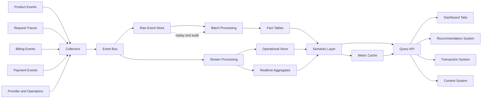
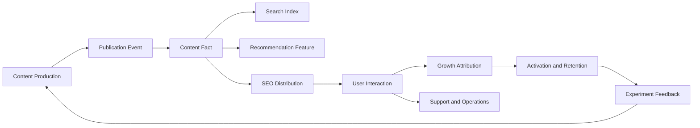
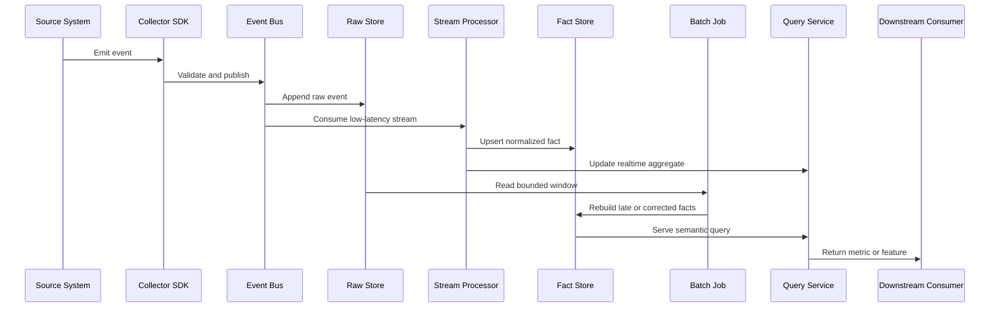

我做过很长时间的数据流，做过内容发布、搜索、推荐、增长、交易，也做过客户端和 SDK 的采集、服务器接入、数据清洗、跨机房流转、落表、迁移和合规。很多时候，业务方看到的是一张报表、一条推荐结果，或者一次交易是否完成；我更常面对的是这些结果之前的那条链路：数据从哪里来，经过谁，最后落在哪里，又怎样交给下一个系统。

所以我现在再想数据中心，首先想到的不是后台页面上放哪些卡片。页面只是最后一层。更重要的是，数据有没有被正确接住，原始记录有没有留下，跨机房和跨地域流转时有没有违反 policy，清洗以后还能不能追溯，数据延迟或丢失时有没有补救办法。

数据分析、推荐、搜索、增长、交易、广告、消息和运营，都是这套基础设施的消费者。它们会提出不同的要求：有的要实时，有的可以 T+1；有的要保留明细，有的只需要聚合结果；有的可以接受采样，有的涉及钱和权益，不能静默丢失。数据中心要做的，就是让这些要求在同一套数据资产上各自成立，而不是让每个业务系统重新造一份数据。

这篇文章想整理的，正是这条从数据生产到数据消费的全链路。

## 先从已有的指标方法开始

我之前写“数据度量工作指南”时，反复强调过一件事：指标不是报表上的一个数，而是团队用来描述同一件事的共同语言。一个指标至少要交代测量对象、事件定义、计算方法、时间范围和使用边界。

这对数据中心尤其重要。比如“活跃用户”可能是登录过的人、发起过请求的人、成功完成任务的人，也可能是过去一段时间内重复使用的人；“收入”可能是用户消费、已经收款、应收金额，或者扣除供给方分成后的平台留存。它们都可以是合法指标，但不能占用同一个名字。

所以数据中心的第一层设计不是 Tab，而是指标字典。每项指标都应该有：

- 它测量的对象，是请求、用户、会话、任务、订单还是结算周期；
- 什么事件算开始、成功、失败、取消或完成；
- 分子、分母和去重规则是什么；
- 数据覆盖哪些版本、入口、地区和时间窗口；
- 数据什么时候可用，迟到时如何修正；
- 它能支持什么判断，不能推出什么结论；
- 谁维护定义，定义变更后旧数据还能不能比较。

有了这层定义，数据中心才不会把“看起来相近”的数字强行拼成一个故事。

## 先给数据分级，再决定实时性和可靠性

很多团队一上来就争论要不要上消息队列、要不要做实时数仓。更靠前的问题其实是：这条数据如果丢了，企业会损失什么？如果晚一天，谁会做出错误决定？如果被错误修改，能不能恢复？

我会先按业务后果分级：

| 等级 | 典型数据 | 丢失或错误的后果 | 设计要求 |
| --- | --- | --- | --- |
| S 级 | 交易、支付、余额、结算、权益 | 直接形成资金或法律责任 | 事务写入、幂等、不可变事实、可重放、可对账 |
| A 级 | 计费、广告转化、核心商业化指标 | 误判经营结果或错误分配资源 | 高完整性、版本化口径、异常补偿、长期留存 |
| B 级 | 推荐反馈、搜索行为、实验事件 | 模型或策略效果被误判 | 可追踪采集覆盖、允许延迟、支持回算 |
| C 级 | 诊断日志、临时性能采样、低价值明细 | 主要影响排障效率 | 可以采样、压缩和按生命周期清理 |

这个分级不是给数据贴永久标签。相同的事件在不同业务里可能有不同等级：一次点击对推荐模型是重要反馈，对现金结算可能完全无关；一次价格变更对内容推荐只是维度信息，对交易系统却是必须保存的规则版本。

实时性、容灾等级、存储成本和隐私策略，都应该从这个分级推导出来。不能因为某个数据“看起来重要”，就让所有下游都用最高成本的实时链路；也不能因为某个页面只是日报，就把底层原始事实一起删掉。

## 数据中心的 Tab 不是按部门划分的

我更愿意按决策问题来设计 Tab，而不是按数据库表或组织架构来设计。一个面向多 provider 平台的数据中心，可以先从下面几组开始：

| Tab | 它回答的问题 | 主要价值 |
| --- | --- | --- |
| 总览 | 现在发生了什么，是否值得继续下钻 | 建立共同事实和当天优先级 |
| 增长 | 用户和使用是否形成了可持续的增长 | 判断规模、留存和增长质量 |
| 使用与体验 | 用户实际使用了什么，体验在哪里变差 | 把业务结果接回请求和任务 |
| 成本与供给 | 每种能力的成本、容量和可靠性怎样 | 判断单位经济性与资源配置 |
| 营销 | 活动花了什么，带来了什么增量 | 区分补贴、归因和真正增长 |
| 计费 | 请求怎样被计量、定价和扣款 | 保护收入事实和用户信任 |
| 对账 | 内部记录和外部事实哪里不一致 | 把差异变成可处理的工作对象 |
| 经营与价值 | 平台的规模、效率和风险是否改善 | 服务企业经营和投资判断 |

这不是要求第一天就建八个页面。它是一张思考地图：每增加一张卡片，都要说明它服务哪个问题；每增加一个 Tab，都要说明它和其他 Tab 的边界是什么。

## 先把数据中心画成一条数据流

我之前做数据流工作时，比较习惯从“数据在哪里产生”开始，而不是从“最后页面想放什么卡片”开始。一个数据中心大致可以画成下面这样：



这张图里最重要的不是组件名字，而是数据经过了几次“变形”。产品、请求、计费、支付和运营系统先产生事件；采集层负责接收、校验和补充上下文；事件总线让不同消费者可以独立读取；原始事件保留下来，既用于重放，也用于审计；流处理负责低延迟的状态和聚合；批处理负责迟到数据、历史回算和复杂的跨表分析；最后才由语义层把这些数据组织成页面和下游系统都能理解的指标。

Apache Kafka 对事件流的描述很接近这个分层：事件被持续捕获、持久保存、实时或回溯处理，再路由到不同目的地；生产者和消费者解耦，同一事件也可以被多个消费组分别读取。[Kafka event streaming](https://kafka.apache.org/documentation/)

这和“写一张大表，然后所有页面直接查它”是两种完全不同的思路。大表可能在早期很快，但一旦推荐、交易、内容和经营分析开始使用同一批数据，不同的刷新要求、口径和容错方式就会互相拖累。

## 数据从哪里产生：事件先于指标

数据中心不应该从指标反推采集。应该先识别系统里发生了哪些稳定事件，再决定这些事件可以组成什么指标。

| 数据来源 | 典型事件 | 之后可以支持什么 |
| --- | --- | --- |
| 产品交互 | 注册、登录、搜索、提交、完成、取消 | 漏斗、激活、留存、体验 |
| 请求链路 | 请求开始、路由、尝试、响应、重试、超时 | 成功率、延迟、故障定位 |
| 资源使用 | Token、存储、计算、带宽、缓存命中 | 用量、成本、容量规划 |
| 业务交易 | 创建、确认、退款、分配、结算、调整 | 计费、对账、经营分析 |
| 营销活动 | 触达、资格、发放、使用、追回、实验分组 | 活动成本、归因、增量 |
| 系统运行 | 部署、版本、健康、队列积压、任务完成 | 稳定性、数据质量、运维 |

每个事件都至少需要事件 ID、发生时间、记录时间、主体或匿名主体、来源、版本和关联 ID。涉及请求链路时，还需要 trace 或 task 关联；涉及资金或权益时，还需要幂等键、状态和规则版本。

事件发生时间和数据进入数据平台的时间不能混为一谈。用户在下午发生的行为，可能晚上才通过批处理进入仓库；外部支付或 provider 用量也可能迟到。后面所有“今天”“本周”和“转化率”的定义，都依赖这两个时间字段。

## 一条内容和搜索数据流是怎样长出来的

内容系统是一个很好的例子，因为它同时包含生产、分发、搜索、推荐和反馈。一个作者写下一篇文章，最开始产生的不是“阅读量”，而是一系列状态变化：开始编辑、保存草稿、提交审核、发布、修改、下线、重新发布。每个状态都应该有自己的事件和时间，而不是只在文章表里留下一个最后状态。

文章发布以后，数据还会继续流动：搜索系统需要标题、正文、标签、语言、更新时间和可检索状态；推荐系统需要主题、作者、内容质量、曝光和用户反馈；增长系统需要来源、落地页、注册和后续行为；客服和运营需要知道用户看到过什么、在哪一步遇到问题。

可以把这条链画成：

```text
content authoring
    → publication events
    → content facts
    ├─ search indexing
    ├─ recommendation features
    ├─ SEO pages and discovery
    ├─ analytics and retention
    └─ editorial and support operations
```

这里有一个很容易被忽略的区别：内容发布成功，不等于内容已经被搜索系统收录；页面被抓取，不等于用户看见；用户看见，不等于用户读完；用户读完，也不等于内容完成了它原本想完成的任务。数据中心要把这些状态拆开，才能知道问题是在发布、索引、分发、访问还是内容本身。

SEO 也不只是一个流量来源字段。它至少涉及页面身份、爬取、索引、搜索曝光、点击、页面消费和后续转化。每一层都有不同的时间延迟：页面可以马上发布，搜索系统可能过一段时间才处理，用户行为又在更晚的时候发生。把它们压成一个“SEO 带来的用户数”，会把中间所有不确定性都藏起来。

因此，内容和搜索系统需要同时保留两类数据：一类是内容本身的事实，例如版本、作者、主题和发布状态；另一类是内容被发现和消费的事实，例如曝光、点击、打开、阅读、收藏、分享和再次访问。前者回答“我们发布了什么”，后者回答“它有没有被看见、被理解和产生价值”。

## 增长系统：付费和免费不是两个数字

增长系统通常比一个广告投放页面复杂得多。付费渠道可能包括广告、合作、采购流量、付费活动和不同形式的渠道分成；免费渠道可能包括搜索、内容、自然访问、推荐、社群和已有用户传播。它们的成本结构、用户意图、数据延迟和作弊方式都不一样。

我会把增长数据拆成四条链，而不是只按渠道名称分组：

| 链路 | 要回答的问题 | 常见数据 |
| --- | --- | --- |
| 到达链 | 用户从哪里来，是否真的到达目标页面 | source、campaign、landing、visit |
| 激活链 | 用户是否完成第一次有价值的行为 | signup、activation、first task |
| 价值链 | 用户是否产生收入、内容价值或长期使用 | payment、retention、usage、contribution |
| 成本链 | 为了得到这些结果付出了什么 | media cost、incentive、operation、risk |

同一个用户可能先通过免费内容进入，再被付费活动触达；也可能看过广告、点击搜索结果、收到消息，最后在另一个入口完成交易。归因系统如果只保留“最后一个渠道”，会让前面的内容、搜索和触达看起来没有价值；如果把所有触点都算成完整功劳，又会夸大每个渠道的效果。

所以增长数据需要保存触点和归因规则，而不是只保存一个最终来源。不同场景可以使用首次来源、最后来源、线性分摊、位置加权或实验增量，但必须知道这是哪种规则，以及它能支持什么判断。

付费渠道还需要把媒体费用和业务结果连接起来。一个活动点击很多，可能是素材吸引人；注册很多，可能是奖励足够大；短期付费很多，可能是补贴带来的；长期留存和贡献没有改善时，就不能把这次活动叫作成功。免费渠道也不是“没有成本”，内容生产、SEO、服务器、运营和维护都需要成本，只是成本不一定按每个点击即时发生。

增长 Tab 因此至少要能在同一条链上看到：

```text
source
    → exposure
    → visit
    → activation
    → first value
    → repeat use
    → paid or business outcome
    → retention and contribution
```

每一层都需要样本量、数据覆盖和时间窗口。没有这些信息，“转化率提高了”往往只是分母变小了，或者某个延迟较长的环节还没有把数据送回来。

## 外部对接：真正难的是映射，不是调用接口

数据中心经常需要和外部系统对接：广告平台、支付渠道、内容平台、搜索平台、消息服务、客服系统、第三方数据源和合作伙伴系统。最初看起来只是调用几个 API，实际工作往往集中在字段含义和状态映射上。

外部系统可能用不同的用户标识、订单标识、时间时区、货币、状态枚举和重试规则。一个系统里的 `success`，在另一个系统里可能只是 `accepted`；一个系统的创建时间，可能对应另一个系统的入账时间；一个系统按订单发送事件，另一个系统按批次发送账单。

我会把外部接入拆成五步：

1. 保存原始响应或原始事件，并记录来源、接收时间和外部事件 ID；
2. 建立身份和实体映射，明确外部 ID 与内部 ID 的对应关系；
3. 将外部字段转换成受控的内部状态和类型；
4. 把无法识别、重复、迟到和不完整的记录放进隔离区；
5. 在事实层产生内部事件，再让下游系统消费内部事实。

```text
external event
    → raw payload
    → identity mapping
    → schema and status mapping
    → validation
    ├─ accepted fact
    └─ quarantine / retry / manual review
```

不要让每个业务页面直接理解外部接口。否则一旦外部字段改名、状态增加或接口延迟，搜索、增长、交易和客服都会各自出现一套不一致的兼容逻辑。外部适配层的价值，就是把外部变化隔离在边界内，让内部事实保持稳定。

对接系统还要提供可重复同步能力。同步任务需要记录游标、分页位置、最后成功时间、重试次数和输入范围；如果外部接口支持按时间窗口拉取，还要保留重叠窗口以吸收迟到事件。重复拉取不是错误，重复入账才是错误。

## 用一个典型消费链路说明数据怎样被使用

为了把这些层串起来，可以看一条典型的内容与增长消费链路。内容系统产生发布事件，搜索系统根据内容版本建立索引，推荐系统读取内容特征和用户行为，增长系统关联来源、触点和后续动作，客服与运营系统则在出现异常时读取同一条上下文。



这条链路里至少有三种不同的成功：内容发布成功、用户成功消费内容、业务目标完成。它们不能由同一个字段代表。发布系统确认版本已经保存，搜索系统确认索引已经更新，推荐系统关注曝光和反馈，增长系统等待后续行为，客服系统则需要还原一个具体用户或任务的上下文。

以“用户打开内容页”为例，事件定义可以这样写：

| 字段 | 含义 | 约束 |
| --- | --- | --- |
| event_id | 一次打开事件的唯一标识 | 重试上传不能产生重复事实 |
| occurred_at | 用户实际打开的时间 | 与 received_at 分开保存 |
| received_at | 数据平台收到事件的时间 | 用于计算延迟和迟到 |
| anonymous_user_id | 去标识化用户标识 | 不保存原始身份 |
| content_id | 内容的稳定标识 | 内容版本另行记录 |
| source | 搜索、推荐、消息或直接访问 | 使用受控枚举 |
| content_version | 用户实际看到的版本 | 用于实验和回溯 |
| session_id | 当前任务或会话关联 | 允许为空，但统计缺失率 |
| schema_version | 事件结构版本 | 只做向后兼容演进 |

这组字段可以支持打开次数、去重打开用户、来源分布、版本差异和曝光到打开的转化率，但不能直接证明“内容有价值”或“用户一定读完”。后者还需要停留、滚动、完成、收藏或再次访问等其他事件。

实时推荐可能在几秒内使用这条事件更新短期兴趣；运营报表可以在分钟或小时级聚合；编辑团队观察一篇内容一个月后的搜索和留存表现，则需要完整的离线窗口。事件如果晚到，实时推荐可能错过当下机会，但离线任务仍然应该在回算时吸收它。

这个例子说明的不是某个业务的实现细节，而是数据中心为什么要同时保存事件、事实、版本、来源和时间：同一条数据会被不同系统以不同延迟消费，但它们仍然需要共享稳定的语义。

## 客服和运营：数据最后要交给人处理

数据中心的下游不只是机器学习和自动化。客服、审核、运营和管理人员也需要消费数据，而且他们通常面对的是最复杂、最不规则的问题：用户说自己没收到权益，订单显示成功但页面没有更新，活动被怀疑作弊，内容被错误下架，或者一条数据看起来和用户描述不一致。

客服系统需要的不是一张用户画像，而是一条经过权限控制的上下文时间线：用户做过什么、系统返回了什么、哪些任务成功、哪些事件迟到、是否有人工处理，以及下一步可以做什么。运营系统需要在聚合指标之外看到可执行对象，例如待审核活动、异常渠道、积压任务、需要补发的权益和超过时限的工单。

这要求数据中心提供两种入口：

- 统计入口：看趋势、分布、比例和分组结果；
- 证据入口：看单个用户、订单、任务或事件的经过。

只提供统计入口，客服无法解释个案；只提供证据入口，运营无法判断优先级。好的数据中心应该让人从“整体出现异常”走到“哪些对象需要处理”，再回到“处理后整体是否改善”。

## 存储分层：不是所有数据都放在同一张表

我会把数据存储分成四层，而不是简单地把数据库、缓存和数仓并列：

| 层 | 保存什么 | 主要读者 | 是否可以覆盖 |
| --- | --- | --- | --- |
| 原始层 | 原始事件、原始回执、采集错误和不可变 payload | 回放、审计、重新处理 | 尽量不覆盖 |
| 事实层 | 去重、标准化、关联后的请求、用户、用量、交易事实 | 分析、对账、长期查询 | 用新版本或修正事实表达 |
| 语义层 | 指标定义、维度、公式、权限和数据质量状态 | 查询 API、分析师、业务人员 | 版本化维护 |
| 服务层 | 日聚合、实时聚合、物化结果和缓存 | 看板、告警、在线系统 | 可以重建 |

原始层解决“当时到底收到了什么”；事实层解决“这条记录在业务上表示什么”；语义层解决“大家怎样计算同一个指标”；服务层解决“怎样足够快地给不同消费者使用”。如果把这四个问题都交给一张业务表，最后通常既不能可靠回放，也不能稳定服务高并发查询。

缓存属于服务层，不属于事实层。缓存可以过期、重建和淘汰；底层事实不能因为缓存过期就消失。一个缓存命中率很高的看板，如果没有标记生成时间和覆盖范围，仍然可能展示一份已经过时的判断。

## 实时、队列和定时任务：按问题选择延迟

数据中心不应该追求所有数据都实时。实时的成本、复杂度和一致性代价都很高，应该只给那些“晚几分钟就会改变行动”的数据。

| 数据 | 更适合的方式 | 原因 |
| --- | --- | --- |
| 当前请求状态、错误、队列积压 | 实时事件流或短周期查询 | 需要快速发现和响应 |
| 当前容量、限流、健康状态 | 实时快照加短 TTL 缓存 | 状态变化快，但不需要永久保存每次读取 |
| 单次计费、支付状态、权益状态 | 事务写入加异步队列补偿 | 先保护事实，再异步通知其他系统 |
| 小时趋势和首页卡片 | 流处理或分钟级聚合 | 需要较低延迟和稳定查询 |
| 日报、留存、 cohort、复杂成本 | 定时批处理 | 需要等待迟到数据并做跨表计算 |
| 历史重算和口径迁移 | 可重放的离线任务 | 需要可重复、可比较和可审计 |

实时请求适合读取当前状态或小范围事实，例如“这次请求现在是什么状态”“某个任务是否已经完成”“当前是否还有可用容量”。它不适合在每次打开首页时扫描所有历史明细，也不适合直接承担跨月留存、复杂归因和长期经营报表。

队列适合连接“事实已经产生”和“下游还需要处理”之间的时间差。例如计费事实先在事务里落下，再发布一个事件给分账、通知、搜索索引或运营聚合；消费者失败时可以重试，必要时进入死信队列。队列消费成功不等于原始事实可以删除，消费状态也不应覆盖业务事实。

定时任务适合做重算、回填、校验和压缩。它可以重新计算刚刚结束的时间窗口，吸收迟到事件，并把结果写入可重建的聚合表。定时任务必须有运行记录、输入窗口、代码或公式版本、输出行数和错误原因，否则一次“日报更新”发生了什么，过几天就很难解释。

Apache Flink 的流批统一思路也说明了这一点：同一类处理可以面对无界流和有界输入，但流式作业会不断产生增量结果，批处理则可以在输入完整后产生最终结果；两者的时间、状态和失败恢复方式并不相同。[Flink stream and batch processing](https://nightlies.apache.org/flink/flink-docs-stable/)

## 查询系统：把一个 Tab 组合出来

页面不应该自己决定去查哪张底层表。查询 API 或语义层应该负责把一个 Tab 需要的指标组合起来，并给出统一的窗口、筛选、权限和 freshness。

一次“增长 Tab”查询可能组合用户事实、任务事件、营销归因和 cohort 聚合；一次“成本 Tab”可能组合用量事实、价格规则、供给状态和基础设施成本；一次“对账 Tab”则可能同时读取内部交易、外部事件和差异生命周期。它们共享同一套 ID、时间和口径，但不一定共享同一张物理表。

查询系统至少要做四件事：

1. 把自然语言或页面筛选转换成明确的指标和维度；
2. 判断某个指标应该查实时事实、聚合结果还是缓存；
3. 检查结果的窗口覆盖、数据延迟和质量状态；
4. 返回摘要、来源、更新时间和可下钻的证据链接。

对于高并发、固定维度的报表，可以使用物化视图或预聚合。Cube 把 pre-aggregation 作为独立的聚合层，并记录刷新时间和构建成本；这类设计的价值是把复杂计算提前做掉，但前提是知道什么时候结果仍然有效。[Cube pre-aggregations](https://docs.cube.dev/docs/pre-aggregations/index)

查询缓存可以按“指标定义 + 时间窗口 + 筛选条件 + 权限范围”组成 key。不要只按 URL 缓存一份结果，因为同一个页面可能代表不同的主体、权限和数据截止时间。对需要强一致性的计费或对账查询，缓存只能作为加速层，不能替代底层事实读取。

## 下游消费：推荐、交易和内容不应该各自另算一套

数据中心的价值最终要通过消费体现。推荐系统、交易系统和内容系统使用的数据不同，但它们都需要稳定的事件、统一的实体 ID 和清楚的延迟承诺。

### 推荐系统

推荐系统通常需要最近行为、长期兴趣、内容特征、曝光和反馈。实时流适合更新短期行为和候选召回，离线任务适合训练样本、计算长期特征和评估模型。曝光日志与点击、完成、购买等结果事件必须能关联，否则只能知道“推荐了什么”，不知道“推荐是否带来价值”。

推荐系统还要保留特征的生成时间和版本。一个模型离线评估变好，可能只是训练数据穿越或特征延迟不同；如果特征仓库没有记录 as-of 时间，线上和离线结果很容易不一致。

### 交易系统

交易系统更关心状态机、幂等、余额、库存、价格和对账。实时路径负责保护交易约束，例如不能重复扣款、不能超过额度、不能重复发放权益；队列和批处理负责通知、结算、对账、异常重试和周期报表。

交易数据不能为了分析方便而直接改写。分析层可以生成新的派生事实，不能把原始订单状态替换成一个“最终看起来正确”的状态。否则业务系统得到的是方便的数字，审计系统失去了事件过程。

### 内容系统

内容系统需要采集阅读、搜索、收藏、分享、评论和发布等事件，也需要内容版本、作者、主题和质量反馈。实时数据可以用于热榜、相关推荐和审核提示；离线数据更适合做长期阅读趋势、内容生命周期、作者成长和实验复盘。

内容消费尤其容易把曝光量误认为价值。展示、打开、读完、收藏和再次回来是不同事件；内容系统应该让这些事件在同一个任务或会话上下文里可区分，而不是只留下一个不断增长的 view count。

## 数据平台最难的不是画图，而是管理延迟和不确定性

一套成熟的数据中心通常同时接受三个事实：数据会迟到，数据会重复，数据会被重新解释。

因此每个重要结果都需要有 freshness、completeness 和 lineage。freshness 说明最新数据到了什么时候；completeness 说明窗口内是否还缺来源；lineage 说明这个指标由哪些事实、规则和任务产生。三者缺一不可。

数据质量也应该成为可观察对象：事件覆盖率、重复率、未知事件比例、消费积压、任务失败、聚合和明细的差异、字段版本不一致，都应该可以进入总览和对账 Tab。数据质量不是数据团队自己的内部指标，它直接决定业务人员能不能相信增长、成本和收入的判断。

这也是为什么数据中心需要同时服务实时流和离线流。实时流提供行动速度，离线流提供完整性、可重算性和长期比较。两者不是“新架构替代旧架构”的关系，而是同一套事实面对不同问题时的两种消费方式。

## 总览 Tab：不是“所有数字的首页”

总览页的作用是帮助人决定下一步看什么。它应该同时放三类信息：结果、护栏和异常入口。

结果指标告诉人业务有没有发生，例如完成的核心任务数、活跃使用者数、成功请求数或已确认的订单数。护栏指标防止结果变好但代价失控，例如错误率、延迟、退款率、成本率或未解释差异。异常入口则把需要行动的对象列出来，例如某个版本的失败突然上升、某个成本来源没有更新、某类账单缺少匹配证据。

总览不应该放太多诊断指标。某个 provider 的失败率、某个模型的 Token 分布、某个渠道的延迟，都更适合在下一级 Tab 处理。总览只需要让人知道：结果有没有变化，变化是否超过正常波动，接下来应该沿哪条路径调查。

每个数字旁边还应该有四个小信息：统计窗口、时区、数据截止时间，以及数据是否完整。一个“今天”的数字，如果没有说明今天按哪个时区、是否还在写入、是否包含迟到事件，其实没有足够的解释力。

## 增长 Tab：看增长质量，不只看新增用户

增长 Tab 不是注册数排行榜。它要回答的是：更多人来了以后，有没有完成有价值的第一次使用，是否回来，是否形成了稳定的使用关系。

我会把增长指标分成四层：

| 层 | 观察什么 | 不能单独说明什么 |
| --- | --- | --- |
| 到达 | 来源、注册、首次访问、首次请求 | 到达不等于获得价值 |
| 激活 | 完成关键任务、首次成功、首次付费或首次重复使用 | 一次成功不等于留存 |
| 留存 | 按首次有效使用分 cohort 的后续活跃 | 留存差不一定是获客问题 |
| 价值 | 使用深度、付费转化、贡献毛利或长期关系 | 价值需要扣除补贴与成本 |

这几个层次要连成一条链，而不是各自做一张漂亮的图。注册数上升但激活率下降，可能是渠道变宽了，也可能是新用户根本没有走完关键路径。活跃用户上升但使用深度下降，可能是低质量流量，也可能是产品让一次任务变得更短。复购上升但贡献变差，则需要回到优惠、模型组合和服务成本解释。

增长 Tab 最重要的不是给出一个总增长率，而是让人看见增长从哪里来、在哪一步损失、带来了什么后果。

## 使用与体验 Tab：从任务到 Trace

“请求量”是系统视角，“用户完成任务”才是结果视角。使用与体验 Tab 应该把二者连起来。

对一个核心任务，先画出状态序列：开始、提交、等待、成功、失败、超时、取消，以及“用户已经看到超时但后台最终成功”这样的晚到状态。然后再从状态事件计算完成率、首次成功率、重试率、可见等待、最终成功率和放弃率。

在多服务系统里，一次任务还需要一个能够贯穿链路的关联标识。Trace 不只是排查慢请求的工程工具，也可以成为数据中心的下钻入口：从一个结果指标下钻到某类请求，再下钻到一次 Trace，最后看每个阶段的状态、耗时和外部依赖。

成熟的可观测性实践通常把 traces、metrics 和 logs 作为不同信号，再通过上下文传播把它们关联起来。这样，指标负责发现“哪里变了”，Trace 负责回答“这次请求怎么走”，日志和事件负责解释“具体发生了什么”。[OpenTelemetry 的 signals 模型](https://opentelemetry.io/docs/concepts/signals/)和 context propagation 都是在解决这种关联问题，而不是把所有数据塞进同一张日志表。[OpenTelemetry context propagation](https://opentelemetry.io/docs/concepts/context-propagation/)

这也是为什么我不建议在数据中心里只展示“接口成功率”。接口返回成功，不代表用户看见了结果；一次自动重试成功，也不代表过程没有体验代价；一个没有落下 Trace 的成功请求，更不应该被默认为没有发生。

## 成本与供给 Tab：成本要回到单位经济性

成本 Tab 最容易变成一张 provider 价格表，但企业主真正关心的是：每增加一单位业务，平台要付出多少可变成本和固定成本；这些成本是否带来了更好的用户结果；哪个环节正在吞掉规模效应。

对于模型或 API 平台，至少要分开看：

- 用量成本：输入、输出、缓存、图片、音频或其他可计量资源；
- 供给成本：不同 provider、模型、区域或渠道的实际或参考成本；
- 平台成本：服务器、存储、网络、监控、支付和客服等运营开销；
- 风险成本：退款、坏账、争议、滥用、容量冗余和安全事件准备金；
- 获客成本：活动补贴、渠道费用和营销团队投入。

然后把它们映射到单位：每次请求、每百万 Token、每个活跃用户、每个完成任务，或者每个留存用户。单位不同，问题也不同。每次请求成本下降，可能只是请求更短；每个活跃用户成本上升，可能是高价值用户正在使用更复杂的能力。

供给 Tab 还要看可靠性和容量，而不只是价格。便宜但经常限流的来源，可能带来更多重试和更差体验；容量看起来充足但没有历史快照，不能说明高峰时真的可用；单一来源承担过多流量，则会形成供应风险。

成本优化最后要回到结果指标：更换 provider 后，完成率、延迟、留存和贡献是否一起变好。只看成本曲线，很容易把“少花钱”误认为“经营变好”。

## 营销 Tab：把活动开销和增长结果分开

营销整体开销不应该只显示活动发了多少奖励。一个活动至少要拆成预算、触达、资格、权益、归因、使用、追回和增量结果。

预算回答“最多愿意承担多少”；权益回答“给出去的是什么”；归因回答“为什么把结果算给这个活动”；风控回答“是否有人通过重复账户、循环邀请或虚假支付套利”；增量回答“没有这个活动时，结果大概会怎样”。

活动带来的总消费不能直接当作活动收入。需要同时看到补贴成本、触达成本、支付成本、退款和追回，以及实验组和对照组的差异。没有对照组时，可以描述相关性，不能轻易把所有变化命名为营销带来的增长。

营销 Tab 和计费 Tab 也不能共用一个“金额”字段。活动预算是经营计划，权益发放是业务事实，用户消费是计费事实，现金到账是资金事实，平台贡献是经营派生值。它们可能被放在同一页观察，但不能在存储和公式里互相冒充。

## 计费 Tab：先保护计量，再谈价格

任何需要收费的系统，计费 Tab 都应该能回答一次请求是怎样变成一笔消费的：请求是否被接收，实际使用了什么，价格依据哪一版规则，金额怎样量化，钱包或额度怎样变化，失败和重试如何处理。

计量通常应先统一成互斥的 usage bucket，再计算价格。例如输入、缓存读取、缓存写入和输出应该有清楚的边界，不能因为不同 provider 对字段的命名不同，就把同一段 Token 重复计入。

接着把三个概念分开：

```text
usage measurement
    → reference cost
    → consumer charge
    → supplier allocation
```

参考成本用于理解资源消耗，消费者扣款是平台与用户之间的价格事实，供给方分配是平台内部的结算事实。三者可以有关联，但不能用一个倍率字段假装它们是同一件事。

计费写入还需要幂等键、价格版本和明确的终态。数据库写入失败时不能静默把成功响应交给用户，再假设报表以后会自动发现；未知用量不能被当成零；后来的权威用量如果比早期估算值小，也应该替换旧估算，而不是因为“取最大值比较安全”就保留错误数字。

成熟的 token 与 cost tracking 系统通常也会把调用、usage 类型和价格定义分开保存，再按查询维度聚合。对自己的系统来说，最重要的不是照搬某个产品的表结构，而是让每个扣款都能回到当时的用量和价格规则。

## 对账 Tab：差异不是错误提示，而是工作对象

对账不是把内部数字和外部数字放在一起，发现不相等后把其中一个改掉。对账首先要保留两边各自的事实，再为差异建立生命周期。

最小的差异类型可以包括：内部缺失、外部缺失、金额不一致、状态不一致、重复事件、时间窗口不一致、证据不足和无法匹配。不同差异要进入不同动作：补录事件、等待外部账单、人工复核、创建调整单、冻结后续动作，或者解释为已知边界。

任何修正都应该产生新的事实，不能覆盖原始请求、支付、用量或结算记录。这样做的好处不是让系统更“财务化”，而是让一次争议可以重新播放：当时看到了什么，使用了哪条规则，谁在什么时候做了什么调整。

Stripe 的 balance transaction 和 payout reconciliation 提供了一个值得借鉴的思路：影响余额的活动由不可变交易组成，退款通过新的反向交易表达；报表和结算文件则负责把交易组织到可以核对的范围内。[Stripe reporting and reconciliation](https://docs.stripe.com/plan-integration/get-started/reporting-reconciliation)

对账 Tab 最有价值的指标不是“差异数为零”，而是差异按金额、年龄、严重程度和可处理状态分布。一个差异很少但无法追溯的系统，比差异很多但每条都有证据和负责人更危险。

## 经营与价值 Tab：给企业主和投资人看的不是流水

企业主会关心业务是否越做越稳：增长是否有留存，收入是否覆盖可变成本，规模扩大后固定成本是否摊薄，供给是否足够，风险是否被控制，团队是否能够用同一套事实复盘。

投资人则会把问题再往前推一步：

- 这个平台的增长来自真实需求，还是来自一次性补贴？
- 用户是否形成了迁移成本、使用习惯或供给网络效应？
- 毛利改善来自价格、产品组合、路由效率，还是暂时没有把成本记全？
- 平台是否能扩大交易规模，而不按比例增加人工审核和运维负担？
- 关键业务事实是否可审计，还是只能相信创始人的一张汇总表？
- 供应、计费、支付和风控中，哪一个环节可能成为规模化瓶颈？

因此，价值 Tab 应该展示趋势和关系，而不是只放一个估值数字。可以把用户增长、留存、单位贡献、成本结构、活动回收期、供给集中度、故障代价、对账覆盖率和人工处理量放在同一张经营地图上。

这里尤其要警惕“收入增长但证据覆盖下降”。如果规模变大以后，价格版本缺失、现金事件不完整、未知用量积压、人工调整变多，那么看起来更好的收入可能只是更大的不可解释区域。数据质量本身就是平台价值的一部分。

## 数据应该怎样存：事实、语义和服务三层

数据中心的读写设计可以分成三层。

第一层是事实层。请求、状态变化、用量、价格版本、支付事件、钱包流水、结算项和对账差异应尽量追加写入，保留发生时间、记录时间、来源和关联 ID。涉及金额和权限的事实要优先保证事务性与幂等性；日志和诊断数据可以采用不同的可靠性等级，但不能假装它们等同于账务事实。

第二层是语义层。指标字典、维度定义、公式版本、时间窗口和数据质量状态在这里统一。它负责把“请求”“成功请求”“活跃用户”“付费用户”“现金收入”和“平台贡献”区分开，也负责声明哪些字段可加总、哪些必须重新计算。

第三层是服务层。日报、小时聚合、缓存和预计算结果服务页面查询，但它们都是事实层的投影。投影要记录生成时间、覆盖窗口、公式版本和失败状态；如果没有覆盖完整窗口，就返回 partial 或 stale，而不是默默拼出一个看似完整的数字。

成熟的分析系统通常会在事实和查询之间增加语义模型或预聚合层。Cube 的 pre-aggregations 就是通过预先构建和刷新聚合结果来提高查询性能与并发能力，但它仍然需要显式处理刷新时间和数据源边界。[Cube pre-aggregations](https://docs.cube.dev/docs/pre-aggregations/index)

我的原则是：先把事实和口径做对，再用预聚合解决性能；不要因为查询慢，就把不可解释的结果缓存得更快。

### 一次数据从产生到被消费

如果把一条数据的生命周期展开，通常会经历下面这些状态：



这里的 `upsert` 只适合表达可重建的标准化结果或聚合投影，不适合拿来覆盖 S 级的原始交易事实。对于交易、支付和权益，通常要先追加一条不可变事件，再由状态投影反映当前状态；对于推荐特征或日报，重算后覆盖服务层结果则是合理的。

### 读写链路要分开看

写入路径的目标是“尽量不丢，并且知道自己收到了什么”：

```text
produce → validate → persist raw → acknowledge → process → publish derived facts
```

读取路径的目标是“足够快，并且知道自己在读什么”：

```text
question → metric definition → source selection → freshness check → result → drill-down
```

如果把两者混在一起，就容易出现一个危险的系统：页面为了快，直接读缓存；缓存为了更新，反过来修改事实；事实为了适应页面，又开始保存一堆无法解释的派生字段。更稳妥的做法是让事实层成为单向来源，让服务层可以重建，让查询层负责组合和解释。

### 哪些数据应该实时拉底层库

实时请求不是“直接查最底层”四个字，而是要先判断底层是否适合被在线流量访问。可以使用一个简单的选择表：

| 请求类型 | 推荐数据源 | 说明 |
| --- | --- | --- |
| 当前订单或任务状态 | 事务库或专用状态存储 | 需要最新状态和明确权限 |
| 某次请求的详情 | 明细事实表 | 查询范围小，可按关联 ID 定位 |
| 首页趋势卡片 | 分钟/小时聚合 | 不应每次扫描原始明细 |
| 长周期经营报表 | 日聚合或分析仓库 | 允许延迟，重视口径和完整性 |
| 推荐在线特征 | Feature Store 或低延迟 KV | 需要稳定延迟和特征版本 |
| 交易风控判断 | 实时状态 + 特征缓存 | 需要在决策窗口内完成 |
| 历史归因和留存 | 离线事实与 cohort 表 | 需要完整窗口和回算能力 |

实时读取底层库适合小范围、强关联、低延迟的查询；它不等于让所有实时流量都绕过聚合层。底层库一旦同时承担交易写入、离线扫描和看板聚合，任何一个查询高峰都可能反过来影响核心业务。

## 写入和读取各自要承担什么责任

写入路径负责留下事实：生成稳定的请求或事件 ID，记录发生时间和来源，保证同一事件重试不会重复入账，保存足够的价格和规则版本，并区分成功、失败、未知和待确认。

读取路径负责解释事实：明确窗口和时区，统一筛选条件，标注 freshness 和覆盖范围，提供从卡片到明细的下钻，并在证据不足时展示“不可确认”，而不是用零或当前配置填补空白。

这两条路径不要互相越权。看板查询不能直接修改余额；补偿任务不能覆盖原始事实；人工调整不能绕过审批和审计；日报不能成为新的账务权威。

一个实用的读路径大致是：

```text
metric definition
    → query window and filters
    → fact or valid rollup
    → freshness and quality checks
    → summary
    → drill-down evidence
```

当某个指标发生变化时，用户应该能知道它是来自实时事实、已关闭周期的聚合，还是混合来源；如果是混合来源，哪些天或哪些维度仍然缺数据。

## 这套设计会遇到什么问题

第一个问题是高基数。把用户 ID、请求 ID、完整模型名和所有标签都放进聚合维度，会让查询和存储迅速膨胀。高基数标识应主要服务下钻和抽样，不应默认成为首页分组。

第二个问题是迟到和重放。支付 webhook、上游用量、异步分红和成本账单可能在不同时间到达。指标必须区分事件发生时间与系统记录时间；回填任务要可重跑，但重跑不能制造第二笔金额。

第三个问题是分母漂移。采集范围、版本、入口或过滤条件变化后，比例可能突然变好或变坏。所有关键趋势都应该能看到样本量、覆盖率和定义版本。

第四个问题是把聚合当事实。p95、去重用户、留存和转化不能简单把日结果相加；某些指标需要保留可合并的分布或回到用户级事实重新计算。

第五个问题是权限和脱敏。数据中心可能同时接触用户、密钥、支付和供给方信息。展示所需的维度不等于需要展示原始身份；导出也必须沿用权限、脱敏和审计规则。

第六个问题是把“数据多”误认为“判断强”。如果每个 Tab 都有几十个指标，却没有指标维护者、异常负责人和行动规则，数据中心只会增加讨论成本。

## 机房迁移：第一步不是选技术，而是确定 Policy

数据迁移常被描述成复制、双写、切流和回滚，但真正应该最先确认的不是使用哪种工具，而是 policy：哪些数据可以迁，哪些数据必须留在原地，哪些数据只能以脱敏或聚合形式流转，谁有权批准，保存多久，出现争议时需要保留什么证据。

同一家公司里，不同数据的迁移策略也可能完全不同。公开内容可以跨地域复制；带有个人身份或敏感行为的数据可能需要本地化存储；涉及交易、权益和审计的数据可能需要不可变保存与受控复制；低价值诊断数据则可能只保留摘要。数据是否能跨地域，最终取决于隐私、安全、行业监管、合同和法务要求，而不是工程团队单独决定。

确定 policy 后，才有资格比较几种迁移方式：

| 方式 | 适合的问题 | 主要代价 |
| --- | --- | --- |
| 单集群本地保存 | 数据归属严格、访问范围有限 | 容灾和跨地域访问较复杂 |
| 跨集群只读复制 | 需要就近查询或灾备 | 复制延迟、权限和删除传播复杂 |
| 双写 | 新旧系统需要并行承接流量 | 一致性、重复写入和合规边界更难 |
| 回填后灰度切换 | 可以接受迁移窗口和验证周期 | 需要校验、补偿和明确回滚点 |
| 只流转聚合结果 | 下游只需要统计或特征 | 丢失明细后无法支持部分追溯 |

双写并不天然比单写更安全。它可能让同一份敏感数据在更多区域出现，也可能产生两个都认为自己是权威的写入点。对于高等级数据，宁可设计清楚“一个权威写入者 + 受控复制 + 可验证回放”，也不要为了切换方便把所有系统都暂时写一遍。

迁移验收也不能只比较表的行数。至少还要检查主键覆盖、时间窗口、版本、状态分布、抽样内容、权限结果、删除传播、延迟、重复和下游查询结果。对于允许丢弃的数据，要事先定义丢弃规则和上限；对于不能丢的数据，要有补发、重放和人工接管路径。

## 存储成本为什么经常被低估

“存储成本会一直限额”这个判断是有道理的，但更准确的表达是：数据系统的长期成本经常被低估，而存储是最容易持续累积、最容易被忽略的一部分。

真正的存储成本不只是每 GB 的单价，还包括：

- 原始数据、清洗数据和聚合数据是否保存了多份；
- 多机房复制、备份、快照和版本保留了多少副本；
- 索引、分区、元数据和小文件带来的额外空间；
- 查询、扫描、归档恢复和跨地域传输的费用；
- 为了实时读取长期运行的计算资源；
- 合规保留、删除和审计要求带来的最低保存周期。

云厂商的公开文档也把对象存储的成本拆成存储、请求、检索、提前删除、管理、版本保留、复制和带宽等部分，并提供生命周期和分层存储来控制长期成本。[Amazon S3 storage and billing](https://docs.aws.amazon.com/AmazonS3/latest/userguide/aws-billing-reports.html)

所以不能简单地说“把冷数据放到更便宜的存储就完成优化”。如果一份数据很少读取，可以归档；如果它必须跨区域复制，复制和带宽可能成为主要成本；如果它有严格的合规保留期，删除也未必能立即降低成本；如果它有大量小文件，查询和元数据成本可能比容量本身更麻烦。

数据中心至少应该按数据等级和访问模式维护一张成本表：保存多久、保存几份、谁读取、每次读取扫描多少、是否跨区域、恢复需要多久、删除是否有法律限制。成本优化不是单纯删除数据，而是在可恢复性、合规、延迟和长期价值之间做选择。

## 公开系统给出的三个参照

我不想把成熟系统的名字当成架构答案，但公开资料可以帮助我们确认哪些问题是长期存在的。

Spotify 曾公开介绍过它的 Event Delivery 和 Data Platform。它把事件按类型隔离到不同的主题和处理链路，为不同重要性设置不同的服务目标，并为事件定义提供 schema、权限、保留周期、lineage 和质量检查。这个做法对应到这里，就是不要让一个低价值、高噪声事件拖垮业务关键数据；事件的生产者也应该对定义和变更负责。[Spotify Data Platform Explained](https://stage.engineering.atspotify.com/2024/5/data-platform-explained-part-ii)、[Spotify Event Delivery](https://engineering.atspotify.com/2019/11/spotifys-event-delivery-life-in-the-cloud)

LinkedIn 公开过搜索和推荐系统的架构案例：搜索行为进入队列，经 ETL 生成标签和训练数据，同时更新搜索索引和在线模型；离线批处理与实时更新服务不同的延迟要求。这个例子特别适合说明，搜索、推荐、实验和数据分析可以共享事件来源，但不应该共享完全相同的消费路径。[LinkedIn Search and Recommendation Systems](https://engineering.linkedin.com/content/dam/me/engineering/li-en/research/SIGIR-2018.pdf)

OpenTelemetry Demo 则提供了一个更偏基础设施的参照：多个服务通过 HTTP 或 gRPC 调用，遥测数据进入 Collector，再分发到不同的处理器和后端；它还专门展示接收量、拒绝量、处理量和导出失败量。这个思路提醒我，数据流本身也要被监控，不能只监控业务服务而不知道数据在采集层丢了多少。[OpenTelemetry Demo Architecture](https://opentelemetry.io/docs/demo/architecture/)、[Collector Data Flow Dashboard](https://opentelemetry.io/docs/demo/collector-data-flow-dashboard/)

这三个公开案例的共同点不是都使用某个特定组件，而是都把下面几件事显式化了：事件有主人，数据有等级，链路有持久化，处理有实时和离线两种路径，结果有质量和延迟指标，消费者可以独立演进。

## 跨地域数据流：能流转不代表应该流转

当一个集团在多个国家或机房运行时，数据中心还要处理一个看板上看不见的问题：哪些数据可以跨地域复制，哪些只能在本地保存，哪些只能以脱敏后的聚合结果流转。

我会把数据拆成三个维度来判断：

| 维度 | 需要回答的问题 |
| --- | --- |
| 敏感度 | 是否包含身份、支付、密钥、内容正文或可识别行为？ |
| 业务等级 | 丢失或错误是否会影响钱、权益、合规或核心经营判断？ |
| 流转范围 | 是否必须跨国家、跨机房或跨组织共享？ |

由此决定保存位置、加密方式、脱敏规则、访问角色、保留周期和跨境传输审批。原始数据通常只在最必要的位置保存；分析和推荐可以使用去标识化事件或聚合特征；对外共享则应该尽可能只提供统计结果和受控查询。

多地域系统还要区分“数据复制”和“数据归属”。一条事件可能被复制到多个区域用于容灾，但不代表每个区域都可以成为它的修改者；一份聚合结果可以被全球查询，但不代表原始个人数据也应该被复制过去。所有权、复制关系和可见范围要分别建模。

这也是数据中心需要数据目录和 lineage 的原因。知道一个字段叫什么还不够，还要知道它从哪里来、经过哪些清洗、被哪些指标和系统消费、谁可以访问，以及删除或更正请求会沿着哪条链路传播。

## 最后：数据中心是组织的判断接口

数据中心不是数据库的可视化外壳，也不是企业主用来证明业务不错的展示板。它是组织面对同一个系统时，共同观察、共同下钻和共同承担判断的接口。

从数据分析师的角度，它要保证对象、口径、分母和证据可复查；从工程师的角度，它要把指标连接到 Trace、事件和真实失败路径；从企业主的角度，它要说明增长、成本、营销和风险之间的取舍；从投资人的角度，它要让规模、单位经济性、可扩展性和证据质量可以被审视。

所以我会用五个问题验收一套数据中心：

1. 每个 Tab 正在帮助谁做什么决定？
2. 每个指标的对象、分母、时间窗口和边界是否清楚？
3. 一个数字能不能下钻到事件、请求或一笔可解释的业务事实？
4. 迟到、重复、未知和不可审计的数据会怎样显示？
5. 结果变好时，能不能同时看见它付出的成本和承担的风险？

如果这五个问题答不清楚，继续增加卡片、图表和筛选器，通常只是在把不清楚的地方装饰得更完整。一个好的数据中心不负责替人做决定；它负责让人知道自己到底在根据什么做决定。
