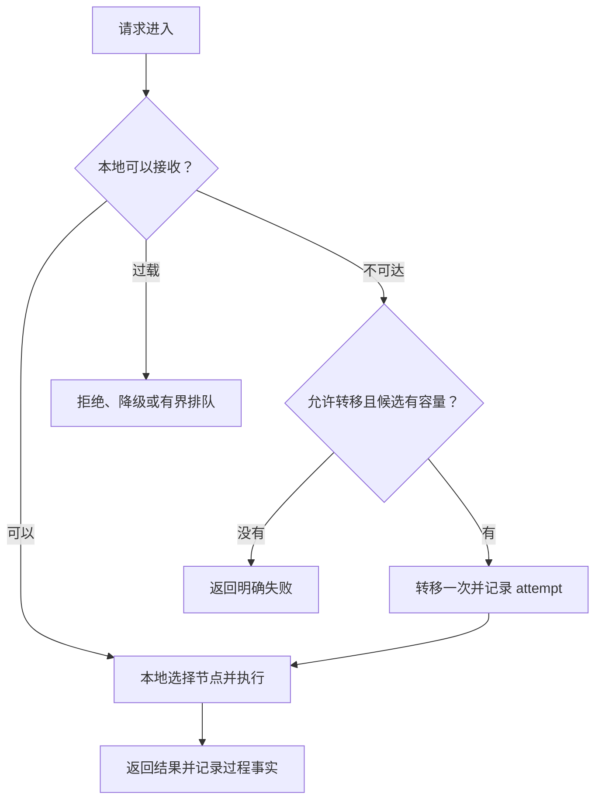
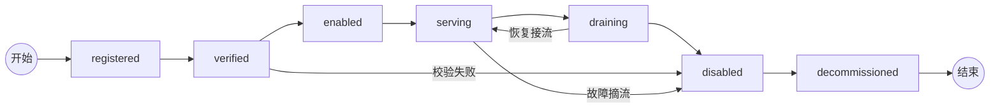
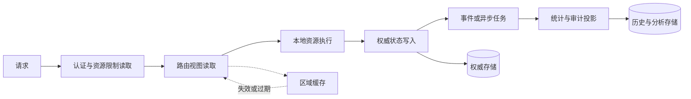

This article discusses a cross-region multi-node execution system. The caller only needs to face a stable service entrance. The system hands the request to the appropriate execution node based on capabilities, capacity, area and current status; the execution node then calls external dependencies, completes the task and returns the result to the caller.

The system initially only solves the problem of "finding an available execution resource for the caller". As the number of callers, execution nodes, and external services increases, it gradually assumes responsibilities such as protocol adaptation, routing, capacity management, failover, request observation, and node operation and maintenance. It doesn't just move the request from one end to the other, but maintains a stable contract between the caller and the execution resource.

When requests, states, and failures start to span nodes and regions, a simple execution chain turns into a distributed system that requires careful design. This article starts from these boundaries and discusses how systems can remain explainable, recoverable, and governable while continuing to scale.

A system is often very simple at the beginning: a portal, a service, and a database. Logs are written directly to the standard output. During deployment, you log in to the machine and execute a few commands. As long as the request can be returned, the system has completed the first phase.

Later, the system began to add nodes, regions, routing, health checks, failover, and background tasks. Each addition seems to solve a local problem, but these local solutions gradually form new upstream and downstream relationships, and also bring new states, delays, and fault boundaries.

At this point the system may still "run", but it starts to become unexplainable:

```text
请求可以跨边界调用，但不知道一次请求到底经历了什么；
集群可以切换，但不知道切换依据是不是已经过期；
日志确实存在，但无法把入口、节点和上下游串起来；
节点可以部署，但不同机器的版本和配置可能不一致；
监控可以告警，但告警不能说明应该由谁修复。
```

These are not five isolated issues. Together they illustrate one thing: the system adds more nodes without simultaneously establishing boundaries for facts, status, responsibilities, and fault handling.

This article is not a list of distributed system components, but an architectural review. The more practical questions for a running system are:

> How can a system that was originally functional gradually evolve into a distributed system that is explainable, observable, recoverable, and manageable after continuously adding nodes and functions?

The "distribution" here does not mean copying a service to multiple machines, but that after requests, statuses and faults have crossed boundaries, the system can still answer: who is responsible, who is trustworthy, what is happening now, and what should be done next.


This evolution path does not require every small project to reach the final step, but explains where complexity arises: the increase of nodes brings selection problems, the increase of regions brings status synchronization problems, and traffic transfer brings capacity and failure problems. In the end, the control plane, data plane and governance mechanism need to jointly answer these questions.

## 1. How does the transit station grow from a forwarding link?

### Start from a single node

Many problems with single-node relays can be temporarily hidden by processes and databases. The transfer station knows where the upstream is, the upstream knows its own status, and the logs are usually written on the same machine. Even without formal service discovery, capacity models, and failover, it is still possible to meet current scale needs.

But that doesn't mean the problem doesn't exist. They are simply obscured by the condition that there is only one place.

### After adding nodesWhen the transfer station has multiple execution nodes, the system immediately needs to answer: which node the request should be sent to, whether the node is really available, what capabilities the node supports, how much capacity is currently left, and whether the switch will be repeated after a failure.

After adding multiple regions, the global entrance, regional services and local upstream resources will have local information respectively. They may observe different states at different times, or they may be temporarily unable to acknowledge each other due to network partitions. At this point the transit station already has distributed semantics, even if it only has a few machines.

### Boundary of review

This article conceals the business name, node name, domain name, account number, capacity and time window, and only retains the fault structure that can be migrated to other systems. What is discussed here is not the technology stack of a certain project, but the architectural problems exposed in the real operation of a multi-node system, and how the next version of the design should respond to these problems.

The point of review is not to prove that the original implementation was useless, but to find out which capabilities have become critical infrastructure and where they are still just maintained by convention, scripts and luck.

## 2. How to deduce architectural gaps from online problems

The following questions come from an online troubleshooting of an evolving multi-node system. Specific names and operational data have been hidden, leaving only the structure of the problem, evidence, and causal relationships between failures.

### There is more than one clock for request timeout

A long request passes through edge entrances, multiple service boundaries, execution nodes and upstream services at the same time. If timeouts are set for each layer separately, it may happen: the upstream is still executing, but the edge has returned a timeout; the application has written the response header, and the background thinks the request failed; the client sees `200`, but the response body is actually an error.

Therefore, when troubleshooting "why the request timed out", you cannot just look at the logs of a certain layer, but answer:

```text
客户端何时断开？
边缘何时停止等待？
执行节点何时收到上游的响应头？
执行端何时开始输出？
服务端何时完成业务？
后台记录和后置处理何时结束？
```

This means that the deadline must be a fact of the request that is passed across the boundary, rather than an isolated number configured by each layer. Streaming requests also need to separate "response header has been submitted" and "complete output has ended", otherwise the keepalive mechanism may just change the expression of the error.

### Passing the health check does not mean that the business path is available.

If `/healthz` of a certain node returns successfully, it can only mean that the detection path is reachable at that moment. It does not necessarily mean:

- The data plane can accept new requests;
- Local resources still have available capacity;
- There is no current limit on the upstream;
- The current version and configuration are correct;
- Logs, databases and background tasks still work.

Therefore, the health status must be at least divided into alive, reachable, serviceable and bearable. Treating a simple HTTP 200 as all health facts makes monitoring overly optimistic when you need it most.

### Configuration entry drift will create "sporadic failures"

Online investigations often reveal that: code, deployment scripts, network access configuration, reverse proxy and monitoring each have a set of entrance addresses saved. They may work just fine at ordinary times, but once the node is switched or redeployed, there will be a situation where monitoring accesses path A and users access path B.

Such problems are difficult to fix with business code. The system should have only one canonical endpoint and automatically verify it before publishing:

```text
路由配置
= 网络接入入口
= 反向代理主机名
= 健康检查地址
= 监控目标
= 部署变量
```Configurations are also production facts and cannot be treated as mere document attachments.

### The log exists, but it cannot prove what happened.

A system may already have request logs, trace IDs, upstream and downstream execution attempts, and error logs, but it still cannot answer questions during troubleshooting: which node a certain request passed through, how many attempts occurred, which stage took the longest, and whether the failure occurred before the request or after the response.

Common reasons include log fields being discarded in the formatter, different services using different IDs, streaming requests without terminal events, background write failures without compensation, and sampling rules not being logged. The result is "Lots of logs" but one request cannot be reconstructed.

Observation data should also have its own schema version, collection success rate, and completeness indicators. Otherwise, there is a problem with the log system itself, and business monitoring may still show that everything is normal.

### A local current limit is magnified into a regional fault

The same status code returned by the upstream may mean both "the long-term resource window has been exhausted" and "the request is too fast in a short period of time". If the downstream converts both to permanently unavailable, the short cooling of a single resource will turn the entire node out of the route; if each node has only one resource of this type, the local problem will further become a regional problem.

What is really missing here is not a more complex load balancing algorithm, but the granularity and life cycle of states: the system needs to distinguish between temporary cooling, permanent disabling, capacity exhaustion and unknown states, and let the router use these different actions of "downgrade, wait, quarantine or remove".

### Background task failure is treated as a normal situation

Capacity refresh, trace archiving, statistical projection and alarm sending are often placed in scheduled tasks or background tasks after the request ends. In order not to affect user requests, these tasks may catch errors and continue running.

The problem is: if this task is the only writer of a routing table or observation table, then "capture and record" does not equal system security. What the downstream reads may be permanently old data, but nowhere is it explicitly told that the refresh task has stopped.

Background tasks need their own running status, last success time, failure reason, retry and compensation mechanism. Error isolation should prevent one node from bringing down the entire batch, but it cannot turn the failure of a critical task into a silent normal state.

### Logs and temporary files can also be sources of failure

Request logs, streaming shards, and debug archives can eventually fill up the disk if their total size is not capped. A more hidden situation is that the cleaner only cleans log files and not the temporary directory; or the cleaning function is turned off by default, but the deployment process does not check the configuration.

This type of failure shows that capacity management is not only targeted at business requests, but also at the system's own observation data: log retention time, disk budget, cleanup failure alarms and pre-deployment space inspection should all be part of the closed loop of operation.

## 3. Deducing architectural gaps from phenomena

### Let’s first look at what the system must fulfill

When reviewing, you can't just ask "which module has the bug", but also ask what the system must fulfill. Otherwise, a local fix may break another boundary: increasing retries to reduce timeouts may amplify upstream pressure; to improve cache hit rates, expired status may continue to be propagated.A set of cross-region transfer stations may require such guarantees:

```text
只读请求：允许在有限时间内切换区域
幂等写入：可以带幂等键重试
非幂等写入：超时后不能直接重放
流式请求：连接建立或响应开始后不透明切换
关键写入：结果和副作用必须可审计
区域故障：不影响其他区域继续处理可用请求
系统过载：拒绝一部分请求，也不让全部请求无限等待
```

These sentences are more useful than "high performance, high availability, and high stability" because they can be translated into interfaces, tests, and alarms. Architecture should be derived from guarantees, not spelled out from a list of components.

Here we also need to distinguish a few words that are often confused together:

- **Impotence**: If the same operation is executed multiple times, the business effect will be the same as if it was executed once;
- **Consistency**: The states seen by different nodes satisfy the specified order or constraints;
- **Persistence**: Confirmed facts will not disappear due to node failure;
- **Traceability**: The process of requests and status changes can be reconstructed after the fact.

A single request cannot achieve strong consistency, unlimited availability, minimal latency and zero cost at the same time. The first step in design is to acknowledge that there are trade-offs between these guarantees and write them out.

### Write boundaries, targets and non-targets first

Engineering design cannot just write "the system must be highly available". Before entering into implementation, you should at least write down clearly what requests the system serves, what it is not responsible for, what goals it must meet, and which issues are explicitly left for later.

For example, a set of cross-regional transfer stations can be written as:

| Project | Constraints |
| --- | --- |
| Service scope | Receive requests, select regions, perform intra-region scheduling, adapt upstream and downstream and return results |
| Not responsible | Solve business consistency for the upstream and do not merge all regional status into a real-time database |
| Request target | Normal requests are completed within the deadline; failed requests can distinguish between retryable and unknown results |
| Status Goals | Ownership and critical records have authoritative writers; capacity views allow bounded staleness |
| Failure target | Single node or single area failure does not propagate into global overload |
| Post-problems | Multi-active control plane, cross-region strongly consistent transactions, automatic expansion and contraction |

The non-goal is not to admit that the system is incomplete, but to prevent one architectural discussion from sucking in all the issues and ending up with neither a deliverable first version nor clear boundaries.

### Write principles as invariants

An engineering principle is often just a wish if it cannot be tested or checked. The core design can be written as system invariants:

```text
同一类权威状态不能存在两个无协调写入者
已经进入响应阶段的请求不能被透明重放
旧版本状态不能覆盖新版本状态
被 drain 的节点不能接收新请求
一次请求的所有重试必须共享同一个 deadline 和预算
容量快照必须带 observed_at，超过 TTL 后不能继续按新鲜事实使用
任何已确认的业务副作用都必须有唯一 request_id 或审计事实
```

These invariants are closer to the core of the design than "use some kind of database". Databases can be replaced, but invariants cannot disappear because of implementation convenience.

### Every decision has trade-offs

Engineering writing should not only give the final solution, but also explain why other options were not chosen:

```text
问题：区域容量视图是否要求强一致？

选择：带 TTL 的最终一致快照
原因：容量会快速变化，强一致读取会把每个请求绑定到控制面
代价：路由可能短暂选择已过载区域
补偿：数据面做 admission control，失败时有限转移
升级条件：快照陈旧导致的错误率超过目标，或资源浪费不可接受
```

This way of writing changes "eventual consistency is better" into a bounded judgment: under what conditions it is established, at what cost, and when it needs to be re-evaluated. The value of architectural decision records is also to preserve context, decisions, and consequences. [MADR](https://adr.github.io/madr/)

## 4. Look at distributed issues along a request chainLet’s first look at the hierarchical structure of this multi-node execution system. The caller requests to enter the global entrance, and the system selects a region based on capabilities, capacity, distance and affinity; the regional control plane selects the local node; the data plane selects the local execution unit, calls external dependencies and returns the results.

~~~mermaid
flowchart LR
    U[用户请求] --> G[全局入口 / 数据面]
    G --> A[区域 A 数据面]
    G --> B[区域 B 数据面]
    G --> C[区域 C 数据面]
    A --> AR[区域 A 本地执行资源]
    B --> BR[区域 B 本地执行资源]
    C --> CR[区域 C 本地执行资源]
    AR --> AU[外部依赖]
    BR --> BU[外部依赖]
    CR --> CU[外部依赖]
    CP[全局控制面] -.期望状态、策略、版本.-> G
    CP -.-> AC[区域 A 控制面]
    CP -.-> BC[区域 B 控制面]
    CP -.-> CC[区域 C 控制面]
    AC -.注册、租约、容量.-> A
    BC -.注册、租约、容量.-> B
    CC -.注册、租约、容量.-> C
    G -.过程事实、容量信号.-> O[(观测与审计)]
    A -.过程事实、容量信号.-> O
    B -.过程事实、容量信号.-> O
    C -.过程事实、容量信号.-> O
~~~

The normal flow of a request can be written as:

~~~mermaid
sequenceDiagram
    participant Client as Client
    participant Global as Global Router
    participant View as Control View
    participant Region as Regional Data Plane
    participant Resource as Local Resource
    participant Dependency as Upstream Service

    Client->>Global: request_id + deadline + capability
    Global->>View: read versioned routing view
    View-->>Global: eligible regions and capacity evidence
    Global->>Region: forward request
    Region->>Resource: local scheduling
    Resource->>Dependency: execute operation
    Dependency-->>Resource: result or typed error
    Resource-->>Region: local result
    Region-->>Global: response + attempt metadata
    Global-->>Client: result or bounded failure
    Global-->>View: trace, outcome, capacity signal
~~~

Every arrow in the diagram requires a question: is it a synchronous call or an asynchronous event? Who handles failure? Can you try again? Is the caller relying on live state or a versioned snapshot? If there are no answers to these questions, the architecture diagram simply draws the uncertainty as lines.

### Control plane, data plane and regional control plane

Complex systems usually require at least three levels.

### Global control plane

The global control plane maintains the desired state and global rules of the system:

- which areas and services exist;
- Which areas are allowed to receive traffic;
- In which areas a certain capability should be provided;
- Which version and configuration the node uses;
- Which area is draining;
- What are the global policies, resource limits and audit facts.

### Regional control surface

The regional control plane is responsible for bringing global goals to this region:

- In-region service discovery;
- Node registration and lease;
- Local capacity summary;
- Configuration execution;
- Node start, stop and rolling update;
- Local recovery in case of zone failure.

### Regional data surface

The data plane only focuses on hot paths:

- receive requests;
- Select resources based on available views;
- Execute business;
- Make limited retries within the deadline;
-Return results and record facts.

The control plane is responsible for "what the system should look like", and the data plane is responsible for "how to complete this request now". When the control plane fails, the data plane that has obtained valid configuration and lease does not have to stop immediately; when the data plane fails, the control plane should still be able to observe and repair it.

The controller mode of Kubernetes is a similar control loop: the controller observes the current state and gradually pushes it to the desired state, rather than assuming that the two will always be the same in real time. [Kubernetes Controllers](https://kubernetes.io/docs/concepts/architecture/controller/)

## 5. Four closed loops of status, responsibility and fact

"Is this service healthy?" is usually too crude. Service discovery and routing have to deal with at least four facts respectively.

### Identity Facts: Who it is

Regions, nodes, services and versions all have stable identities:

```text
region_id = us-west-1
node_id = worker-17
service = task-executor
version = release-42
```

The fact of status only means that it exists on the roster, but does not mean that it can currently provide services.

### Reachable Facts: Can I contact it?

DNS resolution, networking, TLS, authentication, and interface responses are all reachability. The node may exist but the network is unreachable; the management interface may be reachable but the data plane is overloaded.

```text
存在 ≠ 可达
```

### Ability Facts: What It Can DoWhether a node supports certain business capabilities, protocol versions, long connection methods or authentication methods is a capability fact. Capabilities generally change slowly and are suitable for registration and version management.

### Capacity Facts: How Much More Can It Do Now

Available concurrency, resource limits, temporary hold-down states, latency, and error rates are all capacity facts. It must have an observation time and may begin to expire after being written.

```text
ready_count = 3
cooling_count = 1
queue_depth = 12
observed_at = T0
```

So instead of swapping DNS for another name, service discovery combines identity, reachability, capabilities, capacity, and lifecycle into a view that routing can understand. etcd treats KV, Watch and Lease as different primitives, which also shows that state storage, change propagation and survival detection are not the same thing. [etcd API guarantees](https://etcd.io/docs/v3.5/learning/api_guarantees/)

### State ownership: who can write, who can only observe

The core of the multi-region design is not to copy all data to the center, but to assign an authority to each type of status:

| Status | Authoritative | What is saved elsewhere |
| --- | --- | --- |
| In-zone resource and lease status | Zone services | Summary, versions, and events |
| Whether the zone is enabled | Global control plane | The actual execution status of the zone |
| Local Scheduling and Cooling | Regional Data Plane | Capacity Observation |
| Request forwarding facts | Node that actually handles the request | Central correlation, key logging and auditing |
| Global Capacity View | Central Projection | Timestamped Read-Only Snapshot |

Both the center and the region can directly modify the same state, which is one of the most dangerous designs. The clearer relationship is:

```text
Command → 权威节点执行 → Event → 其他节点建立投影
```

For example, if the central government wants to disable a regional resource, it sends a command with `command_id`; after the regional execution, it writes the local state and then publishes the `ResourceDisabled` event; after the central consumes the event, it updates the global view.

MQ is only responsible for delivering messages and is not responsible for automatically resolving conflicts. To ensure that local status and events are not separated, it is usually necessary to outbox: status updates and events are written in the same transaction, and then published asynchronously. When the central projection is damaged, it can be reconstructed from events rather than trusting that a certain timing synchronization is complete.

Strongly consistent storage or consensus may be required for unique ownership, business-critical records, and security policies. The core of Raft is to use replicated logs to construct a replicated state machine, rather than having several databases regularly overwrite each other. [Raft paper](https://raft.github.io/raft.pdf)

### Multi-zone is not a fully connected network

There can be dedicated secure paths between zones, but each zone should not default to discovering and calling all other zones. The more common structure is:

```text
Global Control Plane
  ├─ Region A Control Plane ── Region A Data Plane
  ├─ Region B Control Plane ── Region B Data Plane
  └─ Region C Control Plane ── Region C Data Plane
```

The global control plane provides regional directories and policies, and the regional control plane is responsible for local service discovery. Only declare cross-region calls when business dependencies do exist:```text
Region A → Global State Store
Region A → Region B Replication
Region B → Global Configuration
```

This is not done to make the topology look good, but to control fault propagation, permission boundaries, and the number of connections. Kubernetes uses a centralized API path for node and control plane communication, which also reflects the value of hub-and-spoke for governance. [Kubernetes control-plane communication](https://kubernetes.io/docs/concepts/architecture/control-plane-node-communication/)

## 6. The most expensive thing is not the machine, but the border

### Communication contract definition failure semantics

HTTP, RPC, gRPC, and Message Queuing are just transports. What really needs to be designed is the contract:

```text
request_id
idempotency_key
deadline
protocol_version
required_capability
trace_id
schema_version
config_version

error_code
error_layer
retryable
retry_scope
retry_after
server_version
```

A throttling response may indicate that an execution unit is temporarily unavailable, upstream global throttling, caller limit exceeded, or region capacity exhausted. They require different recovery paths: intra-region replacement of execution units, cross-region transfer, waiting, or outright rejection.

"Unknown results" also need to be defined. Request timeout does not mean that the server did not execute it; for write operations, after timeout, you should first query the status or enter compensation instead of sending it again directly. Being able to track an error does not mean you are qualified to retry the error.

The version is not just a number in the interface either. A cross-node system must manage at least several versions at the same time:

```text
代码版本：当前进程运行的实现；
协议版本：请求和响应如何解释；
数据版本：数据库 schema 和数据迁移状态；
配置版本：路由、能力、限流和安全策略；
事件版本：历史事件的结构和语义；
部署版本：某个节点是否已经完成升级。
```

These versions cannot be assumed to change simultaneously. When new code is released, the old node may still be processing requests; when the database is migrated, the old code may still be reading and writing; when the control plane pushes new configurations, the regional data plane may not have been applied yet. A safer release sequence is usually: expand compatibility first, then migrate data and configuration, finally switch users, confirm that there are no dependencies on old versions, and then delete the old paths.

Every cross-boundary communication should clearly indicate the supported version range, rather than just recording the "current version". For status and events, the producer version, consumer version and migration method must also be retained, otherwise you can only rely on luck when rolling back.

### Traffic distribution is a hierarchical decision, not an even distribution.

A request usually goes through three selections:

```text
全局层：选择区域
区域层：选择节点
节点层：选择本地资源
```

Each layer only selects resources that it has sufficient information and control over. The routing sequence can be:

```text
1. 过滤能力不匹配的节点
2. 排除 disabled、失联、熔断和明显过载的节点
3. 根据容量、并发和队列加权
4. 在可行候选中优化距离和缓存/会话亲和
5. 在请求 deadline 内做有限 failover
```

The goal of load balancing is not necessarily an average number of requests. The number of requests, concurrency, computation time, long connections, upstream resource limits, and queue length may represent different pressures.

Affinity protects cache locality, but must give way to overload. Weighted rendezvous hashing, least-loaded, or random by capacity can be used, provided that the selection goal is clear and the algorithm does not lump unexplained multiple indicators into an uncheckable score.

### Failure recovery must have boundaries

Recovery should proceed layer by layer along resource ownership:

```text
上游限流
  → 区域内换资源

本地资源耗尽
  → 区域调度器重新选择

区域网络不可达
  → 全局路由器尝试其他区域

全局容量不足
  → 限流、降级或拒绝
```Don't let the ingress, regional services, and upstream clients each have their own set of infinite retries. With three retries for each of the three layers, one user request may turn into twenty-seven downstream calls. gRPC's official retry configuration also includes retryable status, maximum number of attempts, exponential backoff, random jitter, and retry throttling as explicit mechanisms. [gRPC Retry](https://grpc.io/docs/guides/retry/)

Each request should have only one total deadline and one total retry budget, and each layer consumes the same budget. Otherwise, the so-called high availability will turn into a retry storm.

### Protect the system first when overloaded

When the system is overloaded, there are not only two options: "add machine" and "drop request". In between there are:

```text
admission control
  → 分层限流
  → 有界排队
  → deadline
  → 熔断
  → 降级
  → load shedding
  → 扩容
```

The queue cannot grow indefinitely. A request that has been waiting until the client gives up continues to occupy connections, memory and threads, which will only reduce the effective throughput of the entire system.

Different flows should also be isolated: normal requests, long streaming, management operations, and background synchronization should not share an unbounded queue. Traffic transfer after a zone failure must also check the remaining capacity, otherwise a local failure will become a cascading failure. Google SRE considers this process of "failures causing traffic shifts, which cause more failures" as a typical cascading failure, and recommends the use of load drops, degradation, dynamic timeouts, backoffs, and retry budgets. [Google SRE: Cascading Failures](https://sre.google/sre-book/addressing-cascading-failures/)

Failover can first be drawn as a bounded decision-making process:



The key here is not that "you must change regions after failure", but that the transfer itself must also consume budget, check capacity, and leave evidence. Otherwise failover simply moves the fault from one boundary to another.

## 7. How nodes change and how the system recovers

### Life cycle and deployment are also system design

Nodes should have state machines instead of just online and offline:



The meaning of `draining` is to stop new requests, but allow existing requests to be completed; `disabled` is the routing status, which does not necessarily mean deleting nodes and local resources; `decommissioned` means that the resources can be cleaned up.

When deploying, drain first, then update the program, then verify the capability and capacity, and finally resume serving. If any step fails, the original version and original routing status should be restored. The global control plane also prevents emptying the only areas where a certain capability is available, otherwise the maintenance action itself creates an incident.

### Safety Boundary and Fault DomainIf the regional service owns resource leases, business keys, or other sensitive state, the global control plane should not read the original secret, only the digest and submit the command with permissions. Management interfaces and data interfaces should be separated, service identities should be rotated, and area entry should pass through dedicated security boundaries.

Also define the fault domain:

```text
单进程故障
单节点故障
单区域故障
跨区域网络分区
全局控制面故障
上游故障
```

Each fault domain requires an independent degradation strategy. If one area hangs up, other areas should not be allowed to wait for its management interface to time out; the global control plane is temporarily unavailable, and the data plane with valid local configuration should not be allowed to stop service immediately.

## 8. Database, cache and performance

After the system becomes complicated, performance is usually not suddenly broken down by a certain algorithm, but is superimposed by multiple small costs: requests go through an extra layer of proxies, the database is queried one more time, background tasks are written one more time, and the cache is invalidated and the pressure is returned to the database. The functionality was still correct, but each iteration made the thermal path longer, and in the end the design problems had to be covered up by adding more machines.

### Draw the read and write paths first

Database design should start from the life cycle and access mode of the state, rather than selecting a certain database first. At least a distinction should be made between:

```text
权威写入：谁能改变事实；
查询读取：谁需要看到哪些投影；
异步写入：哪些结果可以延后记录；
历史记录：哪些事实必须追加保存；
统计读取：哪些查询不应该阻塞在线请求。
```

The read and write path of a request can be drawn as:



Every database access asks: does it have to be on the request's main path? Is it reading authoritative state or a derived view? Is it possible to try again after failure? Are repeated writes idempotent? Where are the transaction boundaries?

If online requests, background synchronization, statistical analysis, and audit writing are all pushed to the same set of tables and the same set of connection pools, the system will compete with each other for resources as soon as it becomes complex. Read-write separation, asynchronous projection, batch writing and independent connection pools are not to pursue architectural form, but to isolate different pressures.

### The cache must describe what it caches

Caching is not done by "adding a Redis". Each cache must be written clearly:

```text
缓存对象是什么；
谁负责失效；
允许陈旧多久；
未命中时谁承担回源压力；
回源失败时是否允许使用旧值；
缓存击穿时如何限并发；
缓存中的数据是否包含敏感信息。
```

Status such as permissions, key business status, attribution, and idempotent results cannot bypass authoritative verification just because of a cache hit. Capacity and service discovery views can often use caching with TTL, but staleness must be factored into routing decisions. The order of cache updates after writing must also be considered, otherwise there will be a situation where the database already has a new value and the cache overwrites the old value again.

Common cache issues include cache blowouts, avalanches, penetrations, and hot keys. They are essentially concurrency, expiration time and return-to-origin paths that have not been designed, rather than the wrong choice of caching product.

### Write performance as budget

"Performance is better" cannot guide iteration. A request should be allocated a budget of:

```text
总延迟预算
  = 认证预算
  + 路由预算
  + 数据库预算
  + 上游调用预算
  + 响应和观测预算
```

At the same time, throughput, concurrency, queue length, database connection usage, cache hit rate, P95/P99 latency and retry ratio are recorded. Average latency often masks the long tail; an increase in cache hit ratio does not necessarily mean faster user requests, as invalid requests may have slowed down the database.

Performance optimization should first locate who consumes the budget, and then decide to add indexes, change queries, batch, asynchronous, cache or expand capacity. Optimization without baselines and profiling often just moves complexity from one location to another.

### Database complexity must have boundariesAs business grows, the database will gradually carry transactions, configurations, logs, statistics, queues, and cache invalidation records. Their life cycles, access pressures, and consistency requirements are different, and continuing to be placed in the same model will make migration, lock contention, and troubleshooting increasingly difficult.

There are several questions you can use to decide whether to split:

```text
这张表保存的是权威事实还是派生结果？
它的写入是否需要和其他状态处在同一个事务？
它是否需要长期保留，还是可以按时间清理？
它的查询是否会影响在线请求？
它是否需要独立扩展、备份和恢复？
```

Only when the access patterns, fault domains, or life cycles are truly different, is it worthwhile to split tables, databases, or introduce new storage. Otherwise premature splitting will turn a transaction problem into a distributed consistency problem.

## 9. Turn optimization into hierarchical decision-making

If the previous principles cannot be translated into optimization sequences, they are still just architectural discussions. Real systems cannot solve all problems at once, nor should all components be optimized from the beginning. A more practical approach is to first separate requests, status, calls and storage, and see clearly where each type of cost comes from.

### Make sure the request is correct first

The first goal of the request hot path is not throughput, but correct semantics: requests cannot be replayed with errors, responses cannot disguise failures as successes, and unknown repeated side effects cannot occur after timeout.

This layer should be completed first:

```text
统一 request_id、trace_id 和 attempt_id；
统一 deadline、取消和错误契约；
写操作使用幂等键；
重试共享总预算；
关键副作用都有可查询的结果。
```

After doing this, no matter how many nodes a request passes through, it should at least be able to determine whether it has been executed, which step it has been executed to, and whether it can be safely retried. Without this foundation, caching and parallel calls will just produce errors faster.

### First make the area shorter

Within the region, priority is given to solving "one less step" and "one less wait": reuse connections and clients, reduce repeated authentication and configuration reading, use local routing views, limit single-node concurrency and queues, and allow local failures to be digested locally.

Cross-region calls should occur primarily on the failover path, not the default flow for each request. The goal is to ensure that most requests do not rely on the global control plane and do not wait for other nodes due to exceptions on one node.

### Move global control out of hot path

The global control plane is suitable for processing low-frequency operations such as registering nodes, publishing configurations, modifying routing policies, performing drains, summarizing capacity, and recording audits. It should not query all regions synchronously for every user request.

A more appropriate way is: the control plane asynchronously generates a versioned routing view, the data plane reads the latest valid view, the region independently reports the actual status, and enters a clear downgrade strategy after the view expires.

The pursuit here is not that the status is always real-time. What's really needed is a request path that doesn't rely on a slow central coordination process while making staleness measurable, boundable, and explainable.

### Organize storage by cost

Storage costs are not just disk costs, but also include database connections, transaction locks, index maintenance, network transmission, backups, query latency, and operation and maintenance complexity. Different data should be layered by lifecycle and consistency requirements:| Data types | Suitable storage methods | Main goals |
| --- | --- | --- |
| Authoritative business state | Transaction database | Correctness and constraints |
| Hot path query views | Indexed tables or read models | Low latency and scalable reads |
| Short-term routing and capacity | Caching with versions and TTL | Fast reads and bounded staleness |
| Long-term logs and historical events | Object storage or archive storage | Low-cost retention and offline analysis |

Online requests should not scan transaction tables to display statistics, nor should they wait for complex business transactions to write an observation record. Authoritative state is committed in an explicit transaction, and statistics and observation projections are generated via outbox or asynchronous tasks.

### The cache only caches data that can be stale.

The cache should be layered by data freshness and error cost: the in-process cache is responsible for short-term repeated calculations, the regional cache is responsible for shared routing views, the global cache is responsible for low-frequency configuration, and the authoritative storage is responsible for ownership, permissions, and key business status.

Each cache value must define the version, maximum staleness time, expiration mode, behavior when the return to the origin fails, and the upper limit of the return to the origin concurrency. An increase in cache hit rate does not necessarily mean that the system is getting faster. Also observe database QPS, P95/P99, errors caused by stale data, and cache breakdown.

### Try to make as few cross-border calls as possible

The order in which optimizations are called is usually:

```text
不调用 → 本地调用 → 批量调用 → 并行调用 → 有预算的重试 → 跨区域转移
```

Management operations can query multiple regions in parallel, subject to single-region timeout, total timeout, and partial success semantics. User requests should avoid accessing all nodes simultaneously to get complete status.

Neither parallel nor hedging requests are free: they increase the number of connections, the transient load, and the width of the failure surface. They should only be used when the cost of repeated execution is acceptable, requests can be safely canceled, and the long tail is truly worth optimizing.

### How should optimization results be verified?

Layered optimization cannot just be written as "performance improvement". After going online, at least these changes must be observed:

```text
热路径不再同步依赖全局控制面；
单个节点故障不会触发全局 fan-out；
跨区域调用只出现在明确的恢复路径；
数据库在线事务和统计查询互不拖累；
缓存陈旧、命中、击穿和回源都有指标；
重试流量不超过预算；
P95/P99 延迟能够按阶段解释；
日志、状态和事件能够重建一次请求。
```

If average latency goes down without explaining an increase in errors, cache expiration, or amplified retries, then the problem is most likely just in a different location.

## 10. How far should we go in the next version?

Reviewing this point, the next version does not require all enterprise infrastructure to be deployed immediately. Even if there are only a few machines, it is not necessary to use a complete service mesh, consensus cluster, or automatic orchestration platform; but the following semantics cannot continue to rely on conventions:

```text
一个注册表
每个区域一个本地服务
心跳和容量上报
带版本和 TTL 的配置快照
一个全局路由器
区域内本地调度
统一错误契约
请求 deadline 和幂等键
一次有限 failover
drain 状态
trace_id 和审计事件
```

The first version can replace watches with scheduled pulls, orchestrators with scripts, and high-availability control planes with a single control plane. But just because the scale is small, you cannot allow multiple places to write the same state at the same time; you cannot allow each layer to retry infinitely; you cannot pretend that expired snapshots are real-time facts.

As the scale expands, the following will be introduced based on actual guarantees:

```text
outbox 和事件回放
Lease / Watch
共识存储
区域控制器
自动限流和熔断
多活控制面
自动滚动发布
```

Complex components should be the result of deriving requirements and failure models, not to make the architecture diagram look like a large company's system.

The minimum system should also have clear acceptance conditions, rather than just "can run" as if it is completed:

```text
能注册和撤销一个节点
能发现节点失联，并在 TTL 后停止把它当作新鲜候选
能在区域故障时执行一次有预算的转移
能保证同一个幂等写入重复到达不会产生两次副作用
能在过载时有界排队或明确拒绝
能安全 drain、发布、失败回滚和恢复流量
能通过 request_id 重建一次请求的尝试过程
```These conditions can be verified by integration testing, fault injection, and small-scale stress testing. They also provide evidence of when to introduce more complex components, rather than being dictated by team size or technology trends.

### Observation should retain process facts

A request should be able to answer at least:

```text
为什么最初选择区域 A？
A 在哪一步失败？
A 是否已经执行了业务？
为什么转移到区域 B？
B 是否成功？
最终响应来自哪里？
这次转移增加了多少延迟和成本？
```

Therefore, trace, metrics, logs, and audit events need to be kept separately: trace records paths, metrics records overall health, logs explains specific exceptions, and audit events retain non-overridable status and business facts.

Full link traceability does not mean copying all original requests, resource identifiers and business loads to the central platform. Low-cardinality facts that are sufficient to explain routing and failures should be recorded while controlling privacy, storage cost, and proliferation of sensitive information.

Observations must also be bound to targets. At least you need to know: whether the request success rate reaches the target, whether the P95/P99 delay exceeds the budget, whether failover is increasing, how long the capacity view is stale, what proportion of retry traffic is, and whether the expected low-priority requests are rejected when overloaded. Without these indicators, the system only "has logs" and is far from verifiable reliability.

## 11. How the architecture is formed during iterations

### Architecture is not a one-time design

Architectural design is not about drawing a picture at the beginning of a project and then requiring all implementations to obey it forever. Real systems change with traffic, data volume, team boundaries, and failure experience, and the architecture should be re-examined at every significant iteration.

An iteration should leave at least five categories of results:

```text
新增了什么用户保证；
新增了哪些状态和状态所有者；
热路径增加了哪些读写和网络跳数；
引入了哪些新的失败模式和运维动作；
哪些指标或测试可以证明这次变化没有破坏预算。
```

Each iteration can be compressed into a small loop: first write the target and non-target, then draw the request and read and write paths, define the invariants and version compatibility range, do the minimum implementation, and finally verify it with indicators, tests and fault drills. If the verification results do not meet the budget, reduce paths, change isolation methods, or adjust the data model instead of continuing to add patches to the system.

This is closer to the basic architectural skills of engineers: when requirements change, they can re-identify boundaries, states, costs and faults, and judge whether the complexity is worth it this time, rather than reflexively adding a component.

What really needs to be taken away is not a list of components, but a judgment sequence: first look at user guarantees, then status and responsibilities; find out read, write, call and failure boundaries along the request chain; and finally decide whether to add complex components based on indicators and failure evidence. If you switch to file processing, search, task scheduling or internal platforms, the business will change, but this set of judgments still holds.

## Conclusion

A distributed system is not about deploying services to multiple machines. That's just the physical form of distribution.

A more complete statement is: it hands status, responsibilities, facts, traffic and failures to different boundaries, and then uses versions, events, protocols, control loops and failure budgets to allow these boundaries to continue to cooperate even when the network is unreliable, nodes will lose contact, and information will expire.

There is no mysterious gap between small and large systems. Small systems may not have complex infrastructure for the time being, but they should retain the correct semantics; large systems should turn these semantics into stronger redundancy, automation, consensus, observation, and governance after the scale, faults, and team boundaries expand.Looking back, the more reasonable evolution sequence is not to continue to add more distributed components to a running system, but to first complete the four closed loops of request, status, storage and failure, and then decide whether stronger replication, consensus or automation is needed based on new evidence. The value of architectural design does not lie in predicting the end of the system from the beginning, but in that after every change, the system still knows the price it has paid.

There is another reality that is difficult to get around: the first version of the design of many systems is already completed by AI. Of course, AI's design capabilities are "ok" - it can quickly expand vague ideas into components, interfaces, processes and codes, and it can also provide several sets of seemingly complete solutions in a few minutes; but it "can't do enough". It usually doesn't know that a certain solution will add one more network call to the hot path, will make fault recovery unverifiable, and will make database writing a new bottleneck. It also doesn't know whether the team has the ability to maintain this complexity for a long time.

This is not to say that AI has no architectural capabilities, but that it is more like a high-speed solution generator and local optimizer. The recurring judgments in community discussions are roughly the same: AI will amplify the organization's original engineering capabilities; developers recognize the speed and learning benefits it brings, but remain cautious about complex tasks, code base context, and output reliability. After code generation becomes faster, what is really scarce is understanding, verification and choice. In addition to technical debt, there will also be cognitive debt and intention debt: there are more and more codes, but it is getting harder and harder for people to understand why the system is designed this way and what boundaries should be followed for the next change.

Therefore, AI can help us move through the solution space faster, but it cannot bear the cost of architecture selection for others. People still need to decide what user guarantees are, which facts must be consistent, which failures are acceptable, who will maintain the complexity, and what evidence will be used to prove that the system is really better after it goes online. For every important design generated by AI, ask at least three things: What state and boundaries does it add? What new failure modes does it introduce? Are the cost savings greater than the future operational and evolution costs?

This is also the final conclusion that I want to leave behind in this review: AI makes "making a system that can run" faster, but it does not make "knowing why a system can run reliably for a long time" automated. Architectural judgment will not become unimportant as implementation costs decrease, but will become an engineering capability that needs to be retained.
