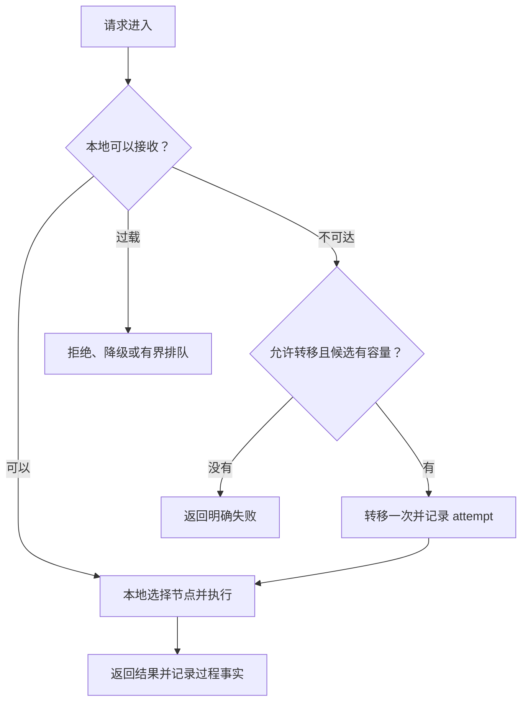
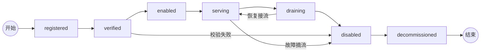
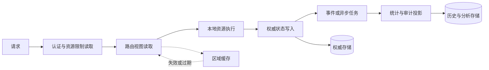

本文讨论的是一套跨区域的多节点执行系统。调用方只需要面对一个稳定的服务入口，系统根据能力、容量、区域和当前状态，把请求交给合适的执行节点；执行节点再调用外部依赖，完成任务并把结果返回给调用方。

系统最初只是解决“为调用方找到一个可用执行资源”的问题。随着调用方、执行节点和外部服务增多，它逐渐承担了协议适配、路由、容量管理、失败转移、请求观测和节点运维等职责。它不只是把请求从一端搬到另一端，而是在调用方与执行资源之间维护了一层稳定的契约。

当请求、状态和故障开始跨越节点与区域时，一条简单的执行链路就会变成需要认真设计的分布式系统。本文从这些边界出发，讨论系统如何在继续扩展的同时保持可解释、可恢复和可治理。

一个系统最开始往往很简单：一个入口、一个服务、一个数据库，日志直接写到标准输出，部署时登录机器执行几条命令。只要请求能返回，系统就算完成了第一阶段。

后来系统开始增加节点、区域、路由、健康检查、失败转移和后台任务。每一次增加看起来都在解决一个局部问题，但这些局部方案逐渐形成了新的上下游关系，也带来了新的状态、延迟和故障边界。

这时系统仍然可能“能跑”，但它开始变得难以解释：

```text
请求可以跨边界调用，但不知道一次请求到底经历了什么；
集群可以切换，但不知道切换依据是不是已经过期；
日志确实存在，但无法把入口、节点和上下游串起来；
节点可以部署，但不同机器的版本和配置可能不一致；
监控可以告警，但告警不能说明应该由谁修复。
```

这些不是五个孤立的问题。它们共同说明了一件事：系统增加了更多节点，却没有同步建立事实、状态、责任和故障处理的边界。

这篇文章不是一份分布式系统组件清单，而是一次架构复盘。对正在运行的系统来说，更实际的问题是：

> 一个原本能运行的系统，如何在不断增加节点和功能之后，逐步演进为一个可解释、可观测、可恢复、可治理的分布式系统？

这里的“分布式”不是把一个服务复制到多台机器上，而是请求、状态和故障已经跨越边界之后，系统仍然能够回答：谁负责、谁可信、现在发生了什么、下一步应该怎么做。


这条演进路径不是要求每个小项目都走到最后一步，而是说明复杂度从哪里产生：节点增加带来选择问题，区域增加带来状态同步问题，流量转移带来容量和故障问题，最终需要控制面、数据面和治理机制共同回答这些问题。

## 一、中转站是怎样从一条转发链路长出来的

### 从单节点开始

单节点中转站的很多问题可以被进程和数据库暂时隐藏。中转站知道上游在哪里，上游知道自己的状态，日志也通常写在同一台机器上。即使没有正式的服务发现、容量模型和故障转移，它仍然可能满足当前规模的需求。

但这并不意味着问题不存在。它们只是被“只有一个地方”这个条件遮住了。

### 增加节点以后

当中转站拥有多个执行节点时，系统马上需要回答：请求应该送到哪个节点，节点是否真的可用，节点支持哪些能力，当前还剩多少容量，以及失败后切换是否会重复执行。

增加多个区域以后，全局入口、区域服务和本地上游资源又会分别拥有局部信息。它们可能在不同时间观察到不同状态，也可能因为网络分区而暂时无法互相确认。这时中转站已经出现了分布式语义，即使它只有几台机器。

### 复盘的边界

本文隐去了业务名称、节点名称、域名、账号、容量和时间窗口，只保留可以迁移到其他系统的故障结构。这里讨论的不是某个项目的技术栈，而是一次多节点系统在真实运行中暴露出的架构问题，以及下一版设计应该如何回应这些问题。

复盘的重点不是证明原来的实现一无是处，而是找出哪些能力已经成为关键基础设施，哪些地方仍然只是靠约定、脚本和运气维持。

## 二、线上问题如何反推出架构缺口

下面这些问题来自一套正在演进的多节点系统的线上排查。具体名称和运行数据已经隐藏，只保留问题的结构、证据和故障之间的因果关系。

### 请求超时不只有一个时钟

一次长请求同时经过边缘入口、多个服务边界、执行节点和上游服务。各层如果分别设置超时，就可能出现：上游仍在执行，边缘已经返回超时；应用已经写出响应头，后台又认为请求失败；客户端看到了 `200`，但响应体实际是错误。

因此排查“请求为什么超时”时，不能只看某一层的日志，而要回答：

```text
客户端何时断开？
边缘何时停止等待？
执行节点何时收到上游的响应头？
执行端何时开始输出？
服务端何时完成业务？
后台记录和后置处理何时结束？
```

这说明 deadline 必须是跨边界传递的请求事实，而不是每一层各自配置的孤立数字。流式请求还要把“响应头已提交”和“完整输出已结束”分开，否则保活机制可能只是改变错误的表现形式。

### 健康检查通过，不代表业务路径可用

某个节点的 `/healthz` 返回成功，只能说明探测路径在那一刻可达。它不一定说明：

- 数据面可以接受新请求；
- 本地资源还有可用容量；
- 上游没有限流；
- 当前版本和配置正确；
- 日志、数据库和后台任务仍然正常。

所以健康状态至少要分成存活、可达、可服务和可承载。把一个简单的 HTTP 200 当作所有健康事实，会让监控在最需要它时过于乐观。

### 配置入口漂移会制造“偶发故障”

线上排查经常发现：代码、部署脚本、网络接入配置、反向代理和监控分别保存了一套入口地址。它们平时可能恰好都能工作，但一旦切换节点或重新部署，就会出现监控访问 A 路径、用户访问 B 路径的情况。

这类问题很难靠业务代码修复。系统应该只有一个 canonical endpoint，并在发布前自动校验：

```text
路由配置
= 网络接入入口
= 反向代理主机名
= 健康检查地址
= 监控目标
= 部署变量
```

配置也是生产事实，不能只当作文档附件。

### 日志存在，但不能证明发生过什么

一个系统可能已经有请求日志、trace ID、上下游执行尝试和错误日志，但排查时仍然无法回答：某次请求到底经过了哪台节点、发生了几次尝试、哪个阶段耗时最长、失败发生在请求前还是响应后。

常见原因包括日志字段在 formatter 中被丢弃、不同服务使用不同 ID、流式请求没有 terminal 事件、后台写入失败没有补偿，以及采样规则没有记录。结果是“日志很多”，但无法重建一次请求。

观测数据也应该有自己的 schema 版本、采集成功率和完整性指标。否则日志系统本身出了问题，业务监控仍然可能显示一切正常。

### 一次局部限流被放大成区域故障

上游返回的同一个状态码，可能同时表示“长期资源窗口已经耗尽”和“短时间内请求过快”。如果下游把两者都转换成永久不可用，单个资源的短暂冷却就会变成整个节点退出路由；如果每个节点又只有一个该类资源，局部问题就会进一步变成区域问题。

这里真正缺失的不是一个更复杂的负载均衡算法，而是状态的粒度和生命周期：系统要区分暂时冷却、永久禁用、容量耗尽和未知状态，并让路由使用“降权、等待、隔离或移除”这些不同动作。

### 后台任务失败被当成了正常情况

容量刷新、trace 归档、统计投影和告警发送往往放在定时任务或请求结束后的后台任务中。为了不影响用户请求，这些任务可能捕获错误后继续运行。

问题在于：如果这个任务是某张路由表或观测表的唯一写入者，那么“捕获并记录”并不等于系统安全。下游读取到的可能是永久旧数据，但没有任何地方明确告诉它刷新任务已经停止。

后台任务需要自己的运行状态、最后成功时间、失败原因、重试和补偿机制。错误隔离应该避免一台节点拖垮整个批次，但不能把关键任务的失败变成静默的正常状态。

### 日志和临时文件也会成为故障源

请求日志、流式分片和调试归档如果没有总量上限，最终可能填满磁盘。更隐蔽的情况是，清理器只清理日志文件，不清理临时目录；或者清理功能默认关闭，但部署流程没有检查配置。

这类故障说明容量治理不仅针对业务请求，也针对系统自己的观测数据：日志保留时间、磁盘预算、清理失败告警和部署前空间检查都应该是运行闭环的一部分。

## 三、从现象反推架构缺口

### 先看系统必须兑现什么

复盘时，不能只问“哪个模块有 bug”，还要先问系统必须兑现什么。否则一个局部修复可能会破坏另一个边界：为了减少超时而增加重试，可能放大上游压力；为了提高缓存命中率，可能把过期状态继续传播。

一套跨区域中转站可能需要这样的保证：

```text
只读请求：允许在有限时间内切换区域
幂等写入：可以带幂等键重试
非幂等写入：超时后不能直接重放
流式请求：连接建立或响应开始后不透明切换
关键写入：结果和副作用必须可审计
区域故障：不影响其他区域继续处理可用请求
系统过载：拒绝一部分请求，也不让全部请求无限等待
```

这些句子比“高性能、高可用、高稳定”更有用，因为它们可以转化成接口、测试和告警。架构应该由保证推导出来，而不是由组件清单拼出来。

这里还要区分几个经常被混在一起的词：

- **幂等性**：同一个操作执行多次，业务效果和执行一次相同；
- **一致性**：不同节点看到的状态满足规定的顺序或约束；
- **持久性**：已经确认的事实不会因为节点故障消失；
- **可追溯性**：事后可以重建请求和状态变化的过程。

一次请求不能凭空同时获得强一致、无限可用、最低延迟和零成本。设计的第一步，就是承认这些保证之间存在取舍，并把取舍写出来。

### 先写边界、目标和非目标

工程设计不能只写“系统要高可用”。在进入实现之前，至少应该写清楚系统服务什么请求、不负责什么、必须满足什么目标，以及哪些问题明确留到以后。

例如，一套跨区域中转站可以先写成：

| 项目 | 约束 |
| --- | --- |
| 服务范围 | 接收请求、选择区域、执行区域内调度、适配上下游并返回结果 |
| 不负责 | 替上游解决业务一致性，不把所有区域状态合并成一份实时数据库 |
| 请求目标 | 正常请求在 deadline 内完成；失败请求能区分可重试和未知结果 |
| 状态目标 | 归属和关键记录有权威写入者；容量视图允许有界陈旧 |
| 故障目标 | 单节点或单区域故障不扩散成全局过载 |
| 后置问题 | 多活控制面、跨区域强一致事务、自动扩缩容 |

非目标不是承认系统不完整，而是防止一次架构讨论把所有问题都吸进来，最后既没有可交付的第一版，也没有清楚的边界。

### 把原则写成不变量

一个工程原则如果不能被测试或检查，往往还只是愿望。可以把核心设计写成系统不变量：

```text
同一类权威状态不能存在两个无协调写入者
已经进入响应阶段的请求不能被透明重放
旧版本状态不能覆盖新版本状态
被 drain 的节点不能接收新请求
一次请求的所有重试必须共享同一个 deadline 和预算
容量快照必须带 observed_at，超过 TTL 后不能继续按新鲜事实使用
任何已确认的业务副作用都必须有唯一 request_id 或审计事实
```

这些不变量比“使用某种数据库”更接近设计核心。数据库可以替换，但不变量不能因为实现方便而消失。

### 每个决策都要留下取舍

工程写作不应该只给出最终方案，还要说明为什么没有选择其他方案：

```text
问题：区域容量视图是否要求强一致？

选择：带 TTL 的最终一致快照
原因：容量会快速变化，强一致读取会把每个请求绑定到控制面
代价：路由可能短暂选择已过载区域
补偿：数据面做 admission control，失败时有限转移
升级条件：快照陈旧导致的错误率超过目标，或资源浪费不可接受
```

这种写法把“最终一致性更好”改成了有边界的判断：它在什么条件下成立，承担什么代价，什么时候需要重新评估。架构决策记录的价值也正在于保存上下文、决策和后果。[MADR](https://adr.github.io/madr/)

## 四、沿着一条请求链看分布式问题

先看这套多节点执行系统的分层结构。调用方请求进入全局入口，系统根据能力、容量、距离和亲和性选择一个区域；区域控制面再选择本地节点；数据面选择本地执行单元，调用外部依赖并返回结果。

~~~mermaid
flowchart LR
    U[用户请求] --> G[全局入口 / 数据面]
    G --> A[区域 A 数据面]
    G --> B[区域 B 数据面]
    G --> C[区域 C 数据面]
    A --> AR[区域 A 本地执行资源]
    B --> BR[区域 B 本地执行资源]
    C --> CR[区域 C 本地执行资源]
    AR --> AU[外部依赖]
    BR --> BU[外部依赖]
    CR --> CU[外部依赖]
    CP[全局控制面] -.期望状态、策略、版本.-> G
    CP -.-> AC[区域 A 控制面]
    CP -.-> BC[区域 B 控制面]
    CP -.-> CC[区域 C 控制面]
    AC -.注册、租约、容量.-> A
    BC -.注册、租约、容量.-> B
    CC -.注册、租约、容量.-> C
    G -.过程事实、容量信号.-> O[(观测与审计)]
    A -.过程事实、容量信号.-> O
    B -.过程事实、容量信号.-> O
    C -.过程事实、容量信号.-> O
~~~

一次请求的正常流转可以写成：

~~~mermaid
sequenceDiagram
    participant Client as Client
    participant Global as Global Router
    participant View as Control View
    participant Region as Regional Data Plane
    participant Resource as Local Resource
    participant Dependency as Upstream Service

    Client->>Global: request_id + deadline + capability
    Global->>View: read versioned routing view
    View-->>Global: eligible regions and capacity evidence
    Global->>Region: forward request
    Region->>Resource: local scheduling
    Resource->>Dependency: execute operation
    Dependency-->>Resource: result or typed error
    Resource-->>Region: local result
    Region-->>Global: response + attempt metadata
    Global-->>Client: result or bounded failure
    Global-->>View: trace, outcome, capacity signal
~~~

图中的每一条箭头都需要一个问题：它是同步调用还是异步事件？失败由谁处理？能不能重试？调用者依赖的是实时状态还是带版本的快照？如果这些问题没有答案，架构图只是把不确定性画成了几条线。

### 控制面、数据面和区域控制面

复杂系统通常至少需要三个层次。

### 全局控制面

全局控制面维护系统的期望状态和全局规则：

- 哪些区域和服务存在；
- 哪些区域允许接收流量；
- 某项能力应该在哪些区域提供；
- 节点使用哪个版本和配置；
- 哪个区域正在 drain；
- 全局策略、资源限制和审计事实是什么。

### 区域控制面

区域控制面负责把全局目标落到本区域：

- 区域内服务发现；
- 节点注册和租约；
- 本地容量汇总；
- 配置执行；
- 节点启停和滚动更新；
- 区域故障时的本地恢复。

### 区域数据面

数据面只关注热路径：

- 接收请求；
- 根据可用视图选择资源；
- 执行业务；
- 在 deadline 内做有限重试；
- 返回结果并记录事实。

控制面负责“系统应该是什么样”，数据面负责“这个请求现在怎么完成”。控制面故障时，已经拿到有效配置和租约的数据面不一定要立刻停止；数据面故障时，控制面仍然应该能够观察和修复它。

Kubernetes 的 controller 模式也是类似的控制回路：控制器观察当前状态，再把它逐渐推向期望状态，而不是假设二者永远实时相同。[Kubernetes Controllers](https://kubernetes.io/docs/concepts/architecture/controller/)

## 五、状态、责任和事实的四个闭环

“这个服务健康吗”通常太粗了。服务发现和路由至少要分别处理四种事实。

### 身份事实：它是谁

区域、节点、服务和版本都有稳定身份：

```text
region_id = us-west-1
node_id = worker-17
service = task-executor
version = release-42
```

身份事实只表示它在名册里存在，不代表它现在能提供服务。

### 可达事实：我能不能联系上它

DNS 解析、网络、TLS、认证和接口响应都属于可达性。节点可以身份存在，但网络不可达；也可以管理接口可达，数据面已经过载。

```text
存在 ≠ 可达
```

### 能力事实：它能做什么

节点是否支持某种业务能力、协议版本、长连接方式或认证方式，是能力事实。能力一般变化较慢，适合进入注册和版本管理。

### 容量事实：它现在还能做多少

可用并发、资源限制、暂时抑制状态、延迟和错误率都属于容量事实。它一定带有观测时间，可能在写入后就开始过期。

```text
ready_count = 3
cooling_count = 1
queue_depth = 12
observed_at = T0
```

因此，服务发现不是把 DNS 换成另一个名字，而是把身份、可达性、能力、容量和生命周期组合成路由可以理解的视图。etcd 把 KV、Watch 和 Lease 作为不同原语，也说明状态存储、变更传播和存活检测不是一件事。[etcd API guarantees](https://etcd.io/docs/v3.5/learning/api_guarantees/)

### 状态所有权：谁可以写，谁只能观察

多区域设计的核心不是把所有数据复制到中央，而是给每类状态指定权威者：

| 状态 | 权威者 | 其他地方保存什么 |
| --- | --- | --- |
| 区域内资源和租约状态 | 区域服务 | 摘要、版本和事件 |
| 区域是否启用 | 全局控制面 | 区域的实际执行状态 |
| 本地调度和冷却 | 区域数据面 | 容量观察 |
| 请求转发事实 | 实际处理请求的节点 | 中央关联、关键记录和审计 |
| 全局容量视图 | 中央投影 | 带时间戳的只读快照 |

中央和区域都能直接修改同一份状态，是最危险的设计之一。比较清楚的关系是：

```text
Command → 权威节点执行 → Event → 其他节点建立投影
```

例如中央要禁用一个区域资源，它发送带 `command_id` 的命令；区域执行后写入本地状态，再发布 `ResourceDisabled` 事件；中央消费事件后更新全局视图。

MQ 只负责传递消息，不负责自动解决冲突。要保证本地状态和事件不会分离，通常需要 outbox：状态更新和事件写入同一个事务，之后再异步发布。中央投影损坏时，可以从事件重建，而不是相信某次定时同步一定完整。

对于唯一归属、关键业务记录和安全策略，可能需要强一致存储或共识。Raft 的核心是用复制日志构造复制状态机，而不是让几份数据库定期互相覆盖。[Raft paper](https://raft.github.io/raft.pdf)

### 多区域不是全连接网络

区域之间可以有专门的安全通路，但不应该默认让每个区域发现并调用所有其他区域。更常见的结构是：

```text
Global Control Plane
  ├─ Region A Control Plane ── Region A Data Plane
  ├─ Region B Control Plane ── Region B Data Plane
  └─ Region C Control Plane ── Region C Data Plane
```

全局控制面提供区域目录和策略，区域控制面负责本地服务发现。只有确实存在业务依赖时，才声明跨区域调用：

```text
Region A → Global State Store
Region A → Region B Replication
Region B → Global Configuration
```

这样做不是为了追求拓扑图好看，而是为了控制故障传播、权限边界和连接数量。Kubernetes 的节点与控制面通信采用中心化 API 路径，也体现了 hub-and-spoke 对治理的价值。[Kubernetes control-plane communication](https://kubernetes.io/docs/concepts/architecture/control-plane-node-communication/)

## 六、最贵的不是机器，而是边界

### 通信契约定义失败语义

HTTP、RPC、gRPC 和消息队列只是传输方式。真正需要设计的是契约：

```text
request_id
idempotency_key
deadline
protocol_version
required_capability
trace_id
schema_version
config_version

error_code
error_layer
retryable
retry_scope
retry_after
server_version
```

一个限流响应可能表示某个执行单元暂时不可用、上游全局限流、调用方超限或区域容量耗尽。它们需要不同的恢复路径：区域内换执行单元、跨区域转移、等待，或者直接拒绝。

还需要定义“未知结果”。请求超时不代表服务端没有执行；对于写操作，超时后应先查询状态或进入补偿，而不是直接再发一次。能追踪一个错误，也不等于有资格重试这个错误。

版本也不只是接口里的一个数字。一个跨节点系统至少要同时管理几种版本：

```text
代码版本：当前进程运行的实现；
协议版本：请求和响应如何解释；
数据版本：数据库 schema 和数据迁移状态；
配置版本：路由、能力、限流和安全策略；
事件版本：历史事件的结构和语义；
部署版本：某个节点是否已经完成升级。
```

这些版本不能假设同时变化。发布新代码时，旧节点可能仍在处理请求；数据库迁移时，旧代码可能仍在读写；控制面推送新配置时，区域数据面可能还没有应用。更安全的发布顺序通常是：先扩展兼容能力，再迁移数据和配置，最后切换使用方，确认没有旧版本依赖后再删除旧路径。

每一次跨边界通信都应该明确支持的版本范围，而不是只记录“当前版本”。对于状态和事件，还要保留生产者版本、消费者版本和迁移方式，否则回滚时只能依赖运气。

### 流量分发是分层决策，不是平均分配

一次请求通常经历三次选择：

```text
全局层：选择区域
区域层：选择节点
节点层：选择本地资源
```

每层只选择自己拥有足够信息、也拥有控制权的资源。路由顺序可以是：

```text
1. 过滤能力不匹配的节点
2. 排除 disabled、失联、熔断和明显过载的节点
3. 根据容量、并发和队列加权
4. 在可行候选中优化距离和缓存/会话亲和
5. 在请求 deadline 内做有限 failover
```

负载均衡的目标也不一定是请求数平均。请求数、并发数、计算时间、长连接、上游资源限制和队列长度，可能代表不同的压力。

亲和性可以保护缓存局部性，但必须让位于过载。加权 rendezvous hashing、least-loaded 或按容量随机都可以使用，前提是选择目标已经明确，而且算法不会把不可解释的多个指标揉成一个无法排查的分数。

### 失败恢复必须有边界

恢复应该沿着资源所有权逐层推进：

```text
上游限流
  → 区域内换资源

本地资源耗尽
  → 区域调度器重新选择

区域网络不可达
  → 全局路由器尝试其他区域

全局容量不足
  → 限流、降级或拒绝
```

不要让入口、区域服务和上游客户端各自拥有一套无限重试。三层各重试三次，一个用户请求就可能变成二十七次下游调用。gRPC 的官方重试配置也把可重试状态、最大尝试次数、指数退避、随机抖动和 retry throttling 作为显式机制。[gRPC Retry](https://grpc.io/docs/guides/retry/)

每个请求应该只有一个总 deadline 和一个总 retry budget，各层消耗同一个预算。否则所谓高可用会变成重试风暴。

### 过载时先保护系统

系统过载时，不是只有“加机器”和“丢请求”两个选项。中间还有：

```text
admission control
  → 分层限流
  → 有界排队
  → deadline
  → 熔断
  → 降级
  → load shedding
  → 扩容
```

队列不能无限增长。一个已经等待到客户端放弃的请求，继续占用连接、内存和线程，只会降低整个系统的有效吞吐。

不同流量还应该隔离：普通请求、长 streaming、管理操作和后台同步不应该共享一个无边界的队列。区域故障后的流量转移也必须检查剩余容量，否则一个局部故障就会变成级联故障。Google SRE 将这种“故障导致流量转移，流量转移又导致更多故障”的过程作为典型级联故障，并建议使用负载丢弃、降级、动态超时、退避和重试预算。[Google SRE: Cascading Failures](https://sre.google/sre-book/addressing-cascading-failures/)

故障转移可以先画成一个有边界的决策流程：



这里的关键不是“失败后一定换区域”，而是转移本身也必须消耗预算、检查容量并留下证据。否则 failover 只是把故障从一个边界搬到另一个边界。

## 七、节点如何变化，系统如何恢复

### 生命周期和部署也是系统设计

节点应该有状态机，而不是只有 online 和 offline：



`draining` 的意义是停止新请求，但允许已有请求完成；`disabled` 是路由状态，不一定意味着删除节点和本地资源；`decommissioned` 才表示资源可以被清理。

部署时先 drain，再更新程序，再验证能力和容量，最后恢复 serving。任何一步失败，都应该能恢复原版本和原路由状态。全局控制面还要防止排空某种能力唯一可用的区域，否则维护动作本身就制造了事故。

### 安全边界与故障域

如果区域服务拥有资源租约、业务密钥或其他敏感状态，全局控制面就不应该读取原始秘密，只读取摘要并提交带权限的命令。管理接口和数据接口应当分离，服务身份应该可以轮换，区域入口应该经过专门的安全边界。

同时要定义故障域：

```text
单进程故障
单节点故障
单区域故障
跨区域网络分区
全局控制面故障
上游故障
```

每种故障域都需要独立的降级策略。一个区域挂掉，不应该让其他区域等待它的管理接口超时；全局控制面暂时不可用，也不应该让拥有有效本地配置的数据面立即停止服务。

## 八、数据库、缓存和性能

系统复杂化以后，性能通常不是被某一个算法突然击穿，而是被多个小成本叠加出来：请求多经过一层代理，数据库多一次查询，后台任务多一次写入，缓存失效后又把压力打回数据库。功能仍然正确，但每次迭代都让热路径变长，最后只能靠加机器掩盖设计问题。

### 先画读写路径

数据库设计要从状态的生命周期和访问模式开始，而不是先选择某一种数据库。至少应该区分：

```text
权威写入：谁能改变事实；
查询读取：谁需要看到哪些投影；
异步写入：哪些结果可以延后记录；
历史记录：哪些事实必须追加保存；
统计读取：哪些查询不应该阻塞在线请求。
```

一次请求的读写路径可以画成：



每一次数据库访问都要问：它是否必须在请求主路径上？它读的是权威状态还是派生视图？失败后是否可以重试？重复写入是否幂等？事务边界在哪里？

如果把在线请求、后台同步、统计分析和审计写入都压到同一组表和同一套连接池上，系统一复杂就会互相争抢资源。读写分离、异步投影、批量写入和独立连接池不是为了追求架构形式，而是为了隔离不同压力。

### 缓存必须说明它缓存的是什么

缓存不是“加一个 Redis”就完成了。每个缓存都要写清楚：

```text
缓存对象是什么；
谁负责失效；
允许陈旧多久；
未命中时谁承担回源压力；
回源失败时是否允许使用旧值；
缓存击穿时如何限并发；
缓存中的数据是否包含敏感信息。
```

权限、关键业务状态、归属和幂等结果等状态，不能因为缓存命中就绕过权威校验。容量和服务发现视图通常可以使用带 TTL 的缓存，但必须把陈旧性纳入路由决策。写入后的缓存更新也要考虑顺序，否则会出现数据库已经是新值、缓存却把旧值重新覆盖回去的情况。

常见的缓存问题包括缓存击穿、雪崩、穿透和热 key。它们本质上都是并发、失效时间和回源路径没有被设计，而不是缓存产品选错了。

### 把性能写成预算

“性能要好”无法指导迭代。应该给一次请求分配预算：

```text
总延迟预算
  = 认证预算
  + 路由预算
  + 数据库预算
  + 上游调用预算
  + 响应和观测预算
```

同时记录吞吐、并发、队列长度、数据库连接占用、缓存命中率、P95/P99 延迟和重试比例。平均延迟通常掩盖长尾；缓存命中率提高也不一定代表用户请求更快，因为失效请求可能已经把数据库拖慢。

性能优化应该先定位预算被谁消耗，再决定加索引、改查询、批量化、异步化、缓存或扩容。没有基线和剖析的优化，往往只是把复杂度从一个位置移动到另一个位置。

### 数据库复杂化要有边界

随着业务增长，数据库会逐渐承载交易、配置、日志、统计、队列和缓存失效记录。它们的生命周期、访问压力和一致性要求不同，继续放在同一个模型里会让迁移、锁竞争和排障越来越困难。

可以用几个问题决定是否拆分：

```text
这张表保存的是权威事实还是派生结果？
它的写入是否需要和其他状态处在同一个事务？
它是否需要长期保留，还是可以按时间清理？
它的查询是否会影响在线请求？
它是否需要独立扩展、备份和恢复？
```

只有当访问模式、故障域或生命周期确实不同，才值得拆表、拆库或引入新的存储。否则过早拆分会把一个事务问题变成分布式一致性问题。

## 九、把优化变成分层决策

前面的原则如果不能转化成优化顺序，仍然只是架构讨论。真实系统不可能一次把所有问题解决，也不应该一开始就优化所有组件。更实际的做法，是先把请求、状态、调用和存储分开，看清楚每一类成本从哪里来。

### 请求先保证正确

请求热路径的第一目标不是吞吐，而是语义正确：请求不能被错误重放，响应不能把失败伪装成成功，超时后不能产生未知的重复副作用。

这一层应该先完成：

```text
统一 request_id、trace_id 和 attempt_id；
统一 deadline、取消和错误契约；
写操作使用幂等键；
重试共享总预算；
关键副作用都有可查询的结果。
```

这样做以后，一次请求无论经过多少节点，至少应该能判断它是否执行过、执行到哪一步、是否可以安全重试。没有这个基础，缓存和并行调用只会更快地产生错误。

### 先把区域内做短

区域内部优先解决“少走一步”和“少等一次”：复用连接和客户端，减少重复认证与配置读取，使用本地路由视图，限制单节点并发和队列，让本地失败在本地消化。

跨区域调用应该主要出现在故障恢复路径，而不是每个请求的默认流程。目标是让大多数请求不依赖全局控制面，也不因为一个节点的异常等待其他节点。

### 把全局控制移出热路径

全局控制面适合处理注册节点、发布配置、修改路由策略、执行 drain、汇总容量和记录审计等低频操作。它不应该为每个用户请求同步查询所有区域。

更合适的方式是：控制面异步生成版本化路由视图，数据面读取最近一次有效视图，区域独立汇报实际状态，视图过期后进入明确的降级策略。

这里并不追求状态永远实时。真正需要的是：请求路径不依赖缓慢的中心协调过程，同时让陈旧性变得可测量、可限制、可解释。

### 按成本组织存储

存储成本不只是磁盘费用，还包括数据库连接、事务锁、索引维护、网络传输、备份、查询延迟和运维复杂度。不同数据应该按生命周期和一致性要求分层：

| 数据类型 | 适合的存储方式 | 主要目标 |
| --- | --- | --- |
| 权威业务状态 | 事务数据库 | 正确性和约束 |
| 热路径查询视图 | 索引表或读模型 | 低延迟和可扩展读取 |
| 短期路由与容量 | 带版本和 TTL 的缓存 | 快速读取和有限陈旧 |
| 长期日志与历史事件 | 对象存储或归档存储 | 低成本保留和离线分析 |

在线请求不应该为了展示统计数据扫描交易表，也不应该为了写一条观测记录等待复杂业务事务。权威状态先在明确的事务中提交，再通过 outbox 或异步任务生成统计和观测投影。

### 缓存只缓存可以陈旧的数据

缓存应该按数据的新鲜度和错误代价分层：进程内缓存负责短时间重复计算，区域缓存负责共享路由视图，全局缓存负责低频配置，权威存储负责归属、权限和关键业务状态。

每个缓存值都要定义版本、最大陈旧时间、失效方式、回源失败时的行为和回源并发上限。缓存命中率提高不一定代表系统变快，还要观察数据库 QPS、P95/P99、陈旧数据导致的错误和缓存击穿。

### 尽量少做跨边界调用

调用优化的顺序通常是：

```text
不调用 → 本地调用 → 批量调用 → 并行调用 → 有预算的重试 → 跨区域转移
```

管理操作可以并行查询多个区域，但要有单区域超时、总超时和部分成功语义。用户请求则应避免为了得到完整状态而同步访问所有节点。

并行和对冲请求都不是免费的：它们会增加连接数、瞬时负载和失败面的宽度。只有当重复执行的成本可接受、请求可以安全取消、长尾确实值得优化时，才应该使用它们。

### 优化结果应该如何验证

分层优化不能只写“性能提升”。上线以后，至少要能观察到这些变化：

```text
热路径不再同步依赖全局控制面；
单个节点故障不会触发全局 fan-out；
跨区域调用只出现在明确的恢复路径；
数据库在线事务和统计查询互不拖累；
缓存陈旧、命中、击穿和回源都有指标；
重试流量不超过预算；
P95/P99 延迟能够按阶段解释；
日志、状态和事件能够重建一次请求。
```

如果平均延迟下降了，却无法解释错误增加、缓存过期或重试放大，那么问题大概率只是换了一个位置。

## 十、下一版先做到什么程度

复盘到这里，下一版不需要立刻部署所有企业基础设施。即使只有几台机器，也可以先不用完整的服务网格、共识集群或自动编排平台；但下面这些语义不能继续依赖约定：

```text
一个注册表
每个区域一个本地服务
心跳和容量上报
带版本和 TTL 的配置快照
一个全局路由器
区域内本地调度
统一错误契约
请求 deadline 和幂等键
一次有限 failover
drain 状态
trace_id 和审计事件
```

第一版可以用定时拉取代替 Watch，用脚本代替编排器，用单个控制面代替高可用控制面。但不能因为规模小，就让多个地方同时写同一个状态；不能让每层无限重试；不能把过期快照假装成实时事实。

随着规模扩大，再按实际保证引入：

```text
outbox 和事件回放
Lease / Watch
共识存储
区域控制器
自动限流和熔断
多活控制面
自动滚动发布
```

复杂组件应该是需求和故障模型推导出来的结果，而不是为了让架构图看起来像大公司的系统。

最小系统也应该有明确的验收条件，而不是“能跑起来”就算完成：

```text
能注册和撤销一个节点
能发现节点失联，并在 TTL 后停止把它当作新鲜候选
能在区域故障时执行一次有预算的转移
能保证同一个幂等写入重复到达不会产生两次副作用
能在过载时有界排队或明确拒绝
能安全 drain、发布、失败回滚和恢复流量
能通过 request_id 重建一次请求的尝试过程
```

这些条件可以由集成测试、故障注入和小规模压测验证。它们也给“什么时候该引入更复杂组件”提供了证据，而不是由团队规模或技术潮流决定。

### 观测要保留过程事实

一次请求至少应该能够回答：

```text
为什么最初选择区域 A？
A 在哪一步失败？
A 是否已经执行了业务？
为什么转移到区域 B？
B 是否成功？
最终响应来自哪里？
这次转移增加了多少延迟和成本？
```

因此需要分别保留 trace、metrics、logs 和 audit events：trace 记录路径，metrics 记录总体健康，logs 解释具体异常，audit events 保留不可覆盖的状态和业务事实。

全链路可追踪不等于把所有原始请求、资源标识和业务载荷复制到中央平台。应当记录足够解释路由和故障的低基数事实，同时控制隐私、存储成本和敏感信息扩散。

观测还要和目标绑定。至少需要知道：请求成功率是否达到目标，P95/P99 延迟是否超过预算，failover 是否在增加，容量视图陈旧了多久，重试流量占比多少，以及过载时拒绝的是不是预期的低优先级请求。没有这些指标，系统只是“有日志”，还谈不上可验证的可靠性。

## 十一、架构如何在迭代中形成

### 架构不是一次性设计

架构设计不是在项目开始时画一张图，然后要求所有实现永远服从它。真实系统会随着流量、数据量、团队边界和故障经验变化，架构也应该在每次重要迭代中重新接受检查。

一次迭代至少应该留下五类结果：

```text
新增了什么用户保证；
新增了哪些状态和状态所有者；
热路径增加了哪些读写和网络跳数；
引入了哪些新的失败模式和运维动作；
哪些指标或测试可以证明这次变化没有破坏预算。
```

可以把每次迭代压缩成一个小循环：先写目标和非目标，再画请求与读写路径，定义不变量和版本兼容范围，做最小实现，最后用指标、测试和故障演练验证。如果验证结果不符合预算，就减少路径、改变隔离方式或调整数据模型，而不是继续往系统上叠加补丁。

这更接近工程师的架构基本功：需求变化时，能重新识别边界、状态、代价和故障，并判断这次复杂度是否值得，而不是条件反射式地增加一个组件。

真正需要带走的不是一张组件清单，而是一种判断顺序：先看用户保证，再看状态和责任；沿着请求链找出读写、调用和失败边界；最后根据指标和故障证据决定是否增加复杂组件。换成文件处理、搜索、任务调度或内部平台，业务会变化，但这套判断仍然成立。

## 结语

分布式系统不是把服务部署到多台机器上。那只是分布式的物理形态。

更完整的说法是：它把状态、职责、事实、流量和失败交给不同边界，再通过版本、事件、协议、控制回路和故障预算，让这些边界在网络不可靠、节点会失联、信息会过期的情况下继续协作。

小系统和大系统之间并没有一道神秘的鸿沟。小系统可以暂时没有复杂的基础设施，但应该保留正确的语义；大系统则是在规模、故障和团队边界扩大以后，把这些语义变成更强的冗余、自动化、共识、观测和治理。

回头看，比较合理的演进顺序不是继续往一个能跑的系统上粘更多分布式组件，而是先补齐请求、状态、存储和故障四个闭环，再根据新的证据决定是否需要更强的复制、共识或自动化。架构设计的价值，不在于一开始就预言系统的终点，而在于每一次变化之后，系统仍然知道自己付出了什么代价。

还有一个很难绕开的现实：现在很多系统的第一版设计，已经会由 AI 参与完成。AI 的设计能力当然“可以”——它能快速把模糊想法展开成组件、接口、流程和代码，也能在几分钟内给出几套看起来完整的方案；但它又“可以得不够多”。它通常不知道某个方案会让热路径多一次网络调用，会让故障恢复变得不可验证，会让数据库写入变成新的瓶颈，也不知道团队是否有能力长期维护这套复杂度。

这不是说 AI 没有架构能力，而是说它更像一个高速的方案生成器和局部优化器。社区讨论中反复出现的判断也大致如此：AI 会放大组织原有的工程能力；开发者认可它带来的速度和学习收益，但对复杂任务、代码库上下文和输出可靠性仍然保持谨慎。代码生成变快以后，真正稀缺的反而是理解、验证和取舍。技术债之外，还会出现认知债和意图债：代码越来越多，但人越来越难理解系统为什么这样设计，以及下一次变化应该遵守什么边界。

所以，AI 可以帮助我们更快地蹚过方案空间，却不能替人承担架构选择的代价。人仍然需要决定用户保证是什么、哪些事实必须一致、哪些故障可以接受、复杂度由谁维护，以及上线后用什么证据证明系统真的变好了。对 AI 生成的每个重要设计，至少要追问三件事：它增加了什么状态和边界？它引入了什么新的失败模式？它节省的成本是否大于未来要支付的运维和演进成本？

这也是这次复盘最后想留下的判断：AI 让“做出一个能跑的系统”更快了，但没有让“知道一个系统为什么能长期可靠地运行”变得自动化。架构判断不会因为实现成本下降而变得不重要，反而会成为更需要被人保留下来的工程能力。
