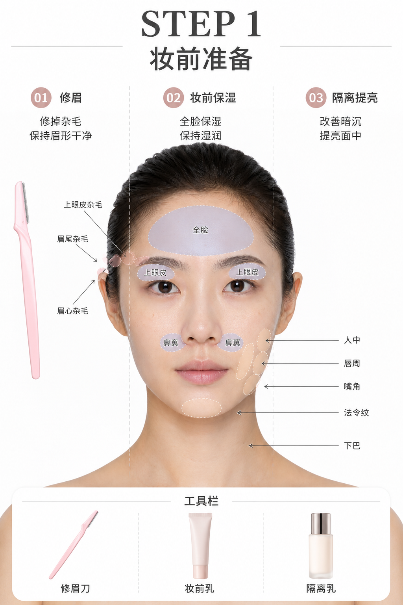
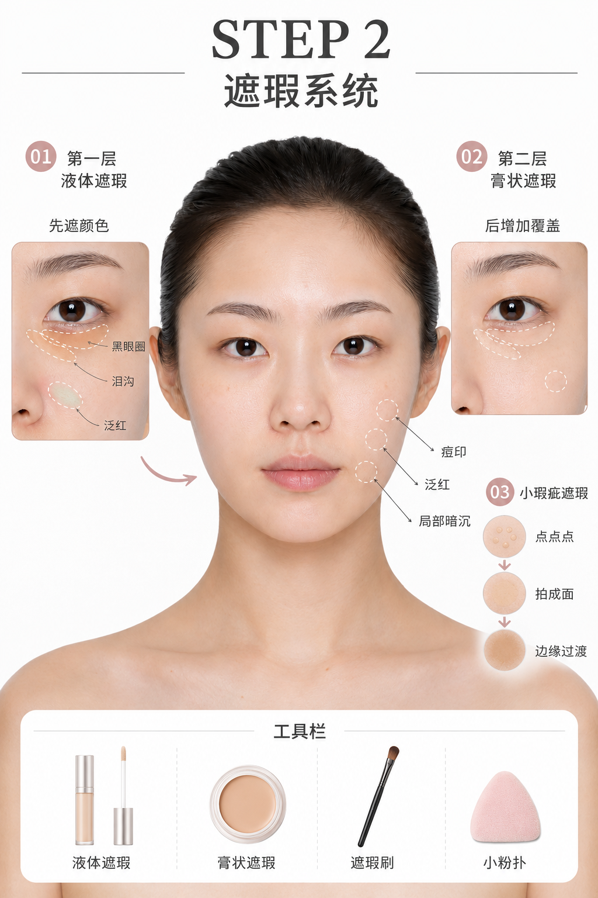
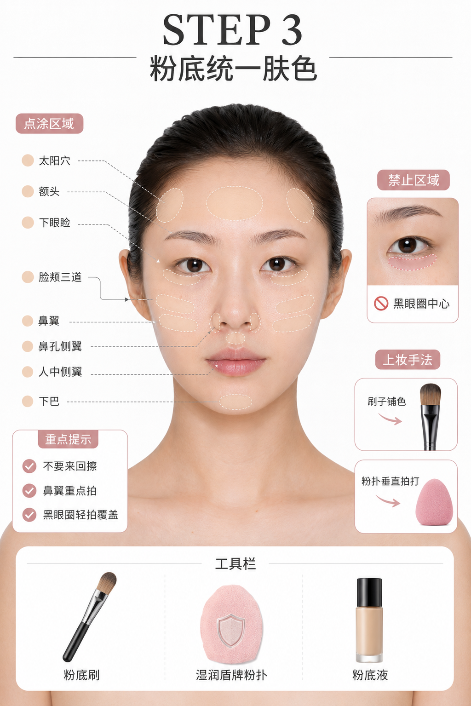
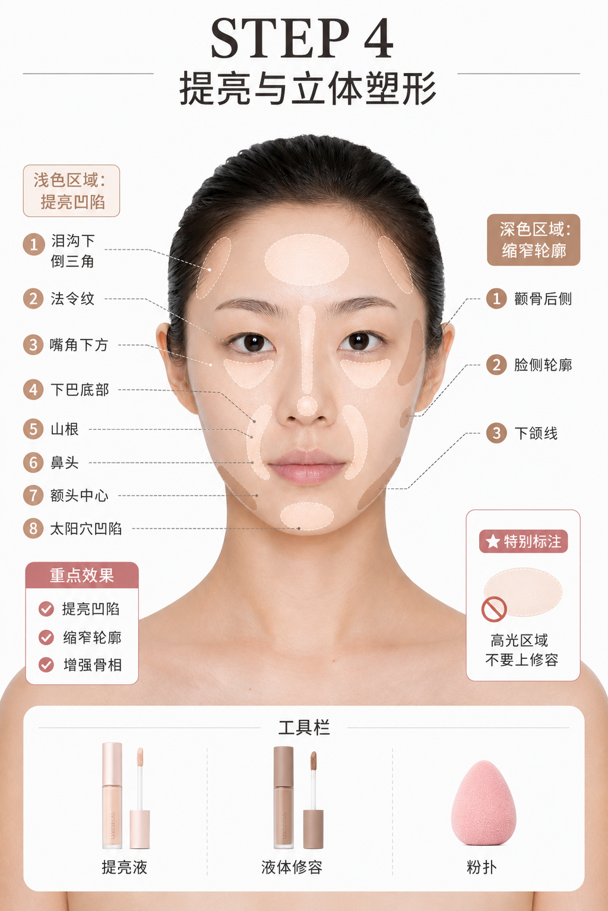
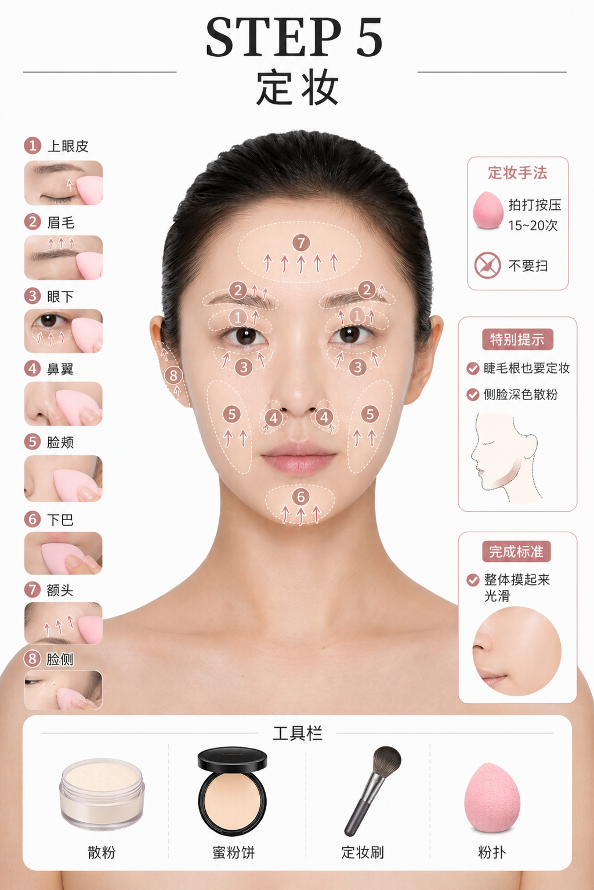
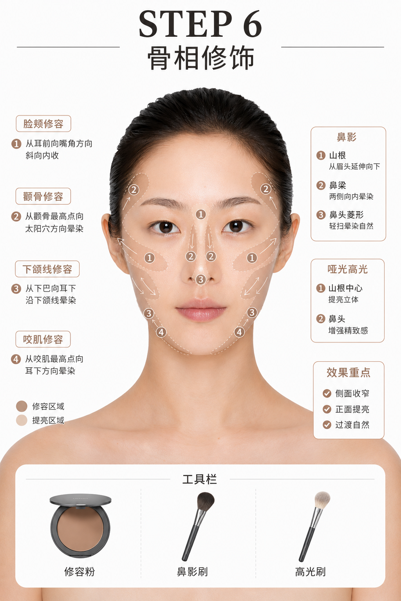
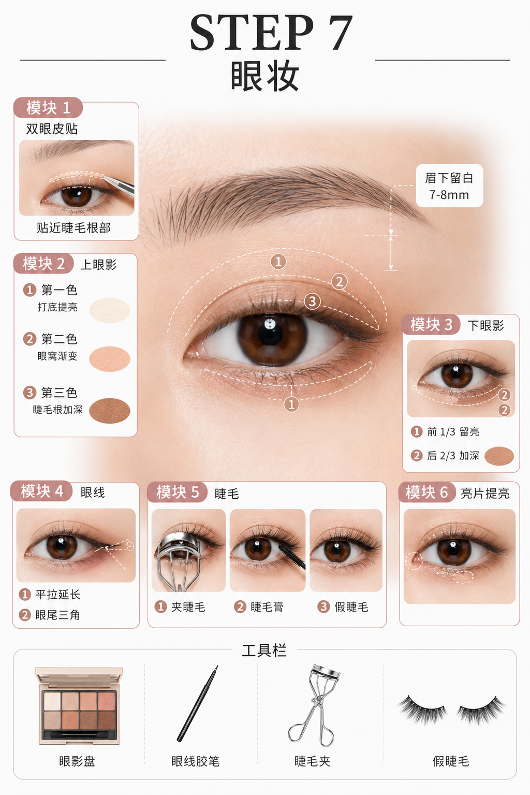
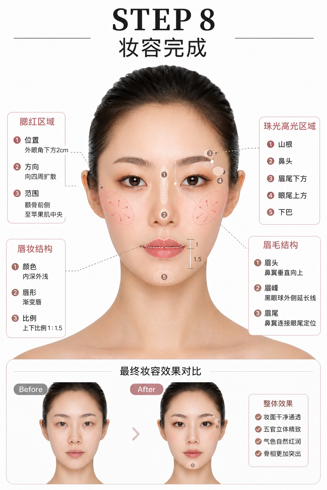

## 阅读说明

这是一份个人学习后的流程笔记，偏向自然妆感、中性偏干皮的持妆思路，并强调骨相修饰。不同皮肤状态、五官与产品都会影响结果；请把它当作练习起点，而不是唯一标准。

文中的示意图均为 AI 生成的示意图片，仅用于说明上妆区域与顺序，不构成对肤色、肤质或外貌的评价。若产品引起持续不适，请停止使用；涉及皮肤问题时，请咨询合适的医疗专业人士。

## 化妆流程

### 施法前摇

先洗脸并擦干，保留一点自然湿润感即可。若日常会使用防晒，可在上妆前按产品说明涂好并等待成膜。

## STEP 1：妆前准备

#### 修眉

修掉上眼皮、眉尾与眉间的杂毛；过长的眉尾毛可适当剪短。眉形以干净、自然为主。

#### 妆前乳 / 保湿

全脸用手涂开，上眼皮与鼻翼也带到。动作不要反复摩擦；若已经干掉或被擦掉，再少量补一层。

#### 隔离 / 唇周提亮遮暗沉

可用粉色、白色或紫色的校色产品，少量放在唇周、嘴角、下巴、人中与法令纹区域，中和局部暗沉。

## STEP 2：遮瑕系统

#### 大瑕疵遮瑕 / 黑眼圈

先用液体遮瑕处理黑眼圈最深的线，再用膏状遮瑕叠加。重点是“点、拍、过渡”：目标是中和暗沉，而不是把眼下提得过亮。

## STEP 3：粉底统一肤色

#### 粉底

用扁平刷上脸，再用打湿、挤干的粉扑垂直拍开。避开重点遮瑕的黑眼圈区域；脸颊、鼻翼、人中、太阳穴、下眼睑与额头分区处理。鼻翼可轻揉后再拍开，眼下遮瑕上方只用少量粉底。

#### 定妆喷雾

距离脸部约 30cm，按产品说明均匀喷洒。可用风扇吹约 10 秒成膜，或自然等待 30–60 秒后再进行下一步。

#### 小瑕疵遮瑕

用小粉扑把遮瑕拍成一个柔和的“面”，处理泪沟深色、泛红与小瑕疵。眼下用量要少，避免卡进细纹。

## STEP 4：提亮与立体塑形

#### 提亮

可少量提亮泪沟下方倒三角、法令纹、嘴角下侧、下巴底部、山根、鼻头、额头中央、太阳穴与面部凹陷处。用手指点上去，再用小粉扑垂直拍开。

#### 精细遮泪沟

用细节遮瑕刷处理泪沟最暗的一条沟壑，再轻轻过渡上下边缘，让颜色与反光更连贯。

#### 液体修容

颧骨侧后方少量点涂，下颌线少量带过，再用粉扑贴着皮肤拍开。高光区域不要叠加修容。

## STEP 5：定妆

#### 散粉定妆

先定眉尾、下巴与三角区，再定上眼皮、眉毛、眼下、鼻翼、脸颊、下巴和额头。以按压代替扫开；每个区域可拍约 15–20 下，眼下约 10–15 下。侧脸可用更深一点的粉，大刷子按压约 20–30 下即可。

## STEP 6：修容与鼻影

#### 粉状脸颊修容

用圆头点彩刷从后往前扫过颧骨，再轻带下颌骨与咬肌。标准是侧面略深、正面仍然清爽，并且没有明显边界。

#### 鼻影修容

从山根侧面向前推，再沿鼻梁边缘向下过渡；山根连接到眉头下方。鼻头可用柔和的菱形结构调整，但不必追求绝对对称或明显线条。

#### 哑光高光

在山根中央和鼻头少量点涂，用圆头刷或手指轻点 1–2 下即可。

## STEP 7：完整眼妆

#### 贴双眼皮

用夹子夹住双眼皮贴，贴在双眼皮纹路上并尽量靠近睫毛根部。若双眼不对称，可微调贴的位置来平衡睁眼后的效果。

#### 上眼影

眼影整体做半圆形渐变，上眼皮到眉毛留约 7–8mm。第一色打底提亮，第二、三色逐层加深，最深色贴近睫毛根部；最后再按需要少量加入亮片。

#### 下眼影

用第一色或哑光高光打底，第二色从外眼角向前刷到瞳孔下方，约占下眼睑后 2/3；前 1/3 留给高光或亮片，内眼角画窄小圆弧。

#### 眼线与睫毛

用眼线笔或最深色眼影画眼尾小三角，尾部保持平稳、不要下垂；眼线胶笔可贴着睫毛根部填充。睫毛依序夹翘、刷开，最后再按需要贴假睫毛。

## STEP 8：妆容收尾

#### 腮红

眼妆后再画腮红。中心点可放在外眼线下方约 2cm、颧骨与高光之间，面积不超过鼻底水平线；原地拍开后再向四周过渡。

#### 珠光高光

从外眼角下方约 2cm 向下带，到鼻底附近向鼻翼方向收成竖弧线；再少量点在山根、鼻头、下巴底、眉尾下方与眼睑尾部上方。

#### 画眉

眉尾可参考“鼻翼—眼尾延长线”，顺着自身毛流补齐，整体保持平缓自然。

#### 口红

上下唇可参考约 1:1.5 的视觉比例，内侧颜色更重、外侧更浅，做出渐变。唇色、腮红与眼影保持相近色调，整体会更完整。

## 卸妆

带妆结束后，按产品说明充分卸除彩妆和防晒，再进行适合自己的清洁与保湿。任何让皮肤不舒服、明显堆积或无法解释的步骤，都可以删掉或调整。
