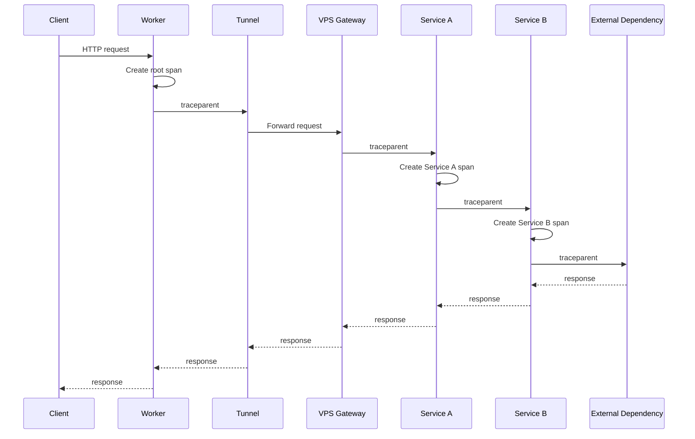
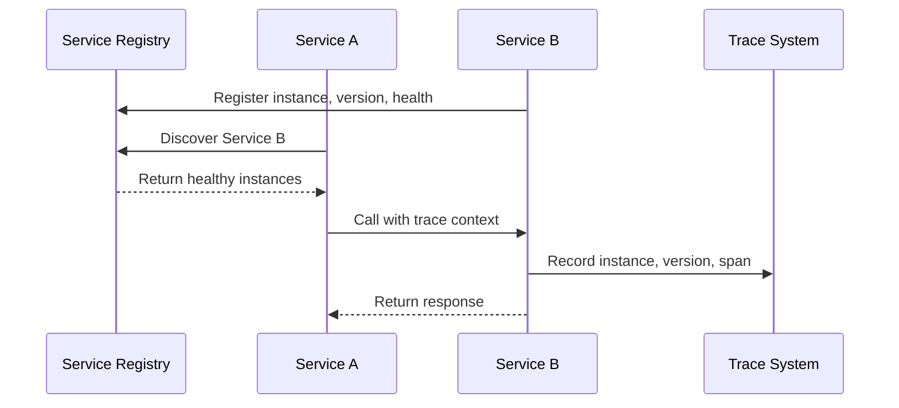
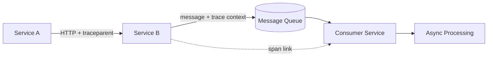
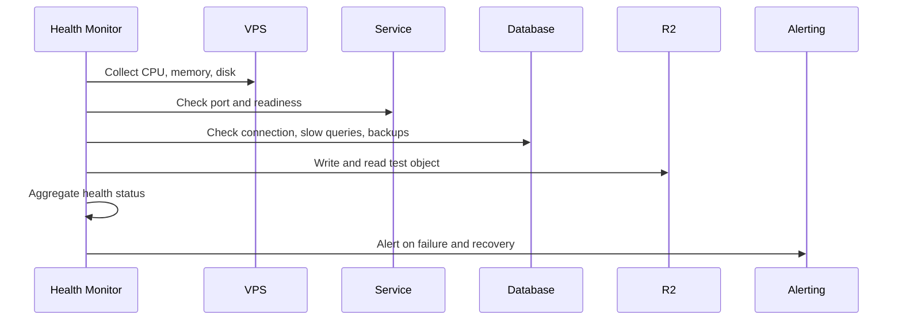
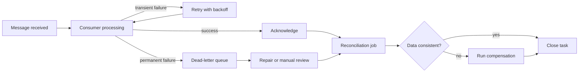
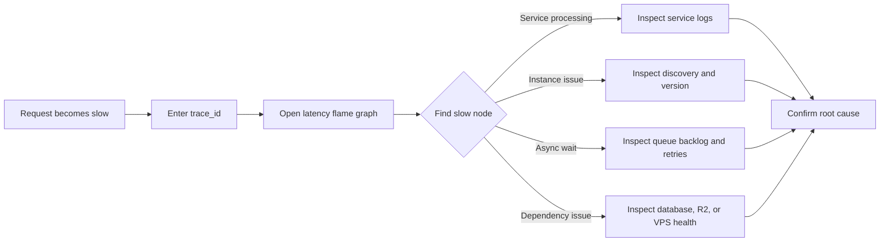

Recently I had been making a few small tools when a former colleague asked me to help investigate a project. That was also how I properly entered the world of software development. The project was close to launch: most of the core features were already in place, but the system around them was still rough. It exposed a unified API entry point for forwarding requests and coordinating external capabilities. The entry ran on Cloudflare Workers, connected through Cloudflare Tunnel to several VPSs, and the VPSs hosted several services that called one another. Those services also accessed a database, R2, and other external dependencies.

The work I took on was, more precisely, governance for a distributed architecture: service boundaries, request correlation, runtime state, failure handling, and data reconciliation. My first task was not to redraw the architecture diagram. It was to answer a much simpler question: why had one request become so slow?

My first suspicion was the Tunnel. A request went from the Worker to a VPS through several services, so the network relay seemed like an obvious bottleneck. But after I added timings at each stage and drew a latency flame graph, the answer was different. The Tunnel added very little overhead. Most of the delay came from an internal computation task in one of the services. I optimized that task, and for the first time used data to correct my own guess about the system.

That incident became the starting point for this system. At work, I had used mature troubleshooting platforms for years: search logs, open a Trace, expand a latency flame graph, inspect a service topology, analyze a slow request, and jump from a span to its logs. As a user, I never had to think about how IDs were propagated, spans were closed, events were stored, or topology data was aggregated.

This time I treated the work as a learning exercise. I also brought part of the business-reliability work I had done over the previous year into this smaller system. I was not trying to build another Datadog. I wanted to understand what a small project actually needed before “I think the Tunnel is slow” could become “the evidence points to an internal computation,” and before retries, reconciliation, and recovery could stop depending on guesswork.

## Define the problem precisely

The problem was not simply how to generate a Trace for one request. When I took over and maintained the system, it had already been running for some time without systematic observability.

The symptoms were scattered. A failed request was visible only at the entry point. A service could say that it had processed a request, but there was no way to prove it was the same request the entry point had seen. A VPS process could still be alive while the business logic was unusable. A database could accept connections while slow queries or failed backups went unnoticed. R2 could respond to API calls without anyone checking whether objects could be written, read back, and expired as expected.

When something broke, we did not usually have a clean error. We had a few incomplete log lines, a few timestamps, and a network diagram, and then we assembled a story that sounded plausible.

The first version of the path looked like this:

```text
User → Cloudflare Worker → Cloudflare Tunnel → Service A → Service B → External Dependency
```

That diagram explained the system's shape, but it could not prove that a particular request had actually passed through every node. Service A might not have logged the request. Service B might have left only one error line. An external dependency might have had its own request ID. The Tunnel knew something about the connection layer, but no shared ID tied the pieces together.

So the first step was to make the system answer a few basic questions:

1. Did the request reach the entry point?
2. Which services and instances did it actually call?
3. Did each service record its start, end, and failure reason?
4. Were the VPS, database, R2, and Tunnel healthy?
5. Which stages had direct evidence, and which were only estimates from timestamp differences?
6. Could one ID retrieve the request the next time something went wrong?

That was the point at which logs, Traces, and health checks became distinct to me. They all describe what happened, but at different time scales.

```text
Trace       which services one request passed through
Logs        what a service was doing at the time
Metrics     how the system behaved over a period
Health      whether it can work now
Events      when the system changed state
```

## I had used mature systems; this time I wanted to build a small one

The commercial troubleshooting platforms I had used—Datadog APM, New Relic Distributed Tracing, and Sentry Performance—package logs, Traces, errors, slow requests, and service relationships into a finished product. Datadog's Trace View, for example, offers Flame Graph, Span List, Waterfall, and Map views. The operator does not have to design span storage or build a query service first.

Open-source systems are more like a box of parts. Jaeger is a direct Trace backend. Grafana Tempo stores and queries Traces and works with Grafana and Loki. OpenTelemetry standardizes the collection and transport of Traces, Logs, and Metrics. Grafana can also link a Tempo span to Loki logs and back again.

The API relay business I was working in had another layer of difficulty. It was not enough to forward a request. The system also had to register external resources, schedule requests, enforce concurrency limits, switch away from failed resources, and record usage events. A business request could complete successfully while the system still had to answer which instance handled it, which resource it consumed, whether the statistics event was lost, and whether it could be safely retried.

These systems are useful not just because they store data, but because they turn troubleshooting into a repeatable path: find a request, see its services, inspect each duration, open the abnormal node, and jump to the relevant logs. A topology answers a different question: which services have been calling which others recently, and which dependency has become slower or less reliable?

For a personal project, commercial pricing is a real constraint. Logs, Traces, metrics, retention, and data volume all affect the bill. Once data grows, long-term retention and cross-service queries stop being negligible costs. I wanted to understand the minimum behind the product rather than simply connect another SaaS.

So I built a low-cost version. It was not meant to replace Datadog or support every runtime. It only needed the parts this project actually required: one shared identity, a cross-service timeline, log search, a service topology, and device health.

## Start by giving the request one identity

The system already had several local IDs: request information from the Worker, a request ID created by a service, Cloudflare's Ray ID, and database connection information. They could all be useful, but they should not be forced into one string.

I ended up giving them different jobs:

```text
trace_id       primary correlation key for one end-to-end request
request_id     compatibility ID for existing logs and tools
span_id        local ID for one service or stage
service_id     stable identity of a service instance
platform_id    external correlation information from a platform
```

The entry service generates a W3C Trace Context-compatible `trace_id`. Each service creates its own span and passes the context downstream through `traceparent`. The `trace_id` stays the same across the request; the `span_id` changes with each service and operation.



A W3C `trace_id` is 32 hexadecimal characters and a `parent-id` is 16 hexadecimal characters. A normal hyphenated UUID cannot simply be placed into `traceparent`. Client-provided `traceparent` and `x-request-id` also cannot be treated as trusted internal identity: the entry point needs to validate them and generate new internal IDs when necessary.

The custom `x-request-trace-id` remains useful as a compatibility field for older logs, but cross-service propagation should prefer the standard `traceparent`. Otherwise two fields can both be called “request ID” while different services interpret them differently.

## A service name is not enough; I need the instance

Once there were several services, another problem appeared. A Trace saying `user-service` did not tell me which instance had actually handled the request.

The registry keeps a set of healthy instances for each service name. A caller uses discovery to find an available instance, and the Trace records the one it selected. Discovery answers “where should the request go?” The Trace answers “what happened after it got there?”

Each runtime identity therefore includes at least:

```text
service.name
instance.id
service.version
environment
region
```

I also record discovery in the diagnostic context: target service, resolved instance, version, selection time, connection result, and whether the registry or a local cache answered the query. A slow call can then be separated into service processing, failed discovery, or a connection failure after a successful discovery.



This is what made service registration and discovery click for me. They are not there to make an architecture diagram look more complicated. A service name alone simply cannot explain a real failure.

## Put a timestamp on every meaningful stage

Once the IDs were in place, I did not immediately add more fields. I first made the time points precise:

```text
received_at       request reached the entry service
validated_at      request validation finished
service_start     a service began processing
dependency_start  a downstream call began
dependency_end    the dependency returned a result
service_end       service processing finished
request_end       the entire request finished
```

From these points I can calculate:

```text
request_total_ms      = request_end - received_at
dependency_wait_ms    = dependency_end - dependency_start
service_process_ms    = service_end - service_start
```

I name fields after facts I actually observed. If I only know the time from starting a dependency call to receiving its result, I call it `dependency_response_time`; I do not label it “connection time” or “queue time.” Those could also include connection setup, service queueing, dependency processing, and network round trips.

There is an important limitation that architecture diagrams tend to hide: having one `trace_id` does not mean every segment has been measured accurately. I can reliably obtain the Worker wall time, downstream service processing time, and request result. The per-request duration between the Worker and Tunnel depends on additional instrumentation. DNS, connection setup, dependency response, and the final byte observed by the client may not be recoverable from the server side.

My latency flame graph therefore distinguishes collected timings from values inferred from parent and child spans. Worker wall time and backend latency can be compared directly, but their difference cannot simply be declared to be Tunnel time. It may also contain platform scheduling, network transfer, and uninstrumented work. An observability system should show where it has evidence, and where it is estimating.

### One slow request: I blamed the Tunnel, then optimized computation

The investigation itself was simple, but it changed how I thought about the system.

When a user reported a slow request, I followed the network path first: Worker to Tunnel, then VPS, then several services. The Tunnel seemed like the obvious suspect. Without timings, that hypothesis was reasonable, but it was still only a hypothesis. The entry point had one total duration, and the service logs contained only scattered start and end lines. Nobody could say where the time had gone.

I did not change the Tunnel first. I added timestamps around the entry point, service calls, internal computation, and request completion. Once those events were organized by `trace_id` into a latency flame graph, the result was clear: the Worker total and backend processing time were close, and the Tunnel added little overhead. Most of the delay came from an internal computation task in a service, and that task sat on the critical path.

The question changed from “is the network slow?” to “why is this computation slow?” I broke the task into smaller steps, found the expensive part, and optimized it. Afterward I watched similar requests again. I compared not just one total duration, but the internal task, service processing, and end-to-end duration together.

This does not prove that a Tunnel can never be a bottleneck. It shows how easily the “relay” in an architecture diagram attracts attention before there is evidence. The value of the flame graph is not that it finds the answer automatically. It turns a guess into a testable hypothesis. Even concluding that the Tunnel added little cost is useful evidence.

I also separated data by reliability. At request completion, the system writes a queryable Trace summary; a fuller diagnostic summary goes to R2; runtime logs are collected separately. They share `trace_id`, but a successful business request does not guarantee that every diagnostic record has reached storage. Strict business events, best-effort statistics, and diagnostic data need different failure policies.

Asynchronous work should not be forced into one continuous synchronous Trace. If Service A puts a message on a queue and a Consumer handles it later, the producer and consumer have separate spans linked by message context or a span link. Message waiting, retries, backlog, and consumer failures are separate events.



A queue is not a substitute for reliable logging. It changes the time boundary of a request and introduces acknowledgement, retry, idempotency, dead-letter, and backlog monitoring problems.

## A request can work while the device is unhealthy

Looking at request Traces still was not enough. Some failures happened before a request arrived: a VPS disk was nearly full, Docker or systemd services kept restarting, database backups failed repeatedly, an R2 write check failed, or the Tunnel was connected while a service's core logic was unusable.

I divided health monitoring into several layers:

```text
Host health       CPU, memory, disk, network, inode
Process health    Docker, systemd, agent status
Service health    port, HTTP readiness, core business check
Dependency health database, R2, Tunnel, domain, certificate
Data health       slow queries, backups, object lifecycle, last report time
```

“The process is alive” is not the same as “the service is healthy.” An HTTP service may still listen while its database pool is exhausted. A database may accept connections while its backups have been failing for days. Object storage may return success while the application cannot correctly read or expire what it wrote.

I did not make health a single Boolean. Each check records its type, time, duration, result, error, version, and device identity. R2 checks include writing, reading, and expiring a test object. Database checks include connectivity, slow queries, and backups. Business services also run a real core-logic check.



Trace and health checks now have a clear division of labor for me: a Trace explains why one request was slow; health monitoring tells me whether the system can accept requests now. They meet in the same troubleshooting entry point, but they answer different questions.

## After observability, failures still need handling

Observability, health checks, reliability, and disaster recovery were in the plan from the beginning. I delivered them in stages. Observability leaves evidence, reliability handles failure, disaster recovery restores a component that is completely unavailable, and reconciliation checks whether the data became consistent again.

### Consuming a message is a lifecycle, not just a function call

Any asynchronous task needs a stateful lifecycle:

```text
Message received
  → Consumer fetches it
  → Processing starts
  → Acknowledgement succeeds
  → Retry on failure
  → Dead-letter after the limit
  → Automatic or manual repair
```

For each consumer task I record `message_id`, `trace_id`, consumer, attempt, first receive time, last attempt time, acknowledgement time, and failure reason. That tells me whether a message has not been consumed, is being retried, has completed, or is stuck in the dead-letter queue.

Most queues provide at-least-once delivery, so duplicate consumption is not an exceptional case. Consumers need idempotency keys. Retries need to distinguish temporary and permanent failures. Messages beyond the retry limit need a dead-letter path. Queue backlog, consumer delay, and failure rate belong in health monitoring too.

### Retries, degradation, and recovery need boundaries

Not every error deserves a retry. A short network failure or an overloaded dependency may justify a limited exponential backoff. Invalid parameters, permission errors, and incompatible schemas will only create more failures if retried. Retries also need a budget, or one dependency failure will be amplified by every downstream service.

I record timeouts, retries, rate limits, circuit breaks, and degradation as separate reliability events. A Trace can show that one call retried, but retry rate, circuit-break count, degradation ratio, and recovery time are needed to tell whether the system is getting worse over a period.

### A business-looking failure may come from the system boundary

The most useful incidents were not always caused by a bad function. The same error result can come from different layers. For example, if a service-selection state snapshot is stale or missing, the system may reject requests for safety and appear unavailable. If a temporary limit or refusal is mistaken for a permanently unusable instance, recoverable capacity is removed from consideration.

Retry policy can magnify the mistake. Several downstream calls may retry in series without a per-hop timeout or an end-to-end deadline. One slow dependency then turns into long-tail latency across the request. The answer is not simply “try more times,” but to record the reason, duration, and remaining budget for each attempt, and to distinguish temporary failure, explicit refusal, and non-retryable errors.

Some failures happen outside business code. A wrong working directory or build entry in a deployment artifact can make every route return 500 even when the code and unit tests have not changed. Deployment version, build digest, configuration version, and startup logs therefore belong in the searchable event stream too.

These cases made me separate failure causes into request behavior, service implementation, dependency state, deployment artifacts, and control-plane data. Health checks, Traces, deployment events, and discovery records need to be viewed together to tell which layer actually failed.

### A successful write does not mean consistent data

A task can pass through a sequence like this:

```text
External call succeeds
  → Message is delivered
  → Consumer processing fails
  → Database is not written
  → R2 may already contain an object
```

Blindly retrying can duplicate the write. The system therefore needs idempotency keys, a state machine, retry records, compensation jobs, and a repair audit. Reconciliation compares database records, R2 objects, message state, Trace summaries, and final business state to find missing, duplicate, expired, or contradictory data.

I have seen a typical version of this in the real system: the main request completed and the user received a success response, while statistics and diagnostic events were still being processed asynchronously. An event entered an in-process queue and was later batch-written to the database; a fuller diagnostic summary went to R2. If the service restarted before the batch was flushed, or if the database or R2 briefly failed, the main flow did not roll back. The result was “the request succeeded, but one statistic is missing” or “the database has the summary, but R2 does not.”

That led me to separate the main request from its side-channel data by reliability level. A strict business result cannot depend only on an in-memory queue. Best-effort statistics may arrive late, but loss must be detectable. A diagnostic archive can be written later, as long as the original request can be found through `trace_id`. Reconciliation first finds the events that should exist, compares the database, message acknowledgement state, and R2, and creates a compensation task instead of directly changing a row to “complete.”

Compensation also cannot simply rerun the entire request. The repair task carries the original business idempotency key, event version, and completed steps. If the database record already exists, it skips that write. If the R2 object is missing, it writes only the archive. If the statistics event was not acknowledged, it publishes it again with a new attempt. The failure then leaves a complete trail and can be reconciled again after repair.

To me, “repeatable” does not mean mechanically sending the same HTTP request again. It means that the same business intent can produce an explainable result under the same inputs and rules. That requires the business idempotency key, rule or configuration version, input digest, important intermediate states, and final state. A retry can continue from the state machine or rebuild from confirmed events instead of guessing what happened.

“Reconciled” does not mean running one scheduled SQL query. The check must answer whether the original events are complete, the database and object storage agree, the message was acknowledged, the external call has a result, and the current state follows the business rules. A discrepancy becomes a traceable reconciliation task with discovery time, difference type, repair action, and post-repair result. Even manual intervention becomes auditable instead of being a direct production edit.

For a failed business operation, I keep three paths: safe retry for steps that may still succeed; compensation for completed steps that need a reverse or alternative action; and replay, using sanitized input with a fixed version, to verify the result after code or configuration changes. Together they decide whether recovery means deleting data and starting over, or following evidence back to a correct state.



### Disaster recovery is more than having a backup

VPSs, databases, R2, and observability data each need a recovery path. The design has to answer where a service restarts, what point in time the database can recover to, whether diagnostic objects can be retrieved, whether service registration must be rebuilt, and whether the business can continue while observability is unavailable.

At minimum, disaster recovery needs measurable answers: the RTO, the RPO, the most recent backup, the most recent successful restore drill, and whether discovery and health checks work after a switch. The backup job itself belongs in health monitoring. The existence of a backup file is not proof that the system can be restored.

## These views eventually need to meet

When I used mature troubleshooting platforms, I relied on three views.

The first was the request detail and latency flame graph. Services and internal tasks were expanded by call hierarchy, showing whether the request was waiting in Service A, calling an external dependency from Service B, or stuck in an internal computation step. Each span could expose its status, error type, instance, version, and related logs.

The second was the service topology. It answered which services had been calling which others over a period, along with request volume, error rate, and P95 latency for a dependency. A topology was not one request's Trace; it was a system view aggregated from many call events.

The third was log search. It needed filters for `trace_id`, `span_id`, service, instance, version, and time range. A log entry should jump to the full Trace, and a span should jump back to its logs. Without shared time, service identity, and correlation IDs, the diagrams still ended in manual evidence gathering.

Slow-request analysis also needs a baseline, or “slow” remains subjective. I use absolute thresholds for success rate and compare latency and dependency response time with a recent online baseline. When there is not enough baseline data, the result is “not enough evidence” rather than a false alert during cold start. Request count is usually context, not proof of health.



I did not plan to bring over every capability of a commercial platform. For this project, entering a `trace_id` and seeing the service nodes, latency flame graph, failure stage, instance, and related logs—then seeing VPS, database, and R2 health from the service page—was already a useful troubleshooting loop.

## Storage and governance: writing the data is not the end

I did not put everything into one `traces` table. The data had different purposes, query patterns, and retention periods.

The relational database stores queryable business and operational summaries: request state, service, instance, error stage, health-check result, backup state, and last report time. It needs a stable schema, indexes, and access controls, but it is not a good place for complete request or response bodies or large volumes of high-frequency events.

R2 is better for controlled diagnostic summaries and archives. Objects need a schema version, size limit, stable key, field allowlist, and lifecycle rule. Sensitive fields, authorization headers, request bodies, and response bodies are not stored by default. A successful write is not enough; I also verify that the object can be read back and that expiration actually works.

The log system stores runtime events: service logs, Docker/systemd logs, health-check logs, network events, and deployment events. The Trace system stores cross-service spans. They share `trace_id`, service, instance, and time range so logs and Traces can link to each other.

That creates governance questions: who can see logs, which fields are indexed, how long data stays, what happens when a device is retired, and who notices when the collector itself is down. A small project can keep the rules simple, but it cannot have no rules.

## Cost governance: writes are often more expensive than storage

Once I put data in R2, I started calculating the system's cost seriously. People often worry first about storing years of data, but long-term storage is relatively easy to control: use lifecycle rules, limit retention, compress diagnostic summaries, and move rarely queried data to object storage.

Writes are easier to overlook. Every span, log event, health-check result, and statistics event may require serialization, a network request, a database write, or an object write. If every small event is sent separately, request count and network overhead can exceed the payload itself. Batching reduces request count, but adds memory use and delay, and creates a window where a restart can lose unflushed data.

I estimate the cost in separate pieces:

```text
Daily ingest volume = requests × events per request × bytes per event
Write cost          = network requests + database writes + object writes
Storage cost        = daily volume × retention days × replica or compression factor
Query cost          = index size + scanned data + egress traffic
```

The answer is not just “store less.” A better approach is to remove low-value events: retain aggregates and exception details for health checks; retain a necessary Trace summary for successful requests; retain the full chain and error context for failed requests. Request bodies, response bodies, authorization information, and other high-risk, high-volume fields stay out of observability data by default.

### Keep every failure; sample successful requests

The strategy I would use next is to retain failed requests as completely as possible, while keeping only a proportion of detailed Traces for successful requests. Metrics and a traceable summary remain for both. This preserves the ability to answer “where did it fail?” without spending the write budget on thousands of repetitive successful requests.

There is a trap here: at the beginning of a request, we do not know whether it will fail. If the successful request is discarded immediately and it later fails, there is no complete Trace to recover. Common approaches are:

1. Head sampling: decide at the beginning whether to keep the Trace. It is simple and cheap, but cannot guarantee that a later failure is kept in full;
2. Tail sampling: buffer the Trace in a Collector until it ends, then decide based on error, latency, and service importance. The decision is better, but it needs memory, a decision window, and grouping by `trace_id`;
3. Two-level recording: write a low-cost result summary for every request, keep complete spans and context for failures, and save detailed Traces for only a proportion of successful requests. This is the trade-off that fits a small project best.

Industry solutions follow similar lines. OpenTelemetry Collector provides probabilistic and tail-sampling processors. The Grafana Tempo ecosystem uses Collector or Alloy policies for errors and latency. Datadog combines head sampling with error and rare-trace sampling and reports ingestion reasons. Sentry leans toward SDK-side transaction sampling while keeping error events. The difference is not only the percentage; it is where the decision happens, whether a complete Trace is available, whether failures have an additional retention path, and how much buffering and operations the sampler needs.

If I continue expanding this implementation, I will define the retention policy before copying anyone's percentage: failures and recovery events first, slow requests next, higher rates for critical paths, and proportional sampling for ordinary successes. Even when a detailed Trace is sampled out, the result summary, error count, and health metrics must remain. Otherwise the system becomes cheaper by becoming blind.

## What is still missing compared with mature systems

The gap between this system and an industrial platform is mostly scale and governance, not whether there is a Trace page. Mature platforms need an independent collection pipeline for batching, rate limiting, backpressure, retries, dropped-data accounting, and horizontal scaling. With tail sampling, all spans of a Trace also need to reach the same collector so a complete decision can be made at the end.

The logging side is more than putting text in a database. A production log platform also needs full-text search, inverted indexes, high-cardinality field controls, hot and cold storage, compression, sharding, query timeouts, tenant quotas, and lifecycle management. This project has limited query volume and retention, so a simple implementation is acceptable. At larger scale, storage design becomes a primary engineering problem.

Several other capabilities currently exist only as boundaries or future work:

```text
Metrics and SLOs   RED/USE, P95/P99, error budgets, burn-rate alerts
Alert governance   deduplication, aggregation, suppression, recovery, on-call
Security           tenants, RBAC, redaction, access audit
Platform self-checks collector, index, query, and write-path health
Runtime diagnosis  CPU/memory profiles, GC, threads, goroutines, locks
Scale              collector clusters, sharding, load balancing, multi-region recovery
```

These are not reasons to keep turning a small project into a large platform. They are capabilities to add when real pressure justifies them. First I would make the collection path reliable and observable, then deepen metrics and alerting. If query volume grows, I would introduce indexes, sharding, and hot/cold storage. If the service count and permission boundaries grow, I would add tenancy and stricter access audit.

## What I actually implemented in stages

Looking back, this is not a complete industrial APM. It is a lightweight system delivered in stages from a real operational problem.

The first stage closed the request and log loop:

1. Generate and validate one `trace_id` at the entry point and propagate Trace Context;
2. Have multiple services record spans, service identity, and instance identity;
3. Discover healthy instances and include the selection in the diagnostic context;
4. Collect and query structured logs, with a path from logs to Traces;
5. Show a single request's latency flame graph and an aggregated service topology.

The second stage governed devices and dependencies:

6. Monitor VPSs, Docker/systemd, ports, readiness, and business-logic stability;
7. Monitor database connections, slow queries, and backups;
8. Check R2 writes, reads, and lifecycle;
9. Monitor domains, certificates, Tunnel, and the observability system itself.

The third stage handled reliability and data governance:

10. Record acknowledgement, retries, idempotency, dead letters, and backlog for consumers;
11. Record timeout, degradation, circuit-break, and recovery events;
12. Use reconciliation jobs to compare database, R2, message, and business state;
13. Define backup, recovery, and disaster-recovery paths for VPSs, databases, R2, service registration, and observability data.

## The parts that transfer to industrial systems

I would not describe this as building my own Datadog. More accurately, I rebuilt a small part of what mature troubleshooting platforms do inside one small project.

The implementation cannot be copied directly at a different scale. Industrial systems need collector clusters, tail sampling, multi-region recovery, hot/cold storage, sophisticated alert suppression, and strict access audit. A small project may need only one collector, low-cost storage, and a short retention period.

But several principles hold at any size: requests need stable correlation identity; services need clear boundaries; instances must be locatable; logs and Traces should link to one another; health checks must be closer to business capability than “the process is listening”; storage needs a schema and lifecycle; asynchronous work needs acknowledgement and retry.

That is the most valuable part of this exercise. I used to know where to click to open a slow request. Now I have a better sense of which events make a latency flame graph possible, which aggregates make a topology possible, why a log can jump to a Trace, why a health status cannot be based only on an open port, and why a failure needs retry, compensation, reconciliation, and recovery.

The useful result is not a pretty Trace. When someone says “that request was slow,” I can use one ID to find whether it arrived, which services it crossed, which instance handled it, where it waited, whether its dependencies were healthy, and which log provides evidence.

I started with a small project and built a lightweight version. It does not have the scale, recovery guarantees, or automation of an industrial platform. But putting these pieces together in stages gave me a more concrete understanding of why large logging systems, distributed tracing, microservices, message systems, and infrastructure governance are separate systems—and why they eventually need to meet in one troubleshooting entry point.
