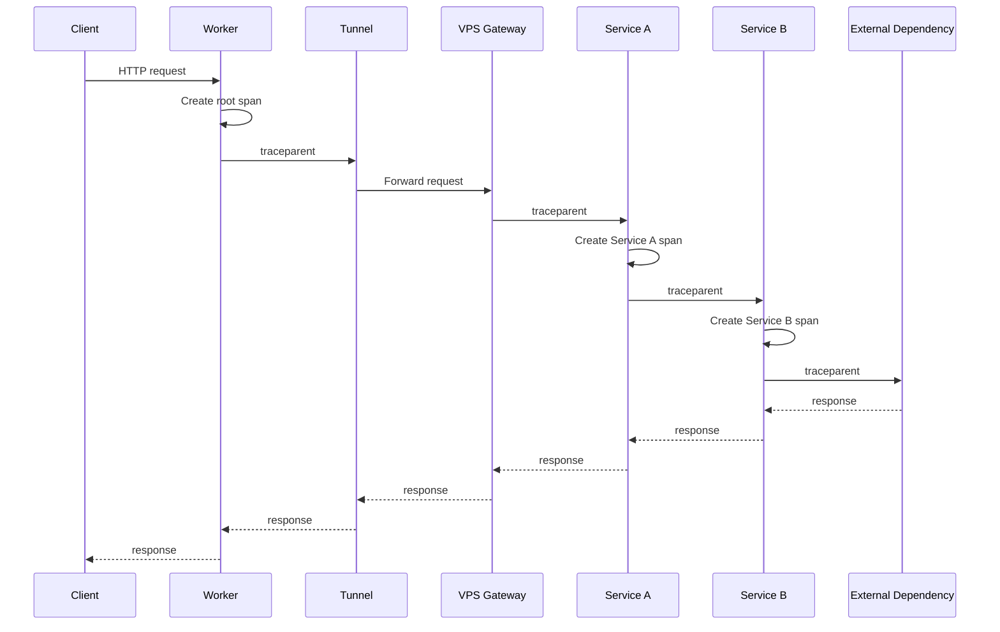
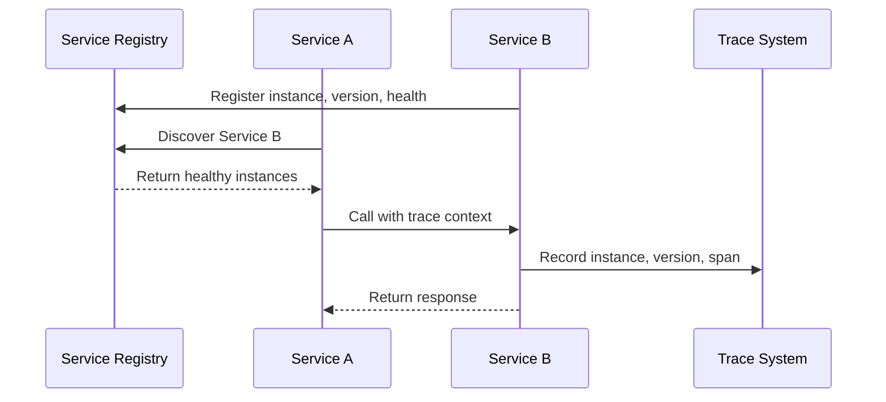
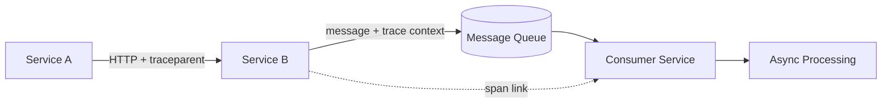
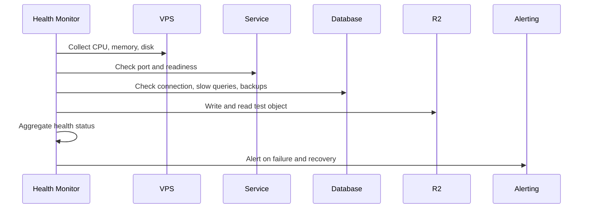
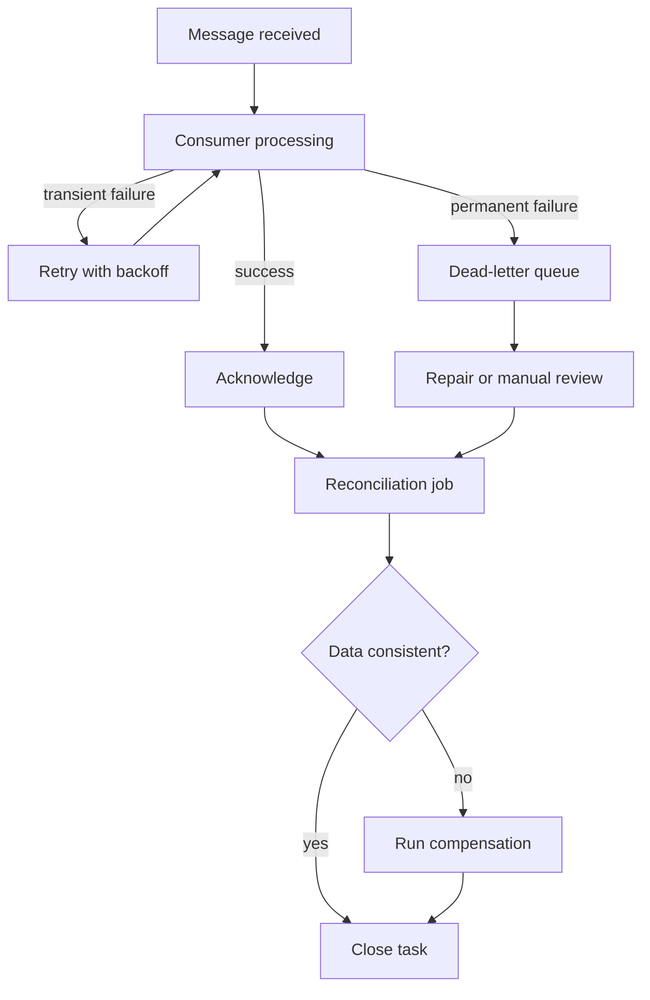
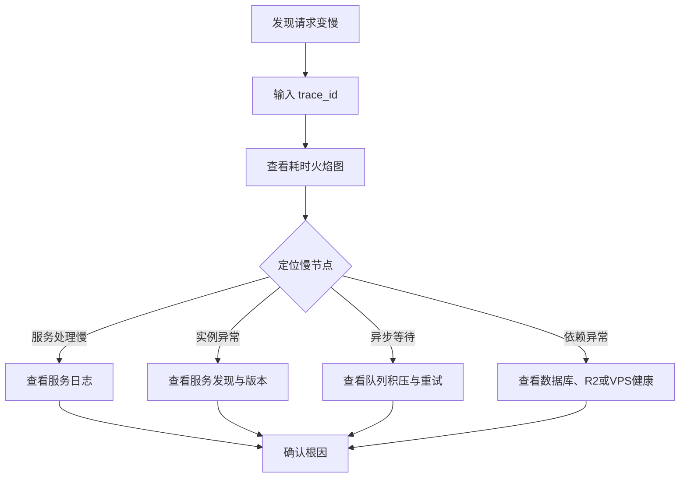

最近我在做一些小工具，之前的同事拉我一起研究一个项目，也算是顺带正式进入了开发者的工作范畴。这个项目即将上线，主要功能已经开发得差不多了，但整套系统还比较粗糙。它对外提供统一的 API 入口，负责请求转发和外部能力调度：入口跑在 Cloudflare Worker 上，通过 Cloudflare Tunnel 连接到几台 VPS，VPS 上又有几个互相调用的微服务。服务会访问数据库、R2，也会调用其他外部依赖。

我接手的工作，更准确地说是给这套分布式架构做治理：补上服务边界、请求关联、运行状态、故障处理和数据校准这些原本缺失的部分。第一件事不是重画架构图，而是处理一次“请求为什么这么慢”的问题。当时直觉上最可疑的是 Tunnel：请求要从 Worker 绕到 VPS，再经过多个服务，网络中转听起来很容易成为瓶颈。但给各个环节补上打点、画出耗时火焰图以后，结果却不是这样。Tunnel 本身几乎没有占用多少时间，真正拖慢请求的是服务内部的一段计算任务。于是我针对这段任务做了一次优化，也第一次用数据校准了自己对系统的猜测。

这件事后来成了我做这套系统的起点。过去我在公司里用过很多成熟的排查系统：搜日志、看 Trace、展开耗时火焰图、查看服务拓扑、分析慢请求，再从链路跳到日志。那些系统用了很多年，很多能力已经被做得很自然了。作为使用者，我只需要点开一条慢请求，却不需要知道背后要怎样传递 ID、记录 span、保存事件和聚合拓扑。

这次我把它当成一次学习，也把过去持续做了一年的业务稳定性经验拆出一部分，放进这个真实运营的小系统里重新实现。我要验证的不是能不能做出一个 Datadog，而是一个小项目至少需要哪些能力，才能让“我猜是 Tunnel”变成“证据显示是内部计算”，也才能让失败后的重试、校准和恢复不再依赖人工猜测。

## 先把问题说准确

真正的问题不是“怎么给一个请求生成 Trace”，而是我接手和维护这个系统时，它已经真实运行了一段时间，却没有被系统性建设过可观测能力。

它的问题看起来很分散：某个请求失败了，但入口只知道返回了错误；某个微服务说自己处理过请求，但没有办法证明它和入口看到的是同一个请求；某台 VPS 上的服务还在运行，可是业务已经不能正常工作；数据库可以建立连接，却可能已经出现慢查询或备份失败；R2 也可以调用，但对象写入、读取和生命周期是否正常，没有统一的验证结果。

出了问题以后，最常见的状态不是“查到了错误”，而是大家拿几行不完整的日志、几个时间戳和一张网络拓扑图，拼出一个听起来合理的故事。

我一开始只能画出一张猜测中的链路：

```text
User → Cloudflare Worker → Cloudflare Tunnel → Service A → Service B → External Dependency
```

这张图可以帮助理解系统结构，但不能证明一次真实请求确实走过这些节点。Service A 可能没有记录请求，Service B 可能只写了一行错误，外部依赖可能有自己的 request ID，Tunnel 只知道连接层发生了什么，最后没有任何一个 ID 能把它们串起来。

所以第一步不是马上部署一个漂亮的 Trace UI，而是先让系统能够回答几个很基础的问题：

1. 请求有没有到达入口；
2. 它实际调用了哪些服务和实例；
3. 每个服务有没有留下开始、结束和失败原因；
4. VPS、数据库、R2 和 Tunnel 当前是否健康；
5. 哪些阶段确实有证据，哪些阶段只是根据时间差推测；
6. 下一次再出问题时，能不能只拿一个 ID 找回这次请求。

这也是我后来理解日志、Trace 和健康监测的起点：它们都在回答“系统发生了什么”，但回答的时间尺度不同。

```text
Trace       一次请求经过了哪些服务
Logs        某个服务当时具体发生了什么
Metrics     一段时间内系统表现如何
Health      现在还能不能工作
Events      系统状态什么时候发生了变化
```

## 我过去使用过成熟系统，但这次想自己做一个简配版

公司里常见的排查系统大致有几类。

Datadog APM、New Relic Distributed Tracing、Sentry Performance 这一类商业服务，把日志、Trace、错误、慢请求和服务关系组织成了一个完整产品。Datadog 的 Trace View 可以在 Flame Graph、Span List、Waterfall 和 Map 之间切换；New Relic 的分布式追踪界面也可以从一条链路跳到服务和错误详情。使用者不需要自己设计 span 如何存储，也不需要先搭一套查询服务。

开源方案则更像一组可以自己组合的零件。Jaeger 是比较直接的 Trace 后端；Grafana Tempo 负责存储和查询 Trace，并和 Grafana、Loki 等组件配合；OpenTelemetry 负责标准化 Trace、Log、Metric 的采集和传输。Grafana 还支持从 Tempo 的 span 跳到 Loki 的日志，再从日志跳回完整 Trace。

而我接触到的这类 API 中转业务，难点也不只是把请求转发出去。它还要处理外部服务的资源登记、请求调度、并发限制、失败切换和用量事件。业务代码可以把一次调用成功地完成，但从系统治理的角度看，还要确认这次调用经过了哪个实例、消耗了哪类资源、统计事件有没有落下，以及失败以后能不能安全重试。

这些系统好用的地方，不只是“把数据存起来”，而是把排查动作固定了下来：找到一次请求，看到它经过的服务，看到每段耗时，点开异常节点，再跳到对应日志。服务拓扑则回答另一种问题：最近一段时间，哪些服务在调用哪些服务，哪条依赖的错误率和延迟变高了。

但对一个个人小项目来说，直接使用商业服务也有现实成本。日志、Trace、指标、保留时间和数据量都可能影响费用；数据一多，长期保存和跨服务查询很快就不再是一个可以忽略的开销。我真正想验证的也不是能不能接入一个 SaaS，而是这些成熟产品背后的最小能力是什么。

既然已经徒手做到了这里，那就先做一个低成本版本。它不追求替代 Datadog，也不追求一次覆盖所有语言和运行时，只实现我实际需要的那部分：统一身份、跨服务时间线、日志查询、服务拓扑和设备健康状态。

## 先把请求串起来

系统里原本已经有很多局部 ID：Worker 的请求信息、某个服务自己的 request ID、Cloudflare 的 Ray ID、数据库请求日志里的连接信息。它们都可能有用，但不能强行合成一个 ID。

后来我没有强行把这些 ID 合并成一个，而是给它们分了工：

```text
trace_id       一次端到端请求的主关联键
request_id     兼容旧日志和排障工具的请求 ID
span_id        某个服务或阶段自己的局部 ID
service_id     服务实例的稳定身份
platform_id    Cloudflare 等平台提供的外部关联信息
```

入口服务生成符合 W3C Trace Context 的 `trace_id`，每个服务接收到请求后创建自己的 span，并通过 `traceparent` 把上下文传给下游。`trace_id` 在一条链路里保持不变，`span_id` 则随着服务和操作变化。



W3C 的 `trace_id` 是 32 个十六进制字符，`parent-id` 是 16 个十六进制字符，不能把带连字符的普通 UUID 直接塞进 `traceparent`。客户端传进来的 `traceparent` 和 `x-request-id` 也不能直接当作内部身份：入口需要校验格式，必要时生成新的内部 ID。

自定义的 `x-request-trace-id` 可以作为旧系统的兼容字段，但真正的跨服务传播应该优先使用标准 `traceparent`。否则最后很容易出现两个字段都叫“请求 ID”，但不同服务对它们的理解不一样。

## 服务名还不够，得知道具体是哪台机器

从两个服务变成多个服务以后，我又遇到了另一个问题：Trace 里写着 `user-service`，并不能说明这次请求到底去了哪个实例。

服务注册中心维护“服务名 → 健康实例”的集合，调用方通过服务发现找到一个可用实例；Trace 则记录这次具体调用实际选择了谁。服务发现解决的是“往哪里发”，Trace 解决的是“发过去以后发生了什么”。

所以每个服务的运行时身份至少需要包括：

```text
service.name
instance.id
service.version
environment
region
```

我还把服务发现过程记录进诊断上下文：目标服务名、解析到的实例、版本、选择耗时、连接结果，以及注册中心或本地缓存是否命中。这样一次慢调用可以进一步区分：是服务处理慢，是服务发现没有找到实例，还是找到实例以后连接失败。



这件事让我真正明白了服务注册和服务发现的用处。它们不是为了让架构图更复杂，而是因为只写一个服务名，根本解释不了一次真实故障。

## 给每个环节补上时间

有了统一 ID 以后，我先做的不是继续加字段，而是把时间点定义清楚。一次请求至少要知道这些时间：

```text
received_at       入口服务收到请求
validated_at      请求校验完成
service_start     某个服务开始处理
dependency_start  发起下游调用
dependency_end    下游依赖返回结果
service_end       服务处理结束
request_end       整个请求结束
```

由此可以计算：

```text
request_total_ms      = request_end - received_at
dependency_wait_ms     = dependency_end - dependency_start
service_process_ms    = service_end - service_start
```

我把字段命名成“真正观测到的事实”。比如只知道从发起依赖调用到拿到结果的时间，就叫 `dependency_response_time`，不直接把它命名成“连接耗时”或“排队耗时”。后两个结论可能还混合了连接建立、服务排队、依赖处理和网络往返。

这里有一个很容易被架构图掩盖的限制：链路上有一个 `trace_id`，不代表每一段时间都已经被准确测量。我在实际系统里能比较稳定地拿到入口 Worker 的总耗时、下游服务的处理耗时和请求结束状态；Worker 到 Tunnel 的单次请求耗时，取决于是否在入口和服务之间额外记录；客户端看到的 DNS、连接建立、依赖响应和最后一个字节，则不一定能从服务端补回来。

所以我的耗时火焰图会区分“已采集的时间”和“根据父子 span 推断的时间”。例如 Worker 的 wall time 和后端记录的 latency 可以直接比较，但不能把两者的差值直接宣布成 Tunnel 耗时：其中可能还包括平台调度、网络传输和未被埋点的处理。这个限制反而很重要——观测系统应该告诉人哪里有证据，也要告诉人哪里只是估算。

### 一次慢请求：原本怀疑 Tunnel，最后优化了内部计算

这次排查的过程很简单，但它改变了我对这套系统的理解。

用户反馈请求变慢时，我先按网络路径猜测：Worker 到 Tunnel，再到 VPS，最后经过多个微服务，Tunnel 可能是最值得怀疑的环节。没有打点时，这个猜测听起来并不荒谬，但它仍然只是猜测。入口只有一个总耗时，服务日志里也只有零散的开始和结束记录，没人能说清楚时间究竟花在了哪一段。

我先没有改 Tunnel，而是给入口、服务调用、内部计算任务和请求结束补上时间点。把这些事件按照 `trace_id` 组织成耗时火焰图以后，结果很清楚：Worker 的整体耗时和后端处理时间基本能够对上，Tunnel 带来的额外开销很小；真正占大头的是某个服务内部的计算任务，而且它位于请求的关键路径上。

这时问题就从“网络是不是慢”变成了“这段计算为什么慢”。我把这段任务继续拆成更小的步骤，确认最耗时的部分，再针对它做了一次优化。优化之后重新观察同类请求，重点比较的也不再是某一个总耗时，而是内部任务、服务处理和端到端耗时是否一起下降。

这个案例没有证明 Tunnel 永远不会成为瓶颈，它证明的是：在没有证据以前，架构图里的“中转”很容易抢走注意力。耗时火焰图的价值，不是替我自动找到答案，而是把猜测变成可验证的假设；即使最后结论是“Tunnel 没什么开销”，这也是一次有价值的排除和校准。

我还把不同可靠性的数据分开处理。请求结束时写入一条可查询的 Trace 摘要，更完整的诊断内容归档到 R2；运行时日志则由采集器单独收集。它们共享 `trace_id`，但不能假设“业务请求成功”就意味着“所有观测数据都已经成功落盘”。严格业务事件、尽力而为的统计事件和诊断数据，需要有不同的失败策略。

对于异步任务，也不能强行把它画成一条连续的同步链路。如果 Service A 把消息投进队列，Consumer 过一段时间才处理，那么生产者和消费者分别有自己的 span，再通过消息里的 trace context 或 span link 表达因果关系。消息等待、重试、积压和消费失败都是独立事件。



队列不是“把日志写得更可靠”的替代品。它改变了请求的时间边界，也带来了确认、重试、幂等、死信和积压监控等新的问题。

## 请求能跑，不代表设备真的健康

只看请求链路还是不够。有些故障发生在请求进来以前：VPS 磁盘快满，Docker 或 systemd 服务不断重启，数据库备份连续失败，R2 的写入检查失败，或者 Tunnel 看起来连接着，但服务的核心逻辑已经不能正常工作。

所以我把健康监测分成几层：

```text
主机健康       CPU、内存、磁盘、网络、inode
进程健康       Docker、systemd、agent 是否运行
服务健康       端口、HTTP readiness、核心业务检查
依赖健康       数据库、R2、Tunnel、域名和证书
数据健康       慢查询、备份、对象生命周期、最近上报时间
```

“进程还活着”不等于“服务健康”。一个 HTTP 服务可以继续监听端口，但数据库连接池已经耗尽；一个数据库可以接受连接，但备份可能已经几天没有成功；一个对象存储可以返回成功，但应用写进去的对象可能永远不会被正确读取或过期。

因此我没有把健康检查设计成一个布尔值。我记录检查类型、检查时间、耗时、结果、错误信息、版本和设备身份。对于 R2，除了 API 可用性，还检查测试对象的写入、读取和生命周期；对于数据库，除了连接，还看慢查询和备份；对于业务服务，则加入真正的核心业务逻辑检查。



到这里，Trace 和健康监测的分工也很明确了：Trace 用来解释某一次请求为什么慢，健康监测用来判断系统现在还能不能接请求。它们最后会在同一个排查入口里汇合，但解决的不是同一个问题。

## 观测之后，还要处理失败

观测、健康监测、稳定性和容灾一直就在我的计划里，只是按阶段落地。观测负责留下证据，稳定性机制负责处理失败，容灾负责在组件彻底不可用时恢复，校准则确认恢复后的数据有没有回到一致状态。

### 消息消费不是简单地“取出来执行”

只要系统里有异步任务，就需要把消费过程当成一个有状态的生命周期：

```text
消息进入队列
  → Consumer 拉取
  → 开始处理
  → 成功确认
  → 失败重试
  → 超过次数进入死信
  → 自动或人工修复
```

我为消费任务记录 `message_id`、`trace_id`、consumer、attempt、首次接收时间、最后一次尝试时间、确认时间和失败原因。这样才能知道一条消息是还没消费、正在重试、已经成功，还是卡在死信队列里。

消息队列通常只能保证至少一次投递，所以重复消费不是异常情况，而是实现必须接受的事实。消费者需要幂等键；重试需要区分暂时性错误和永久性错误；超过阈值的消息要进入死信；队列积压、消费延迟和失败率也必须进入健康监测。

### 重试、降级和恢复要有边界

不是所有错误都应该重试。网络短暂失败、依赖服务过载，可能适合有限次数的指数退避；参数错误、权限错误和 schema 不兼容，重试只会制造更多失败。重试还需要预算，否则一个上游故障会被所有下游一起放大。

因此我把超时、重试、限流、熔断和降级作为独立的稳定性事件记录下来。Trace 可以告诉我某次调用触发了重试，但还需要统计一段时间内的重试率、熔断次数、降级比例和恢复时间，才能判断系统是不是正在持续恶化。

### 有些故障看起来像业务问题，其实是系统边界问题

在真实排查中，最有价值的经验往往不是“某个函数写错了”，而是同一个错误结果可能由完全不同的层产生。比如服务选择依赖的状态快照过期或缺失时，系统可能为了安全而拒绝请求，最后表现成服务不可用；如果把一次限流或暂时拒绝误判成实例已经永久不可用，又会把本来可以恢复的资源排除掉。

重试策略也会放大这种误判。多个下游依次重试，却没有每一跳的超时和整条请求的总 deadline 时，一次上游变慢就可能变成整条链路的长尾延迟。正确的做法不是简单地“多试几次”，而是记录每次尝试的原因、耗时和剩余预算，并区分暂时失败、明确拒绝和不可重试错误。

还有一类问题发生在业务代码之外：部署产物的工作目录或构建入口错误，可能让所有路由一起返回 500；服务代码和单元测试都没有变化，但发布出来的东西已经不是预期的应用。于是部署版本、构建摘要、配置版本和启动日志也应该成为可检索的事件，不能只看请求日志。

这些案例让我把“故障原因”拆成了几层：请求本身、服务实现、依赖状态、部署产物和控制面数据。健康检查、Trace、部署事件和服务发现记录放在一起，才有机会判断到底是业务失败、容量判断失败，还是系统根本没有按预期启动。

### 数据成功写入，不代表数据已经一致

例如一条任务可能经历这样的过程：

```text
上游调用成功
  → 消息投递成功
  → Consumer 执行失败
  → 数据库没有写入
  → R2 可能已经写入
```

这时直接重试可能会造成重复写入，所以需要幂等键、状态机、重试记录、补偿任务和修复审计。校准任务会定期对比数据库记录、R2 对象、消息消费状态、Trace 摘要和业务最终状态，找出缺失、重复、超时或互相矛盾的数据。

我在实际系统里遇到过一种很典型的情况：主请求已经完成，用户也拿到了成功响应，但请求结束后的统计和诊断事件还在异步处理。事件先进入进程内队列，随后批量写入数据库；更完整的诊断摘要则写入 R2。只要服务在批量写入前重启，或者数据库、R2 在那个时间窗口内出现短暂失败，主流程并不会自动回滚，最后就会出现“请求成功了，但统计缺一条”“数据库有摘要，但 R2 没有归档”这样的状态。

这件事让我把请求主流程和旁路数据分成了不同等级。严格业务结果不能只依赖内存队列；尽力而为的统计可以允许延迟，但必须能发现丢失；诊断归档可以稍后补写，但要通过 `trace_id` 找回原始请求。校准任务会先用 Trace 摘要找出应该存在的事件，再对比数据库记录、消息确认状态和 R2 对象，生成一条补偿任务，而不是直接把某个表的状态改成“已完成”。

补偿也不能简单地把整条请求再执行一次。修复任务会携带原始业务幂等键、事件版本和已经完成的步骤：如果数据库记录已经存在，就跳过重复写入；如果 R2 对象缺失，就只补写归档；如果统计事件没有确认，就重新投递并记录新的 attempt。这样一次失败最终会留下完整的过程证据，也能在修复后再次校准。

我理解的“可重复”，不是把同一个 HTTP 请求机械地再发一次，而是同一个业务意图在相同输入和规则下，可以得到可解释的结果。为此需要保留业务幂等键、规则或配置版本、输入摘要、关键中间状态和最终状态；需要重试时，系统可以从状态机继续执行，或者从已经确认的事件重新构建结果，而不是从头猜测现场发生过什么。

“可校准”也不只是定时跑一条 SQL。它应该能回答：原始事件是否完整，数据库状态和对象存储是否一致，消息是否成功确认，外部调用是否有结果，当前状态是否符合业务规则。如果不一致，要能生成一条可追踪的校准任务，记录发现时间、差异类型、修复动作和修复后的结果。这样人工介入也会变成有审计记录的流程，而不是直接改生产数据。

对一条已经失败的业务，我保留三种能力：安全重试，重新执行仍然可能成功的步骤；补偿，对已经完成但无法继续的步骤做反向或替代处理；重放，在修复代码或配置后，用脱敏且版本固定的输入重新验证结果。它们共同决定了系统出了问题以后，是只能删数据重来，还是可以沿着证据把业务恢复回来。



### 容灾不是“有备份”

VPS、数据库、R2 和观测数据需要分别考虑恢复路径。容灾设计必须回答：服务在哪台设备上重新启动，数据库能恢复到哪个时间点，R2 的诊断对象是否还能找回，服务注册信息是否需要重建，以及观测系统本身不可用时业务系统能不能继续运行。

所以容灾至少要落到几个可验证的问题：RTO 是多少，RPO 是多少，最近一次备份是什么时候，最近一次恢复演练是否成功，切换以后服务发现和健康检查是否能重新工作。备份任务本身也应该进入健康监测，否则“备份文件存在”很容易被误认为“系统可恢复”。

## 这些视图最后要汇到一起

我过去使用成熟排查系统时，最依赖的是三个视图。

第一个是链路详情和耗时火焰图。每个服务和内部任务按照调用层级展开，可以看出请求是在 Service A 等待、Service B 调上游，还是卡在某个内部计算步骤。每个 span 可以点出状态码、错误类型、实例、版本和相关日志。

第二个是链路拓扑或服务依赖图。它回答的是一段时间内“哪些服务在调用哪些服务”，以及某条依赖的请求量、错误率和 P95 延迟。拓扑图不是某一次请求的 Trace，而是根据一段时间里的调用事件聚合出来的系统视图。

第三个是日志检索。它需要支持按照 `trace_id`、`span_id`、服务名、实例、版本和时间范围筛选，并且可以从一条日志跳到完整 Trace，再从某个 span 跳回对应日志。如果日志没有统一的时间、服务身份和关联 ID，前面两张图最后还是要靠人工补证据。

慢请求分析还需要一个基线，否则“慢”只是主观感受。我对成功率使用绝对阈值，对延迟和依赖响应时间则和近期在线基线比较；没有足够基线数据时显示“暂无判断”，不把冷启动阶段误报成故障。请求量本身通常更适合作为背景信息，不能因为请求少就把系统判断成健康。



我没有打算一开始就把商业系统的所有能力搬过来。对这个项目来说，输入一个 `trace_id`，能看到服务节点、耗时火焰图、失败阶段、实例信息和关联日志，再从服务页看到 VPS、数据库和 R2 的健康状态，这套排查闭环就已经有用了。

## 存储和治理：不是把数据写进去就结束了

我没有把所有数据都塞进一张 `traces` 表。不同数据的用途、查询方式和保存时间并不一样。

关系数据库保存可查询的业务和运维摘要，例如请求状态、服务、实例、错误阶段、健康检查结果、备份状态和最近上报时间。它需要稳定的 schema、索引和权限控制，但不适合保存完整请求体、响应体或大量高频事件。

R2 更适合保存受控的诊断摘要和归档数据。对象需要有 schema 版本、大小上限、稳定的 key、字段白名单和生命周期规则。默认不保存敏感字段、授权头、请求正文和响应正文；写入成功还不够，还要验证对象能否被读回，并确认过期策略真的生效。

日志系统保存运行时事件：服务日志、Docker/systemd 日志、健康检查日志、网络层日志和部署事件。Trace 系统保存跨服务的 span。两者需要共享 `trace_id`、服务名、实例和时间范围，才能实现链路和日志互跳。

这些东西也带来治理问题：谁可以看日志，哪些字段可以进入索引，数据保存多久，设备下线后如何处理，采集器本身挂了以后谁来发现。小项目可以把规则做得简单，但不能完全没有规则。

## 成本治理：贵的往往不是存储，而是每一次写入

把数据放进 R2 以后，我才开始认真算这套系统的成本。直觉上大家会先担心“存几年会不会很贵”，但对这个项目来说，长期存储反而比较容易控制：可以设置生命周期、限制保留时间、压缩诊断摘要，也可以把不常查询的内容放到对象存储。

更容易被忽略的是写入成本。每一个 span、日志事件、健康检查结果和统计事件，都可能产生序列化、网络请求、数据库写入或对象写入；如果每个小事件都单独发送，请求次数和网络开销很快会超过实际数据量。写入前做批处理可以减少请求次数，但批次又会增加内存占用和数据延迟，还要面对服务重启时未刷新的数据。

所以我把成本拆成了几项来估算：

```text
每日写入量 = 请求数 × 每请求事件数 × 单事件大小
写入成本   = 网络请求数 + 数据库写入 + 对象存储写入
存储成本   = 每日写入量 × 保留天数 × 副本或压缩系数
查询成本   = 索引规模 + 查询扫描量 + 出口流量
```

实际治理时，不能只说“少存一点”。更有效的做法是减少无价值的事件：健康检查保留聚合结果和异常明细，成功请求保留必要的 Trace 摘要，失败请求保留完整链路和错误上下文；请求正文、响应正文、授权信息等高风险又高体积的内容默认不进入观测数据。

### 失败 100% 记录，成功请求抽样

后续我会采用这样的思路：失败请求尽量完整保留，成功请求不必全部保存完整 Trace，但仍然保留指标和可追溯的摘要。这样既能回答“失败发生在哪里”，又不会让大量重复的成功链路占满写入预算。

这里有一个实现上的坑：请求刚开始时，还不知道它最后会不会失败。如果一开始就把成功请求丢掉，结束时才发现它其实失败了，就已经没有完整链路可以补救。因此有三种常见做法：

1. 头部采样：请求一开始决定是否保留整条 Trace，简单、成本低，但无法保证后面发生的失败一定被完整记录；
2. 尾部采样：先暂存在 Collector 或采集器中，等整条 Trace 结束后根据错误、耗时和服务重要性决定是否保留，判断更准确，但需要内存、等待窗口和按 `trace_id` 聚合；
3. 双层记录：所有请求先写入低成本的结果摘要，失败请求再保留完整 span、日志和诊断上下文，成功请求按比例保存详细 Trace。这是我更适合小项目的取舍。

业界方案也大致沿着这条思路展开。OpenTelemetry Collector 提供概率采样和 tail sampling 等处理器；Grafana Tempo 生态强调由 Collector 或 Alloy 根据错误、延迟等条件做尾部采样；Datadog 同时提供头部采样、错误采样和稀有请求采样，并把采样原因纳入摄入量分析；Sentry 更偏向在 SDK 侧按事务采样，同时保留错误事件。它们的区别不只是“采样率是多少”，而是采样决策发生在哪里、能不能看到完整链路、失败是否有额外保留通道，以及采样本身需要多少缓冲和运维。

如果继续扩展这套实现，最重要的不是照搬某个平台的百分比，而是先定义保留策略：失败和恢复事件优先，慢请求优先，关键业务路径提高比例，普通成功请求按比例抽样；无论详细 Trace 是否被抽掉，结果摘要、错误计数和健康指标都不能一起被抽掉。否则系统成本是降下来了，但真正出问题时也可能什么都查不到。

## 分阶段实现了什么

回头看，我做的不是一个完整的工业级 APM，而是一套从真实问题出发、按阶段落地的简配系统。

第一阶段是请求和日志的观测闭环：

1. 在入口生成并校验统一的 `trace_id`，向下游传播 Trace Context；
2. 让多个微服务记录自己的 span、服务身份和实例信息；
3. 通过服务注册与发现找到健康实例，并把选择结果纳入诊断上下文；
4. 采集和查询结构化日志，支持从日志定位 Trace；
5. 展示单条链路的耗时火焰图和一段时间内的服务拓扑；

第二阶段是设备和依赖治理：

6. 监控 VPS、Docker/systemd、端口、readiness 和业务逻辑稳定性；
7. 监控数据库连接、慢查询和备份；
8. 检查 R2 的写入、读取和生命周期；
9. 监控域名、证书、Tunnel 和观测系统自身的状态。

第三阶段是可靠性和数据治理：

10. 为消息消费记录确认、重试、幂等、死信和积压；
11. 对超时、降级、熔断和恢复建立独立事件；
12. 用校准任务检查数据库、R2、消息状态和业务状态的一致性；
13. 为 VPS、数据库、R2、服务注册和观测数据定义备份、恢复和容灾路径。

这套系统和工业界方案的差异很明显。工业系统要面对更大的吞吐、更复杂的采样、更严格的多租户权限、更长的数据保留周期，以及观测平台自身的高可用。我的系统可以接受更少的服务、更低的请求量、更简单的告警和一定程度的人工运维。

但这不意味着它只是工业系统的玩具版。它至少让我亲手遇到了成熟产品已经替使用者隐藏掉的难题：ID 如何生成，span 如何闭合，实例如何定位，日志如何关联，健康状态如何定义，数据放哪里，保存多久，以及故障发生时观测系统自己是否还可靠。

## 和成熟系统相比，我还缺什么

把这套系统放到工业系统旁边看，差距主要不在“有没有 Trace 页面”，而在规模化和治理能力。成熟平台通常还需要一条独立的采集管道，负责批处理、限流、背压、失败重传、数据丢弃统计和横向扩展；当使用尾部采样时，还要保证同一条 Trace 的 span 被路由到同一个采集节点，才能在链路结束后做完整判断。

日志侧也不只是把文本写进数据库。真正的日志平台还要处理全文检索、倒排索引、高基数字段、冷热分层、压缩、分片、查询超时、租户配额和生命周期。现在这套小系统的查询量和保留周期都很有限，所以可以接受简单实现；一旦数据量上来，存储结构本身就会成为主要工程问题。

另外几块能力目前只是有入口，还没有达到成熟平台的深度：

```text
指标与 SLO       RED/USE、P95/P99、错误预算和燃烧率告警
告警治理         去重、聚合、抑制、恢复通知和值班流程
安全治理         多租户、RBAC、敏感字段脱敏、访问审计
平台自监控       采集器、索引、查询、写入链路自身的健康状态
运行时诊断       CPU/内存 profile、GC、线程、协程和锁分析
规模化能力       Collector 集群、分片、负载均衡、跨区域容灾
```

这些不是为了把小项目继续堆成一个“大平台”，而是下一阶段可以按实际压力逐项补上的能力。优先级应该由真实问题决定：先补采集链路的可靠性和数据丢弃监控，再补指标与告警治理；如果查询量开始增长，再考虑索引、分片和冷热存储；如果服务数量和权限边界扩大，再引入多租户和更严格的访问审计。

## 小项目和工业系统之间，真正可以复用的部分

我现在不会把这套系统描述成“自己实现了一个 Datadog”。更准确的说法是：我在一个小项目里重新实现了成熟排查系统最核心的一小部分。

规模不同，很多实现当然不能直接照搬。工业系统可能需要 Collector 集群、tail sampling、跨区域容灾、冷热分层存储、复杂的告警抑制和严格的权限审计；小项目可能只需要一个采集器、一套低成本存储和有限的保留周期。

但有几件事无论规模大小都成立：请求必须有稳定的关联身份，服务必须记录自己的边界，实例必须能够被定位，日志和 Trace 必须能够互相跳转，健康检查必须比“进程还活着”更接近真实业务，数据存储必须有 schema 和生命周期，异步处理必须考虑确认和重试。

这也是这次学习最有价值的部分。以前我使用成熟系统时，只知道从哪里点开一条慢请求；现在我开始知道那张耗时火焰图背后需要哪些事件，那张拓扑图依赖哪些聚合数据，一条日志为什么能跳回 Trace，一个“健康”状态为什么不能只看端口是否还在监听，以及一次失败为什么还需要重试、补偿、校准和恢复。

最后真正有用的也不是一张漂亮的 Trace 图，而是当有人说“刚才很慢”时，我可以用一个 ID 找到：请求是否到达、经过了哪些服务、落到了哪个实例、在哪个阶段等待、相关依赖是否健康、哪一条日志能够证明发生了什么。

我从一个小项目开始，做的只是一套简配版。它没有工业系统的规模、容灾等级和自动化程度，但在按阶段把这些能力拼起来以后，我更具体地理解了大型日志系统、分布式追踪、微服务、消息系统和基础设施治理为什么要被拆成不同的系统，又为什么最后必须在同一个排查入口里串起来。
