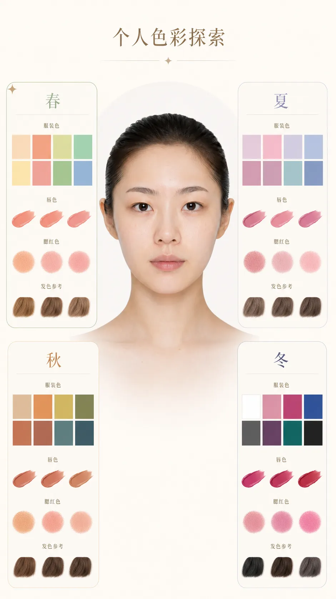
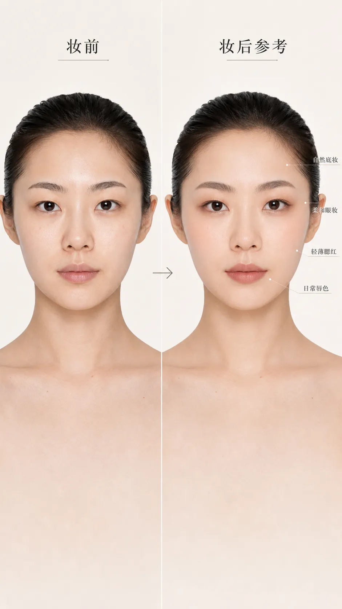

## 先把“适合”说清楚

彩妆产品的选择很容易被色号、流行妆容和别人的试色带着走，但真正决定效果的，通常是三个更朴素的问题：它和我的肤色是否协调、它在我的皮肤上是否舒服、它适不适合今天的场景。

这篇是个人学习中整理出的观察与试用框架，不提供医疗或皮肤诊断，也不代表专业化妆师意见。肤色、肤质和审美都没有优劣；下面的分类只是帮助缩小选择，不是给人贴标签。

> 图片说明：文中配图均为 AI 生成的示意图（不使用真人照片），用于说明观察与试色思路，不构成对具体肤色或产品的评判。本文不包含品牌推荐或合作背书。

## 在自然光下，先观察三个维度

不要急着问“我是冷皮还是暖皮”。在靠近窗边的自然光下、脸部没有强滤镜和明显色彩反射时，先观察以下三个维度。它们比一个单独的结论更有用。

### 1. 明度：是更浅、更深，还是介于中间？

明度说的是整体的明暗感，而不是“白不白”。试粉底时，最重要的是它能否自然接到下颌和颈部；一款过浅的底妆可能看起来提亮，但也会让脸和身体脱节。腮红、修容和唇色也受明度影响：肤色明度较低时，过浅的颜色容易显灰；肤色明度较高时，过深、过厚的颜色又可能显得突兀。

### 2. 冷暖倾向：偏粉、偏黄，还是接近中性？

冷暖是相对倾向，不是必须二选一的身份。观察脖子、下颌和脸颊的整体感觉：有人更容易带粉、玫瑰或偏蓝的底色，有人更偏金、黄、橄榄方向，也有人在不同光线下接近中性。

把手腕血管颜色、首饰偏好当作线索可以，但不要把它们当判定法。更可靠的是实际试色：一款颜色是否让肤色显得均匀、有精神，而不是在局部看起来“更白”。

### 3. 饱和度与对比度：你能承受多强的颜色？

有些人的脸在低饱和、灰一点的颜色里更安静，有些人则需要更鲜明、干净的颜色才不显得没精神。也可以观察头发、眉眼与肤色的对比：自然对比强的人，眉眼和唇色可以承受更清晰的边界；对比柔和的人，柔雾、渐变和低对比配色通常更协调。

这不是限制。想画高饱和口红、夸张眼影当然可以；它只是解释了为什么同一支颜色，有人涂起来像“刚刚好”，有人需要调整用量、边缘或搭配。

> 图注：在同一自然光、同一相机设置下，用抽象色卡展示粉底明度、冷暖方向与低/高饱和腮红的示意。

## 先按肤感选质地，再按颜色选产品

“肤质”也不是一张永久身份证。有人夏天容易出油、冬天局部干；有人额头和鼻翼与脸颊的状态不同。因此，产品选择应该先看当天的肤感和需要维持多久。

| 当天观察 | 选择时优先看什么 | 上妆时更重要的动作 |
| --- | --- | --- |
| 干燥、局部起皮 | 薄、延展性好、光泽或自然妆效的产品 | 少量分区，按压融合；减少反复叠加粉类 |
| 容易出油、需要久带妆 | 持妆表现、轻薄度、能否局部定妆 | 先薄铺，再只在易出油处少量定妆 |
| 有明显纹理或表情纹 | 不易结块的薄质地 | 遮瑕范围缩小，避免堆在纹理上 |
| 状态不稳定或有不适 | 成分、使用说明与个人耐受 | 暂停尝试刺激性新品；不适时停止使用 |

产品宣称只能作为参考。试用时，比起立刻判断“遮不遮”，更值得看它过一段时间后的表现：是否氧化变色、是否在鼻翼或眼下积线、是否仍然舒适，和自己的防晒或护肤是否打架。

## 把每类产品的任务分开

当一支产品被要求同时保湿、遮瑕、提亮、修容、定妆时，往往会越叠越厚。把任务分开，选择会简单很多。

### 底妆：匹配下颌，不追求瞬间提白

试粉底时，可在下颌到颈部之间薄涂两三个相近色，而不是只在手背试。等几分钟再看自然光下的边界、颜色变化和皮肤质感。最接近肤色的那支不一定第一眼最亮，却更容易成为日常可用的选择。

如果需要提亮，优先用少量局部产品完成，而不是把全脸粉底选得更浅。色调方面，偏粉、偏黄或偏中性都应以与颈部的融合为准，不以包装上的名称为准。

### 遮瑕：先处理颜色，再处理范围

眼下暗沉、泛红或痘印的颜色不一样，需要的遮瑕方向也不一样。选择时先看能否中和明显色差，再看遮盖力；许多局部只需要薄薄一层。过亮的遮瑕可能让眼下更突出，过厚的遮瑕则容易在表情中积线。

### 腮红、眼影和唇色：让冷暖彼此呼应

不必要求三者完全同色，但可以让它们处于相近的色彩方向。例如，偏玫瑰、莓果、豆沙的一组常带来更柔和的冷感；偏杏、蜜桃、棕橘的一组常带来更温暖的感觉。中性肤色可以两边尝试，再观察哪一边让自己更有精神。

颜色过强时，先降低用量、把边缘晕开，或换成更薄的质地，而不是立刻认定“这个色系不适合我”。唇色也可以用点涂、叠涂或唇线边缘的处理调整强度。

### 修容和高光：选择“阴影”与“反光”，不是复制脸型

修容更接近自然阴影，通常应避开明显发红、发橘或过亮的颜色；高光则看反光颗粒、底色和皮肤纹理。日常使用时，先在脸侧或局部薄试，退远看整体，再决定是否增加。它们的作用是强调已有轮廓，而不是把脸改成某一种标准形状。

> 图注：脸颊、眼影和唇色的同色系搭配示意（色块或局部示意，避免将单一肤色作为”正确范本”）。

## 把 AI 当作第二双眼睛

观察框架练起来需要时间。另一个实用的做法，是让 AI 对同一张正脸照做一次结构化分析，作为自己观察的对照。它的价值不在“替你做决定”，而在强迫你描述清楚脸型、五官比例、肤色和皮肤状态，再据此缩小产品选择。以下五个提示词是我整理笔记时用过的，供参考；用更好的模型分析通常结果更可靠。使用时注意保护隐私：只上传自己愿意共享的照片，避免上传他人的、未脱敏的或包含敏感信息的图片。

**① 面容分析图（教学版）**——分析脸型、三庭五眼、五官比例、冷/暖/中性皮与肤色亮度：

```text
Use the uploaded portrait as the exact face reference.

Do NOT change:
face shape, facial proportions, eye shape, nose shape, lip shape, skin tone, hairstyle.

Create a professional facial analysis chart.

Layout:
TOP TITLE: 《AI智能面容分析》
CENTER: Original face portrait

Overlay professional beauty annotations:
① Face Shape Analysis — 鹅蛋脸 / 圆脸 / 方脸 / 长脸 / 菱形脸
② Three-Part Facial Ratio — 三庭比例
③ Five-Eye Proportion — 五眼比例
④ Facial Symmetry
⑤ Facial Features Analysis — forehead, eyebrow shape, eye shape, nose shape, lip shape, jawline
⑥ Skin Undertone Analysis — 冷皮 / 暖皮 / 中性皮
⑦ Skin Brightness Level — Ⅰ 白皙 Ⅱ 自然肤色 Ⅲ 健康小麦色

Use arrows, guidelines, measurement lines, semi-transparent overlays.
White background. Professional beauty consulting report style. Luxury cosmetic clinic aesthetic.
Chinese labels only. Ultra detailed. 9:16 vertical.
```


*效果图示意：它把提示词中的观察项目整理成可对照的版面；不构成生物特征或专业诊断。*

**② 适合妆容推荐图**——判断大地系、奶茶系、韩系裸妆、纯欲妆、日杂妆、欧美妆的适配度：

```text
Use the uploaded portrait as the exact face reference.

Create a professional makeup suitability analysis board.

Title: 《适合我的妆容风格》
Center: Original portrait.

Surrounding recommendation panels:
① 大地系妆容 ★★★★☆  ② 韩系裸妆 ★★★★★  ③ 奶茶妆 ★★★★★
④ 纯欲妆 ★★★★☆  ⑤ 日杂妆 ★★★★☆  ⑥ 欧美浓颜妆 ★★☆☆☆

For each style show: suitability score, recommended eyeshadow colors, recommended blush colors, recommended lipstick colors.

Use professional makeup color swatches. Chinese labels. Beauty consultant report style. White background. Magazine quality. 9:16.
```


*效果图示意：色卡用于比较不同妆容方向，并非对个人适配度的定论。*

**③ 肤色分析图**——判断春夏秋冬色彩体系：

```text
Use the uploaded portrait as the exact face reference.

Create a personal color analysis chart.

Title: 《个人色彩诊断》

Analyze: Spring, Summer, Autumn, Winter. Highlight the best matching season.

Show: recommended colors, recommended lipstick shades, recommended blush shades, recommended hair colors, recommended clothing colors.

Include color palettes. Professional image consultant style. Chinese labels. White background. Luxury beauty report. 9:16.
```



*效果图示意：四季色彩只是探索颜色方向的起点，实际效果仍需在自然光下试色确认。*

**④ 皮肤分析图**——水分、油脂、毛孔、敏感度、肤色均匀度、黑眼圈、法令纹与肤质类型：

```text
Use the uploaded portrait as the exact face reference.

Create a skincare diagnostic chart.

Title: 《皮肤状态分析》

Analyze: 水分, 油脂, 毛孔, 敏感度, 肤色均匀度, 黑眼圈, 法令纹, 肤质类型 (干皮 / 油皮 / 混合皮 / 中性皮).

Use heat maps, semi-transparent overlays, beauty clinic visualization.
Chinese labels. Medical beauty report style. White background. Ultra realistic. 9:16.
```


*效果图示意：这里改为日常状态观察，不替代皮肤检测、医疗建议或诊断。*

**⑤ 最终推荐妆容效果图**——基于脸型、肤色与五官生成妆后模拟，作为选择方向的参考：

```text
Use the uploaded portrait as the exact face reference.

Do NOT change identity.

Create a professional makeover simulation.

Apply the most suitable makeup style based on: face shape, skin tone, facial proportions, undertone, eye shape, lip shape.

Recommended style: Korean soft glam makeup — natural skin finish, soft contour, earth tone eyeshadow, defined lashes, natural brows, soft peach blush, MLBB lipstick.

Split-screen layout: LEFT Before, RIGHT After.
Use arrows and labels. Chinese annotations: 肤色提亮, 眼部放大, 轮廓优化, 气色提升.

White background. Beauty academy textbook style. Ultra realistic. 9:16.
```



*效果图示意：妆后部分仅展示一种低强度妆容方向；实际产品、手法和效果会因光线、肤感与个人偏好而不同。*

这五类分析可以串成一个完整流程：先弄清脸型和三庭五眼，再判断色系和肤质，最后落到一个具体的妆容方向。和前面的人工观察一样，AI 输出也只是一个假设，最终仍以你在自然光下、带妆一段时间后的实际感受为准。

## 建立自己的试色记录，而不是收藏一堆结论

最有用的产品档案不需要很复杂。每次试用后，记下这几件事：

- 日期、天气与带妆时长；
- 当天皮肤是偏干、偏油、稳定还是不适；
- 产品的色号、质地和搭配的防晒/底妆；
- 刚上妆、两三个小时后、卸妆前的颜色和纹理；
- 下次会保留、减少或更换什么。

拍照时尽量固定窗边位置、时间和相机设置，少用美颜滤镜。这样几次之后，你会知道自己常用的底妆明度区间、喜欢的腮红位置和最耐看的唇色方向。这比从别人的“必买清单”里盲选更可靠。

## 一个购买前的检查清单

在下单或带新品回家前，问自己：

- 我希望它解决的是颜色、质地，还是持妆问题？
- 它和我已有的底妆、工具和卸妆方式能配合吗？
- 我能不能先试色、买小样，或从接近的现有产品开始？
- 我是在自然光和一段带妆时间后做判断的吗？
- 它让我更舒服、更自在，还是只是短暂符合某种流行？

如果使用任何产品后出现持续不适或异常反应，应停止使用，并视情况向合适的医疗专业人士咨询。彩妆可以帮助表达风格，但不需要承担处理皮肤问题的职责。

从肤色观察到产品选择，最后并不是为了得到一张永不改变的“个人色彩答案”。它更像一套随时能重启的观察方法：今天的光线、皮肤、场景和心情变了，选择也可以跟着变。
