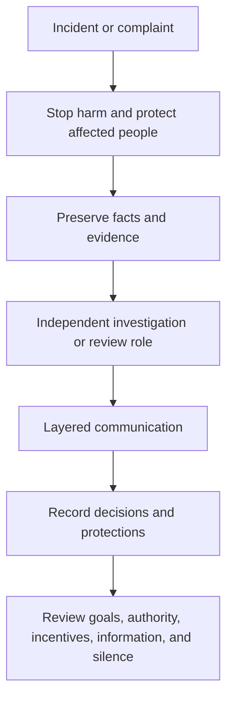

Speed is not the same as correctness. Safety, compliance, privacy, stability, and people’s professional safety cannot be treated as costs that a short-term result is allowed to buy.

Not every risk requires certainty before action, but some boundaries require the appropriate specialist or authorized escalation. The second tier does not need to be a safety, legal, privacy, or compliance expert. It must ensure that the concern is visible, owned, reviewable, and not buried by business pressure.

Power also needs different views. A good decision process lets the person closest to the issue, the collaborating team, the specialist role, and the senior organization contribute different facts. For an important decision, state who owns the outcome, who can request review or reopen it, and what signal invalidates the choice.

Fairness does not mean identical resources or outcomes. It means that comparable responsibility is judged by comparable standards, differences have an explainable purpose, and affected people know their boundaries, criteria, decision owner, and next review even when sensitive details cannot be shared.

“Independent” means the investigator is not controlled only by the subject’s goals or interests; it does not always require an external body. Urgent safety, unlawful conduct, or continuing harm must enter the organization’s existing HR, legal, privacy, security, or emergency channels.

The final test is whether people can report bad news and dissent without retaliation while still being accountable for outcomes. Governance preserves speed by preventing hidden costs from becoming repeated incidents.
