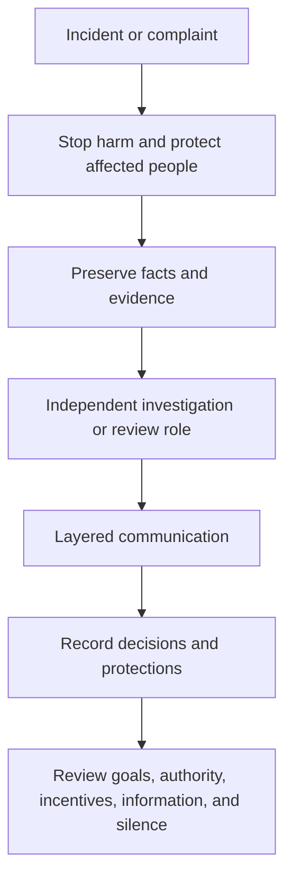

Here, “second tier” means a manager of managers who can allocate resources and influence several teams. Speed is not the same as correctness. Safety, compliance, privacy, stability, and people’s professional safety cannot be treated as costs that a short-term result is allowed to buy.

## State the non-negotiable boundaries first

Not every risk requires certainty before action, but some boundaries require the appropriate specialist or authorized escalation. A manager of managers does not need to be a safety, legal, privacy, or compliance expert. The role is to ensure that the concern is visible, owned, reviewable, and not buried by business pressure.

Power also needs different views. A good decision process lets the person closest to the issue, the collaborating team, the specialist role, and the senior organization contribute different facts. For an important decision, state who owns the outcome, who can request review or reopen it, and what signal invalidates the choice.

## More power requires more independent review

Fairness does not mean identical resources or outcomes. It means that comparable responsibility is judged by comparable standards, differences have an explainable purpose, and affected people know their boundaries, criteria, decision owner, and next review even when sensitive details cannot be shared.

## Fairness does not mean identical outcomes

## After an incident, protect people and facts first

“Independent” means the investigator is not controlled only by the subject’s goals or interests; it does not always require an external body. Urgent safety, unlawful conduct, or continuing harm must enter the organization’s existing HR, legal, privacy, security, or emergency channels.

The sequence is not a replacement for formal HR, legal, security, privacy, or emergency procedures. It is the minimum a manager of managers should do while directing the issue into the proper channel: stop the harm, preserve evidence, assign a review role that is not controlled by the subject, communicate by role, record the decision, and inspect the organizational conditions that made the incident possible.

## Protect safe expression at every level

The final test is whether people can report bad news and dissent without retaliation while still being accountable for outcomes. Governance preserves speed by preventing hidden costs from becoming repeated incidents. The aim is not to remove managerial speed, but to stop speed from being purchased with safety, fairness, and people’s basic conditions for working.
