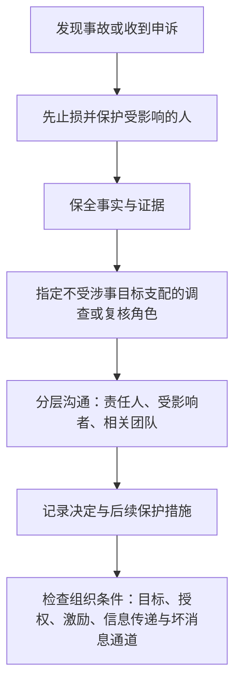

二线拥有更多资源、能推动更多团队，也就更容易把决定做得很快。问题是，快不等于对。

一个目标很紧、一个客户很急、一个业务窗口快要过去时，组织最容易说出的话是：“风险我们知道，先把事情做出来。”有些风险确实可以在之后补；有些不可以。安全、合规、隐私、稳定性和人员公平，一旦被当作可以用结果交换的成本，管理就不再是在解决问题，而是在把代价转给更没有选择的人。

这里的“治理”不是给二线再加一层流程，而是指在二线能调资源、定优先级、影响人员机会时，仍有人能提出异议、有人能复核事实、有人要对后果负责。

## 先把不能交换的底线说清

不是所有风险都一样。团队不可能在每件事上都等到百分之百确定，也不应因为存在风险就停止行动。但有些问题不应仅凭“业务重要”压过去：适用的法律和监管要求、个人安全、数据隐私、重大稳定性风险，以及明显不公平或可能伤害他人职业安全的管理做法。

遇到这类问题，二线首先要做的不是计算“值不值得冒险”，而是确认有没有不可越过的边界。必要时缩小范围、延后时间、换方案，甚至停止这条路径。拿到一个短期结果，却在之后留下不可逆的安全、合规或人员伤害，不是管理能力。

边界之外仍有大量需要判断的风险。它们可以按影响范围、发生可能性、可逆性和暴露时间来区分：哪些团队自己可以处理，哪些必须升级；哪些信息需要立即同步，哪些可以在事实更清楚后再说；哪些选择可以试，哪些必须由具备专业判断的人先确认。

二线不必假装自己是安全、法务、隐私或合规专家。它的责任是确保这些问题没有在业务压力里消失：有人负责、有人能提出异议、有人知道何时需要升级。

## 权力越大，越需要不同视角复核

跨团队结果往往需要一个最终决定者，但最终决定权不等于不受约束。

一个好的决定过程，至少要允许不同位置的人提供不同事实：离问题最近的人知道现场约束，合作方知道团队边界和代价，安全、法务、隐私等专业负责人知道风险边界，更高层知道组织能够承担什么后果。二线要把这些信息带进选择，而不是只收集支持自己方案的理由。

特别是当决定会影响多个团队、人员机会或对外承诺时，至少应把三件事说清：

- 谁对最终结果负责；
- 谁可以提出新事实、请求复核或要求重开决定；
- 出现什么信号时，原来的选择不再成立。

这样做会慢一点，但不是为了让所有人都有一票否决权。它是为了避免一个人把局部判断放大成全组织的后果，却没有人能及时指出问题。

## 公平不是把所有结果做成一样

人员管理里的公平，很少等于每个人拿到同样的资源、薪酬、机会或晋升。组织本来就会根据目标、角色、能力缺口和贡献作差异化选择。

真正伤害信任的，通常不是差异本身，而是标准在事后才出现，或者同样的责任被不同的尺子评价。一个团队为什么拿到招聘名额，另一个为什么没有；一位负责人为什么得到更大的问题，另一位为什么被要求继续证明；一次人员调整为什么发生——这些决定不一定能把所有细节公开，但应当有可以说明的目标、依据和复评条件。

信息也需要分层。涉及个人隐私、敏感人事或尚未确认的组织变化时，不能靠“完全公开”解决问题；只公布最终结论、让受影响的人从传闻里猜，也会造成伤害。更低的标准是：承担责任的人要知道自己的边界、可被评价的标准和下一步；受影响的人要知道哪些信息暂时不能公开、谁在作决定、何时能得到新的说明。

## 管理事故发生后，先保护人和事实

管理事故不只包括明显的违法违规。长期压住风险、利用模糊授权让人承担不合理责任、在人员评价中明显失公、对提出问题的人进行报复，都会破坏组织让人安全表达和工作的基本条件。

发生事故后，最先要做的是止损：保护可能受影响的人，暂停正在造成伤害的动作，防止关键事实和证据继续丢失。若让涉事管理者自己定义事实、决定调查范围或处理申诉，组织很难获得可信结论。

管理事故的最小处理顺序可以压缩成一条流程：

这不是替代公司调查制度或适用法律程序的通用流程。紧急安全、涉嫌违法或持续伤害风险，应优先进入组织现有的人力资源、法务、安全、隐私或当地紧急渠道。

接下来通常应由合适的层级和角色查清事实。这里的“独立”不一定意味着每次都由外部机构处理，而是指调查者不应只对涉事者的目标和利益负责。不同人听到的、看到的事情可能不同，结论也不应只来自一份向上的汇报。

事实清楚后，信息仍要分层传递。直接承担责任和受到影响的人，需要足以理解后续安排的信息；其他人未必需要知道全部细节，但应知道组织已经如何处理、哪些边界被重申、以后遇到类似问题该怎样报告和保护自己。处理过程和关键决定也应留档，避免同类问题发生后，组织只能靠记忆和关系重新判断。

最后才是事后检查。检查不应只问“谁做错了”，还要问：什么组织要求、授权边界、激励方式、信息传递方式或不敢说坏消息的氛围，让这个问题能够发生或被放大？如果事故处理只停在换一个人，原来的条件还在，下一次只会换一个位置重演。

## 一线和管理层都需要安全表达和工作的条件

安全表达和工作的条件，不是只保护一线员工免受管理伤害。管理者同样需要在明确边界内报告风险、表达异议、请求复核，而不因为说出坏消息或不同意见就被惩罚、报复或失去机会。

这不等于管理者可以逃避结果。相反，只有当风险能够被如实说出，组织才有机会区分：问题来自个人判断、资源不足、目标冲突，还是上层授权本身有误。把所有坏消息都当作“不够担当”，最后只会留下愿意报喜的人。

二线处在上下之间，尤其需要保护这种通道：向下不应因为有人提出问题就让他失去机会；向上也不应为了维持表面顺利，把自己和一线负责人逼到只能隐瞒风险。清楚的原则、能够升级的路径、留下记录的决定和可被复核的边界，都是这种保护的一部分。

治理的目的不是让管理失去速度，而是让速度不以安全、公平和人的基本工作权利为代价。一个组织真正能承担复杂目标，不在于它有没有最强势的二线，而在于关键时刻是否还有人能说清底线、提出异议、保护事实，并让决定对得起它带来的后果。
