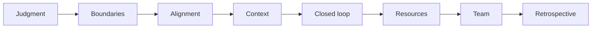

Over the years I've written quite a few articles about management, collaboration, and decision-making. Looking back, they actually all come from the same long retrospective: the pitfalls I repeatedly stepped into and the judgments I repeatedly confirmed while leading teams were split into many articles, each focused on a single angle.

The advantage of writing them separately is that each piece is short and can be read on its own; the cost is that the same underlying skeleton gets repeated too many times. So here I consolidate them once: eight judgments, each explained thoroughly once, with the related articles attached below. After reading this piece, you can see how these judgments connect; to land on a specific scenario, click into the corresponding article.

## 1. Judgment: First answer "what we're solving," then talk about "how"

The longer I lead teams, the more I feel that most fruitless arguments aren't because the participants aren't smart enough, but because everyone is answering different questions: one person says "this feature is important," meaning user tasks will be blocked; another says "let's hold off," meaning the cost is too high; yet another worries about future maintenance cost. All three views can be valid, yet they don't connect to each other.

So I treat "discussable" as the minimum standard for a judgment. A judgment that can be refuted, supplemented, and verified afterward must at least clarify four things: goal (what outcome you want to change), facts (what evidence exists now), constraints (time, people, system boundaries), and trade-offs (therefore what to do, what not to do, and what risks to take). Without these four pieces, discussion degrades into "I think this is more important"; with them, the argument shifts from a battle of positions to "do we agree on this yardstick."

Another side of this is prioritization: faced with a long list of tasks, you first need a judgment framework, and only then does "the three most important things" emerge.

Further reading:

- [The Top K Problem](/writing/2024/02/top-k-thinking/) · [Structured Thinking](/writing/2022/06/structured-thinking-at-work/) · [The Counting Game](/writing/2025/08/counting-practice/) · [How to Ask Yourself Better Questions](/writing/2023/04/how-to-ask-yourself-better-questions/)
- [Why Engineers Need Product Judgment](/writing/2022/02/engineer-product-judgment/) · [Product Sense](/writing/2022/03/product-judgment-for-engineers/) · [When a Team Can't Articulate Its Unique Value](/writing/2023/03/engineering-without-unique-value/) · [The First Map of an Unfamiliar Field](/writing/2023/03/mapping-an-unfamiliar-value-chain/) · [How to Write a Product Overview](/writing/2021/09/product-overview-is-a-decision-model/) · [From Complaints Back to Problems](/writing/2018/04/product-apocalypse-one/)
- [Frontend Engineers: From Execution to System Judgment](/writing/2023/08/frontend-engineer-system-judgment/) · [Three Outputs of Frontline Engineering Management](/writing/2023/03/frontline-engineering-management/)

## 2. Boundaries and Responsibility: Before taking initiative, sort out the boundaries first

The easiest way "ownership mindset" goes wrong is that it's easily understood as always taking on work and always being on call. Once that happens, responsibility has no boundaries; and responsibility without boundaries ultimately either burns people out or teaches them to avoid it.

I later redefined responsibility as "a reasonable commitment and delivery": not mindlessly taking on tasks, but turning a problem worth solving into a path that someone is willing to walk to the end together. What really needs to be clarified are four things: who decides, who executes, when to escalate, and where the accountability ends. Likewise, "definitely not doing something" is not laziness — time, attention, and the radius of responsibility all have limits, and being clear about what you won't do preserves trust better than agreeing to everything.

This point also explains duplication in collaboration: the difference between healthy redundancy (disaster recovery, double-checking, replaceability) and harmful overlap (competing for resources, horse racing) isn't in "how many copies were made," but in whether the delegation is clear. Once delegation is clear, duplication naturally returns to its proper place.

Further reading:

- [Ownership Mindset and Responsibility](/writing/2021/11/ownership-with-boundaries/) · ["Definitely Not Doing Something" Is Not Laziness](/writing/2023/03/defining-what-not-to-do/) · [Collaboration Overlap Is Not Busyness](/writing/2023/04/healthy-redundancy-and-harmful-overlap/)
- [Engineering POC: Responsibilities, Boundaries, and the Delivery Loop](/writing/2021/08/requirement-poc-responsibilities/) · [Engineering POC in Practice: FAQ](/writing/2021/04/engineering-poc-faq-responsibility-boundaries/)

## 3. Alignment: Information sync isn't CC'ing people — it's enabling the other person to make a decision

When it comes to information, the pitfall I've hit most often is treating it as "just send it out and you're done." Copying a long block of progress into the group chat leaves the recipients unable to see the conclusion, judge the risk, or know whether they need to act — the more information there is, the harder the key content is to find.

The goal of syncing is never "to send out everything you know," but to let the right people get enough information at the right time to judge, collaborate, or act. There's an even finer distinction hidden in here: information is not authority. Giving context without decision rights only lets a person know about more problems while changing nothing — turning into a useless burden.

When conflict appears, most of the time it's not that someone refuses to cooperate, but that three things aren't aligned: what to change together, which facts to grasp, and who makes the final decision under what conditions. Once these three are made clear, disagreements can return to a solvable target.

Further reading (those 13 one-on-one articles form a complete topic map; here are the main ones):

- [1-on-1s Are Not Routine Meetings](/writing/2023/03/one-on-ones-and-decision-rights/) · [Information Sync Is Not CC](/writing/2023/03/information-sync-for-decisions/) · [The Three Things to Align First in a Project Conflict](/writing/2023/03/resolving-project-conflicts/)
- [The Product–Engineering Relationship Isn't "Cooperation"](/writing/2023/03/product-engineering-trust/) · [How to Sync Without Breeding Speculation When Org Changes Happen](/writing/2023/04/communicating-organizational-change/) · [How to Communicate Well](/writing/2023/01/clarify-feedback-and-commitment/)
- [One-on-One Conversations (the entire series)](/columns/one-on-one-conversations/): from [how to open](/writing/2021/03/shared-problem-definition/), [talking about busyness](/writing/2021/06/one-on-one-time-and-commitment-boundaries/), [talking about growth](/writing/2021/08/specific-growth-milestones/), and [talking about anxiety](/writing/2023/04/anxiety-and-work-boundaries/), to [business slowdown](/writing/2023/12/anxiety-when-growth-slows/) and [insecurity and comparison](/writing/2024/01/insecurity-comparison-and-long-term-capability/)

## 4. Context: Almost all collaboration loss happens at handoff points

A decision goes from being proposed, explained, and handed over to being executed, and the context thins out a layer each time it's passed along. What you understand today as "this change is to solve A" may arrive at next week's colleague as just "this needs to be changed" — the responsibility remains, but why it's being changed and what must not be broken are all lost.

The most expensive cost of distributed collaboration is therefore not the time difference, but context being repeatedly lost in handoffs. The solution is three things: divide closed-loop responsibility by deliverable outcomes (without slicing the whole responsibility too finely), use documents to preserve context (so that "what's already been thought through" doesn't depend on human memory), and keep a small amount of high-quality sync (read the materials first, have an agenda, and land conclusions back in the document).

Thinking along this line, documentation isn't a record either, but a collaboration interface — it lets people who weren't part of the earlier context quickly learn "why we're doing it, how, and where I participate in the judgment."

Further reading:

- [How Distributed Teams Reduce Context Loss](/writing/2023/03/reducing-context-loss-in-distributed-teams/) · [Documents Are Not Records, They're Collaboration Interfaces](/writing/2020/10/documents-are-collaboration-interfaces/) · [Why Technical Knowledge Bases Need Entry Pages](/writing/2020/01/why-technical-knowledge-bases-need-entry-pages/)
- [Technical Sharing Is Not an Event](/writing/2020/10/what-good-technical-sharing-should-change/) · [Turning Spoken Ideas into Decision-Making Documents](/writing/2025/12/turn-spoken-ideas-into-decision-documents/)

## 5. Closed Loop: From "done" to "actually effective"

The most expensive thing in engineering isn't "being slow," but "thinking it's done when it hasn't actually taken effect." Quality isn't one team's job — everyone on the delivery chain is responsible for their own segment of the result, and everyone is jointly responsible for the production outcome. When something goes wrong in production, the order is prevention, detection, mitigation, and repair — mitigate first, then explain; at the scene of an incident, the most expensive thing is time and the cheapest thing is a kill switch.

For developers, "use your own product more" is also often reduced to an empty phrase: browse for ten minutes, raise a few scattered issues, and next time start from scratch. Real self-use is a closed loop: experience as tasks, record as evidence, handle structurally, and verify in a closed loop. A fix without follow-up verification doesn't count as finished.

The value of the closed loop is letting the team continually revise old assumptions with new observations, rather than treating "commit" or "ship" as the finish line.

Further reading:

- [Quality Is Not One Team's Job](/writing/2023/03/quality-is-shared-accountability/) · [Use Your Own Product First](/writing/2021/05/use-your-own-product-feedback-loop/) · [How Engineering Standards Avoid Creating Bureaucratic Processes](/writing/2023/03/engineering-standards-without-bureaucracy/)
- [A Guide to Data Metrics at Work (five-article series)](/columns/data-metrics-guide/): from definitions and metric tiers to periodic retrospectives — the data-flavored version of the "supporting decisions with a single shared set of definitions" thread

## 6. Resources and Capacity: The problem isn't headcount, but the gap between goals and capability

A ratio like "how many engineers per product" at most describes the state at a single point in time; it can't support decisions. Whether ten people is a lot or a little depends on what you need to deliver, how much maintenance responsibility you carry, and how complex the dependencies are. Talking about ratios apart from goals and constraints is like deciding on the answer first and then looking for the question.

What really needs to be answered is: where is the gap between the goal and current capability — in ability, in process, in dependencies, or simply in headcount. Using the single tool of "adding people" to handle every gap only spends money and people in the wrong places.

Interestingly, both resource scarcity and resource abundance cause problems: when scarce, it's easy to grit through on overdrive; when abundant, it's easy to grow increments that no one is responsible for. The solution at both ends is the same: first see the real problem clearly, then let resources serve the real problem. Resources themselves are neutral; they only amplify the results of decisions.

Further reading:

- [How to Run Without Overdrive When Resources Are Scarce](/writing/2023/03/working-under-resource-constraints/) · [Why Organizations Still Slow Down When Resources Are Abundant](/writing/2023/04/escaping-the-resource-curse/) · [Headcount Planning Is Not a Ratio Game](/writing/2023/04/headcount-is-not-a-ratio/)
- [Time Management: A Conversation About "Busyness"](/writing/2021/06/one-on-one-time-and-commitment-boundaries/)

## 7. Team and Growth: Development is passing on judgment, not instilling experience

Team growth is often misunderstood as having more people, or a few strong veterans joining. These can raise the ceiling of capability, but they don't automatically form a team that can keep solving problems. Real growth is collaboration, experience, and continuity becoming reliable over time.

Development also isn't pouring experience into everyone. The same piece of advice means different things to people at different stages: newcomers need to articulate the problem clearly and complete a full task; people who can deliver independently find their bottleneck shifting from "can I do it" to "can I explain why it's done this way"; people starting to set direction need to move from local implementation to holistic judgment. The manager's most valuable move is to set responsibilities that require just one step beyond the current level, rather than doing a bit more for the team.

Frontline management, in the end, is about shifting effort from "substitute labor" to "systematic output": better judgment, predictable delivery, and problems that can be handled in the open.

Further reading:

- [Team Growth Is Not Expansion](/writing/2022/01/team-growth-is-not-expansion/) · [Development Is Not Training](/writing/2023/06/team-development-compounds/) · [Three Growth Paths: Newcomers, Core Members, and Leads](/writing/2023/06/growth-paths-for-newcomers-core-and-leads/) · [Good Mentor Relationships and the First 90 Days for Newcomers](/writing/2020/10/mentor-relationship-and-first-90-days/)
- [Three Outputs of Frontline Engineering Management](/writing/2023/03/frontline-engineering-management/) · [What to Design First When Building a Team from Zero](/writing/2023/06/from-zero-design-the-team/) · [How Far from Code Should Managers Stay](/writing/2023/03/how-close-managers-should-stay-to-code/) · [When Someone Loses Motivation](/writing/2023/03/when-a-team-member-loses-motivation/)
- [How to Tell Whether Work Helps You Grow](/writing/2022/01/how-to-tell-if-work-helps-you-grow/) · [Capability Models and Honest Self-Assessment](/writing/2022/09/honest-self-assessment/) · [What to Look For When Evaluating Potential](/writing/2023/02/evaluating-potential-with-care/) · [Self-Iteration Is Not Pep Talk](/writing/2023/06/self-iteration-feedback-system/) · [Achievement Is Not a Reward](/writing/2021/01/achievement-is-not-a-reward/) · [A Self-Check List Before Promotion and Interviews](/writing/2023/08/career-growth-ten-questions/) · [Growth Milestones](/writing/2021/08/specific-growth-milestones/)
- [Recruiting and Professional Relationships (series)](/columns/recruiting-and-professional-relationships/): from [technical hiring](/writing/2022/01/technical-hiring-long-term-judgment/), [referrals](/writing/2025/03/referral-is-mutual-recognition/), and [networking](/writing/2021/11/relationships-as-long-term-reciprocity/) to [recruiting branding](/writing/2024/05/recruiting-brand-is-a-trust-system/) and [campus recruiting](/writing/2022/07/campus-recruitment-training/)

## 8. Retrospective: Let experience return to the next decision

A retrospective is most easily turned into two kinds of waste: one is a praise session or a blame session, and the other is a record that no one reads again after it's written. The former hurts relationships; the latter produces no change at all.

An effective retrospective cares about only one thing: the next time we face a similar situation, what do we keep, change, or stop. It should leave behind fewer but clearer actions — a new verification checkpoint, an earlier design discussion, a clearer handoff standard. Planning, goals, and retrospectives are essentially the same loop: turning "handing in homework" into your own growth.

Further reading:

- [A Reusable Engineering Retrospective](/writing/2020/10/reusable-engineering-retrospective/) · [Goals, Planning, and Retrospectives](/writing/2023/07/goals-retrospectives-and-next-actions/) · [Self-Iteration Is Not Pep Talk](/writing/2023/06/self-iteration-feedback-system/)

## This skeleton isn't a process — it's a sequence of judgments

Taken together, the eight judgments form a very plain sequence: first define the problem, then sort out boundaries, align facts and expectations, preserve context, close the loop, see the resource gap clearly, and let the team and retrospectives pass experience on.

It was never a process to be memorized, nor proof of "managing a lot." The phrase I've always liked still holds: **Context, not control** — give enough context and put decision rights closest to where the problem is. All the articles above are just this phrase unfolded in different scenarios.
