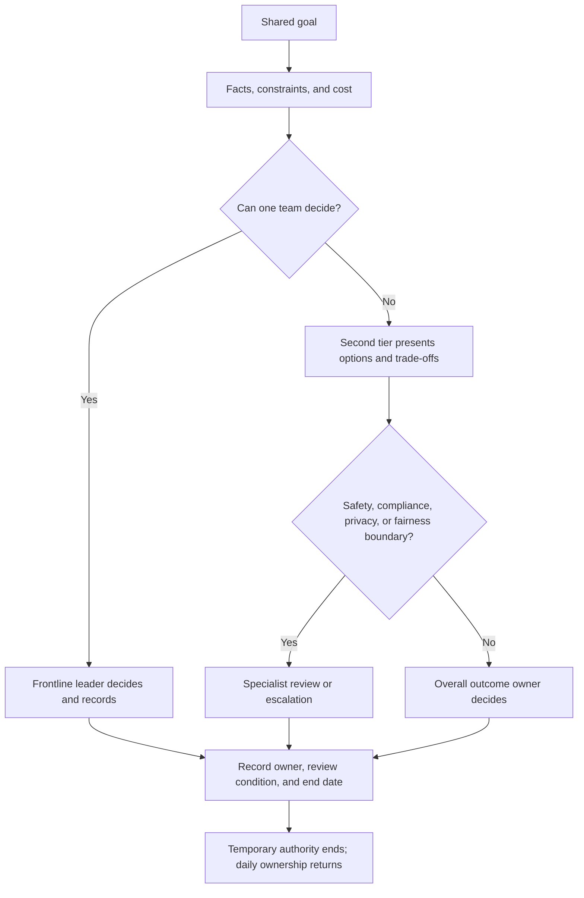
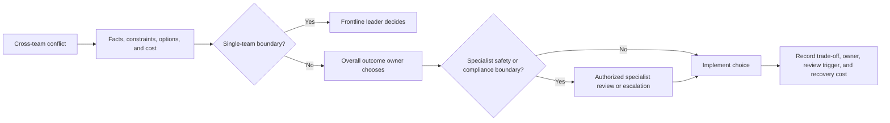

When several teams share a delivery, a manager of managers can either watch only the final result while teams guess priorities, or bypass frontline managers and assign work directly. The job is to avoid both failures: make the shared goal real without reclaiming daily team management.

Start with the organization’s need, not with a person waiting for a title. Clarify the outcome, boundaries, interfaces, joint decisions, and responsibility; then choose whether the gap is filled through hiring, development, transfer, or temporary authorization.

In one-on-ones, ask: what must change, who is waiting for whom, what would be dropped if resources cover only one side, and who owns the external promise? When a leader escalates every conflict, distinguish missing authority from avoidance of a hard choice. The support differs.

Cross-line work is legitimate when the manager of managers defines the outcome, assigns the interface, coordinates resources, and states the scope and end date. It becomes shadow management when the manager of managers gives daily tasks to another team’s members, handles their performance, or leaves a permanent unofficial reporting line.

Evaluate both result and method: did the team become better at judgment and coordination, or did every important decision return to one leader? Good second-tier management makes leaders less dependent on the layer above.

## Cross-team work can be driven without taking over daily management

The manager of managers may need to push across team boundaries when a shared commitment has no single owner. The role should define the outcome, interface, resources, and escalation path, then return execution and people management to the frontline leaders.

## The result should also produce better leaders

After the work, ask whether leaders can make more of the next set of choices themselves. If every decision still returns upward, the intervention delivered a result but failed to build organizational capability.

## Authority and Resources Should Serve Outcomes

## Authority is not a substitute for responsibility

When two teams need the same person or release window, authority matters only if it enables a real choice: what is protected, what is deferred, who decides, and who carries the cost. “Go make it happen” is not complete authorization.

Ask what is blocking the goal before asking for more power. The gap may be priority control, an external commitment, a temporary capability, or a missing interface. Present options, costs, and the latest decision time instead of saying only that resources are insufficient.

Some boundaries cannot be purchased with business results. Legal, regulatory, personal safety, privacy, and major stability risks need the appropriate safety, legal, privacy, compliance, or technical governance role. The manager of managers ensures that the issue is named, owned, escalated, and recorded; the role must not disguise specialist judgment as a business trade-off.

After a choice, record what was protected, what was given up, who explains it, and what would reopen it. “Compensation” is not equal distribution or a guaranteed reward; it is recognition of cost and a credible review or recovery commitment. Otherwise every conflict returns to the same bottleneck.

## Authority should be earned through explicit choices

The goal determines which decisions and resources a leader must be able to request. Delegation is useful only when it gives someone a real choice, a visible boundary, and a review condition; otherwise it is merely a transfer of blame.

## Information exists to enable decisions

More reporting lines do not solve an unclear decision. Share information according to the choice it enables: the owner, the constraint, the alternatives, the cost, and the time by which the decision must be made.

## Resource conflict needs a recorded trade-off

Negotiation is not always a matter of splitting the difference, and escalation is not always a matter of taking more. Some choices require compensating the team that gives up capacity; the record should state the cost, owner, and review trigger.

## What should remain after coordination

After a coordination event, the teams should have a clearer boundary, a named owner, and a reusable rule for the next similar conflict. If nothing remains except a promise to coordinate again, the organization has created another dependency on the manager of managers.

## Review whether authorization helped the result

Once the result is visible, revisit the goal, boundary, authorization, and resource arrangement. If they did not help, change the structure instead of asking the same people to compensate through more effort.

## Scope and limits

Specific employment, legal, safety, privacy, and compliance decisions must follow applicable law and the organization’s authorized procedures.
