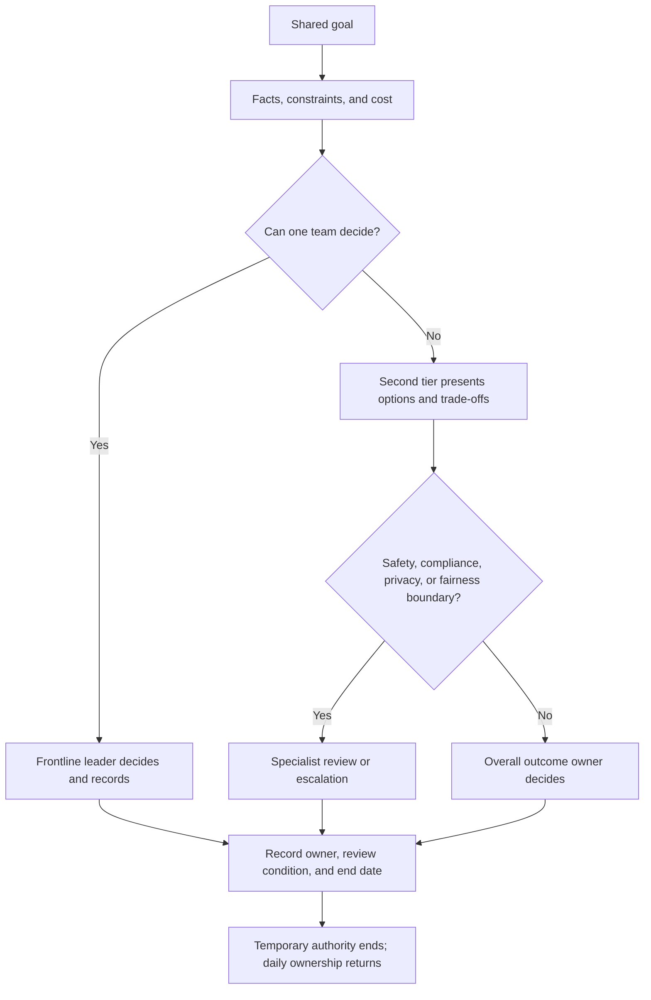
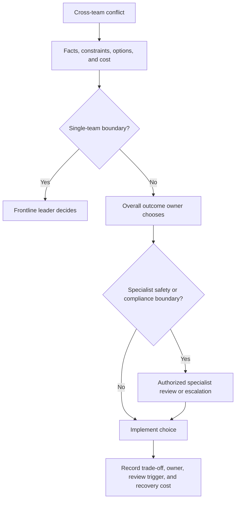

When several teams share a delivery, a manager of managers can either watch only the final result while teams guess priorities, or bypass frontline managers and assign work directly. The job is to move between those failures: make the shared goal real without reclaiming daily team management.

Start with the organization’s need, not with a person waiting for a title. Clarify the outcome, boundaries, interfaces, joint decisions, and responsibility; then choose whether the gap is filled through hiring, development, transfer, or temporary authorization.

In one-on-ones, ask: what must change, who is waiting for whom, what would be dropped if resources cover only one side, and who owns the external promise? When a leader escalates every conflict, distinguish missing authority from avoidance of a hard choice. The support differs.

Cross-line work is legitimate when the second tier defines the outcome, assigns the interface, coordinates resources, and states the scope and end date. It becomes shadow management when the second tier gives daily tasks to another team’s members, handles their performance, or leaves a permanent unofficial reporting line.

Evaluate both result and method: did the team become better at judgment and coordination, or did every important decision return to one leader? Good second-tier management makes leaders less dependent on the layer above.

## Authority and Resources Should Serve Outcomes

---

When two teams need the same person or release window, authority matters only if it enables a real choice: what is protected, what is deferred, who decides, and who carries the cost. “Go make it happen” is not complete authorization.

Ask what is blocking the goal before asking for more power. The gap may be priority control, an external commitment, a temporary capability, or a missing interface. Present options, costs, and the latest decision time instead of saying only that resources are insufficient.

Some boundaries cannot be purchased with business results. Legal, regulatory, personal safety, privacy, and major stability risks need the appropriate safety, legal, privacy, compliance, or technical governance role. The second tier ensures that the issue is named, owned, escalated, and recorded; it must not disguise specialist judgment as a business trade-off.

After a choice, record what was protected, what was given up, who explains it, and what would reopen it. “Compensation” is not equal distribution or a guaranteed reward; it is recognition of cost and a credible review or recovery commitment. Otherwise every conflict returns to the same bottleneck.

## Public boundary

Specific employment, legal, safety, privacy, and compliance decisions must follow applicable law and the organization’s authorized procedures.
