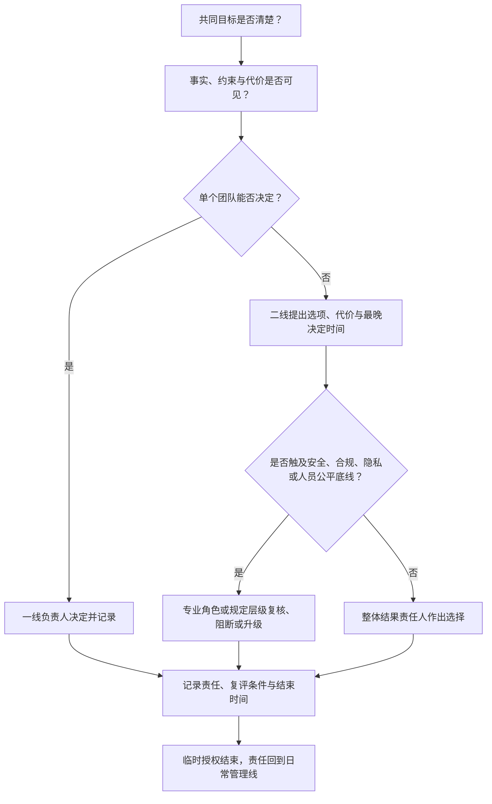

一个专项需要几个团队一起完成时，最容易发生两件事：二线只盯最后的结果，下面的人各自猜优先级；或者二线看见事情卡住，干脆绕过一线负责人直接把任务派下去。

前者会让协作停在口号里，后者会让一线负责人很快失去责任。二线管理一线负责人的难处，就在这两者之间：既要让组织目标真的被推进，又不能把每个团队的日常管理收回自己手里。

## 负责人应由组织需要决定，不是先有了人再找事做

一线负责人的位置，应该先由目标和组织边界决定。一个业务目标需要哪些团队共同承担，团队之间怎么分工，谁对外代表整体，哪些事情必须共同作选择——这些问题清楚以后，才知道需要怎样的负责人。

这也是招聘比“先培养一批负责人”更靠前的原因。组织先要确定缺什么能力、谁需要对哪一段结果负责，再去找适合的人。内部培养、调岗或专项授权当然会发生，但它们应当服务这个缺口，而不是为了给某个人安排一个位置。

现实里，目标会变，组织也会变。一位原来适合带一个稳定团队的负责人，未必适合处理多团队的资源冲突；反过来，一个能开新局的人，也不一定适合长期维护一套成熟系统。二线要持续判断的，不是“谁最优秀”，而是当前目标需要怎样的组织和负责人。

## 日常管理先看负责人之间能不能协同

一线负责人各自把团队带好，并不自动等于组织能拿到结果。二线最先要看的是他们之间：目标是否一致，团队之间的交接责任是否有人负责，资源冲突出现时能否作选择。

这不是要求所有负责人反复开会。一次对话里，二线往往只需要追问几件事：这件事最后要改变什么？谁在等待谁？如果资源只能保一边，准备放弃什么？需要谁来承担对外承诺？

[项目冲突先对齐哪三件事](/writing/2023/03/resolving-project-conflicts/)已经把基本判断写得很清楚：共同目标、事实和决策权。二线的工作，是在问题变成冲突之前，让这些东西已经存在；而不是等到几个团队都觉得自己被牺牲时，再来做裁判。

### 一个已经授权、却仍然不清楚边界的团队

设想一位一线负责人已经有了明确的团队和日常授权，成员也愿意做事。问题出在边界：团队接到了几个方向的需求，却说不清哪些是本周期必须完成的，哪些只是“最好也做”；与其他团队的协作责任没有明确负责人；成员遇到冲突时，有人直接找二线，有人闷头等待，还有人各自做了相近的方案。

        这时，二线最容易犯的错，是直接重新给成员分任务。这样短期可能更快，但负责人会逐渐变成传递指令的人，团队也会学会绕过他找上面。

更合适的动作，是先和负责人一起把问题重新放回组织目标：这轮要改变的结果是什么，哪些事情明确不做，团队要对哪一段协作责任负责，什么情况必须升级到二线。二线可以帮助协调外部边界，却不替负责人决定团队里每个人今天做什么。

真正的变化不在于二线参加了多少会议，而在于几周以后负责人能自己说清：我的团队负责什么、不负责什么；跨团队卡住时该找谁；什么风险需要尽早升级。成员也开始少靠猜测行动，协作方不再每次都等二线救火。到这一步，授权才从一句“你负责”变成了一段能被团队使用的边界。

### 二线怎样通过负责人带人

二线带一线负责人，最有价值的动作常常不是给答案，而是把原来被混在一起的问题拆开。一位负责人说“团队配合不好”，二线可以先不判断谁对谁错，而是追问：这次共同目标是什么？哪项协作责任没有人负责？你希望对方作什么选择？如果对方不配合，你手里还有哪些方案？

这种追问不是为了让负责人在一对一沟通里答题。它的作用是让他带着更清楚的边界回到自己的团队和协作方那里。二线可以补充背景信息、争取组织支持、在超出其权限时承担决定；但日常的目标分解、成员反馈和团队节奏，仍由负责人自己经营。

有时二线也要明确地给反馈。比如某位负责人每次都把跨团队冲突直接交给上级，可能不是他不愿意负责，而是原先没有被授予足够的协作边界和选择空间；也可能是他习惯把困难选择交给上面。两种情况的处理不同：前者需要补边界和授权，后者需要在下一次真实冲突里让他先带着选择回来。反馈若只说“你要更主动”，通常没有任何帮助。

| 二线看到的现象 | 更值得先问的事 | 可能的支持 |
| --- | --- | --- |
| 负责人总在替团队承担最后责任 | 哪些决定本应由团队自己作？ | 重画团队内的责任与升级条件 |
| 负责人总把冲突直接交给上级 | 这是权限不足，还是没有准备选择？ | 补组织授权，或要求带着方案再升级 |
| 团队反复返工 | 目标、协作责任还是验收标准哪里没说清？ | 协调外部边界，但由负责人带回团队落实 |

通过负责人带人，并不意味着二线离成员越来越远。二线仍要听得见下两层的信号，尤其是目标不清、协作责任失效或风险被压住的时候。但听见之后，不要自动把问题收走。除非涉及安全、合规或直属关系无法安全处理的例外，二线应先帮助负责人看见事实、获得支持，再让责任回到原来的管理线。

跨团队专项可以按下面的最小授权流程处理：

图中的“结束时间”不是形式要求。没有期限和收回动作，跨线专项很容易变成一条新的影子汇报线。

## 可以跨团队推动，但不能接管别人的日常管理

二线有时必须直接推动不向自己汇报的团队。例如，一个明确的业务专项需要几个团队共同交付，原有的协作责任又没有人能统一；或者外部承诺已经影响多个团队，必须有人把资源和节奏重新统一。

这种情况下，二线可以做三件事：明确专项要达成的结果，指定跨团队的协作责任和负责人，协调必要资源并代表组织作出承诺。前提是相关负责人知道这件事为什么发生、谁在什么范围内负责、何时结束。

但有些事情不该做。二线不应借专项之名长期给非直线团队的成员派日常任务；不应绕过直属负责人直接处理成员绩效；也不应让临时沟通通道慢慢变成一条新的汇报线。

区别不在于二线有没有参与，而在于参与之后责任更清楚还是更模糊。一个专项结束时，应该能回答：谁恢复日常负责？临时授权是否收回？这次冲突留下了什么新的团队边界或升级条件？如果答不上来，二线很可能只是用更高的位置解决了一次眼前问题。

## 结果出来以后，才知道培养什么

培养当然是二线工作的一部分，但它不能脱离真实责任。一位负责人在跨团队目标里如何争取资源、怎样处理冲突、什么时候承认原方案不成立，这些都比一场抽象培训更能说明他下一步需要发展什么能力。

二线可以在结果过程中给支持：补充背景信息，指出没被看见的约束，帮助争取资源，或者在风险超出团队承受范围时作决定。结果出来以后再复盘：他当时判断对了什么，漏了什么，下一次该把哪一段责任交得更完整。

这和[培养不是培训](/writing/2023/06/team-development-compounds/)讲的并不冲突。培养需要真实责任、边界和反馈。只是到了二线场景，责任不只是一段任务，也可能是一段跨团队关系、一项资源取舍，或者一次组织目标的承接。

## 评价结果，也评价拿到结果的方式

一线负责人的评价很容易只剩一张结果表：按时交付了吗，目标完成了吗，团队有没有出事。结果当然重要；问题是，有些结果是靠长期透支、压住风险或牺牲协作换来的。只看最后一行数字，组织会慢慢奖励错误的管理方式。

可以设想另一个常见情形：一位负责人在一个周期里拿到了很好的结果，但团队连续加班，外部依赖被反复压缩，几个风险直到最后才被发现。二线不应因为过程不完美就抹掉结果，也不该把“只要赢了就行”当作评价。更有用的做法是把结果和代价一起放回复盘：这次目标为什么值得保住，哪些代价当时可以接受，哪些风险本来应更早暴露，下一周期该怎样调整资源、边界或协作方式。

因此，评价至少要同时看三类证据：

| 看什么 | 要追问什么 |
| --- | --- |
| 结果与代价 | 结果是否服务目标？为了它放弃了什么，风险是否被提前说明？ |
| 团队能力 | 团队是否更能自己判断、协作和承担责任，还是所有关键问题仍回到负责人手里？ |
| 协同质量 | 跨团队关系有没有留下清楚的协作责任和可信承诺，还是靠一次次临时施压？ |

处理方式也不必走向两极。结果好但代价过高时，先承认结果，再把代价带回复盘，要求下一周期修正边界、资源或协作方式。这样既不会把复杂工作变成“永远不能犯错”的表演，也不会让团队以为结果可以抵消一切。

## 不是盯进度，而是检查组织还在不在服务目标

二线和负责人的日常沟通不必固定成一种一对一模板。不同业务阶段、不同团队关系，节奏会不同。但有几个问题值得反复回到：目标有没有变，当前组织还能不能承接？资源和协作责任有没有新的冲突？哪些问题需要组织授权，而不是让某个团队自己硬扛？

这些问题的目的不是把二线变成额外的项目经理，而是让负责人有足够的空间带自己的团队，同时不会在跨团队的地方各自为战。

好的二线管理不会让每位负责人更依赖上面。它会让组织在需要共同选择时知道怎么协同，在需要跨线推动时知道边界在哪里，在结果出来后知道什么应该保留、什么应该改掉。

## 权限和资源怎样服务结果

这时，二线最容易被看成“谁的资源都能分一点的人”。但真正要做的不是当裁判，而是先把选择说清：这轮最要保住什么，为什么不能两边都要，谁有权决定，代价又由谁对外承担。

权限在这里才有意义。它不是为了让二线控制更多人，而是让组织在必须取舍时，不必靠嗓门、私下关系或最后一刻的强行施压来决定。

## 目标决定该争取什么决定权和资源

二线不该先问“我缺什么权力”，而应先问“当前目标卡在哪里”。有时缺的是人，有时缺的是对外承诺的决定，有时只是几个团队没有人能把范围和协作责任放到一起说清。

目标清楚之后，才知道要向上争取什么支持。比如这次需要的是更改优先级的决定，还是临时调动一段能力？是需要有人代表组织承担延期的代价，还是需要把原本模糊的责任重新划分？

这也是向上沟通最重要的部分。不要只说“资源不够”或“团队配合不了”，而要把可选方案、各自代价和最晚决定时间摆出来。上级未必会给出想要的答案，但至少组织会明确：谁在作选择，谁在承担结果。

## 授权要能让人作出选择

“你去推进”不算完整授权。一个人要对跨团队结果负责，至少得知道自己能决定什么，能调动什么，冲突出现时谁会站出来承担代价。

这三件事常常一起缺。二线拿到一个目标，却无法改变其他团队的优先级；能协调资源，却没有权利代表组织作出承诺；有正式头衔，却在真正发生冲突时只能不断往上转述。最后，事情要么卡住，要么靠某个人私下消耗关系推进。

[负责人意识与责任](/writing/2021/11/ownership-with-boundaries/)里的边界仍然适用：谁决定、谁执行、何时升级、承担到哪里为止。二线只是把这些问题带到了多个团队之间。边界越清楚，临时协调越少；边界不清时，再多一次会议也不会让人知道该怎么选。

## 有些底线不能用结果交换

资源和时间都紧的时候，安全、合规、隐私和稳定性很容易被写成“以后再补”。二线不一定是这些专业问题的最终裁决者，但不能因为业务目标紧急，就让它们没有负责人、没有升级路径，或者在会议纪要里只剩一句“风险已知”。

可以分三层处理。首先，法律、监管、个人安全、数据隐私或重大稳定性风险等不可接受的底线，不能靠业务结果购买；必要时应调整范围、延后时间，或停止这条路径。其次，不是所有风险都同样严重，要根据影响范围、发生可能性、可逆性和暴露时间判断是否升级。最后，涉及专业判断的重大事项，应交给相应的安全、合规、法务、隐私或技术治理角色处理，二线负责确保问题被识别、被传递、有人决定，不能让业务压力把它淹没。

这也改变了“谁有最终决定权”的含义。二线可以决定业务范围和资源取舍，但不能把自己没有资格判断的安全或合规问题包装成业务选择。专业角色可以提出否决或升级，最终由组织中承担相应风险的人作出可追溯的决定。

## 最终决定权，不是看谁的位置更高

跨团队冲突发生时，最容易出现两种极端：要么所有事都由二线拍板，一线负责人只负责执行；要么谁离问题近谁说了算，最后却让其他团队承担未经同意的代价。

更可用的顺序是把三件事放在一起看。离问题最近的人先提供事实和判断；当决定影响多个团队、超出单个团队的资源边界时，由承担整体结果的人作最终选择；这些边界应尽量在冲突前说明，而不是每次临场比位置。

这不保证所有人都满意，却能让分歧回到可处理的对象上。二线的责任不是证明自己永远正确，而是让决定、责任和代价不再各自漂浮。

| 决定之后至少留下什么 | 为什么 |
| --- | --- |
| 这次选了什么、暂时放弃了什么 | 让协作者知道组织不是“什么都要” |
| 谁对结果和对外说明负责 | 避免决定落地后又没有主人 |
| 哪些条件出现时必须重开 | 防止一次取舍被误当成永久规则 |
| 哪些边界和任务需要公开同步 | 让相关团队知道自己可以决定什么、需要配合什么 |

现实里，有些协调不能把每一句话都写得过死。为了给关系、节奏和风险留出余地，部分讨论会保留一定模糊。但这不应模糊到没有人知道谁承担责任。能公开的边界、任务和代价应尽量公开；需要暂时保留的部分，也应由相应层级承担，而不是让下层在不完整信息里猜测。

## 信息是为了作决定，不是多一条汇报线

二线当然需要知道跨团队目标的进展和风险，但不需要把所有团队日常都收上来。信息的作用是判断：目标是否变了，资源是否投错了，哪项协作责任正在失效，什么事情已经不能由单个负责人自己解决。

因此，信息应当随决定流动。需要上级支持时，先说结果、风险和选择；需要协作时，先说各自负责什么和下一步；团队内部的细节仍留在一线负责人手里。二线若把下两层变成自己的额外汇报线，短期也许会觉得“看得更清楚”，长期却会让直属负责人无法真正承担责任。

[信息同步不是抄送](/writing/2023/03/information-sync-for-decisions/)已经解释了这个区别：同步的目的不是让更多人知道，而是让需要作决定的人得到足够的信息。

## 资源冲突不是只靠让步，也不是只靠硬抢

资源不够时，纯粹让步会让自己的目标失去必要条件；一味强争，又会把下一次合作变得更难。二线需要守住核心目的，同时尽量找出能让更多人继续往前走的选择。

有时这意味着先保住一个目标，明确放弃另一个；有时是把一个大方案拆开，先做不依赖关键资源的部分；有时是把原来彼此竞争的需求放到更大的共同问题里，重新看能否一起解决。不是每次都能多赢，但至少要避免把还可以重新设计的问题，过早变成零和冲突。

这也是资源协调里最容易被忽略的一件事：关系不是资源之外的软性因素。一个团队是否愿意在这次让出窗口，往往取决于它是否相信代价被看见、选择能被解释、下次自己需要支持时组织也会认真对待。

正式授权可以让二线发出决定，但不能保证别人愿意跟着改原来的安排。后者靠的是此前积累的信任：承诺是否兑现，坏消息是否如实说明，资源取舍是否公开过理由，结果失败时是否有人承担责任。这些东西没有写在权限表里，却决定权限能否真正落到行动上。

### 有些选择需要补偿，不能只宣布结果

资源取舍不是一次宣布之后就结束。某个团队让出了人、窗口或优先级，组织可能需要在后续给出补偿：明确下一次复评的时间，补回被延后的能力建设，或者在另一项选择上承认这个团队已经承担过代价。

补偿不是端水，也不是承诺所有人都会得到相同结果。它的作用是让协作者知道：这次的代价被组织看见，选择不是靠谁更会忍耐来完成。尤其当某个团队为了共同目标暂时放弃自己的计划时，二线要能公开说明它为什么值得，以及组织准备怎样避免这份代价变成长期默认。

有些协调也确实不能完全公开。还在讨论的人事变化、尚未确认的外部合作、可能引发不必要猜测的风险，都需要保留一定空间。关键不是把所有信息摊开，而是不要让这种模糊转嫁为下层的不确定性：已经影响到任务、边界和责任的部分，应当及时同步；仍不能公开的部分，应由有权限的人承担解释和后果。

## 一次协调之后，应该留下什么

最糟糕的资源协调，是每次冲突都重新找同一个人拍板。这样组织只是换了一个新的瓶颈。

一次取舍结束后，至少应该留下一点东西：这次保住了什么，放弃了什么；谁负责对外说明；哪个条件变化后可以重新打开决定；下次遇到同类冲突，哪些协作责任可以不再从头争。

这不需要做成一套厚重流程。它只是让下一次选择有据可查，也让协作不必总靠个人关系撑住。

## 结果出来以后，先看目标、边界和授权有没有帮上忙

一次资源协调或组织调整是否有效，不能只看“项目有没有做完”。主证据要由当时的目标决定：如果这轮是为了拿到业务结果，就看关键结果是否改善；如果是为了控制风险，就看问题有没有继续扩大；如果是为了重建合作，就看团队边界、承诺和升级是否变得更稳定。

主证据之外，还要留几条护栏。结果达到了，团队是否为此长期透支？资源是不是被过度集中，形成新的单点依赖？协作关系是否因为这次取舍被损坏？反过来，结果没有达到预期时，也不要先把问题归到某个负责人身上。先检查目标有没有定义错，组织边界是否仍然适用，资源和授权有没有给够，还是关键假设原本就不成立。

| 事后检查顺序 | 要问的问题 |
| --- | --- |
| 先看主目标 | 这轮最想改变的结果，真的发生了吗？ |
| 再看护栏 | 有没有透支团队、损害协作或制造新的风险？ |
| 再查目标与授权 | 目标、边界、资源和授权里，哪一项让结果偏离？ |
| 最后决定下一步 | 保留、改变还是停止什么；什么新信号出现时重开选择？ |

这样，结果不只是证明某个人做得好或不好，而是帮助组织判断这次的责任划分和资源选择是否值得留下。

二线的权限，最后不是体现在拍了多少板，而是组织面对复杂目标时，能否更早作出选择、更清楚地承担代价，并把有限资源用在真正重要的地方。
