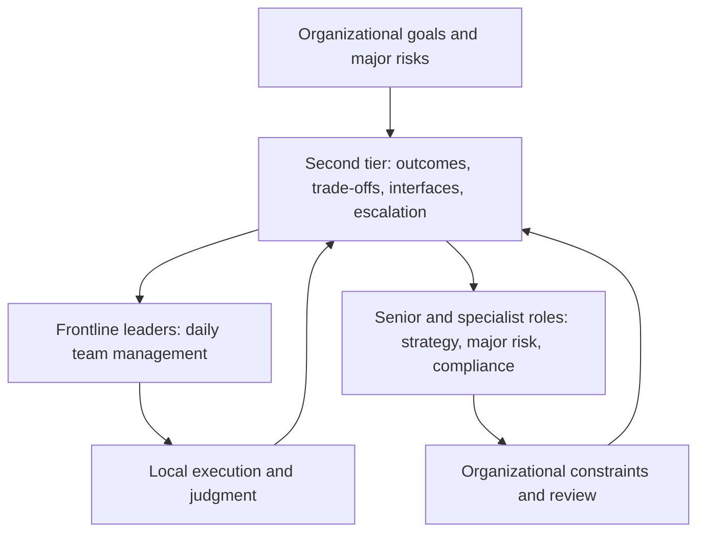

A manager of managers is needed when the original organization can no longer connect several teams’ local work into one result. The issue is not simply headcount or weak frontline leaders. It is that goals, resources, collaboration responsibilities, and external commitments now require a shared choice.

## The problem starts with resources and collaboration responsibility

If teams cannot agree who owns the outcome, adding a layer of management will only move the ambiguity upward. First identify the shared result, the competing constraints, and the decisions that no single frontline leader can make.

## The role usually appears for an organizational reason

Do not begin with a person who needs a larger title. Begin with a persistent multi-team problem, then decide whether the right answer is a manager of managers, a temporary program owner, a clearer interface, or a smaller goal.

Here, “manager of managers” means a manager who directly manages multiple frontline managers and carries cross-team outcomes. Some organizations use “second-level manager” for the same role. “Skip-level manager” describes a reporting relationship or meeting that bypasses a direct manager; it is not the role discussed here.

The role is not a larger project manager and not a second approval line for every team. It should help teams coordinate, make resource choices, clarify who owns an interface, and decide what to stop. A project owner may finish one delivery; a manager of managers also asks what interface, resource boundary, or people responsibility remains afterward.

## A manager of managers is not an enlarged project manager

The role carries recurring organizational complexity: competing goals, resource allocation, cross-team interfaces, and the development of leaders. It should leave the organization more capable after a delivery, not more dependent on one coordinator.

Do not add the layer merely because there are more teams. If existing leaders can set a shared priority, represent the whole, and know when to escalate, first clarify goals and interfaces instead.

Formal authority matters, but organizational trust—keeping commitments, explaining costs, and owning mistakes—determines whether authority turns into action. Trust cannot replace authorization, and authorization cannot replace trust.

## When the layer should not be added

Do not add it merely because the organization has more teams. If existing leaders can set a shared priority, represent the whole, and escalate at the right time, clarify goals and interfaces first.

## The profile starts with the multi-team problem

## Ask two questions first

## Test whether the person can drive a multi-team problem to a result

## Do not turn individual ability into a job description

## The profile must not be based only on personal performance

## The profile changes as the organization changes

### The Manager-of-Managers Profile: What Complexity Can They Carry?

---

“Strategic,” “mature,” and “good communicator” rarely help an organization choose a second-tier leader. Start with two questions: what result does this role need to produce, and why can the existing frontline leaders not carry it alone?

Look for a complete result chain: the goal, why the problem was complex, what support was won, whose arrangement changed, what trade-off was made, and what evidence showed the choice worked. Ask what the candidate did not do, which resource was not obtained, who paid the cost, and how they would restart after a miss.

| Situation | Evidence to seek | Easy misread |
| --- | --- | --- |
| Conflicting goals | One result, explicit trade-offs, visible cost | Strong voice that makes others submit |
| Resource competition | Can explain both the need and the allocation | Always taking more for their team |
| Organizational change | Turns ambiguity into owners and interfaces | Vision without a next action |

Individual delivery skill or a large relationship network is not enough. The role connects judgment, authorization, resources, and relationships into a result across teams. Different leaders can complement one another; the organization should define the non-negotiable boundary and the missing capability instead of selecting clones.

The profile changes with the organization. A leader who excels at stable delivery may not be right for a rebuild; a person who opens new directions may not want to maintain a mature system. Use the profile for selection, authorization, and review—not as a permanent label. The final question is not whether the candidate has the most impressive personal strengths, but whether they can help the people involved in a real organizational problem make shared choices and own the result.

## Scope and limits

This is a management judgment framework, not a promise that one interview story predicts future performance. Use consistent prompts, evidence records, and interviewer calibration to reduce expression and culture bias.
